# Integrate Dynamic Media Viewers with Adobe Analytics and Experience Platform Tags {#integrating-dynamic-media-viewers-with-adobe-analytics-and-adobe-launch}

## What is Dynamic Media Viewers integration with Adobe Analytics and Experience Platform Tags? {#what-is-dynamic-media-viewers-integration-with-adobe-analytics-and-adobe-launch}

<!-- Leave this hidden path here; it points to the topic source from Sasha https://wiki.corp.adobe.com/pages/viewpage.action?spaceKey=~oufimtse&title=Dynamic+Media+Viewers+integration+with+Adobe+Launch -->

*Dynamic Media Viewers* extension for Experience Platform Tags and Dynamic Media Viewers 5.13, lets Adobe Analytics and Experience Platform Tags customers use events and data specific for Dynamic Media Viewers in their Experience Platform Tags configuration.

This integration means that you can track usage of Dynamic Media Viewers on your website with Adobe Analytics. At the same time, you can use the events and data exposed by the viewers with any other Experience Platform Tags extension that comes from Adobe or a third party.

To learn more about Adobe extensions or third-party extensions, see [Adobe extensions](https://experienceleague.adobe.com/docs/experience-platform/tags/extensions/overview.html) in the Experience Platform Tags User Guide.

**This topic is intended for the following:** Site administrators, Developers on the Experience Platform, and people in Operations.

### Limitations of the integration {#limitations-of-the-integration}

* Experience Platform Tags integration for Dynamic Media viewers does not work in the Experience Manager author node. You cannot see any tracking from a WCM page until it is published.
* Experience Platform Tags integration for Dynamic Media viewers is not supported for "pop-up" operation mode, where the viewer URL is obtained using the "URL" button on Asset Details page.
* Experience Platform Tags integration cannot be used simultaneously with legacy viewers Analytics integration (by way of the `config2=` parameter).
* Support for video tracking is limited to "core playback" tracking only, as described in [Tracking Overview](https://experienceleague.adobe.com/docs/media-analytics/using/tracking/track-av-playback/track-core-overview.html?lang=en). In particular, QoS, Ads, Chapter/Segments, or Errors tracking is not supported.
* Storage Duration configuration for Data Elements is not supported for Data Elements using the *Dynamic Media Viewers* extension. Storage Duration must be set to **[!UICONTROL None]**.

### Use cases for the integration {#use-cases-for-the-integration}

The primary use case for the integration with Experience Platform Tags is customers who use both Adobe Experience Manager Assets and Adobe Experience Manager Sites. In such scenarios, you can set up a standard integration between your Experience Manager author node and Experience Platform Tags, then associate your Sites instance with the Experience Platform Tags property. After that, any Dynamic Media WCM component added to a Sites page will track data and events from viewers.

See [Track Dynamic Media viewers in Experience Manager Sites](#tracking-dynamic-media-viewers-in-aem-sites).

A secondary use case that the integration supports are those customers who use Experience Manager Assets only, or Dynamic Media Classic. In such cases, you obtain the embed code for your viewer and add it to the website page. Then, get the Experience Platform Tags library production URL from Experience Platform Tags and manually add it to the web page code.

See [Track Dynamic Media viewers using embed code](#tracking-dynamic-media-viewers-using-embed-code).

<!-- Path on internal wiki [About tracking Dynamic Media viewers using embed code](https://wiki.corp.adobe.com/display/~oufimtse/Dynamic+Media+Viewers+integration+with+Adobe+Launch#DynamicMediaViewersintegrationwithAdobeLaunch-TrackingDynamicMediaViewersusingEmbedcode). -->

## How data and event tracking works in the integration {#how-data-and-event-tracking-works-in-the-integration}

The integration takes advantage of two separate and independent types of Dynamic Media Viewers tracking: *Adobe Analytics* and *Adobe Analytics for Audio and Video*.

### About tracking using Adobe Analytics  {#about-tracking-using-adobe-analytics}

Adobe Analytics lets you track actions that are performed by the end user when they interact with Dynamic Media Viewers on your website. Adobe Analytics also lets you track viewer-specific data. For example, you can track and record view load events along with the asset name, any zoom actions that occurred, and video play actions.

In Experience Platform Tags, the concepts of *Data Elements* and *Rules* work together to enable Adobe Analytics tracking.

#### About Data Elements in Experience Platform Tags {#about-data-elements-in-adobe-launch}

A Data Element in Experience Platform Tags is a named property whose value is either statically defined, or dynamically calculated based on the state of a web page or Dynamic Media Viewers data.

Options that are available for a Data Element definition depend on the list of Extensions that are installed in the Experience Platform Tags Property. The "Core" extension is preinstalled and is available out of the box in any configuration. This "Core" extension allows to define a Data Element which value comes from cookie, JavaScript code, query string, and many other sources.

For Adobe Analytics tracking several more extensions must be installed, as described in [Installation and setup of extensions](#installing-and-setup-of-extensions). Dynamic Media Viewers extension adds an ability to define a Data Element which value is an argument of the Dynamic Viewer event. For example, it is possible to reference the viewer type, or asset name reported by the viewer on load, the zoom level reported when end-user zooms and much more.

Dynamic Media Viewer extension automatically keeps the values of its Data Elements up to date.

After you have defined it, a Data Element can be used in other places of Experience Platform Tags UI, using Data Element picker widget. In particular, Data Elements defined for the purposes of Dynamic Media Viewers tracking is referenced by Set Variables Action of Adobe Analytics extension in Rule (see below).

See [Data elements](https://experienceleague.adobe.com/docs/experience-platform/tags/ui/data-elements.html).

#### About Rules in Experience Platform Tags {#about-rules-in-adobe-launch}

A Rule in Experience Platform Tags is an agnostic configuration that defines three areas that make up a rule: *Events*, *Conditions*, and *Actions*:

* *Events* (if) tell Experience Platform Tags when to trigger a Rule.
* *Conditions* (if) tell Experience Platform Tags what other restrictions to allow or disallow when triggering a Rule.
* *Actions* (then) tell Experience Platform Tags what to do when a Rule is triggered.

Options that are available in the Events, Conditions, and Actions section depend on the extensions that are installed in Experience Platform Tags Property. The *Core* extension is preinstalled and is available out-of-the-box in any configuration. The extension provides several options for Events such as basic browser-level actions. Those actions include focus change, key presses, and form submissions. It also includes options for Conditions, such as cookie value, browser type, and more. For Actions, only the Custom Code option is available.

For Adobe Analytics tracking, several other extensions must be installed, as described in [Installation and setup of extensions](#installing-and-setup-of-extensions). Specifically:

* Dynamic Media Viewers extension extends the list of supported Events to events that are specific to Dynamic Media viewers such as viewer load, asset swap, zoom in, and video play.
* Adobe Analytics extension extends the list of supported Actions with two actions that are required for sending data to tracking servers: *Set Variables* and *Send Beacon*.

To track Dynamic Media viewers, it is possible to use any type of the following:

* Events from Dynamic Media Viewers extension, Core extension, or any other extension.
* Conditions in the Rule definition. Or, you can leave the conditions area empty.

In the Actions section, it is required that you have a *Set Variables* action. This action tells Adobe Analytics how to populate tracking variables with data. At the same time, the *Set Variables* action does not send anything to the tracking server.

The *Set Variables* action must be followed by a *Send Beacon* action. The *Send Beacon* action actually sends data to the analytics tracking server. Both actions, *Set Variables* and *Send Beacon*, come from the Adobe Analytics extension.

See [Rules](https://experienceleague.adobe.com/docs/experience-platform/tags/ui/rules.html).

#### Sample configuration {#sample-configuration}

The following sample configuration within Experience Platform Tags demonstrates how to track an asset name on viewer load.

1. From the **[!UICONTROL Data Elements]** tab, define a data element `AssetName` that references `asset` parameter of the `LOAD` event from the Dynamic Media Viewers extension.

   

1. From the **[!UICONTROL Rules]** tab, define a rule *TrackAssetOnLoad*.

   In this rule, the **[!UICONTROL Event]** field uses the **[!UICONTROL LOAD]** event from the Dynamic Media Viewers extension.

   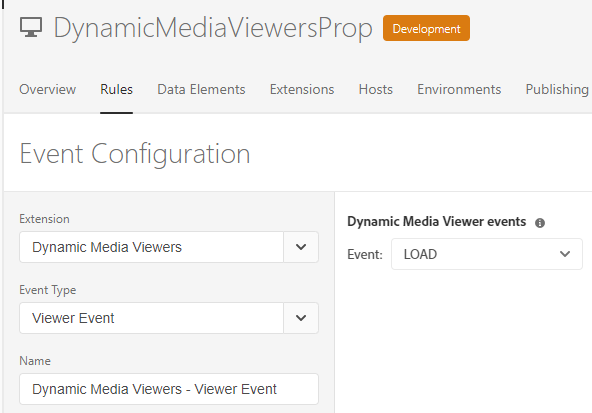

1. The Action configuration has two Action types from the Adobe Analytics extension:

   *Set Variables*, which map an analytics variable of your choice to the value of `AssetName` Data Element.

   *Send Beacon*, which sends tracking information to Adobe Analytics.

   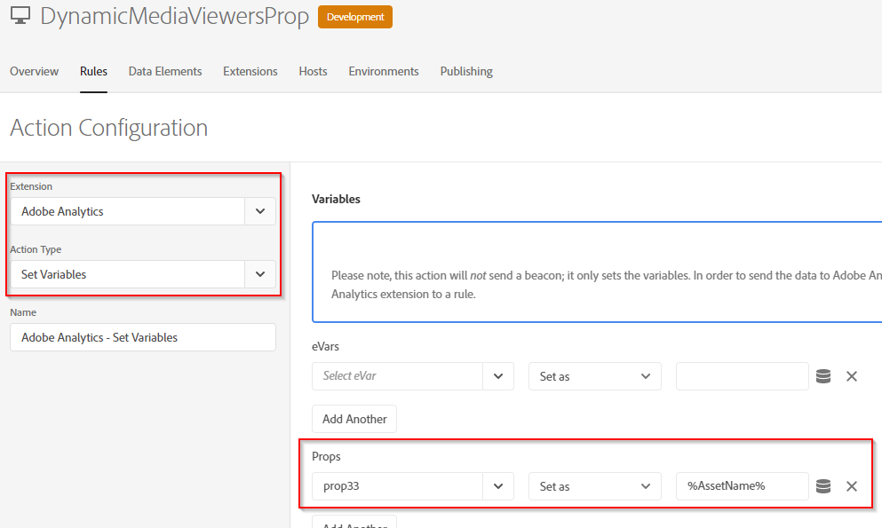

1. The resulting rule configuration looks like the following:

   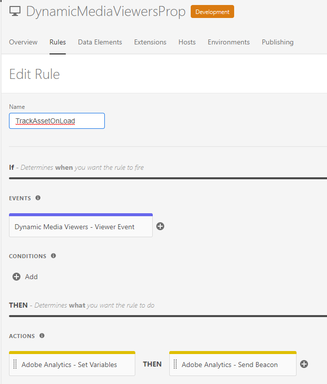

### About Adobe Analytics for Audio and Video {#about-adobe-analytics-for-audio-and-video}

When an Experience Cloud account is subscribed to use Adobe Analytics for Audio and Video, it is enough to enable video tracking in the *Dynamic Media Viewers* extension settings. Video metrics become available in Adobe Analytics. Video tracking depends on the presence of Adobe Media Analytics for Audio and Video extension.

See [Installation and setup of extensions](#installing-and-setup-of-extensions).

Currently, the support for video tracking is limited to "core playback" tracking only, as described in [Tracking overview](https://experienceleague.adobe.com/docs/media-analytics/using/tracking/track-av-playback/track-core-overview.html?lang=en). In particular, QoS, Ads, Chapter/Segments, or Errors tracking is not supported.

## Use the Dynamic Media Viewers extension {#using-the-dynamic-media-viewers-extension}

As mentioned in [Use cases for the integration](#use-cases-for-the-integration), it is possible to track Dynamic Media viewers with the new Experience Platform Tags integration in Experience Manager Sites and by using embed code.

### Track Dynamic Media viewers in Experience Manager Sites {#tracking-dynamic-media-viewers-in-aem-sites}

To track Dynamic Media viewers in Experience Manager Sites, all steps listed under the [Configure all the integration pieces](#configuring-all-the-integration-pieces) section must be performed. Specifically, you must create the IMS configuration and the Experience Platform Tags Cloud Configuration.

Following proper configuration, any Dynamic Media viewer that you add to a Sites page, using a WCM component supported by Dynamic Media, automatically tracks data to Adobe Analytics, or Adobe Analytics for Video, or both.

<!-- To be reviewed and updated although this is found live in the Experience ManageraaCS version:
See [Adding Dynamic Media Assets to Pages using Adobe Sites](https://helpx.adobe.com/experience-manager/6-5/help/assets/adding-dynamic-media-assets-to-pages.html).
-->

### Track Dynamic Media viewers using embed code {#tracking-dynamic-media-viewers-using-embed-code}

Customers who do not use Experience Manager Sites, or embed Dynamic Media viewers into web pages outside of Experience Manager Sites, or both, can still use the Experience Platform Tags integration.

Complete the configuration steps from the [Configure Adobe Analytics](#configuring-adobe-analytics-for-the-integration) and [Configure Experience Platform Tags](#configuring-adobe-launch-for-the-integration) sections. However, Experience Manager-related configuration steps are not needed.

Following proper configuration, you can add Experience Platform Tags support to a web page with a Dynamic Media viewer.

See [Add the Experience Platform Tags Embed Code](https://experienceleague.adobe.com/docs/platform-learn/implement-in-websites/configure-tags/add-embed-code.html) to learn more about how to use Experience Platform Tags library embed code.

<!-- To be reviewed and updated although this is found live in the Experience ManageraaCS version:
See [Embedding the Video or Image Viewer on a Web Page](https://helpx.adobe.com/experience-manager/6-5/help/assets/embed-code.html) to learn more about how to use the embed code feature of Experience Manager Dynamic Media.
-->

**Track Dynamic Media viewers using embed code:**

1. Have a web page ready for embedding a Dynamic Media viewer.
1. Obtain the embed code for Experience Platform Tags library by first logging in to Experience Platform Tags (see [Configuring Experience Platform Tags](#configuring-adobe-launch-for-the-integration)).
1. Select **[!UICONTROL Property]**, then select the **[!UICONTROL Environments]** tab.
1. Pick up the Environment level that is relevant to the environment of the web page. Then, in the **[!UICONTROL Install]** column, select the box icon.
1. **[!UICONTROL In the Web Install Instructions]** dialog box, copy the complete Experience Platform Tags library embed code, along with the surrounding `<script/>` tags.

## Reference guide for the Dynamic Media Viewers extension {#reference-guide-for-the-dynamic-media-viewers-extension}

### About the Dynamic Media Viewers configuration {#about-the-dynamic-media-viewers-configuration}

The Dynamic Media Viewer extension automatically integrates with the Experience Platform Tags library if the following conditions below are true:

* Experience Platform Tags library global object ( `_satellite`) is present on the page.
* The Dynamic Media Viewers extension function `_dmviewers_v001()` is defined on `_satellite`.

* `config2=` viewer parameter is not specified, which means that viewer does not use legacy Analytics integration.

Also, there is an option to explicitly disable Experience Platform Tags integration in the viewer by specifying `launch=0` parameter in the viewer's configuration. The default value of this parameter is `1`.

### Configure the Dynamic Media Viewers extension {#configuring-the-dynamic-media-viewers-extension}

The only configuration option for the Dynamic Media Viewers extension is **[!UICONTROL Enable Adobe Media Analytics for Audio and Video]**.

When you check (enable) this option, and the Adobe Media Analytics for Audio and Video extension is installed and configured, video playback metrics are sent to the Adobe Analytics for Audio and Video solution. Disabling this option turns off video tracking.

If you enable this option *without* having Adobe Media Analytics for Audio and Video extension installed, the option has no effect.

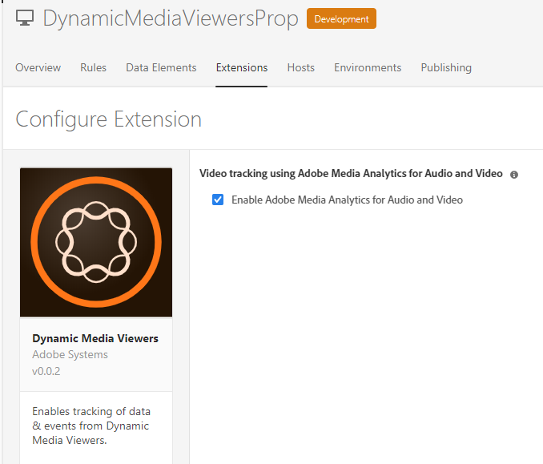

### About Data Elements in the Dynamic Media Viewers extension {#about-data-elements-in-the-dynamic-media-viewers-extension}

The only Data Element type that the Dynamic Media Viewers extension provides is **[!UICONTROL Viewer Event]** from the **[!UICONTROL Data Element Type]** drop-down list.

When selected, the Data Element editor renders a form with two fields:

* **[!UICONTROL DM viewers event data type]** - a drop-down list that identifies all viewer events that are supported by the Dynamic Media Viewers extension which have arguments, plus a special **[!UICONTROL COMMON]** item. A **[!UICONTROL COMMON]** item represents a list of event parameters that are common to all type of events sent by the viewers.
* **[!UICONTROL Tracking parameter]** - an argument of the selected Dynamic Media viewer event.

See the [Dynamic Media Viewers reference guide](https://experienceleague.adobe.com/docs/dynamic-media-developer-resources/library/viewers-aem-assets-dmc/c-html5-s7-aem-asset-viewers.html#viewers-aem-assets-dmc) for the list of supported events by each viewer type; go to specific viewer section, then select Support for Adobe Analytics tracking subsection. Currently, the Dynamic Media Viewers reference guide does not document event arguments.

Now consider the life cycle of the Dynamic Media Viewers *Data Element*. The value of such Data Element is populated after the corresponding Dynamic Media viewer event happens on the page. For example, suppose the Data Element points to the **[!UICONTROL LOAD]** event and its "asset" argument. In such case, the value of such Data Element receives valid data after the viewer runs the **[!UICONTROL LOAD]** event for the first time. If the Data Element points to the **[!UICONTROL ZOOM]** event and its "scale" argument, the value of such Data Element remains empty until the viewer sends a **[!UICONTROL ZOOM]** event for the first time.

Similarly, the values of Data Elements get automatically updated when the viewer sends a corresponding event on the page. The value update happens even if the particular event is not specified in the Rule configuration. For example, suppose the Data Element **[!UICONTROL ZoomScale]** is defined for "scale" parameter of the ZOOM event. However, the only rule present in the Rule configuration is triggered by the **[!UICONTROL LOAD]** event. The value of **[!UICONTROL ZoomScale]** is still updated every time a user runs zoom inside the viewer.

Any Dynamic Media viewer has a unique identifier on the web page. The Data Element tracks the value itself, and the viewer that has populated the value. For example, suppose that there are several viewers on the same page, and an **[!UICONTROL AssetName]** Data Element that points to the **[!UICONTROL LOAD]** event and its "asset" argument. The **[!UICONTROL AssetName]** Data Element maintains a collection of asset names that are associated with each viewer loaded on the page.

The exact value returned by the Data Element depends on the context. If the Data Element is requested in a Rule which was triggered by a Dynamic Media viewer event, then the Data Element value is returned for the viewer that initiated the Rule. And, the Data Element is requested in a Rule that was triggered by an Event from some other Experience Platform Tags extension. At that point, the value of the Data Element comes from the viewer that was last to update this Data Element.

**Consider the following sample setup:**

* A web page that has two Dynamic Media zoom viewers: *viewer1* and *viewer2*.

* **[!UICONTROL ZoomScale]** Data Element points to the **[!UICONTROL ZOOM]** event and its "scale" argument.
* **[!UICONTROL TrackPan]** Rule with the following:

  * Uses the Dynamic Media Viewer **[!UICONTROL PAN]** event as a trigger.
  * Sends the value of **[!UICONTROL ZoomScale]** Data Element to Adobe Analytics.

* **[!UICONTROL TrackKey]** Rule with the following:

  * Uses the key press event from the Core Experience Platform Tags extension as a trigger.
  * Sends the value of **[!UICONTROL ZoomScale]** Data Element to Adobe Analytics.

Now, assume the end user loads the web page with the two viewers. In *viewer1*, they zoom in to 50% scale; then, in *viewer2*, they zoom in to 25% scale. In *viewer1*, they pan image around, and finally select a key on the keyboard.

The end user's activity results in the following two tracking calls being made to Adobe Analytics:

* The first call occurs because **[!UICONTROL TrackPan]** Rule is triggered when the user pans in *viewer1*. That call sends 50% as a value of **[!UICONTROL ZoomScale]** Data Element because the Data Element knows that the Rule is triggered by *viewer1* and fetches the corresponding scale value;
* The second call occurs because **[!UICONTROL TrackKey]** Rule is triggered when the user pressed a key on the keyboard. That call sends 25% as a value of **[!UICONTROL ZoomScale]** Data Element because the Rule was not triggered by the viewer. As such, the Data Element returns the most up-to-date value.

The sample set up above also affects the life span of the Data Element value. The value of the Data Element managed by the Dynamic Media Viewer is stored in the Experience Platform Tags library code even after the viewer itself is disposed on the web page. This functionality means that if there is a Rule that is triggered by a non-Dynamic Media Viewer extension and references such Data Element, the Data Element returns the last known value. Even if the viewer is no longer present on the web page.

In any case, values of Data Elements driven by Dynamic Media Viewers are not stored on the local storage or on the server; instead, they are kept only on the client-side Experience Platform Tags library. Values of such Data Element disappear when the web page reloads.

Generally, the Data Element editor supports [storage duration selection](https://experienceleague.adobe.com/docs/experience-platform/tags/ui/data-elements.html#create-a-data-element). However, Data Elements that use the Dynamic Media Viewers extension only supports the storage duration option of **[!UICONTROL None]**. Setting any other value is possible in the user interface, but the Data Element behavior is not defined in this case. The extension manages the value of the Data Element on its own: the Data Element that maintains the value of the viewer event argument during the entire viewer life cycle.

### About Rules in the Dynamic Media Viewers extension {#about-rules-in-the-dynamic-media-viewers-extension}

In the Rule editor, the extension adds new configuration options for the Events editor. Also the editor provides an option to manually reference event parameters in the Action editor as a short-hand option instead of using preconfigured Data Elements.

#### About the Events editor {#about-the-events-editor}

In the Event editor, the Dynamic Media Viewers extension adds an **[!UICONTROL Event Type]** called **[!UICONTROL Viewer Event]**.

When selected, the Event editor renders the drop-down **[!UICONTROL Dynamic Media Viewer events]**, listing all the available events that are supported by Dynamic Media viewers.

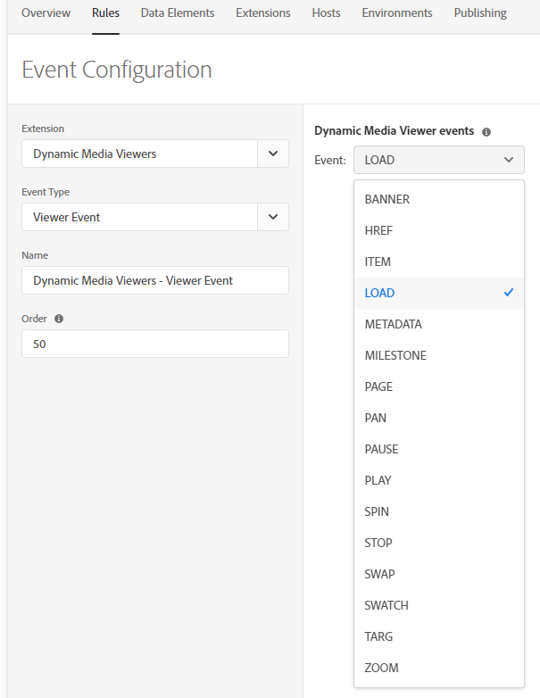

#### About the Actions editor {#about-the-actions-editor}

The Dynamic Media Viewers extension lets you use event parameters of Dynamic Media viewers to map to analytics variables in the Set Variables editor of the Adobe Analytics extension.

The simplest method to do that is to complete the following two-step process:

* First, define one or more Data Elements, where each Data Element represents a parameter of a Dynamic Media Viewer event.
* Finally, in the Set Variables editor of the Adobe Analytics extension select the **[!UICONTROL Data Element]** picker icon (three stacked disks) to open the Select Data Element dialog box, then select a Data Element from it.

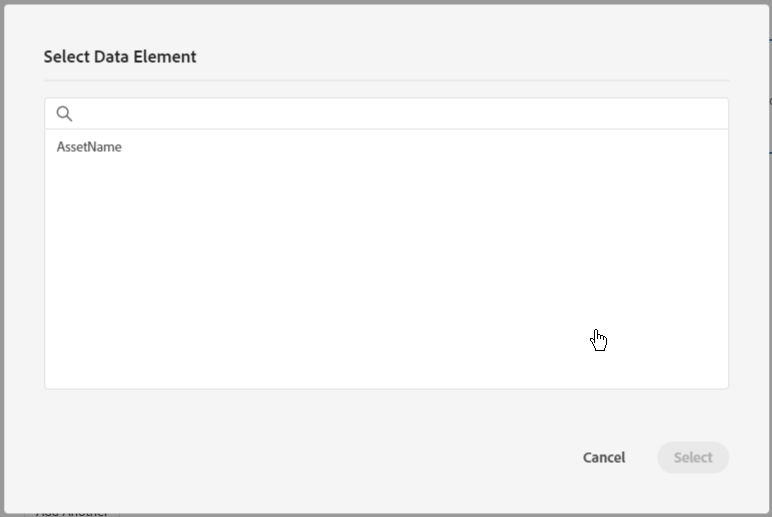

It is possible, however, to use an alternative approach and bypass Data Element creation. You can directly reference an argument from a Dynamic Media Viewer event. Enter the fully qualified name of the event argument in the **[!UICONTROL value]** input field of the Analytics variable assignment. Be sure you surround it with percent (%) signs. For example,

`%event.detail.dm.LOAD.asset%`

There is an important difference between using Data Elements and direct event argument reference. For Data Element, it does not matter which event triggers the Set Variables action. The event that triggers the Rule can be unrelated to Dynamic Viewer. For example, selecting the web page from the Core extension. But, when using a direct argument reference it is important to ensure that the event that triggers the rule corresponds to the event argument that it references.

For example, referencing `%event.detail.dm.LOAD.asset%` returns the correct asset name if the Rule is triggered by the **[!UICONTROL LOAD]** event of the Dynamic Media Viewer extension. However, it returns an empty value for any other event.

The following table lists Dynamic Media Viewer events and their supported arguments:

<table>
 <tbody>
  <tr>
   <td>Viewer event name</td>
   <td>Argument reference</td>
  </tr>
  <tr>
   <td><code>COMMON</code></td>
   <td><code>%event.detail.dm.objID%</code></td>
  </tr>
  <tr>
   <td> </td>
   <td><code>%event.detail.dm.compClass%</code></td>
  </tr>
  <tr>
   <td> </td>
   <td><code>%event.detail.dm.instName%</code></td>
  </tr>
  <tr>
   <td> </td>
   <td><code>%event.detail.dm.timeStamp%</code></td>
  </tr>
  <tr>
   <td><code>BANNER</code>  </td>
   <td><code>%event.detail.dm.BANNER.asset%</code></td>
  </tr>
  <tr>
   <td> </td>
   <td><code>%event.detail.dm.BANNER.frame%</code></td>
  </tr>
  <tr>
   <td> </td>
   <td><code>%event.detail.dm.BANNER.label%</code></td>
  </tr>
  <tr>
   <td><code>HREF</code></td>
   <td><code>%event.detail.dm.HREF.rollover%</code></td>
  </tr>
  <tr>
   <td><code>ITEM</code></td>
   <td><code>%event.detail.dm.ITEM.rollover%</code></td>
  </tr>
  <tr>
   <td><code>LOAD</code></td>
   <td><code>%event.detail.dm.LOAD.applicationname%</code></td>
  </tr>
  <tr>
   <td><strong> </strong></td>
   <td><code>%event.detail.dm.LOAD.asset%</code></td>
  </tr>
  <tr>
   <td><strong> </strong></td>
   <td><code>%event.detail.dm.LOAD.company%</code></td>
  </tr>
  <tr>
   <td><strong> </strong></td>
   <td><code>%event.detail.dm.LOAD.sdkversion%</code></td>
  </tr>
  <tr>
   <td><strong> </strong></td>
   <td><code>%event.detail.dm.LOAD.viewertype%</code></td>
  </tr>
  <tr>
   <td><strong> </strong></td>
   <td><code>%event.detail.dm.LOAD.viewerversion%</code></td>
  </tr>
  <tr>
   <td><code>METADATA</code></td>
   <td><code>%event.detail.dm.METADATA.length%</code></td>
  </tr>
  <tr>
   <td> </td>
   <td><code>%event.detail.dm.METADATA.type%</code></td>
  </tr>
  <tr>
   <td><code>MILESTONE</code></td>
   <td><code>%event.detail.dm.MILESTONE.milestone%</code></td>
  </tr>
  <tr>
   <td><code>PAGE</code></td>
   <td><code>%event.detail.dm.PAGE.frame%</code></td>
  </tr>
  <tr>
   <td> </td>
   <td><code>%event.detail.dm.PAGE.label%</code></td>
  </tr>
  <tr>
   <td><code>PAUSE</code></td>
   <td><code>%event.detail.dm.PAUSE.timestamp%</code></td>
  </tr>
  <tr>
   <td><code>PLAY</code></td>
   <td><code>%event.detail.dm.PLAY.timestamp%</code></td>
  </tr>
  <tr>
   <td><code>SPIN</code></td>
   <td><code>%event.detail.dm.SPIN.framenumber%</code></td>
  </tr>
  <tr>
   <td><code>STOP</code></td>
   <td><code>%event.detail.dm.STOP.timestamp%</code></td>
  </tr>
  <tr>
   <td><code>SWAP</code></td>
   <td><code>%event.detail.dm.SWAP.asset%</code></td>
  </tr>
  <tr>
   <td><code>SWATCH</code></td>
   <td><code>%event.detail.dm.SWATCH.frame%</code></td>
  </tr>
  <tr>
   <td> </td>
   <td><code>%event.detail.dm.SWATCH.label%</code></td>
  </tr>
  <tr>
   <td><code>TARG</code></td>
   <td><code>%event.detail.dm.TARG.frame%</code></td>
  </tr>
  <tr>
   <td> </td>
   <td><code>%event.detail.dm.TARG.label%</code></td>
  </tr>
  <tr>
   <td><code>ZOOM</code></td>
   <td><code>%event.detail.dm.ZOOM.scale%</code></td>
  </tr>
 </tbody>
</table>

## Configure all the integration pieces {#configuring-all-the-integration-pieces}

**BEFORE YOU BEGIN**

Adobe recommends that you thoroughly review all documentation before this section so you understand the complete integration.

This section explains the configuration steps that are necessary to integrate Dynamic Media viewers with Adobe Analytics and Adobe Analytics for Audio and Video. While use of the Dynamic Media Viewers extension for other purposes in Experience Platform Tags is possible, such scenarios are not covered in this documentation.

You are going to use the following Adobe products to configure your integration:  

* Adobe Analytics - used to configure tracking variables and reports.
* Experience Platform Tags - used to define a Property, one or more Rules, and one or more Data Elements to enable viewer tracking.

Also, if this integration solution is used with Experience Manager Sites, the following configuration must also be done:

* [!DNL Adobe Developer Console] - integration is created for Experience Platform Tags.
* Experience Manager author node - IMS configuration and Experience Platform Tags cloud configuration.

As part of the configuration, be sure you have access to a company in Adobe Experience Cloud that has Adobe Analytics and Experience Platform Tags already enabled.

## Configure Adobe Analytics for the integration {#configuring-adobe-analytics-for-the-integration}

After you configure Adobe Analytics, the following will be set up for the integration:

* A Report Suite is in place and selected.
* Analytics Variables are available to receive tracking data.
* Reports are available to view collected data inside Adobe Analytics.

See also [Analytics Implementation Guide](https://experienceleague.adobe.com/docs/analytics/implementation/home.html).

**To configure Adobe Analytics for the integration:**

1. Start by accessing Adobe Analytics from the Experience Cloud [home page](https://experience.adobe.com/#/home). On the menu bar, select the **[!UICONTROL Solutions]** icon (a three by three table of dots) near the upper-right corner of the page, then selecting **[!UICONTROL Analytics]**.

   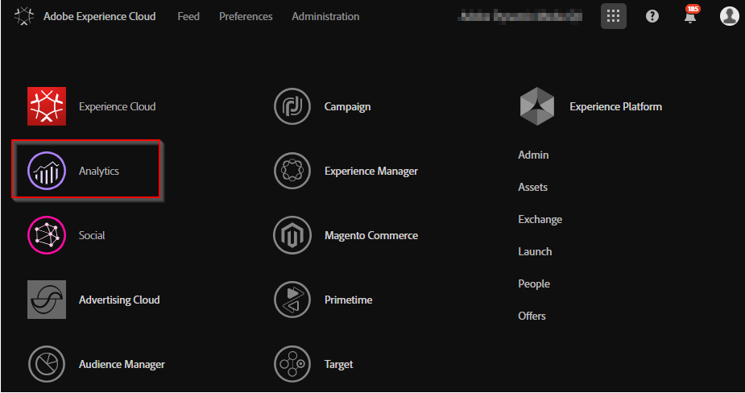

   Now select a report suite.

### Select a report suite {#selecting-a-report-suite}

1. Near the upper-right corner of the Adobe Analytics page, to the right of the **[!UICONTROL Search Reports]** field, select the correct report suite from the drop-down list. If there are multiple report suites available and you are unsure which one to use, contact your Adobe Analytics administrator who can help you select which report suite to use.

   In the screenshot below, a user created a report suite named *DynamicMediaViewersExtensionDoc* and selected it from the drop-down list. The report suite name is an example name only. The name of the report suite you ultimately select is up to you.

   If no report suite is available, you or your Adobe Analytics administrator must create one before you can proceed any further with the configuration.

   See [Reports and Report Suites](https://experienceleague.adobe.com/docs/analytics/admin/admin-tools/manage-report-suites/report-suites-admin.html) and [Create a report suite](https://experienceleague.adobe.com/docs/analytics/admin/admin-tools/manage-report-suites/c-new-report-suite/t-create-a-report-suite.html).

   In Adobe Analytics, report suites are managed under **[!UICONTROL Admin]** > **[!UICONTROL Report Suites]**.

   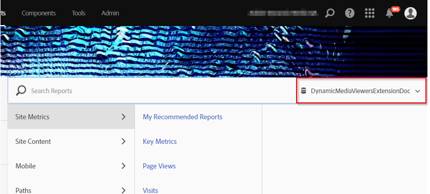

   Now set up Adobe Analytics variables.

### Set up Adobe Analytics variables {#setting-up-adobe-analytics-variables}

1. Designate one or more Adobe Analytics variables that you want to use to track Dynamic Media Viewers behavior on the web page.

   It is possible to use any type of variable supported by Adobe Analytics. The decision about the variable type (like Custom Traffic [props], Conversion [eVar]) is driven by the specific needs of your Analytics implementation.

   See [Overview of props and eVars](https://experienceleague.adobe.com/docs/analytics/implementation/vars/page-vars/evar.html#vars).

   For the purposes of this documentation, only a Custom Traffic (props) variable will be used because they become available in an Analytics Report within a few minutes after an action occurs on a web page.

   To enable a new Custom Traffic variable, in Adobe Analytics, in the toolbar, go to **[!UICONTROL Admin]** > **[!UICONTROL Report Suites]**.

1. On the **[!UICONTROL Report Suite Manager]** page, select the correct report, then in the toolbar, navigate to **[!UICONTROL Edit Settings]** > **[!UICONTROL Traffic]** > **[!UICONTROL Traffic Variables]**.
1. Select a variable that is not used, give it a descriptive name (**[!UICONTROL Viewer asset (prop 30)]**) and change combo box to "Enabled" in the Enabled column.

   The following screenshot is an example of a Custom Traffic variable ( **[!UICONTROL prop30]**) for tracking an asset name used by the viewer:

   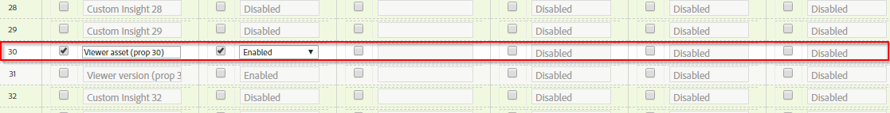

1. At the bottom of the variables list, select **[!UICONTROL Save]**.

### Set up a report {#setting-up-a-report}

1. Generally, setting up a Report in Adobe Analytics is driven by specific project needs. As such, detailed report setup is beyond the scope for this integration.

   It is, however, enough to know that the Custom Traffic reports become automatically available in Adobe Analytics after you set up Custom Traffic variables in [Setup Adobe Analytics variables](#setting-up-adobe-analytics-variables).

   For example, the report for **[!UICONTROL Viewer asset (prop 30)]** variable is available from the Reports menu under **[!UICONTROL Custom Traffic]** > **[!UICONTROL Custom Traffic 21-30]** > **[!UICONTROL Viewer asset (prop 30)]**.

   Visiting this report right after **[!UICONTROL Viewer asset (prop 30)]** creation shows no data; that is expected at this point in the integration.

   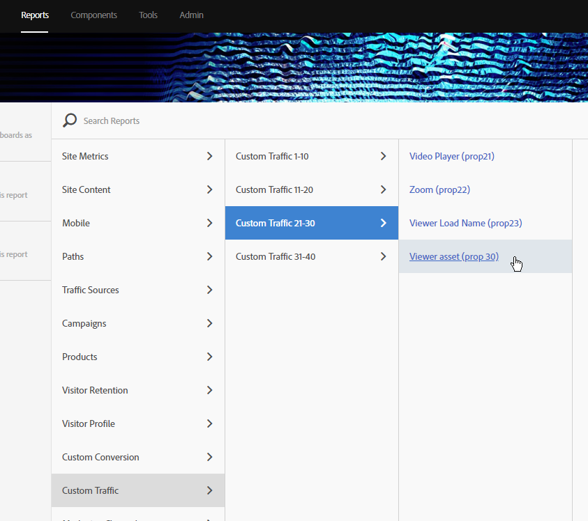

## Configure Experience Platform Tags for the integration {#configuring-adobe-launch-for-the-integration}

After you configure Experience Platform Tags, the following will be set up for the integration:

* The creation of a new Property to keep all your configurations together.
* The installation and setup of extensions. The client-side code of all extensions installed in the Property is compiled together into a library. This library is used by the web page later.
* Configuration of Data Elements and Rules. This configuration defines what data to capture from the Dynamic Media viewers, when to trigger the tracking logic, and where to send the viewer's data in Adobe Analytics.
* Publishing of the library.

**To configure Experience Platform Tags for the integration:**

1. Start by accessing Experience Platform Tags from the Experience Cloud [home page](https://experience.adobe.com/#/home). On the menu bar, select the **[!UICONTROL Solutions]** icon (three by three table of dots) near the upper-right corner of the page, then select **[!UICONTROL Tags]**.

   You can also [open Experience Platform Tags directly](https://launch.adobe.com/).

   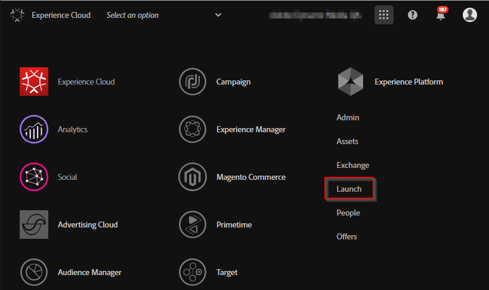

### Create a property in Experience Platform Tags {#creating-a-property-in-adobe-launch}

A property in Experience Platform Tags is a named configuration that keeps all your settings together. A library of the configuration settings is generated and published to different environment levels (development, staging, and production).

See also [Create a Tags property](https://experienceleague.adobe.com/docs/platform-learn/implement-mobile-sdk/initial-configuration/configure-tags.html).

1. In Experience Platform Tags, select **[!UICONTROL New Property]**.
1. In the **[!UICONTROL Create Property]** dialog box, in the **[!UICONTROL Name]** field, type a descriptive name, such as the title of your website. For example, `DynamicMediaViewersProp.`
1. In the **[!UICONTROL Domains]** field, enter your website's domain.
1. In the **[!UICONTROL Advanced Options]** drop-down, enable **[!UICONTROL Configure for extension development (cannot be modified later)]** in case the extension you want to use--in this case, *Dynamic Media Viewers*--is not yet released.

   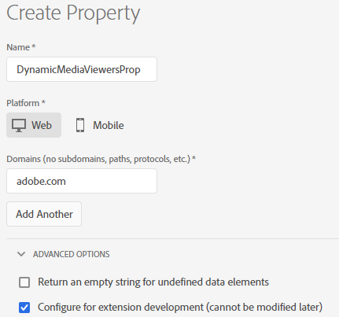

1. Select **[!UICONTROL Save]**.

   Select the newly created property then proceed to *Installation and setup of extensions*.

### Install and set up of extensions {#installing-and-setup-of-extensions}

All available extensions in Experience Platform Tags are listed under **[!UICONTROL Extensions]** > **[!UICONTROL Catalog]**.

To install an extension, select **[!UICONTROL Install]**. If needed, perform a one-time extension configuration, then select **[!UICONTROL Save]**.

Where required, the following extensions must be installed and configured:

* (Required) *Experience Cloud ID Service* extension.

No additional configuration is needed, accept for any proposed values. When you are done, be sure you select **[!UICONTROL Save]**.

See [Adobe Experience Cloud Identity Service extension](https://experienceleague.adobe.com/docs/experience-platform/tags/extensions/client/id-service/overview.html).

* (Required) *Adobe Analytics* extension

To configure this extension, you need the Report Suite ID found in Adobe Analytics, under **[!UICONTROL Admin]** > **[!UICONTROL Report Suite]**, under the **[!UICONTROL Report Suite ID]** column header.

(For demonstration purposes only, the Report Suite ID of the **[!UICONTROL DynamicMediaViewersExtensionDoc]** Report Suite is used in the following screenshots. This ID was created and used in [Select a Report Suite](#selecting-a-report-suite) earlier.)

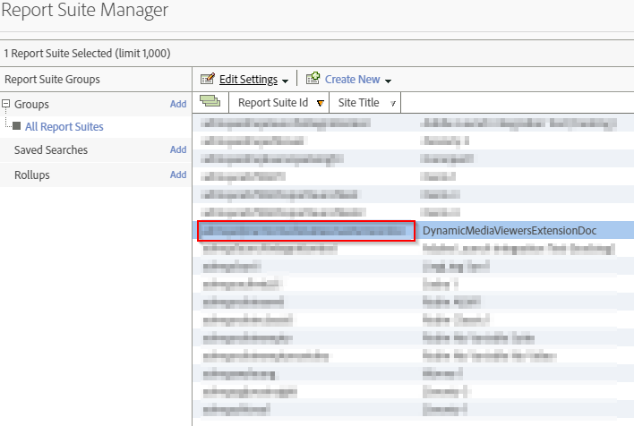

On the Install Extension page, enter the Report Suite ID in the **[!UICONTROL Development Report Suites]** field, the **[!UICONTROL Staging Report Suites]** field, and the **[!UICONTROL Production Report Suites]** field.

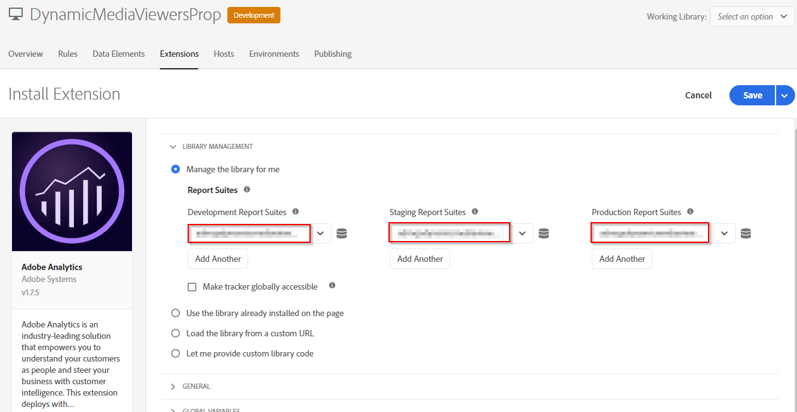

*Configure the following item only if you plan to use video tracking:*

On the **[!UICONTROL Install Extension]** page, expand **[!UICONTROL General]**, then specify the Tracking Server. The Tracking Server follows the template `<trackingNamespace>.sc.omtrdc.net`, where `<trackingNamespace>` is the information obtained in the provisioning email.

Select **[!UICONTROL Save]**.

See [Adobe Analytics extension](https://experienceleague.adobe.com/docs/experience-platform/tags/extensions/client/analytics/overview.html).

* (Optional; required only if video tracking is needed) *Adobe Media Analytics for Audio and Video* extension

Fill in the tracking server field. The tracking server for *Adobe Media Analytics for Audio and Video* extension is different from the tracking server used for Adobe Analytics. It follows the template `<trackingNamespace>.hb.omtrdc.net`, where `<trackingNamespace>` is the information from the provisioning email.

All other fields are optional.

See [Adobe Media Analytics for Audio and Video extension](https://experienceleague.adobe.com/docs/experience-platform/tags/extensions/client/media-analytics/overview.html).

* (Required) *Dynamic Media Viewers* extension

Select **[!UICONTROL enable Adobe Analytics for Video]** to enable (turn on) Video Heartbeat tracking.

As of this writing, the *Dynamic Media Viewers* extension is only available if the Experience Platform Tags Property is created for development.

See [Create a property in Experience Platform Tags](#creating-a-property-in-adobe-launch).

After the extensions are installed and setup, at minimum, the following five extensions (four if you are not tracking video) will be listed in the Extensions &gt; Installed area.

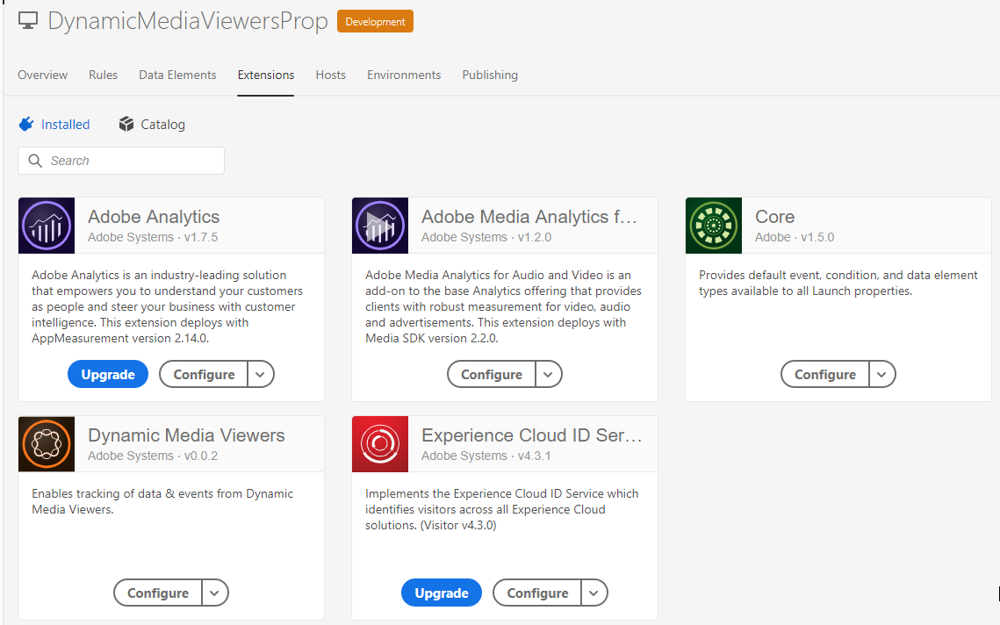

### Set up Data Elements and Rules {#setting-up-data-elements-and-rules}

In Experience Platform Tags, create Data Elements and Rules that are necessary for tracking Dynamic Media viewers.

See [How data and event tracking works in the integration](#how-data-and-event-tracking-works-in-the-integration) for an overview of tracking with Experience Platform Tags.

See [Sample configuration](#sample-configuration) for a sample configuration in Experience Platform Tags that demonstrates how to track an asset name on viewer load.

See [Configure the Dynamic Media Viewers extension](#configuring-the-dynamic-media-viewers-extension) for in-depth information about the extension's capabilities.

### Publish a library {#publishing-a-library}

To change the Experience Platform Tags configuration (including Property, Extensions, Rules, and Data Elements set up), you must *publish* such changes. Publishing in Experience Platform Tags is performed from the Publishing tab under the Property configuration.

Experience Platform Tags can potentially have multiple Development environments, one Staging environment, and one Production environment. By default the Experience Platform Tags Cloud Configuration in Experience Manager points the Experience Manager author node to the Stage environment of Experience Platform Tags. The Experience Manager Publish node points to the Production environment of Experience Platform Tags. This arrangement means that with the default Experience Manager settings, it is necessary to publish the Experience Platform Tags library to the Staging environment. Doing so lets you use it in Experience Manager author. You can then publish it into the Production environment so that it can be used in Experience Manager publish.

See [Environments](https://experienceleague.adobe.com/docs/experience-platform/tags/publish/environments/environments.html) for more information about Experience Platform Tags environments.

Publishing a library involves the following two steps:

* Adding and building a new library by including all the necessary changes (new ones and updates) into the library.
* Moving up the library through the different environment levels (from Development to Staging and Production).

#### Add and build a new library {#adding-and-building-a-new-library}

1. The first time you open the Publishing tab in Experience Platform Tags, the library list is empty.

   In the left column, select **[!UICONTROL Add New Library]**.

   

1. On the Create New Library page, in the **[!UICONTROL Name]** field, enter descriptive name for the new library. For example,

   *DynamicMediaViewersLib*

   From the Environment drop-down list, choose the Environment level. Initially, only the Development level is available for selection. Near the lower-left side of the page, select **[!UICONTROL Add All Changed Resources]**.

   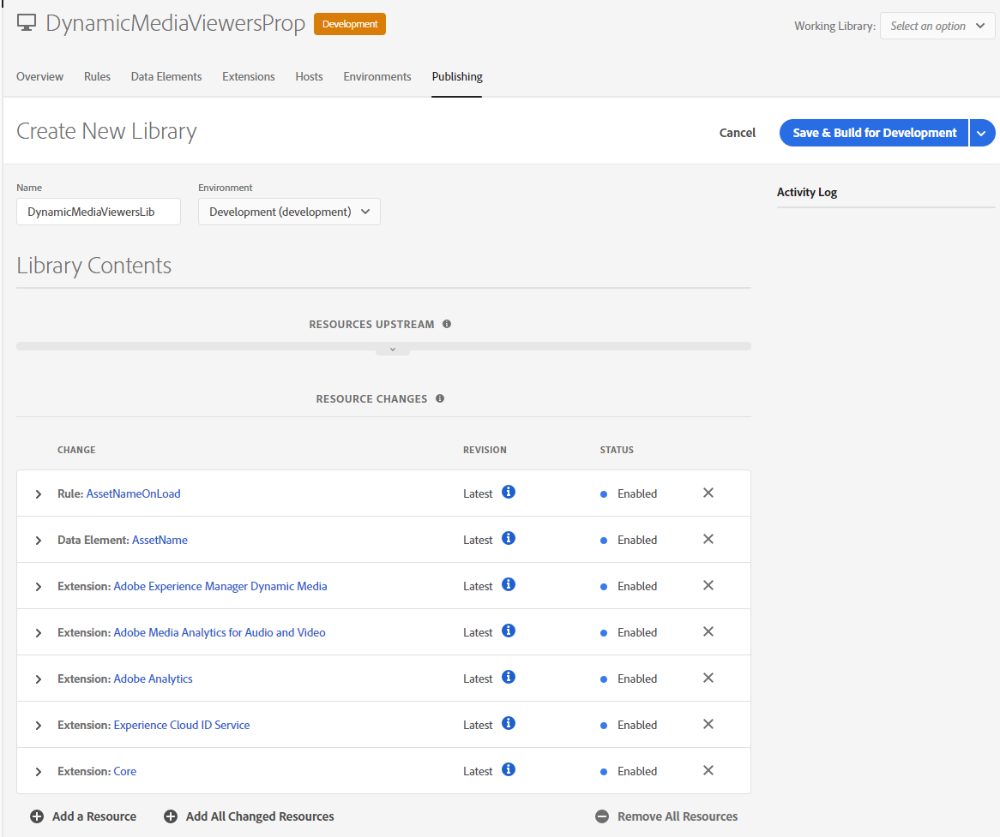

1. Near the upper-right corner of the page, select **[!UICONTROL Save & Build for Development]**.

   In a few minutes, the library is created and ready to use.

   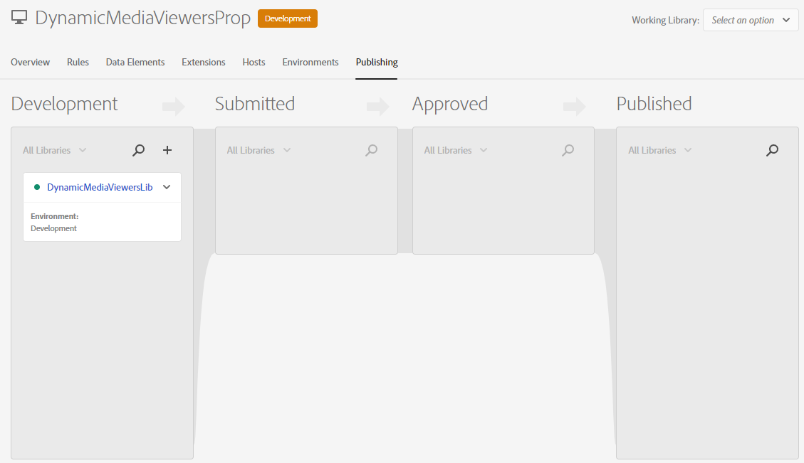

   >[!NOTE]
   >
   >The next time you change your Experience Platform Tags configuration, go to the **[!UICONTROL Publishing]** tab under the **[!UICONTROL Property]** configuration, then select your previously created library.
   >
   >
   >From the library publishing screen, select **[!UICONTROL Add All Changed Resources]**, then select **[!UICONTROL Save & Build for Development]**.

#### Move up a library through environment levels {#moving-a-library-up-through-environment-levels}

1. After a new library is added, it is found in the Development environment. To move it to the Staging environment level (which corresponds to the Submitted column), from the library's drop-down menu, select **[!UICONTROL Submit for Approval]**.

   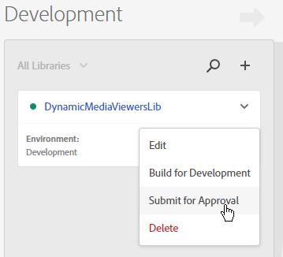

1. In the confirmation dialog box, select **[!UICONTROL Submit]**.

   After the library moves to the Submitted column, from the library's drop-down menu, select **[!UICONTROL Build for Staging]**.

   

1. To move the library from the Staging environment to the Production environment (which is the Published column), follow a similar process.

   First, from the drop-down menu, select **[!UICONTROL Approve for Publishing]**.

   

1. From the drop-down menu, select **[!UICONTROL Build & Publish to Production]**.

   

   See [Publishing](https://experienceleague.adobe.com/docs/experience-platform/tags/publish/overview.html) for more information about the publishing process in Experience Platform Tags.

## Configure Adobe Experience Manager for the integration {#configuring-adobe-experience-manager-for-the-integration}

Prerequisites:

* Experience Manager runs both Author and Publish instances.
* Experience Manager author node is set up in Dynamic Media - Scene7 run mode (dynamicmedia_s7)
* Dynamic Media WCM components are enabled in Experience Manager Sites.

The Experience Manager configuration consists of the following two major steps:

* Configuration of Experience Manager IMS.
* Configuration of Experience Platform Tags Cloud.

### Configure Experience Manager IMS {#configuring-aem-ims}

1. In Experience Manager author, select the **[!UICONTROL Tools]** icon (hammer), then go to **[!UICONTROL Security]** > **[!UICONTROL Adobe IMS Configurations]**.

   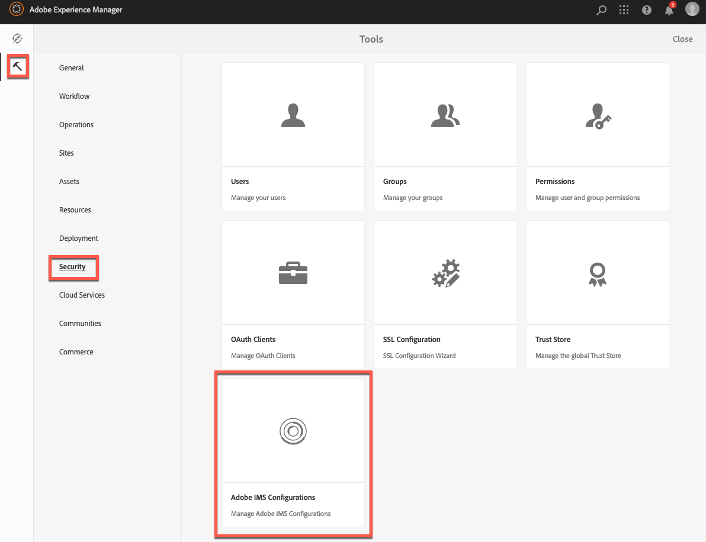

1. On the Adobe IMC Configuration page, near the upper-left corner, select **[!UICONTROL Create]**.
1. On the **[!UICONTROL Adobe IMS Technical Account Configuration]** page, in the **[!UICONTROL Cloud Solution]** drop-down list, select **[!UICONTROL Experience Platform Tags]**.
1. Enable **[!UICONTROL Create new certificate]**, then in the text field, enter any meaningful value for your certificate. For example, *AdobeLaunchIMSCert*. Select **[!UICONTROL Create certificate]**.

   The following Info message is displayed:

   *To retrieve a valid access token, the new certificate's public key is added to the technical account on Adobe Developer Console!*

   To dismiss the Info dialog box, select **[!UICONTROL OK]**.

   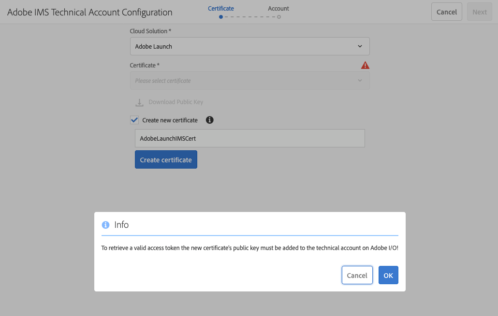

1. To download a public key file (&#42;.crt) to your local system, select **[!UICONTROL Download Public Key]**.

   >[!NOTE]
   >
   >At this point, ***leave open*** the **[!UICONTROL Adobe IMS Technical Account Configuration]** page; ***do not*** close the page and ***do not*** select Next. You are going to return to this page later in the steps.

   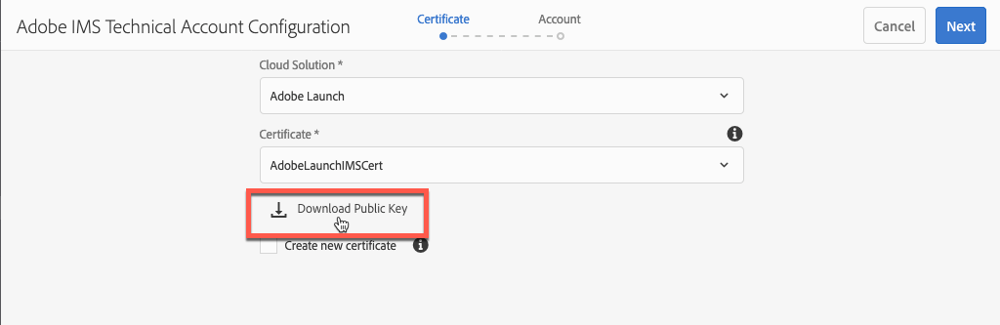

1. In a new browser tab, navigate to [[!DNL Adobe Developer Console]](https://developer.adobe.com/console/integrations).

1. From the **[!UICONTROL Adobe Developer Console Integrations]** page, near the upper-right corner, select **[!UICONTROL New integration]**.
1. In the **[!UICONTROL Create a new integration]** dialog box, ensure that **[!UICONTROL Access an API]** radio button is selected, then select **[!UICONTROL Continue]**.

   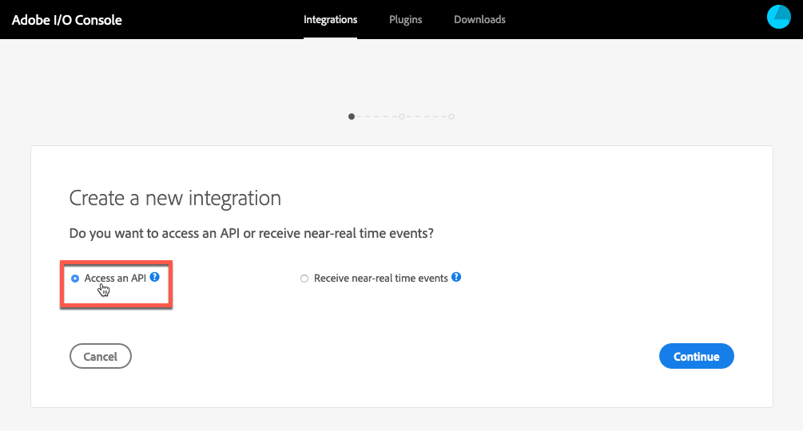

1. On the second **[!UICONTROL Create a new integration]** page, enable (turn on) the **[!UICONTROL Experience Platform Tags API]** radio button. In the lower-right corner of the page, select **[!UICONTROL Continue]**.

   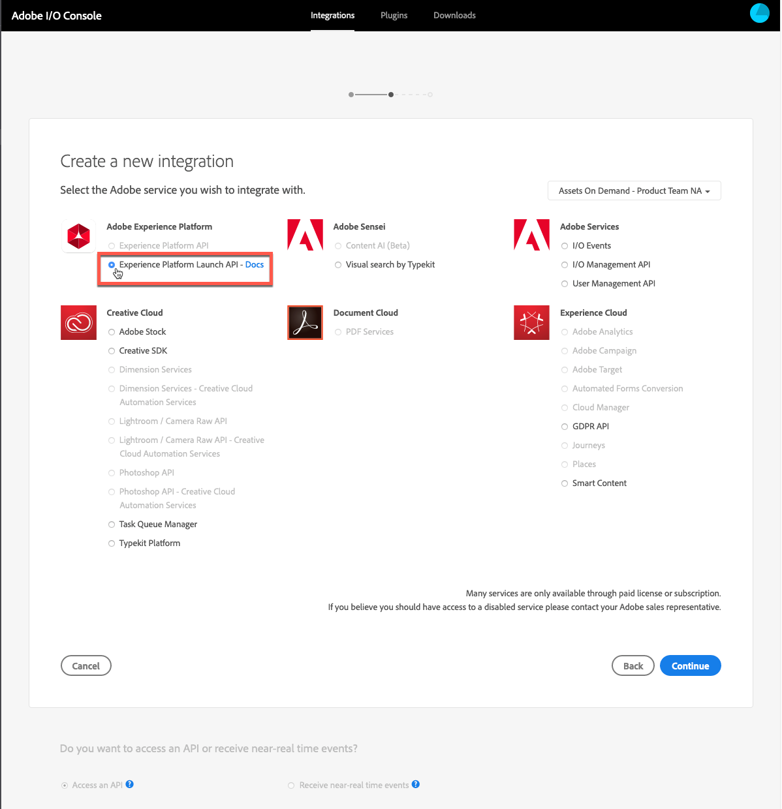

1. On the third **[!UICONTROL Create a new integration]** page, do the following:

    * In the **[!UICONTROL Name]** field, enter descriptive name. For example, *DynamicMediaViewersIO*.

    * In the **[!UICONTROL Description]** field, enter description for the integration.

    * In the **[!UICONTROL Public key certificates]** area, upload your public key file (&#42;.crt) that you downloaded previously in these steps.

    * Under the **[!UICONTROL Select a role for Experience Platform Tags API]** heading, select **[!UICONTROL Admin]**.

    * Under the **[!UICONTROL Select one or more product profiles for Experience Platform Tags API]** heading, select the product profile named **[!UICONTROL Tags - <your_company_name>]**.

   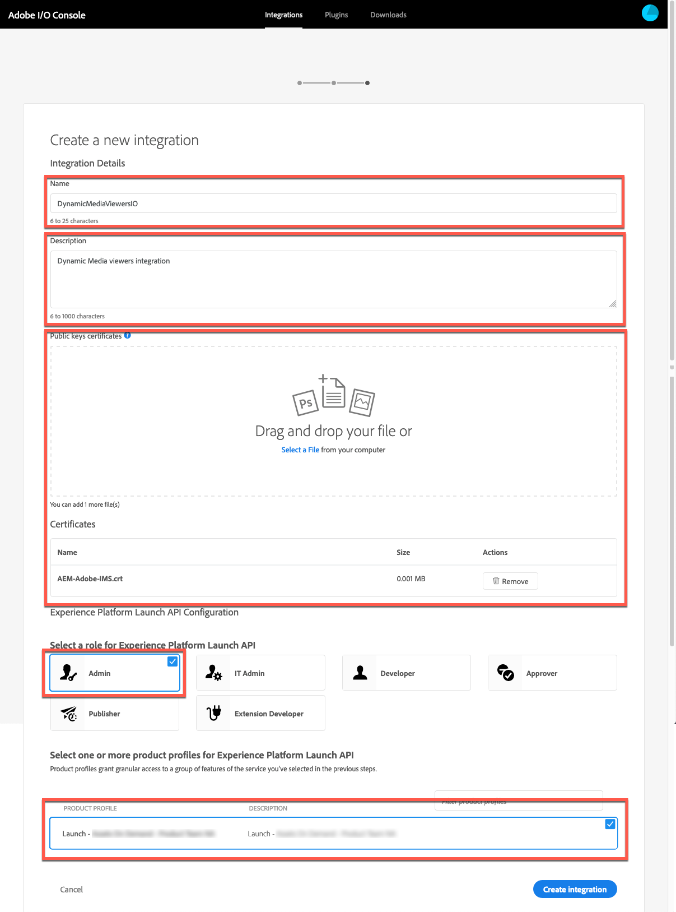

1. Select **[!UICONTROL Create integration]**.
1. On the **[!UICONTROL Integration created]** page, select **[!UICONTROL Continue to integration details]**.

   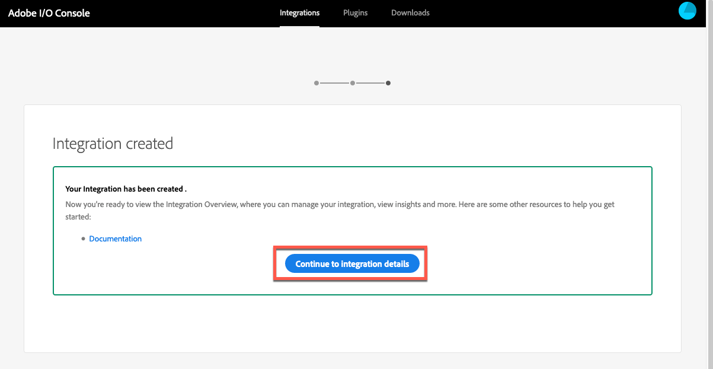

1. An Integrations details page appears, **[!UICONTROL]** similar to the following:

   >[!NOTE]
   >
   >***Leave open this Integration details page***. You are going to need various pieces of information from the **[!UICONTROL Overview]** and **[!UICONTROL JWT]** tabs in just a moment.

   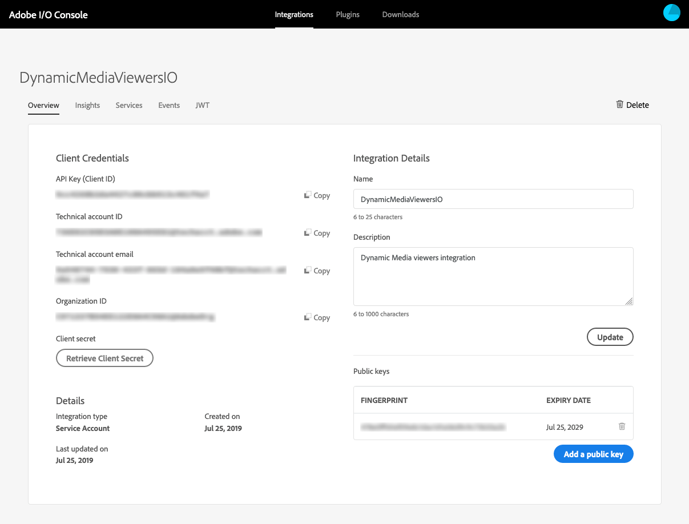

   Integration details page.

1. Return to the **[!UICONTROL Adobe IMS Technical Account Configuration]** page that you left open previously. In the upper-right corner of the page, select **[!UICONTROL Next]** to open the **[!UICONTROL Account]** page in the **[!UICONTROL Adobe IMS Technical Account Configuration]** window.

   (If you closed the page earlier, return to Experience Manager author, then navigate to **[!UICONTROL Tools]** > **[!UICONTROL Security]** > **[!UICONTROL Adobe IMS Configurations]**. Select **[!UICONTROL Create]**. In the **[!UICONTROL Cloud Solution]** drop-down list, select **[!UICONTROL Experience Platform Tags]**. In the **[!UICONTROL Certificate]** drop-down list, select the name of the previously created certificate.)

   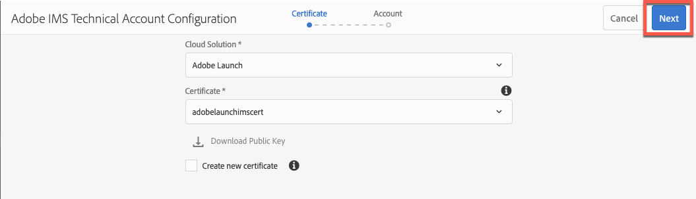

   Adobe IMS Technical Account Configuration - Certificate page.

1. The **[!UICONTROL Account]** page has five fields that you are required to fill out using information from the Integration details page from the previous step.

   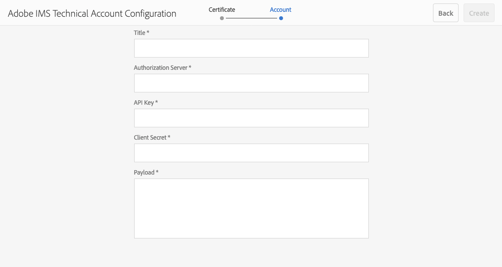

   Adobe IMS Technical Account Configuration - Account page.

1. On the **[!UICONTROL Account]** page, fill in the following fields:

    * **[!UICONTROL Title]** - Enter a descriptive account title.
    * **[!UICONTROL Authorization Server]** - Return to the Integration details page that you opened earlier. Select the **[!UICONTROL JWT]** tab. Copy the server name--without the path--as highlighted below.

   Return to the **[!UICONTROL Account]** page, then paste the name into the respective field.
   For example, `https://ims-na1.adobelogin.com/`
   (the server name is an example only)

   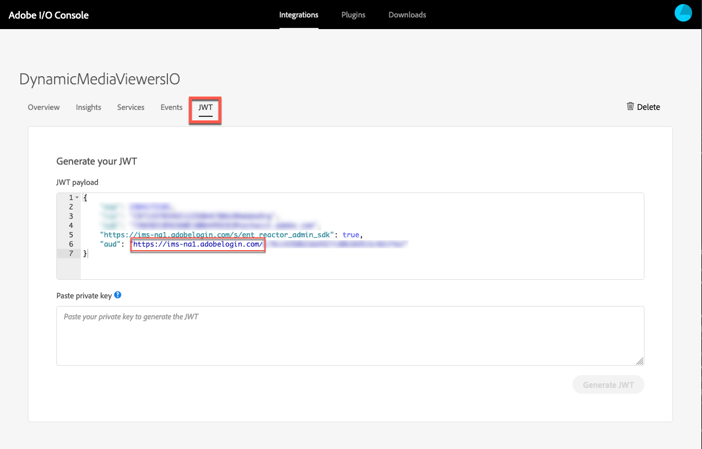

   Integration detail page - JWT tab

1. **[!UICONTROL API Key]** - Return to the Integration details page. Select the **[!UICONTROL Overview]** tab, then to the right of the **[!UICONTROL API Key (Client ID)]** field, select **[!UICONTROL Copy]**.

   Return to the **[!UICONTROL Account]** page, then paste the key into the respective field.

   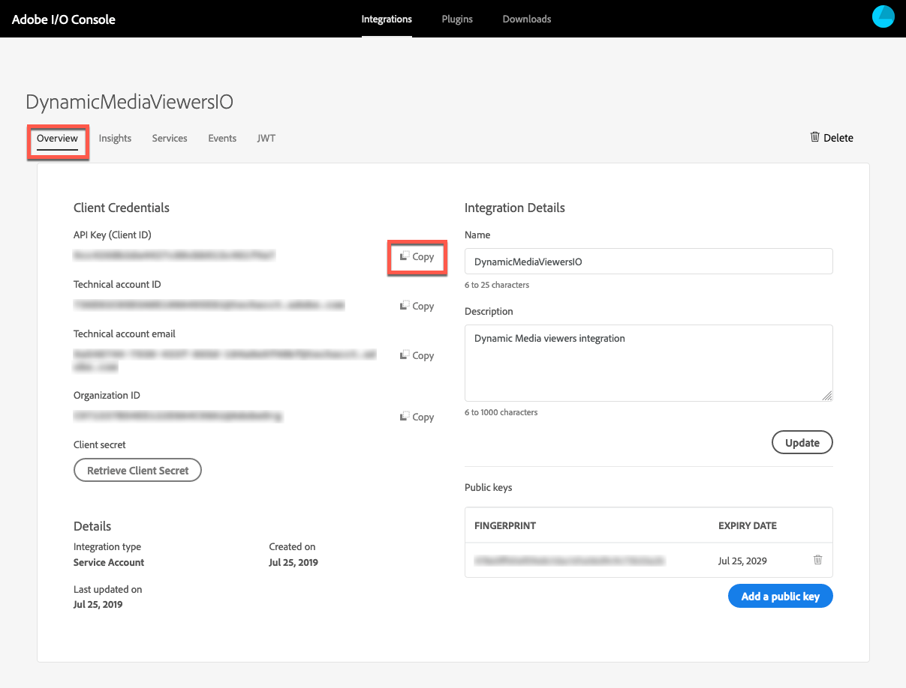

   Integration details page.

1. **[!UICONTROL Client Secret]** - Return to the Integration details page. From the **[!UICONTROL Overview]** tab, select **[!UICONTROL Retrieve Client Secret]**. To the right of the **[!UICONTROL Client secret]** field, select **[!UICONTROL Copy]**.

   Return to the **[!UICONTROL Account]** page, then paste the key into the respective field.

1. **[!UICONTROL Payload]** - Return to the Integration details page. From the **[!UICONTROL JWT]** tab, in the JWT Payload field, copy the entire JSON object code.

   Return to the **[!UICONTROL Account]** page, then paste the code into the respective field.

   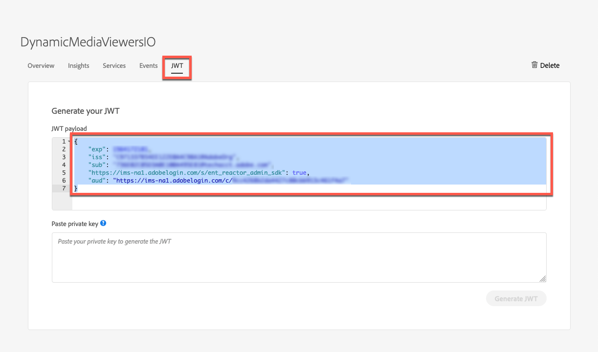

   Integration details page - JWT tab

   The Account page, with all fields filled out, looks similar to the following:

   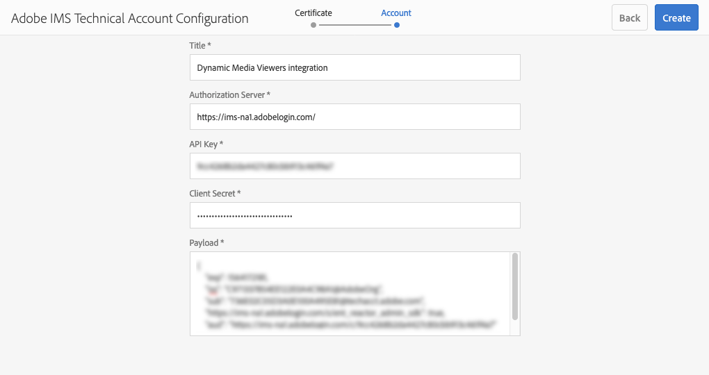

1. Near the upper-right corner of the **[!UICONTROL Account]** page, select **[!UICONTROL Create]**.

   With Experience Manager IMS configured, you now have a new IMSAccount listed under **[!UICONTROL Adobe IMS Configurations]**.

   

## Configure Experience Platform Tags Cloud for the integration {#configuring-adobe-launch-cloud-for-the-integration}

1. In Experience Manager author, near the upper-left corner, select the **[!UICONTROL Tools]** icon (hammer), then go to **[!UICONTROL Cloud Services]** > **[!UICONTROL Experience Platform Tags Configurations]**.

   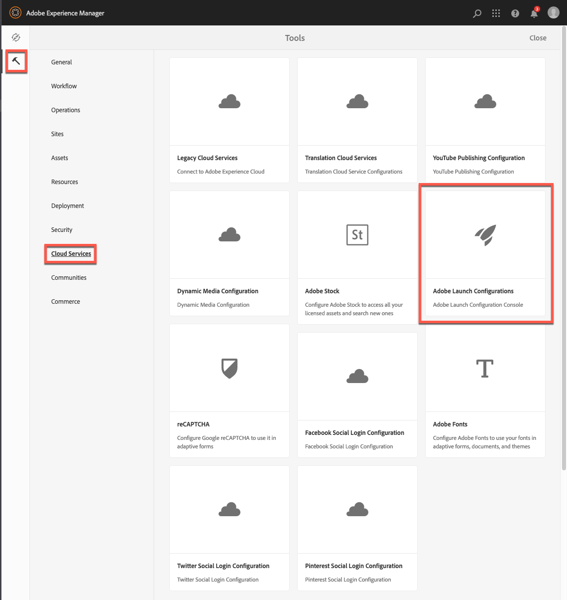

1. On the **[!UICONTROL Experience Platform Tags Configurations]** page, in the left panel, select an Experience Manager Site for which you want to apply your Experience Platform Tags Configuration.

   For sample purposes only, the **`We.Retail`** site is selected in the screenshot below.

   

1. Near the upper-left corner of the page, select **[!UICONTROL Create]**.
1. On the **[!UICONTROL General]** page (1/3 pages) of the **[!UICONTROL Create Experience Platform Tags Configuration]** window, fill in the following fields:

    * **[!UICONTROL Title]** - Enter a descriptive configuration title. For example, `We.Retail Tags cloud configuration`.

    * **[!UICONTROL Associated Adobe IMS Configuration]** - Select the IMS configuration that you created earlier in [Configure Experience Manager IMS](#configuring-aem-ims).

    * **[!UICONTROL Company]** - From the **[!UICONTROL Company]** drop-down list, select your Experience Cloud company. The list populates automatically.

    * **[!UICONTROL Property]** - From the Property drop-down list, select your Experience Platform Tags property that you created previously. The list populates automatically.

   After completing all the fields, your **[!UICONTROL General]** page will look similar to the following:

   

1. Near the upper-left corner, select **[!UICONTROL Next]**.
1. On the **[!UICONTROL Staging]** page (2/3 pages) of the **[!UICONTROL Create Experience Platform Tags Configuration]** window, fill in the following field:

   In the **[!UICONTROL Library URI]** (Uniform Resource Identifier) field, check the location of the staging version of your Experience Platform Tags library. Experience Manager populates this field automatically.

   For example purposes only, this step uses Experience Platform Tags libraries that are deployed to Adobe CDN.

   >[!NOTE]
   >
   >Check to make sure that the auto-populated library URI (Uniform Resource Identifier) is not malformed. If necessary, fix it so that the URI represents a protocol-relative URI. That is, it starts from a double forward slash.
   >
   >
   >For example: `//assets.adobetm.com/launch-xxxx`.

   Your **[!UICONTROL Staging]** page likely appears similar to the following. The **[!UICONTROL Archive]** and **[!UICONTROL Load Library Asynchronously]** options are ***not*** set:

   

1. Near the upper-right corner, select **[!UICONTROL Next]**.
1. On the **[!UICONTROL Production]** page (3/3 pages) of the **[!UICONTROL Create Experience Platform Tags Configuration]** window, if needed, fix the auto-populated production URI similar to how it was done on the previous **[!UICONTROL Staging]** page.
1. Near the upper-right corner, select **[!UICONTROL Create]**.

   Your new Experience Platform Tags Cloud Configuration is now created and listed next to your web site similar to the following example:

1. Select your new Experience Platform Tags Cloud Configuration (a check mark appears to the left of the configuration title when it is selected). On the toolbar, select **[!UICONTROL Publish]**.

   

Currently, Experience Manager author does not support the integration of Dynamic Media Viewers with Experience Platform Tags.

It is, however, supported in the Experience Manager publish node. Using the default settings of Experience Platform Tags Cloud Configuration, Experience Manager publish node uses the production environment of Experience Platform Tags. As such, it is necessary to push Experience Platform Tags library updates from Development up to the Production environment each time during the test.

It is possible to work around this limitation. Specify the Development or Staging URL of the Platform Tags library in the Experience Platform Tags Cloud configuration for the Experience Manager publish node above. Doing so makes the Experience Manager publish node use the Development or Staging version of Experience Platform Tags library.

See [Integrate Experience Manager with Experience Platform Tags by way of [!DNL Adobe Developer Console]](https://experienceleague.adobe.com/docs/experience-manager-learn/sites/integrations/experience-platform-data-collection-tags/overview.html) for more information about setting up Experience Platform Tags Cloud Configuration.
