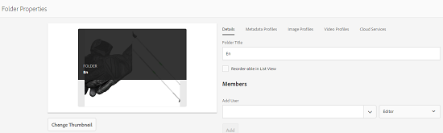
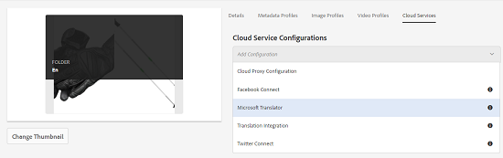
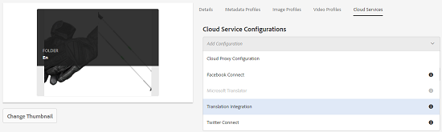
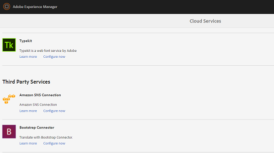
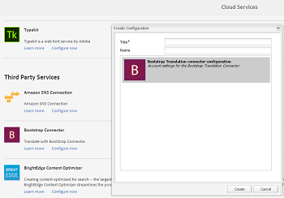
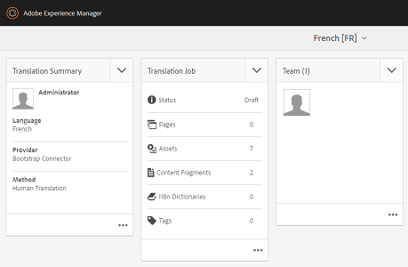

# Applying translation cloud services to folders {#applying-translation-cloud-services-to-folders}

Adobe Experience Manager (AEM) lets you avail cloud-based translation services from the translation provider of your choice to ensure your assets are translated based on your requirements.

You can apply the translation cloud service directly to your asset folder so they can be utilized during translation workflows.

## Applying the translation services {#applying-the-translation-services}

Applying translation cloud services directly to your asset folder eliminates the need to configure translation services when you create or update translation workflows.

1. From the Assets UI, select the folder to which you want to apply translation services.
1. From the toolbar, click/tap the **[!UICONTROL Properties]** icon to display the **[!UICONTROL Folder Properties]** page.

   

1. Navigate to the **[!UICONTROL Cloud Services]** tab.
1. From the Cloud Service Configurations list, choose the desired translation provider. For example, if you want to avail translation services from Microsoft, choose **[!UICONTROL Microsoft Translator]**.

   

1. Choose the connector for the translation provider.

   

1. From the toolbar, click/tap **[!UICONTROL Save]**, and then click **[!UICONTROL OK]** to close the dialog.The translation service is applied to the folder.

## Applying custom translation connector  {#applying-custom-translation-connector}

If you want to apply a custom connector for the translation services you want to use in translation workflows. To apply a custom connector, first install the connector from Package Manager. Then, configure the connector from the Cloud Services console. After you configure the connector, it is available in the list of connectors in the Cloud Services tab described in [Applying the translation services](transition-cloud-services.md#applying-the-translation-services). After you apply the custom connector and run translation workflows, the **[!UICONTROL Translation Summary]** tile of the translation project displays the connector details under the heads **[!UICONTROL Provider]** and **[!UICONTROL Method]**.

1. Install the connector from Package Manager.
1. Click/tap the AEM logo, and navigate to **[!UICONTROL Tools > Deployment > Cloud Services]**.
1. Locate the connector you installed under **[!UICONTROL Third Party Services]** in the **[!UICONTROL Cloud Services]** page.

   

1. Click/tap the **[!UICONTROL Configure now]** link to open the **[!UICONTROL Create Configuration]** dialog.

   

1. Specify a title and a name for the connector, and then click/tap **[!UICONTROL Create]**. The custom connector is available in the list of connectors in the **[!UICONTROL Cloud Services]** tab described in step 5 of [Applying the translation services](#applying-the-translation-services). 
1. Run any translation workflow described in [Creating Translation Projects](translation-projects.md) after you apply the custom connector. Verify the details of the connector in the **[!UICONTROL Translation Summary]** tile of the translation project in the **[!UICONTROL Projects]** console.

   

