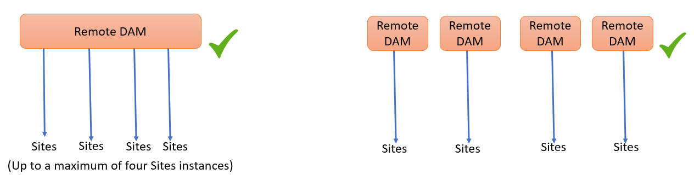
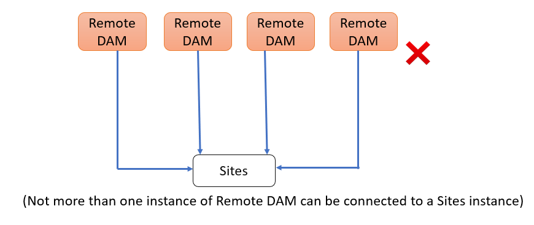
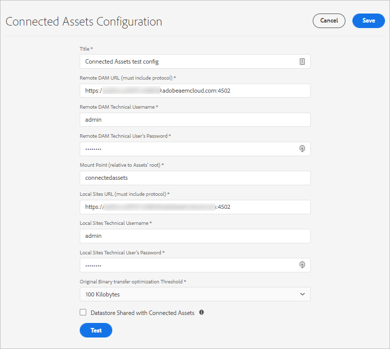
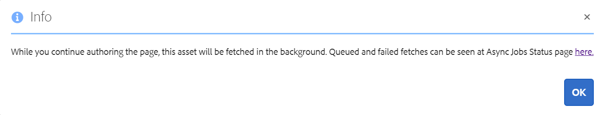
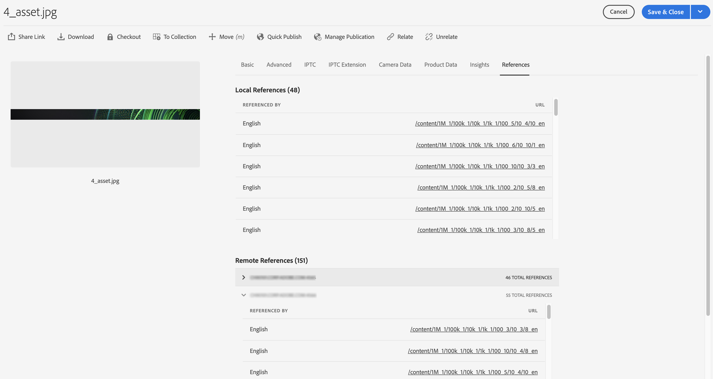
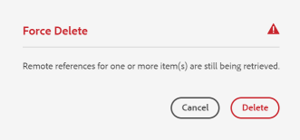
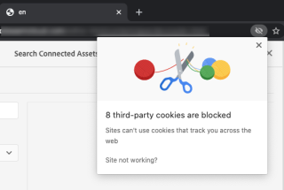
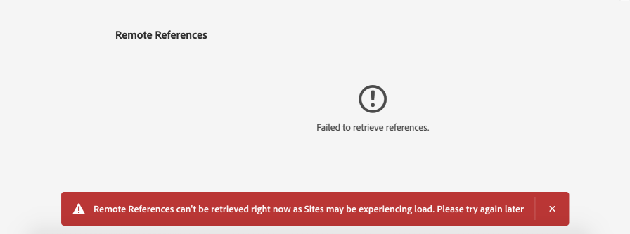

# Use Connected Assets to share DAM assets in [!DNL Experience Manager Sites] {#use-connected-assets-to-share-dam-assets-in-aem-sites}

| Version | Article link |
| -------- | ---------------------------- |
| AEM as a Cloud Service  |    [Click here](https://experienceleague.adobe.com/docs/experience-manager-cloud-service/content/assets/admin/use-assets-across-connected-assets-instances.html?lang=en)                  |
| AEM 6.5     | This article|


In large enterprises the infrastructure required to create websites may be distributed. At times the website creation capabilities and digital assets used to create these websites may reside in different deployments. One reason can be geographically distributed existing deployments that are required to work together. Another reason can be acquisitions leading to heterogenous infrastructure, including different [!DNL Experience Manager] versions, that the parent company wants to use together.

Connected Assets functionality supports the above use cases by integrating [!DNL Experience Manager Sites] and [!DNL Experience Manager Assets]. Users can create web pages in [!DNL Sites] that use the digital assets from a separate [!DNL Assets] deployments.

>[!NOTE]
>
>Configure Connected Assets only when you need to use the assets available on a remote DAM deployment on a separate Sites deployment for authoring web pages.

## Overview of Connected Assets {#overview-of-connected-assets}

When editing pages in [!UICONTROL Page Editor] as target destination, the authors can seamlessly search, browse, and embed assets from a different [!DNL Assets] deployment that acts as a source of assets. The administrators create a one-time integration of a deployment of [!DNL Experience Manager] with [!DNL Sites] capability with another deployment of [!DNL Experience Manager] with [!DNL Assets] capability. Site authors can also use Dynamic Media images in their site's web pages through Connected Assets and leverage the Dynamic Media functionalities, such as smart crop and image presets.

For the [!DNL Sites] authors, the remote assets are available as read-only local assets. The functionality supports seamless search and access to remote assets on the Site Editor. For any other use cases that may require the complete asset-corpus to be available on Sites, consider migrating the assets in bulk instead of using Connected Assets. See [Experience Manager Assets migration guide](/help/assets/assets-migration-guide.md).

### Prerequisites and supported deployments {#prerequisites}

Before you use or configure this capability, ensure the following:

* The users are part of the appropriate user groups on each deployment.
* For [!DNL Adobe Experience Manager] deployment types, one of the supported criteria is met. [!DNL Experience Manager] 6.5 [!DNL Assets] works with [!DNL Experience Manager] as a Cloud Service. For more information about how this functionality works in [!DNL Experience Manager] as a [!DNL Cloud Service], see [Connected Assets in Experience Manager as a Cloud Service](https://experienceleague.adobe.com/docs/experience-manager-cloud-service/content/assets/admin/use-assets-across-connected-assets-instances.html).

  | |[!DNL Sites] as a [!DNL Cloud Service] | [!DNL Experience Manager] 6.5 [!DNL Sites] on AMS| [!DNL Experience Manager] 6.5 [!DNL Sites] on-premise|
  |---|---|---|---|
  |**[!DNL Experience Manager Assets] as a [!DNL Cloud Service]**| Supported | Supported | Supported |
  |**[!DNL Experience Manager] 6.5 [!DNL Assets] on AMS** | Supported | Supported | Supported |
  |**[!DNL Experience Manager] 6.5 [!DNL Assets] on-premise** | Not Supported |Not Supported | Not Supported |

### Supported file formats {#mimetypes}

Authors search for images and the following types of documents in Content Finder and drag the searched assets in Page Editor. Documents are added to the `Download` component and images to the `Image` component. Authors may also add the remote assets in any custom [!DNL Experience Manager] component that extends the default `Download` or `Image` components. The supported formats are:

* **Image formats**: The formats that the [Image component](assets-formats.md#supported-raster-image-formats) supports.
* **Document formats**: See the [supported document formats](assets-formats.md#supported-document-formats).

### Users and groups involved {#users-and-groups-involved}

The various roles that are involved to configure and use the capability and their corresponding user groups are described below. Local scope is used for the use case where an author creates a web page. Remote scope is used for the DAM deployment hosting the required assets. The [!DNL Sites] author fetches these remote assets.

| Role | Scope | User group | User name in walk-through | Descriptions |
|---|---|---|---|---|
| [!DNL Sites] administrator | Local | [!DNL Experience Manager] `administrators` | `admin` | Set up [!DNL Experience Manager] and configure integration with the remote [!DNL Assets] deployment. |
| DAM user | Local | `Authors` | `ksaner` | Used to view and duplicate the fetched assets at `/content/DAM/connectedassets/`. |
| [!DNL Sites] author | Local | <ul><li>`Authors` (with read access on the remote DAM and author access on local [!DNL Sites]) </li> <li>`dam-users` on local [!DNL Sites]</li></ul> | `ksaner` | End users are [!DNL Sites] authors who use this integration to improve their content velocity. The authors search and browse assets in remote DAM using [!UICONTROL Content Finder] and using the required images in local web pages. The credentials of `ksaner` DAM user are used. |
| [!DNL Assets] administrator | Remote | [!DNL Experience Manager] `administrators` | `admin` on remote [!DNL Experience Manager] | Configure Cross-Origin Resource Sharing (CORS). |
| DAM user | Remote | `Authors` | `ksaner` on remote [!DNL Experience Manager] | Author role on the remote [!DNL Experience Manager] deployment. Search and browse assets in Connected Assets using the [!UICONTROL Content Finder]. |
| DAM distributor (technical user) | Remote | [!DNL Sites] `Authors` | `ksaner` on remote [!DNL Experience Manager] | This user present on the remote deployment is used by [!DNL Experience Manager] local server (not the [!DNL Sites] author role) to fetch the remote assets, on behalf of [!DNL Sites] author. This role is not same as above two `ksaner` roles and belongs to a different user group. |

### Connected Assets architecture {#connected-assets-architecture}

Experience Manager allows you to connect a remote DAM deployment as a source to multiple Experience Manager [!DNL Sites] deployments. However, you can connect a [!DNL Sites] deployment with only one remote DAM deployment.

Evaluate the optimal number of Sites instances to connect to a remote DAM deployment. Adobe recommends to incrementally connect Sites instances to the deployment and test that there is no performance impact at the remote DAM, as each connected Sites instance contributes to the data traffic on the remote DAM.

The following diagrams illustrate the supported scenarios:



The following diagram illustrates an unsupported scenario:



## Configure a connection between [!DNL Sites] and [!DNL Assets] deployments {#configure-a-connection-between-sites-and-assets-deployments}

An [!DNL Experience Manager] administrator can create this integration. Once created, the permissions that are required to use it are established via user groups. The user groups are defined on the [!DNL Sites] deployment and on the DAM deployment.

To configure Connected Assets and local [!DNL Sites] connectivity, follow these steps:

1. Access an existing [!DNL Sites] deployment or create a deployment using the following command:

    1. In the folder of the JAR file, execute the following command on a terminal to create each [!DNL Experience Manager] server.
       `java -XX:MaxPermSize=768m -Xmx4096m -jar <quickstart jar filepath> -r samplecontent -p 4502 -nofork -gui -nointeractive &`

    1. After a few minutes, the [!DNL Experience Manager] server starts successfully. Consider this [!DNL Sites] deployment as the local machine for web page authoring, say at `https://[local_sites]:4502`.

1. Ensure that the users and roles with the appropriate scope exist on the [!DNL Sites] deployment and on the [!DNL Assets] deployment on AMS. Create a technical user on [!DNL Assets] deployment and add to the user group mentioned in [users and groups involved](/help/assets/use-assets-across-connected-assets-instances.md#users-and-groups-involved).

1. Access the local [!DNL Sites] deployment at `https://[local_sites]:4502`. Click **[!UICONTROL Tools]** > **[!UICONTROL Assets]** > **[!UICONTROL Connected Assets Configuration]** and provide the following values:

    1. A **[!UICONTROL Title]** of the configuration.
    1. **[!UICONTROL Remote DAM URL]** is the URL of the [!DNL Assets] location in the format `https://[assets_servername]:[port]`.
    1. Credentials of a DAM distributor (technical user).
    1. In the **[!UICONTROL Mount Point]** field, enter the local [!DNL Experience Manager] path where [!DNL Experience Manager] fetches the assets. For example, `remoteassets` folder. The assets that are fetched from DAM are stored in this folder on the [!DNL Sites] deployment.
    1. **[!UICONTROL Local Sites URL]** is the location of the [!DNL Sites] deployment. [!DNL Assets] deployment uses this value to maintain references to the digital assets fetched by this [!DNL Sites] deployment.
    1. Credentials of [!DNL Sites] technical user.
    1. The value of **[!UICONTROL Original Binary transfer optimization Threshold]** field specifies if the original assets (including the renditions) are transferred synchronously or not. Assets with smaller file size can be fetched readily while assets with relatively larger file size are best synchronized asynchronously. The value depends on your network capabilities.
    1. Select **[!UICONTROL Datastore Shared with Connected Assets]**, if you use a datastore to store your assets and the Datastore is shared between both deployments. In this case, the threshold limit does not matter as actual asset binaries are available on the datastore and are not transferred.

    

    *Figure: A typical configuration for Connected Assets functionality.*

1. The existing digital assets on [!DNL Assets] deployment are already processed and the renditions are generated. These renditions are fetched using this functionality so there is no need to regenerate the renditions. Disable the workflow launchers to prevent regeneration of renditions. Adjust the launcher configurations on the ([!DNL Sites]) deployment to exclude the `connectedassets` folder (the assets are fetched in this folder).

    1. On [!DNL Sites] deployment, click **[!UICONTROL Tools]** > **[!UICONTROL Workflow]** > **[!UICONTROL Launchers]**.

    1. Search for Launchers with workflows as **[!UICONTROL DAM Update Asset]** and **[!UICONTROL DAM Metadata Writeback]**.

    1. Select the workflow launcher and click **[!UICONTROL Properties]** on the action bar.

    1. In the [!UICONTROL Properties] wizard, change the **[!UICONTROL Path]** fields as the following mappings to update their regular expressions to exclude the mount point **[!UICONTROL connectedassets]**.

   | Before | After |
   |---|---|
   | `/content/dam(/((?!/subassets).)*/)renditions/original` | `/content/dam(/((?!/subassets)(?!connectedassets).)*/)renditions/original` |
   | `/content/dam(/.*/)renditions/original` | `/content/dam(/((?!connectedassets).)*/)renditions/original` |
   | `/content/dam(/.*)/jcr:content/metadata` | `/content/dam(/((?!connectedassets).)*/)jcr:content/metadata` |

   >[!NOTE]
   >
   >All renditions that are available on the remote deployment are fetched, when authors fetch an asset. If you want to create more renditions of a fetched asset, skip this configuration step. The [!UICONTROL DAM Update Asset] workflow gets triggered and creates more renditions. These renditions are available only on the local [!DNL Sites] deployment and not on the remote DAM deployment.

1. Add the [!DNL Sites] deployment as an allowed origin in the CORS configuration on the [!DNL Assets] deployment. For more information, see [understand CORS](https://experienceleague.adobe.com/docs/experience-manager-learn/foundation/security/understand-cross-origin-resource-sharing.html).

1. Configure [same site cookie support](/help/sites-administering/same-site-cookie-support.md).

You can check the connectivity between configured [!DNL Sites] deployments and [!DNL Assets] deployment.

![Connection test of Connected Assets configured [!DNL Sites]](assets/connected-assets-multiple-config.png)
*Figure: Connection test of Connected Assets configured [!DNL Sites].*

## Use Dynamic Media assets {#dynamic-media-assets}


With Connected Assets, you can use image assets processed by [!DNL Dynamic Media] from remote DAM deployment on Sites pages, and leverage Dynamic Media functionalities, such as smart crop and image presets.

To use [!DNL Dynamic Media] with Connected Assets:

1. Configure [!DNL Dynamic Media] on remote DAM deployment with Sync mode enabled.
1. Configure [Connected Assets](#configure-a-connection-between-sites-and-assets-deployments).
1. Configure [!DNL Dynamic Media] on the Sites instance with the same company name as configured on the remote DAM. The Sites deployment must have read-only access to the Dynamic Media account to work with connected assets. Therefore, ensure to disable the Sync mode in Dynamic Media configuration on Sites instance.
   
>[!CAUTION]
>
>With Connected Assets and [!DNL Dynamic Media] configuration, you cannot use [!DNL Dynamic Media] to process local assets available on the [!DNL Sites] deployment.

## Configure [!DNL Dynamic Media] {#configure-dynamic-media}

To configure [!DNL Dynamic Media] on [!DNL Assets] and [!DNL Sites] deployments:

1. Enable and configure [!DNL Dynamic Media] as global configuration on remote [!DNL Assets] author deployment. To configure Dynamic Media, see [Configure Dynamic Media](/help/assets/config-dynamic.md#configuring-dynamic-media-cloud-services).
On remote [!DNL Assets] deployment, in [!UICONTROL Dynamic Media sync mode], select **[!UICONTROL Enabled by default]**.

1. Create Connected Assets configuration as described in [Configure connection between sites and assets deployments](#configure-a-connection-between-sites-and-assets-deployments). Also, select **[!UICONTROL Fetch Original Rendition for Dynamic Media Connected Assets]** option.

1. Configure [!DNL Dynamic Media] on local [!DNL Sites] and remote [!DNL Assets] deployments. Follow the instructions to [configure [!DNL Dynamic Media]](/help/assets/config-dynamic.md#configuring-dynamic-media-cloud-services).

   * Use the same company name in all configurations.
   * On local [!DNL Sites], in [!UICONTROL Dynamic Media sync mode], select **[!UICONTROL Disabled by default]**. The [!DNL Sites] deployment must have read-only access to the [!DNL Dynamic Media] account.
   * On local [!DNL Sites], in the **[!UICONTROL Publish Assets]** option, select **[!UICONTROL Selective Publish]**. Do not select **[!UICONTROL Sync All Content]**.

1. Enable [[!DNL Dynamic Media] support in Image Core Component](https://experienceleague.adobe.com/docs/experience-manager-core-components/using/components/image.html#dynamic-media). This feature enables the default [Image component](https://www.aemcomponents.dev/content/core-components-examples/library/core-content/image.html) to display [!DNL Dynamic Media] images when [!DNL Dynamic Media] images are used by authors in webpages on local [!DNL Sites] deployment.

## Use remote assets {#use-remote-assets}

The website authors use Content Finder to connect to the DAM deployment. The authors can browse, search for, and drag the remote assets in a component. To authenticate to the remote DAM, keep the credentials provided by your administrator (if any) handy.

Authors can use the assets available on the local DAM and the remote DAM deployment, in a single web page. Use the Content Finder to switch between searching the local DAM or searching the remote DAM.

Only those tags of remote assets are fetched that have an exact corresponding tag along with the same taxonomy hierarchy, available on the local [!DNL Sites] deployment. Any other tags are discarded. Authors can search for remote assets using all the tags present on the remote [!DNL Experience Manager] deployment, as it offers a full-text search.

### Walk-through of usage {#walk-through-of-usage}

Use the above setup to try the authoring experience to understand how the functionality works. Use documents or images of your choice on the remote DAM deployment.

1. Navigate to the [!DNL Assets] interface on the remote deployment by accessing **[!UICONTROL Assets]** > **[!UICONTROL Files]** from [!DNL Experience Manager] workspace. Alternatively, access `https://[assets_servername_ams]:[port]/assets.html/content/dam` in a browser. Upload the assets of your choice.
1. On the [!DNL Sites] deployment, in the profile activator in the upper-right corner, click **[!UICONTROL Impersonate as]**. Provide `ksaner` as user name, select the option provided, and click **[!UICONTROL OK]**.
1. Open a We.Retail website page at **[!UICONTROL Sites]** > **[!UICONTROL We.Retail]** > **[!UICONTROL us]** > **[!UICONTROL en]**. Edit the page. Alternatively, access `https://[aem_server]:[port]/editor.html/content/we-retail/us/en/men.html` in a browser to edit a page.

   Click **[!UICONTROL Toggle Side Panel]** on upper-left corner of the page.

1. Open the [!UICONTROL Assets] tab (Remote Content Finder) and click **[!UICONTROL Log in to Connected Assets]**.
1. Provide the credentials -- `ksaner` as user name and `password` as password. This user has authoring permissions on both the [!DNL Experience Manager] deployments.
1. Search for the asset that you added to DAM. The remote assets are displayed in the left panel. Filter for images or documents and further filter for types of supported documents. Drag the images on an `Image` component and documents on a `Download` component.

   The fetched assets are read-only on the local [!DNL Sites] deployment. You can still use the options provided by your [!DNL Sites] components to edit the fetched asset. The editing by components is non-destructive.

   

   *Figure: Options to filter document types and images when searching assets on remote DAM.*

1. A site author is notified if an asset's original is fetched asynchronously and if any fetch task fails. While authoring or even after authoring, the authors can see detailed information about fetch tasks and errors in the [asynchronous jobs](/help/sites-administering/asynchronous-jobs.md) user interface.

   

   *Figure: Notification about asynchronous fetching of assets that happens in the background.*

1. When publishing a page, [!DNL Experience Manager] displays a complete list of assets that are used on the page. Ensure that the remote assets are fetched successfully at the time of publishing. To check the status of each fetched asset, see [asynchronous jobs](/help/sites-administering/asynchronous-jobs.md) user interface.

   >[!NOTE]
   >
   >Even if one or more remote assets are not fetched completely, the page is published. The [!DNL Experience Manager] notification area displays a notification for errors that show in asynchronous jobs page.

>[!CAUTION]
>
>Once used in a web page, the fetched remote assets are searchable and usable by anyone who has permissions to access the local folder. The fetched assets are stored in the local folder (`connectedassets` in the above walk-through). The assets are also searchable and visible in the local repository via [!UICONTROL Content Finder].

The fetched assets can be used as any other local asset, except that the associated metadata cannot be edited.

### Check use of an asset across webpages {#asset-usage-references}

[!DNL Experience Manager] lets DAM users check all the references to an asset. It helps understand and manage the usage of an asset in remote [!DNL Sites] and in compound assets. Many authors of webpages on [!DNL Experience Manager Sites] deployment can use an asset on a remote [!DNL Assets] in different webpages. To simplify asset management and not lead to broken references, it is important for the DAM users to check use of an asset across local and remote webpages. The [!UICONTROL References] tab in an asset's [!UICONTROL Properties] page lists the local and remote references of the asset.

To view and manage references on the [!DNL Assets] deployment, follow these steps:

1. Select an asset in [!DNL Assets] Console and click **[!UICONTROL Properties]** from the toolbar.
1. Click **[!UICONTROL References]** tab. See **[!UICONTROL Local References]** for use of the asset on the [!DNL Assets] deployment. See **[!UICONTROL Remote References] for use of the asset on [!DNL Sites] deployment where the asset was fetched using Connected Assets functionality.

   

1. The references for [!DNL Sites] pages displays total count of references for each local [!DNL Sites]. It may take some time to find all the references and display the total number of references.
1. The list of references is interactive and DAM users can click on a reference to open the referencing page. If remote references cannot be fetched for some reason, a notification is displayed informing the user of the failure.
1. Users can move or delete the asset. When moving or deleting an asset, the total number of references of all the selected assets/folders are displayed in a warning dialog. When deleting an asset for which the references are not yet retrieved, a warning dialog is displayed.

   

### Manage updates to assets in remote DAM {#manage-updates-in-remote-dam}

After [configuring a connection](#configure-a-connection-between-sites-and-assets-deployments) between remote DAM and [!DNL Sites] deployments, the assets on remote DAM are made available on the [!DNL Sites] deployment. You can then perform the update, delete, rename, and move operations on the remote DAM assets or folders. The updates, with some delay, are available automatically on the [!DNL Sites] deployment. In addition, if an asset on remote DAM is used on a local [!DNL Experience Manager Sites] page, the updates to the asset on remote DAM are displayed on the [!DNL Sites] page.

While moving an asset from one location to another, ensure that you [adjust references](/help/assets/manage-assets.md) so that the asset displays on the [!DNL Sites] page. If you move an asset to a location that is not accessible from the local [!DNL Sites] deployment, the asset fails to display on the Sites deployment.

You can also update the metadata properties for an asset on remote DAM and the changes are available on the local [!DNL Sites] deployment.

[!DNL Sites] authors can preview the available updates on the [!DNL Sites] deployment and then republish the changes to make them available on the [!DNL Experience Manager] publish instance.

[!DNL Experience Manager] displays an expired status visual indicator on assets in `Remote Assets Content Finder` to stop site authors from using the asset on a [!DNL Sites] page. If you use an asset with an expired status on a [!DNL Sites] page, the asset fails to display on the [!DNL Experience Manager] publish instance.

## Frequently Asked Questions {#frequently-asked-questions}

+++**Should  you configure Connected Assets if you need to use assets available on your [!DNL Sites] deployment?**

There is no need to configure Connected Assets in that case. You can use assets available on the [!DNL Sites] deployment.

+++

+++**When do you need to configure the Connected Assets feature?**

Configure the Connected Assets feature only when you need to use the assets available on a remote DAM deployment on a [!DNL Sites] deployment.

+++

+++**Can you connect multiple [!DNL Sites] deployments to a remote DAM deployment after configuring Connected Assets?**

Yes, you can connect multiple [!DNL Sites] deployments to a remote DAM deployment after configuring Connected Assets. For more information, see [Connected Assets architecture](#connected-assets-architecture).

+++

+++**How many remote DAM deployments can you connect to a [!DNL Sites] deployment after configuring Connected Assets?**

You can connect one remote DAM deployment to a [!DNL Sites] deployment after configuring Connected Assets. For more information, see [Connected Assets architecture](#connected-assets-architecture).

+++

+++**Can you use Dynamic Media assets from your [!DNL Sites] deployment after configuring Connected Assets?**

After configuring Connected Assets, [!DNL Dynamic Media] assets are available on [!DNL Sites] deployment in a read-only mode. As a result, you cannot use [!DNL Dynamic Media] to process assets on the [!DNL Sites] deployment. For more information, see [Configure a connection between Sites and Dynamic Media deployments](#dynamic-media-assets).

+++

+++**Can you use assets of Image and Document format types from the remote DAM deployment on the [!DNL Sites] deployment after configuring Connected Assets?**

Yes, you can use assets of Image and Document format types from the remote DAM deployment on the [!DNL Sites] deployment after configuring Connected Assets.

+++

+++**Can you use content fragments and video assets from the remote DAM deployment on the [!DNL Sites] deployment after configuring Connected Assets?**

No, you cannot use content fragments and video assets from the remote DAM deployment on the [!DNL Sites] deployment after configuring Connected Assets.

+++

+++**Can you use Dynamic Media assets from the remote DAM deployment on the [!DNL Sites] deployment after configuring Connected Assets?**

Yes, you can configure and use Dynamic Media image assets from the remote DAM deployment on the [!DNL Sites] deployment after configuring Connected Assets. For more information, see [Configure a connection between Sites and Dynamic Media deployments](#dynamic-media-assets).

+++

+++**After configuring Connected Assets, can you perform the update, delete, rename, and move operations on the remote DAM assets or folders?**

Yes, after configuring Connected Assets, you can perform the update, delete, rename, and move operations on the remote DAM assets or folders. The updates, with some delay, are available automatically on the Sites deployment. For more information, see [Manage updates to assets in remote DAM](#handling-updates-to-remote-assets).

+++

+++**After configuring Connected Assets, can you add or modify assets on your [!DNL Sites] deployment and make them available on remote DAM deployment?**

You can add assets to the [!DNL Sites] deployment, however, those assets cannot be made available to the remote DAM deployment.

+++

## Limitations and best practices {#tip-and-limitations}

* To get insights about asset usage, configure the [Assets Insight](/help/assets/asset-insights.md) functionality on the [!DNL Sites] instance.

### Permissions and asset management {#permissions-and-managing-assets}

* Local assets are read-only copies. [!DNL Experience Manager] components do non-destructive edits to assets. No other edits are allowed.
* Locally fetched assets are available for authoring purposes only. Asset update workflows cannot be applied and metadata cannot be edited.
* Only images and the listed document formats are supported. [!DNL Content Fragments] and [!DNL Experience Fragments] are not supported.
* [!DNL Experience Manager] does not fetch the metadata schemas. It means that all the fetched metadata may not be displayed. If the schema are separately updated on the [!DNL Sites] deployment then all the metadata properties are displayed.
* All [!DNL Sites] authors have read permissions on the fetched copies, even if authors cannot access the remote DAM deployment.
* No API support to customize the integration.
* The functionality supports seamless search and use of remote assets. To make many remote assets available on local deployment in one-go, consider migrating the assets. See [Assets migration guide](assets-migration-guide.md).
* It is not possible to use a remote asset as a page thumbnail on [!UICONTROL Page Properties] user interface. You can set a thumbnail of a web page in [!UICONTROL Page Properties] user interface from the [!UICONTROL Thumbnail] by clicking [!UICONTROL Select Image].

### Set up and licensing {#setup-licensing}

* [!DNL Assets] deployment on [!DNL Adobe Managed Services] is supported.
* [!DNL Sites] can connect to a single [!DNL Assets] deployment at a time.
* A license of [!DNL Assets] working as remote repository is required.
* One or more licenses of [!DNL Sites] working as local authoring deployment is required.

### Usage {#usage}

* Users can search for remote assets and drag those on local page when authoring. No other functionality is supported.
* Fetch operation times out after 5 seconds. Authors can have issues fetching assets, say if there are network issues. Authors can reattempt by dragging the remote asset from [!UICONTROL Content Finder] to [!UICONTROL Page Editor].
* Simple edits that are non-destructive and the edit supported via the `Image` component, can be done on fetched assets. Assets are read-only.
* The only method to re-fetch the asset is to drag it on a page. There is no API support or other methods to re-fetch an asset to update it.
* If assets are decommissioned from the DAM, those continue to be in use on [!DNL Sites] pages.
* The remote reference entries of an asset are fetched asynchronously. The references and the total count is not real-time and there may be some difference if a Sites author uses the asset while a DAM user is viewing the reference. DAM users can refresh the page and try again in a few minutes to get the total count.

## Troubleshoot issues {#troubleshoot}

To troubleshoot common errors, follow these steps:

* If you are unable to search for remote assets from the [!UICONTROL Content Finder], then ensure that the required roles and permissions are in place.

* An asset fetched from the remote DAM may not be published on a web page for one or more reasons. It doesn't exist on remote server, lack of appropriate permissions to fetch it, or network failure can be the reasons. Ensure that the asset is not removed from the remote DAM. Ensure that appropriate permissions are in place and the prerequisites are met. Retry adding the asset to the page and republish. Check the [list of asynchronous jobs](/help/sites-administering/asynchronous-jobs.md) for errors in asset fetching.

* If you are unable to access the remote DAM deployment from the local [!DNL Sites] deployment, ensure that cross-site cookies are allowed and [same site cookie support](/help/sites-administering/same-site-cookie-support.md) is configured. If cross-site cookies are blocked the deployments of [!DNL Experience Manager] may not authenticate. For example, [!DNL Google Chrome] in Incognito mode may block third-party cookies. To allow cookies in [!DNL Chrome] browser, click the 'eye' icon in the address bar, navigate to **Site Not Working** > **Blocked**, select the Remote DAM URL, and allow login-token cookie. Alternately, see [how to enable third-party cookies](https://support.google.com/chrome/answer/95647).

  

* If you are unable to access the Adobe Managed Services remote DAM deployment from Experience Manager Sites as a Cloud Service Sites deployment, update the `aem_author.vhost` file, available at `"/etc/httpd/conf.d/available_vhosts`, for remote DAM to include the following headers in the Dispatcher configuration:

   ```xml   
   Header Set Access-Control-Allow-Origin <Local Sites instance host>
   Header Set Access-Control-Allow-Credentials true
   ```

* If remote references are not retrieved and results in an error message, check if [!DNL Sites] deployment is available and check for network connectivity issues. Retry later to check. [!DNL Assets] deployment attempts twice to establish connection with [!DNL Sites] deployment and then reports a failure.

  

* If the cookies are not sent from the Sites server to the Assets server in Google Chrome, this is because the Assets connection is not over HTTPS. If you do not use HTTPS on the Assets instance then the `SameSite=None` header cannot be added to the response after you authenticate with the Assets server. 

