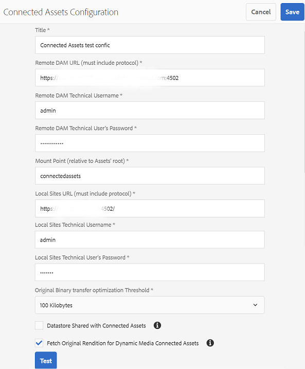

# Use Connected Assets to share DAM assets in [!DNL Experience Manager Sites] {#use-connected-assets-to-share-dam-assets-in-aem-sites}

In large enterprises the infrastructure required to create websites may be distributed. At times the website creation capabilities and digital assets used to create these websites may reside in different deployments. One reason can be geographically distributed existing deployments that are required to work in tandem. Another reason can be acquisitions leading to heterogenous infrastructure that the parent company wants to use together.

Users can create web pages in [!DNL Experience Manager Sites]. [!DNL Experience Manager Assets] is the Digital Asset Management (DAM) system that supplies the required assets for websites. [!DNL Experience Manager] now supports the above use case by integrating [!DNL Sites] and [!DNL Assets].

## Overview of Connected Assets {#overview-of-connected-assets}

When editing pages in [!UICONTROL Page Editor], the authors can seamlessly search, browse, and embed assets from a different [!DNL Assets] deployment. The administrators create a one-time integration of a deployment of [!DNL Sites] with a different (remote) deployment of [!DNL Assets].

For the [!DNL Sites] authors, the remote assets are available as read-only local assets. The functionality supports seamless search and use of a few remote assets at a time. To make many remote assets available on a [!DNL Sites] deployment in one-go, consider migrating the assets in bulk. See [Experience Manager Assets migration guide](/help/assets/assets-migration-guide.md).

### Prerequisites and supported deployments {#prerequisites}

Before you use or configure this capability, ensure the following:

* The users are part of the appropriate user groups on each deployment.
* For [!DNL Adobe Experience Manager] deployment types, one of the supported criteria is met. [!DNL Experience Manager] 6.5 [!DNL Assets] works with [!DNL Experience Manager] as a Cloud Service. For more information about how this functionality works in [!DNL Experience Manager as a Cloud Service], see [Connected Assets in Experience Manager as a Cloud Service](https://experienceleague.adobe.com/docs/experience-manager-cloud-service/assets/admin/use-assets-across-connected-assets-instances.html).

  | |[!DNL Sites] as a Cloud Service | [!DNL Experience Manager] 6.5 [!DNL Sites] on AMS| [!DNL Experience Manager] 6.5 [!DNL Sites] on-premise|
  |---|---|---|---|
  |**[!DNL Experience Manager Assets] as a Cloud Service**| Supported | Supported | Supported |
  |**[!DNL Experience Manager] 6.5 [!DNL Assets] on AMS** | Supported | Supported | Supported |
  |**[!DNL Experience Manager] 6.5 [!DNL Assets] on-premise** | Not Supported |Not Supported | Not Supported |

### Supported file formats {#mimetypes}

Authors search for images and the following types of documents in Content Finder and use the searched assets in Page Editor. Documents are added to the `Download` component and images to the `Image` component. Authors also add the remote assets in any custom [!DNL Experience Manager] component that extends the default `Download` or `Image` components. The supported formats are:

* **Image formats**: The formats that the [Image component](https://experienceleague.adobe.com/docs/experience-manager-core-components/using/components/image.html) supports. [!DNL Dynamic Media] images are not supported.
* **Document formats**: See the [supported document formats](assets-formats.md#supported-document-formats).

### Users and groups involved {#users-and-groups-involved}

The various roles that are involved to configure and use the capability and their corresponding user groups are described below. Local scope is used for the use case where an author creates a web page. Remote scope is used for the DAM deployment hosting the required assets. The [!DNL Sites] author fetches these remote assets.

| Role | Scope | User group | User name in walk-through | Requirement |
|---|---|---|---|---|
| [!DNL Sites] administrator | Local | [!DNL Experience Manager] `administrators` | `admin` | Set up [!DNL Experience Manager] and configure integration with the remote [!DNL Assets] deployment. |
| DAM user | Local | `Authors` | `ksaner` | Used to view and duplicate the fetched assets at `/content/DAM/connectedassets/`. |
| [!DNL Sites] author | Local | `Authors` (with read access on the remote DAM and author access on local [!DNL Sites]) | `ksaner` | End user are [!DNL Sites] authors who use this integration to improve their content velocity. The authors search and browse assets in remote DAM using [!UICONTROL Content Finder] and using the required images in local web pages. The credentials of `ksaner` DAM user are used. |
| [!DNL Assets] administrator | Remote | [!DNL Experience Manager] `administrators` | `admin` on remote [!DNL Experience Manager] | Configure Cross-Origin Resource Sharing (CORS). |
| DAM user | Remote | `Authors` | `ksaner` on remote [!DNL Experience Manager] | Author role on the remote [!DNL Experience Manager] deployment. Search and browse assets in Connected Assets using the [!UICONTROL Content Finder]. |
| DAM distributor (technical user) | Remote | [!DNL Sites] `Authors` | `ksaner` on remote [!DNL Experience Manager] | This user present on the remote deployment is used by [!DNL Experience Manager] local server (not the [!DNL Sites] author role) to fetch the remote assets, on behalf of [!DNL Sites] author. This role is not same as above two `ksaner` roles and belongs to a different user group. |

## Configure a connection between [!DNL Sites] and [!DNL Assets] deployments {#configure-a-connection-between-sites-and-assets-deployments}

An [!DNL Experience Manager] administrator can create this integration. Once created, the permissions that are required to use it are established via user groups. The user groups are defined on the [!DNL Sites] deployment and on the DAM deployment.

To configure Connected Assets and local [!DNL Sites] connectivity, follow these steps:

1. Access an existing [!DNL Sites] deployment or create a deployment using the following command:

    1. In the folder of the JAR file, execute the following command on a terminal to create each [!DNL Experience Manager] server.
       `java -XX:MaxPermSize=768m -Xmx4096m -jar <quickstart jar filepath> -r samplecontent -p 4502 -nofork -gui -nointeractive &`

    1. After a few minutes, the [!DNL Experience Manager] server starts successfully. Consider this [!DNL Sites] deployment as the local machine for web page authoring, say at `https://[local_sites]:4502`.

1. Ensure that the users and roles with local scope exist on the [!DNL Sites] deployment and on the [!DNL Assets] deployment on AMS. Create a technical user on [!DNL Assets] deployment and add to the user group mentioned in [users and groups involved](/help/assets/use-assets-across-connected-assets-instances.md#users-and-groups-involved).

1. Access the local [!DNL Sites] deployment at `https://[local_sites]:4502`. Click **[!UICONTROL Tools]** > **[!UICONTROL Assets]** > **[!UICONTROL Connected Assets Configuration]** and provide the following values:

    1. [!DNL Assets] location is `https://[assets_servername_ams]:[port]`.
    1. Credentials of a DAM distributor (technical user).
    1. In the **[!UICONTROL Mount Point]** field, enter the local [!DNL Experience Manager] path where [!DNL Experience Manager] fetches the assets. For example, `remoteassets` folder.
    1. Adjust the values of **[!UICONTROL Original Binary transfer optimization Threshold]** depending on your network. An asset rendition with a size that is greater than this threshold, is transferred asynchronously.
    1. Select **[!UICONTROL Datastore Shared with Connected Assets]**, if you use a datastore to store your assets and the Datastore is the common storage between both deployments. In this case, the threshold limit does not matter as actual asset binaries reside on the datastore and are not transferred.

    

    *Figure: A typical configuration for Connected Assets.*

1. As the assets are already processed and the renditions are fetched, disable the workflow launchers. Adjust the launcher configurations on the local ([!DNL Sites]) deployment to exclude the `connectedassets` folder, in which the remote assets are fetched.

    1. On [!DNL Sites] deployment, click **[!UICONTROL Tools]** > **[!UICONTROL Workflow]** > **[!UICONTROL Launchers]**.

    1. Search for Launchers with workflows as **[!UICONTROL DAM Update Asset]** and **[!UICONTROL DAM Metadata Writeback]**.

    1. Select the workflow launcher and click **[!UICONTROL Properties]** on the action bar.

    1. In the [!UICONTROL Properties] wizard, change the **[!UICONTROL Path]** fields as the following mappings to update their regular expressions to exclude the mount point **[!UICONTROL connectedassets]**.

   | Before | After |
   |---|---|
   | `/content/dam(/((?!/subassets).)*/)renditions/original` | `/content/dam(/((?!/subassets)(?!connectedassets).)*/)renditions/original` |
   | `/content/dam(/.*/)renditions/original` | `/content/dam(/((?!connectedassets).)*/)renditions/original` |
   | `/content/dam(/.*)/jcr:content/metadata` | `/content/dam(/((?!connectedassets).)*/)jcr:content/metadata` |

   >[!NOTE]
   >
   >All renditions that are available on the remote deployment are fetched, when authors fetch an asset. If you want to create more renditions of a fetched asset, skip this configuration step. The [!UICONTROL DAM Update Asset] workflow gets triggered and creates more renditions. These renditions are available only on the local [!DNL Sites] deployment and not on the remote DAM deployment.

1. Add the [!DNL Sites] deployment as one of the **[!UICONTROL Allowed Origins]** on the remote [!DNL Assets'] CORS configuration.

    1. Log in using the administrator credentials. Search for `Cross-Origin`. Access **[!UICONTROL Tools]** > **[!UICONTROL Operations]** > **[!UICONTROL Web Console]**.

    1. To create a CORS configuration for [!DNL Sites] deployment, click add option  next to **[!UICONTROL Adobe Granite Cross-Origin Resource Sharing Policy]**.

    1. In the field **[!UICONTROL Allowed Origins]**, input the URL of the local [!DNL Sites], that is, `https://[local_sites]:[port]`. Save the configuration.

## Use remote assets {#use-remote-assets}

The website authors use Content Finder to connect to the DAM deployment. The authors can browse, search for, and drag the remote assets in a component. To authenticate to the remote DAM, keep the credentials of the DAM user provided by your administrator handy.

Authors can use the assets available on the local DAM and the remote DAM deployment, in a single web page. Use the Content Finder to switch between searching the local DAM or searching the remote DAM.

Only those tags of remote assets are fetched that have an exact corresponding tag along with the same taxonomy hierarchy, available on the local [!DNL Sites] deployment. Any other tags are discarded. Authors can search for remote assets using all the tags present on the remote [!DNL Experience Manager] deployment, as it offers a full-text search.

### Walk-through of usage {#walk-through-of-usage}

Use the above setup to try the authoring experience to understand how the functionality works. Use documents or images of your choice on the remote DAM deployment.

1. Navigate to the [!DNL Assets] interface on the remote deployment by accessing **[!UICONTROL Assets]** > **[!UICONTROL Files]** from [!DNL Experience Manager] workspace. Alternatively, access `https://[assets_servername_ams]:[port]/assets.html/content/dam` in a browser. Upload the assets of your choice.
1. On the [!DNL Sites] deployment, in the profile activator in the upper-right corner, click **[!UICONTROL Impersonate as]**. Provide `ksaner` as user name, select the option provided, and click **[!UICONTROL OK]**.
1. Open a We.Retail website page at **[!UICONTROL Sites]** > **[!UICONTROL We.Retail]** > **[!UICONTROL us]** > **[!UICONTROL en]**. Edit the page. Alternatively, access `https://[aem_server]:[port]/editor.html/content/we-retail/us/en/men.html` in a browser to edit a page.

   Click **[!UICONTROL Toggle Side Panel]** on upper-left corner of the page.

1. Open the [!UICONTROL Assets] tab and click **[!UICONTROL Log in to Connected Assets]**.
1. Provide the credentials -- `ksaner` as user name and `password` as password. This user has authoring permissions on both the [!DNL Experience Manager] deployments.
1. Search for the asset that you added to DAM. The remote assets are displayed in the left panel. Filter for images or documents and further filter for types of supported documents. Drag the images on an `Image` component and documents on a `Download` component.

   The fetched assets are read-only on the local [!DNL Sites] deployment. You can still use the options provided by your [!DNL Sites] components to edit the fetched asset. The editing by components is non-destructive.

   

   *Figure: Options to filter document types and images when searching assets on remote DAM.*

1. A site author is notified if an asset is fetched asynchronously and if any fetch task fails. While authoring or even after authoring, the authors can see detailed information about fetch tasks and errors in the [async jobs](/help/sites-administering/asynchronous-jobs.md) user interface.

   

   *Figure: Notification about asynchronous fetching of assets that happens in the background.*

1. When publishing a page, [!DNL Experience Manager] displays a complete list of assets that are used on the page. Ensure that the remote assets are fetched successfully at the time of publishing. To check the status of each fetched asset, see [async jobs](/help/sites-administering/asynchronous-jobs.md) user interface.

   >[!NOTE]
   >
   >Even if one or more remote assets are not fetched, the page is published. The component using the remote asset is published empty. The [!DNL Experience Manager] notification area displays a notification for errors that show in async jobs page.

>[!CAUTION]
>
>Once used in a web page, the fetched remote assets are searchable and usable by anyone who has permissions to access the local folder. The fetched assets are stored in the local folder (`connectedassets` in the above walk-through). The assets are also searchable and visible in the local repository via [!UICONTROL Content Finder].

The fetched assets can be used as any other local asset, except that the associated metadata cannot be edited.

## Limitations and best practices {#tips-and-limitations}

* To get insights about asset usage, configure the [Asset Insight](/help/assets/asset-insights.md) functionality on the [!DNL Sites] instance.

### Permissions and asset management {#permissions-and-managing-assets}

* Local assets are not synchronized with the original assets on the remote deployment. Any edits, deletions, or revoking of permissions on the DAM deployment are not propagated downstream.
* Local assets are read-only copies. [!DNL Experience Manager] components do non-destructive edits to assets. No other edits are allowed.
* Locally fetched assets are available for authoring purposes only. Asset update workflows cannot be applied and metadata cannot be edited.
* Only images and the listed document formats are supported. [!DNL Dynamic Media] assets, Content Fragments, and Experience Fragments are not supported.
* [!DNL Experience Manager] does not fetch the metadata schemas. It means that all the fetched metadata may not be displayed. If the schema are updated separately then all the properties are displayed.
* All [!DNL Sites] authors have read permissions on the fetched copies, even if authors cannot access the remote DAM deployment.
* No API support to customize the integration.
* The functionality supports seamless search and use of remote assets. To make many remote assets available on local deployment in one-go, consider migrating the assets. See [Assets migration guide](assets-migration-guide.md).
* It is not possible to use a remote asset as a page thumbnail on [!UICONTROL Page Properties] user interface. You can set a thumbnail of a web page in [!UICONTROL Page Properties] user interface from the [!UICONTROL Thumbnail] by clicking [!UICONTROL Select Image].

### Set up and licensing {#setup-licensing}

* [!DNL Assets] deployment on [!DNL Adobe Managed Services] is supported.
* [!DNL Sites] can connect to a single [!DNL Assets] repository at a time.
* A license of [!DNL Assets] working as remote repository.
* One or more licenses of [!DNL Sites] working as local authoring deployment.

### Usage {#usage}

* Users can search for remote assets and drag those on local page when authoring. No other functionality is supported.
* Fetch operation times out after 5 seconds. Authors can have issues fetching assets, say if there are network issues. Authors can reattempt by dragging the remote asset from [!UICONTROL Content Finder] to [!UICONTROL Page Editor].
* Simple edits that are non-destructive and the edit supported via the `Image` component, can be done on fetched assets. Assets are read-only.
* The only method to re-fetch the asset is to drag it on a page. There is no API support or other methods to re-fetch an asset to update it.
* If assets are decommissioned from the DAM, those continue to be in use on [!DNL Sites] pages.

## Troubleshoot issues {#troubleshoot}

To troubleshoot for the common error scenario, follow these steps:

* If you are unable to search for remote assets from the [!UICONTROL Content Finder], then ensure that the required roles and permissions are in place.
* An asset fetched from the remote dam may not be published on a web page for one or more reasons. It doesn't exist on remote server, lack of appropriate permissions to fetch it, or network failure can be the reasons. Ensure that the asset is not removed from the remote DAM. Ensure that appropriate permissions are in place and the prerequisites are met. Retry adding the asset to the page and republish. Check the [list of asynchronous jobs](/help/sites-administering/asynchronous-jobs.md) for errors in asset fetching.
* If you are unable to access the remote DAM deployment from the local [!DNL Sites] deployment, ensure that cross-site cookies are allowed. If cross-site cookies are blocked the two deployments of [!DNL Experience Manager] may not authenticate. For example, [!DNL Google Chrome] in Incognito mode may block third-party cookies. To allow cookies in [!DNL Chrome] browser, click the 'eye' icon in the address bar, navigate to Site Not Working > Blocked, select the Remote DAM URL, and allow login-token cookie. Alternately, see help about [how to enable third-party cookies](https://support.google.com/chrome/answer/95647).

  
