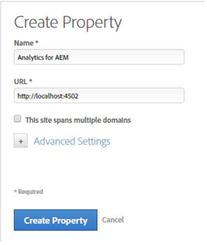
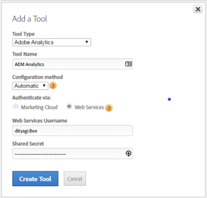
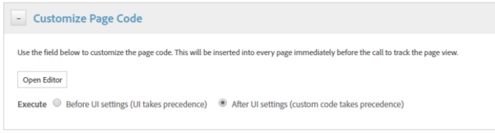

# Enable Assets Insights through DTM {#enable-asset-insights-through-dtm}

Adobe Dynamic Tag Management is a tool that activates your digital marketing tools. It is provided for free to Adobe Analytics customers. You can either customize your tracking code to enable third-party CMS solutions to use Assets Insights or you can use DTM to insert Assets Insights tags. Insights are only supported and provided for images.

>[!CAUTION]
>
>Adobe DTM is deprecated in favor of [!DNL Adobe Experience Platform] and will soon reach [end of life](https://medium.com/launch-by-adobe/dtm-plans-for-a-sunset-3c6aab003a6f). Adobe recommends that you [use [!DNL Adobe Experience Platform] for assets insights](https://experienceleague.adobe.com/docs/experience-manager-learn/assets/advanced/asset-insights-launch-tutorial.html).

Perform these steps to enable Assets Insights through DTM.

1. Click the Experience Manager logo, and go to **[!UICONTROL Tools]** > **[!UICONTROL Assets]** > **[!UICONTROL Insights Configuration]**.
1. [Configure Experience Manager deployment with DTM Cloud Service](/help/sites-administering/dtm.md)

   The API token should be available once you log on to [https://dtm.adobe.com](https://dtm.adobe.com/) and visit **[!UICONTROL Account Settings]** in the user Profile. This step is not required from the Assets Insights standpoint, because the integration of Experience Manager Sites with Assets Insights is still in the works.

1. Log on to [https://dtm.adobe.com](https://dtm.adobe.com/), and select a company, as appropriate.
1. Create or open an existing Web Property

    * Select the **[!UICONTROL Web Properties]** tab, and then click **[!UICONTROL Add Property]**.

    * Update the fields as appropriate, and click **[!UICONTROL Create Property]**. See [documentation](https://experienceleague.adobe.com/docs/experience-manager-learn/getting-started-wknd-tutorial-develop/overview.html).

   

1. In the **[!UICONTROL Rules]** tab, select **[!UICONTROL Page Load Rules]** from the navigation pane and click **[!UICONTROL Create New Rule]**.

   

1. Expand **[!UICONTROL JavaScript /Third Party Tags]**. Then click **[!UICONTROL Add New Script]** in the **[!UICONTROL Sequential HTML]** tab to open the Script dialog.

   

1. Click the Experience Manager logo, and go to **[!UICONTROL Tools]** > **[!UICONTROL Assets]**.
1. Click **[!UICONTROL Insights Page Tracker]**, copy the tracker code, and then paste it in the Script dialog you opened in step 6. Save the changes.

   >[!NOTE]
   >
   >* `AppMeasurement.js` is removed. It is expected to be available through DTM's Adobe Analytics tool.
   >* The call to `assetAnalytics.dispatcher.init()` is removed. The function is expected to be called once DTM's Adobe Analytics tool finishes loading.
   >* Depending on where Assets Insights Page Tracker is hosted (for example, Experience Manager, CDN, and so on), the origin of the script source may require changes.
   >* For Experience Manager-hosted Page Tracker, the source should point to a publish instance using the host name of the dispatcher instance.

1. Access `https://dtm.adobe.com`. Click **[!UICONTROL Overview]** in the web property and click **[!UICONTROL Add Tool]** or open an existing Adobe Analytics Tool. While creating the tool, you can set **[!UICONTROL Configuration Method]** to **[!UICONTROL Automatic]**.

   

   Select Staging/Production report suites, as appropriate.

1. Expand **[!UICONTROL Library Management]**, and ensure that **[!UICONTROL Load Library at]** is set to **[!UICONTROL Page Top]**.

   

1. Expand **[!UICONTROL Customize Page Code]**, and click **[!UICONTROL Open Editor]**.

   

1. Paste the following code in the window:

   ```Java
   var sObj;
  
   if (arguments.length > 0) {
     sObj = arguments[0];
   } else {
     sObj = _satellite.getToolsByType('sc')[0].getS();
   }
   _satellite.notify('in assetAnalytics customInit');
   (function initializeAssetAnalytics() {
     if ((!!window.assetAnalytics) && (!!assetAnalytics.dispatcher)) {
       _satellite.notify('assetAnalytics ready');
       /** NOTE:
           Copy over the call to 'assetAnalytics.dispatcher.init()' from Assets Pagetracker
           Be mindful about changing the AppMeasurement object as retrieved above.
       */
       assetAnalytics.dispatcher.init(
             "",  /** RSID to send tracking-call to */
             "",  /** Tracking Server to send tracking-call to */
             "",  /** Visitor Namespace to send tracking-call to */
             "",  /** listVar to put comma-separated-list of Asset IDs for Asset Impression Events in tracking-call, for example, 'listVar1' */
             "",  /** eVar to put Asset ID for Asset Click Events in, for example, 'eVar3' */
             "",  /** event to include in tracking-calls for Asset Impression Events, for example, 'event8' */
             "",  /** event to include in tracking-calls for Asset Click Events, for example, 'event7' */
             sObj  /** [OPTIONAL] if the webpage already has an AppMeasurement object, include the object here. If unspecified, Pagetracker Core shall create its own AppMeasurement object */
             );
       sObj.usePlugins = true;
       sObj.doPlugins = assetAnalytics.core.updateContextData;
       assetAnalytics.core.optimizedAssetInsights();
     }
     else {
       _satellite.notify('assetAnalytics not available. Consider updating the Custom Page Code', 4);
     }
   })();
   ```

    * The page load rule in DTM only includes the `pagetracker.js` code. Any `assetAnalytics` fields are considered as overrides for default values. They are not required by default.
    * The code calls `assetAnalytics.dispatcher.init()` after making sure that `_satellite.getToolsByType('sc')[0].getS()` is initialized and `assetAnalytics,dispatcher.init` is available. Therefore, you can skip adding it in step 11.
    * As indicated in comments within the Insights Page Tracker code (**[!UICONTROL Tools > Assets > Insights Page Tracker]**), when Page Tracker does not create an `AppMeasurement` object, the first three arguments (RSID, Tracking Server, and Visitor Namespace) are irrelevant. Empty strings are passed instead to highlight this.  
      The remaining arguments correspond to what is configured in the Insights Configuration page (**[!UICONTROL Tools > Assets > Insights Configuration]**).
    * The AppMeasurement object is retrieved by querying `satelliteLib` for all available SiteCatalyst engines. If multiple tags are configured, change the index of the array selector appropriately. Entries in the array are ordered as per SiteCatalyst tools available in the DTM interface.

1. Save and close the Code Editor window, and then save the changes in the Tool configuration.
1. In the **[!UICONTROL Approvals]** tab, approve both the pending approvals. The DTM tag is ready for insertion in your web page.
