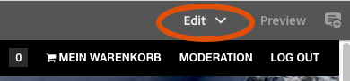
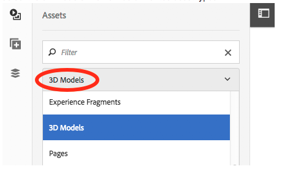

# Working with the 3D Sites component {#working-with-the-d-sites-component}

AEM 3D includes an AEM Sites component that you can use to implement interactive viewing of 3D models on web pages.

After you have added your 3D component, you can [view the 3D asset in that component.](viewing-3d-assets.md)

## Adding the 3D component to the page template {#adding-the-d-component-to-the-page-template}

You must enable the 3D component in the page before you can place it on a page. See [Editing templates](/help/sites-authoring/templates.md#editing-a-template-layout-template-author) for detailed information on enabling components in templates.

**Adding the 3D component to the page template**:

1. Navigate to **[!UICONTROL Tools > General > Templates]**.  

1. Navigate to the page template that you want to enable the 3D component in and select the template.  

1. Tap **[!UICONTROL Edit]** to open the template.
1. Near the upper-right of the page, in the drop-down menu, select **[!UICONTROL Structure]** mode, if it is not already active.

   

1. Tap in the **[!UICONTROL Layout Container]** region to select it.  

1. Tap the **[!UICONTROL Policy]** button to open the **[!UICONTROL Policy Editor]**.
1. In the **[!UICONTROL Properties]** section, select the **[!UICONTROL 3D]** checkmark, and then tap **[!UICONTROL Done]** to save the changes and close the **[!UICONTROL Policy Editor]**.

   You can now place the 3D Sites component on all pages that use this template.

## Adding the 3D viewer component to a web page {#adding-the-d-viewer-component-to-a-web-page}

>[!CAUTION]
>
>This version of AEM 3D supports only one instance of the 3D component on each web page. Multiple 3D components on the same page do not function properly.

**To add the 3D viewer component to a web page**:

1. Open AEM Sites and select the web page to which you want to add the 3D component.  

1. Tap the **[!UICONTROL Edit]** (pencil) icon to open the page into the page editor. Make sure **[!UICONTROL Edit]** mode near the top right of page is selected.

   

1. Tap the rail selector to open the side panel.  

1. Tap the plus sign icon to open the **[!UICONTROL Components]** list.  

1. Drag the **[!UICONTROL 3D Viewer]** component from the **[!UICONTROL Components]** list to the location on the page where you want the 3D viewer to appear.

## Configuring the 3D component {#configuring-the-d-component}

1. In the AEM Sites page editor, select the **[!UICONTROL 3D Viewer]** component that you previously added to the page.  

1. Tap the **[!UICONTROL Configuration]** icon (wrench) to open the component configuration dialog box.

   You can set the following component properties:

   <table> 
    <tbody> 
    <tr> 
    <td>Property</td> 
    <td>Description</td> 
    <td>Applicability</td> 
    </tr> 
    <tr> 
    <td>Height (px)</td> 
    <td>Specify the desired height of the 3D component in pixels. If left empty, the default is 600 pixels.</td> 
    <td> </td> 
    </tr> 
    <tr> 
    <td>Stage Name</td> 
    <td>
Select a 3D Stage from the list of available stages. The stage provides background and lighting.
 
See <a href="/help/assets/about-the-use-of-stages-in-aem-3d.md" target="_blank">About the use of stages in AEM 3D Sites</a>.
 </td> 
    <td>Ignored for Adobe Dimension assets.</td> 
    </tr> 
    <tr> 
    <td>Auto-spin Speed (RPM)</td> 
    <td>
The 3D viewer orbits the camera continuously after load and reset. Auto-spin terminates when the user initiates a manual orbit action.
 
You can specify the spin speed in RPM using the following values:
 
        <ul> 
        <li>Set a positive value to spin right</li> 
        <li>Set a negative value to spin left</li> 
        <li>Set a 0 value to disable auto-spin.</li> 
        </ul> 
The default is 3 RPM, equivalent to 20 seconds per full revolution.    <strong>Note:</strong> The spin speed assumes a 60/sec frame rate. This rate is typically achieved with small to moderately-sized models on more powerful graphics hardware. Larger models or slower devices auto-spin at lower rates.
 </td> 
    <td>Ignored for Adobe Dimension assets.</td> 
    </tr> 
    <tr> 
    <td>Navigation Button Color</td> 
    <td>Use the color picker to choose the primary color for the viewer's control buttons.</td> 
    <td>Ignored for Adobe Dimension asses.</td> 
    </tr> 
    <tr> 
    <td>Navigation Hover Color</td> 
    <td>Use the color picker to choose the hover/selected color for the viewer's control buttons.</td> 
    <td>Ignored for Adobe Dimension assets.</td> 
    </tr> 
    <tr> 
    <td>Show Swatches</td> 
    <td>For future use.</td> 
    <td>Ignored for Adobe Dimension assets.</td> 
    </tr> 
    <tr> 
    <td>Show GLTF Camera Presets</td> 
    <td>Show or hide the camera presets which may be present in Adobe Dimension assets.</td> 
    <td>For Adobe Dimension assets only.</td> 
    </tr> 
    <tr> 
    <td>GLTF Background Color</td> 
    <td>Default background color if the 3D model does not include a background.</td> 
    <td>For Adobe Dimension assets only.</td> 
    </tr> 
    </tbody> 
   </table>

1. Tap the check mark to save your changes.

   In addition to the settings available in the component configuration dialog, a number of global configuration settings are available which can be modified by way of the CRXDE Lite.
   See [Advanced Configuration Settings](advanced-config-3d.md) for detailed information on these global settings.

## Assigning a 3D model to the component {#assigning-a-d-model-to-the-component}

1. In the AEM Sites page editor, click the **[!UICONTROL Assets]** icon to open the Assets list in the side panel.  

1. Select the **[!UICONTROL 3D Models]** filter to hide unwanted asset types.

   

1. Search for or scroll to the 3D asset that you want to view on the page being edited.  

1. Drag the 3D asset from the **[!UICONTROL Assets]** list to the **[!UICONTROL 3D Viewer]** component previously placed on the page.

   Adobe Dimension assets are rendered using new viewer technology based on the glTF open standard, while all other 3D asset types rely on the classic AEM 3D webGL viewer. The component automatically selects the appropriate viewer based on the type of the 3D model.

## Previewing a web page that has a 3D component {#previewing-a-web-page-that-has-a-d-component}

While the web page is in **[!UICONTROL Edit]** mode, the 3D component displays the 3D model but no interaction with the model is possible.

You can preview the web page in the page editor with full access to the functionality of the 3D component.

See also [Viewing 3D assets in the Sites 3D component](viewing-3d-assets.md#viewing-d-assets-in-the-sites-d-component).

**To preview a web page that has a 3D component**:

1. Do either one of the following:

    * Near the upper-right of the page, click **[!UICONTROL Preview]** to enter preview mode.
    * Delete `/edit.html` from the page URL in the browser.

## Publishing the page and assets {#publishing-the-page-and-assets}

See [Publishing Assets](managing-assets-touch-ui.md) for information on how to publish assets. See [Publishing Pages](/help/sites-authoring/publishing-pages.md) for information on how to publish pages.

>[!NOTE]
>
>Using the **[!UICONTROL Publish Page]** menu item on the **[!UICONTROL Page Information]** menu will publish the page and all primary page dependencies. Secondary dependencies that may be referenced by the 3D model and/or the 3D stage, such as texture maps and IBL images, are not published when you publish the page in this way.
>
>Adobe recommends that you publish all 3D assets and their dependencies directly from AEM Assets, before publishing the web page that references these assets.

