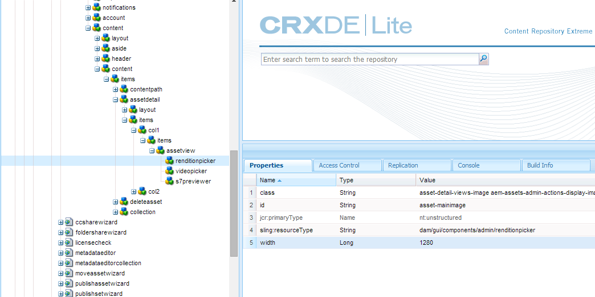
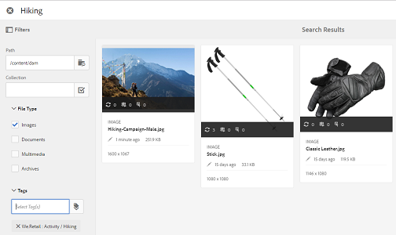

# Asset Selector{#asset-selector}

>[!NOTE]
>
>Asset Selector was named [Asset Picker](https://helpx.adobe.com/experience-manager/6-2/assets/using/asset-picker.html) in prior versions of AEM.

The asset selector lets you search for, filter, and browse assets within Adobe Experience Manager (AEM) Assets. You can also fetch the metadata of assets that you select using the asset selector. To customize the asset selector interface, you can launch it with supported request parameters. These parameters set the context of the asset selector for a particular scenario.

Currently, you can pass the request parameters `Asset Type` (*Image/Video/Text*) and `Selection mode` (*Single/Multiple*) as contextual information for the asset selector, which remains intact throughout the selection.

The asset selector uses the HTML5 **Window.postMessage** message to send data for the selected asset to the recipient.

The asset selector is based on Granite's foundation picker vocabulary. By default, the asset selector operates in Browse mode. However, you can apply filters using the Omni search experience to refine your search for particular assets.

You can integrate any web page (irrespective of whether it is part of the CQ container) with the asset selector (*http://&lt;host&gt;:&lt;port&gt;/aem/assetpicker.html*).

## Contextual Parameters {#contextual-parameters}

You can pass the following request parameters in a URL to launch the asset selector in a particular context:

<table border="1" cellpadding="1" cellspacing="0" width="100%"> 
 <tbody> 
  <tr> 
   <td valign="top">
<strong>Name</strong>
 </td> 
   <td valign="top">
<strong>Values</strong>
 </td> 
   <td valign="top">
<strong>Example</strong>
 </td> 
   <td valign="top">
<strong>Purpose</strong>
 </td> 
  </tr> 
  <tr> 
   <td valign="top">
resource suffix (B)
 </td> 
   <td valign="top">
Folder path as the resource suffix in the URL:
 
<a href="http://localhost:4502/aem/assetpicker.html?mimetype=*presentation&amp;mimetype=*png">http://localhost:4502/aem/assetpicker.html</a>/&lt;folder_path&gt;
 </td> 
   <td valign="top">
To launch the asset selector with a particular folder selected, for example with the folder <a href="http://localhost:4502/aem/assetpicker.html/content/dam/we-retail/en/activities?assettype=images">/content/dam/we-retail/en/activities</a>, selected, the URL should be of the form: <a href="http://localhost:4502/aem/assetpicker.html/content/dam/we-retail/en/activities?assettype=images">http://localhost:4502/aem/assetpicker.html/content/dam/we-retail/en/activities?assettype=images</a>
 </td> 
   <td valign="top">
If you require a particular folder to be selected when the asset selector is launched, passed it as a resource suffix.
 </td> 
  </tr> 
  <tr> 
   <td valign="top">
mode
 </td> 
   <td valign="top">
single, multiple
 </td> 
   <td valign="top">
<a href="http://localhost:4502/aem/assetpicker.html?mode=multiple">http://localhost:4502/aem/assetpicker.html?mode=multiple</a>
 
<a href="http://localhost:4502/aem/assetpicker.html?mode=single">http://localhost:4502/aem/assetpicker.html?mode=single</a>
 </td> 
   <td valign="top">
In multiple mode, you can select several assets simultaneously using the asset selector.
 </td> 
  </tr> 
  <tr> 
   <td valign="top">
mimetype
 </td> 
   <td valign="top">
mimetype(s) (/jcr:content/metadata/dc:format) of an asset (wildcard also supported)
 </td> 
   <td valign="top">
<a href="http://localhost:4502/aem/assetpicker.html?mimetype=image/png">http://localhost:4502/aem/assetpicker.html?mimetype=image/png</a>
 
<a href="http://localhost:4502/aem/assetpicker.html?mimetype=*png">http://localhost:4502/aem/assetpicker.html?mimetype=*png</a>
 
<a href="http://localhost:4502/aem/assetpicker.html?mimetype=*presentation">http://localhost:4502/aem/assetpicker.html?mimetype=*presentation</a>
 
<a href="http://localhost:4502/aem/assetpicker.html?mimetype=*presentation&amp;mimetype=*png">http://localhost:4502/aem/assetpicker.html?mimetype=*presentation&amp;mimetype=*png</a>
 </td> 
   <td valign="top">
Use it to filter assets based on MIME type(s)
 </td> 
  </tr> 
  <tr> 
   <td valign="top">
dialog
 </td> 
   <td valign="top">
true, false
 </td> 
   <td valign="top">
<a href="http://localhost:4502/aem/assetpicker.html?dialog=true">http://localhost:4502/aem/assetpicker.html?dialog=true</a>
 </td> 
   <td valign="top">
Use these parameters to open the asset selector as <a href="https://helpx.adobe.com/experience-manager/6-5/sites/developing/using/reference-materials/granite-ui/api/jcr_root/libs/granite/ui/components/foundation/layouts/dialog/index.html" target="_blank">Granite Dialog</a>. This option is only applicable when you launch the asset selector through <a href="https://helpx.adobe.com/experience-manager/6-5/sites/developing/using/reference-materials/granite-ui/api/jcr_root/libs/granite/ui/components/coral/foundation/form/pathfield/index.html?highlight=pathfield" target="_blank">Granite Path Field</a>, and configure it as pickerSrc URL.
 </td> 
  </tr> 
  <tr> 
   <td valign="top">
assettype (S)
 </td> 
   <td valign="top">
images, documents, multimedia, archives
 </td> 
   <td valign="top">
<a href="http://localhost:4502/aem/assetpicker.html?assettype=images">http://localhost:4502/aem/assetpicker.html?assettype=images</a>
 
<a href="http://localhost:4502/aem/assetpicker.html?assettype=documents">http://localhost:4502/aem/assetpicker.html?assettype=documents</a>
 
<a href="http://localhost:4502/aem/assetpicker.html?assettype=multimedia">http://localhost:4502/aem/assetpicker.html?assettype=multimedia</a>
 
<a href="http://localhost:4502/aem/assetpicker.html?assettype=archives">http://localhost:4502/aem/assetpicker.html?assettype=archives</a>
 </td> 
   <td valign="top">
Use this option to filter asset types based on the value passed.
 </td> 
  </tr> 
  <tr> 
   <td valign="top">
root
 </td> 
   <td valign="top">
&lt;folder_path&gt;
 </td> 
   <td valign="top">
<a href="http://localhost:4502/aem/assetpicker.html?assettype=images&amp;root=/content/dam/we-retail/en/activities">http://localhost:4502/aem/assetpicker.html?assettype=images&amp;root=/content/dam/we-retail/en/activities</a>
 </td> 
   <td valign="top">
Use this option to specify the root folder for the asset selector. In this case, the asset selector lets you select only child assets (direct/indirect) under the root folder.
 </td> 
  </tr> 
 </tbody> 
</table>

## Using the asset selector {#using-the-asset-selector}

1. To access the asset selector interface, go to *http://&lt;host&gt;:&lt;port&gt;/aem/assetpicker*.
1. Navigate to the desired folder, and select one or more assets.

   

   Alternatively, you can search for the desired asset from the OmniSearch box and then select it.

   

   If you search for asssets using the OmniSearch box, you can select various filters from the **Filters** pane to refine your search.

   

1. Tap/click **Select** from the toolbar.

