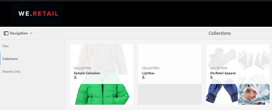
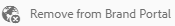

# Publish collections to Brand Portal{#publish-collections-to-brand-portal}

As an Adobe Experience Manager (AEM) Assets administrator, you can publish collections to the AEM Assets Brand Portal instance for your organization. However, you must first integrate AEM Assets with Brand Portal. For details, see [Configure AEM Assets integration with Brand Portal](../../assets/using/brand-portal-configuring-integration.md).

If you make subsequent modifications to the original collection in AEM Assets, the changes are not reflected in Brand Portal until you publish the collection again. This characteristic ensures that work-in-progress changes are not available in Brand Portal. Only approved changes that are published by an administrator are available in Brand Portal.

>[!NOTE]
>
>Content fragments cannot be published to the Brand Portal. Therefore, if you select content fragment(s) on AEM Author, then **Publish to Brand Portal** action is not available.
>
>If collections containing content fragments are published from AEM Author to Brand Portal, then all the contents of the folder except content fragments get replicated to Brand Portal interface.

## Publish a collection to Brand Portal {#publish-a-collection-to-brand-portal}

1. In the AEM Assets UI, tap/click the AEM logo. Then, go to **Assets** &gt; **Collections** from the **Navigation** page.
1. From the Collections console, select the collection you want to publish to Brand Portal.

   

1. From the toolbar, tap/click **Publish to Brand Portal**.

   

1. In the confirmation dialog, tap/click **Publish**.
1. Close the confirmation message. 
1. Log in to Brand Portal as an administrator. The published collection is available in the Collections console.

   

## Unpublish collections {#unpublish-collections}

You can unpublish collections that you publish from AEM Assets to Brand Portal. After you unpublish the original collection, its copy is no longer available to Brand Portal users.

1. From the Collections console of your AEM Assets instance, and select the collection you want to unpublish.

   

1. From the toolbar, tap/click the **Remove from Brand Portal** icon.

   

1. In the dialog, tap/click **Unpublish**.
1. Close the confirmation message. The collection is removed from the Brand Portal interface.

