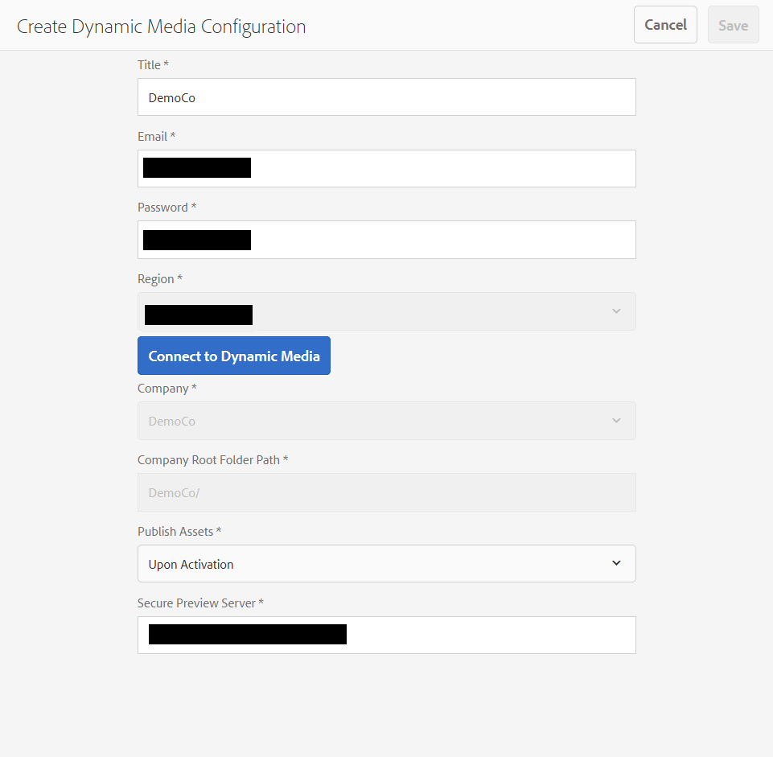
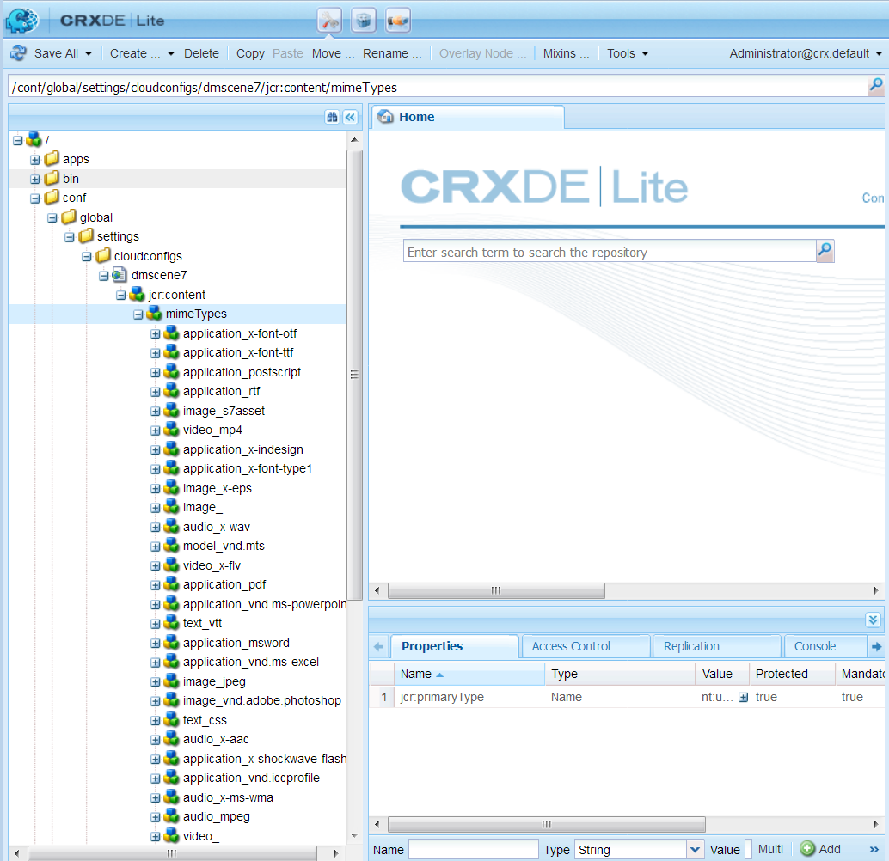
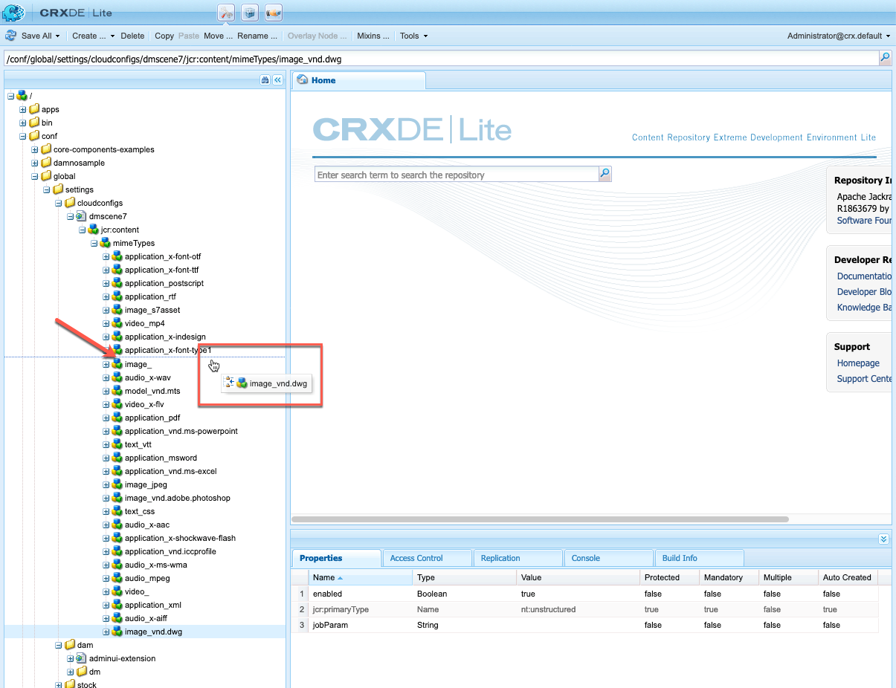
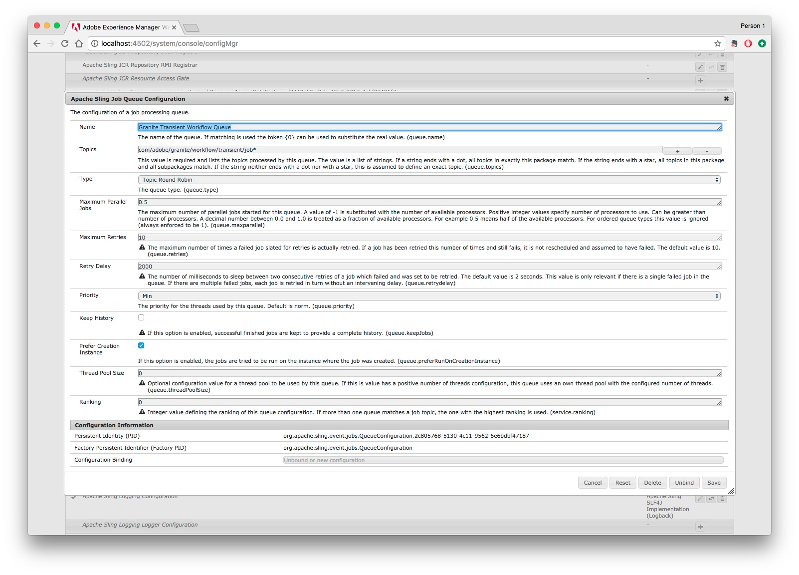
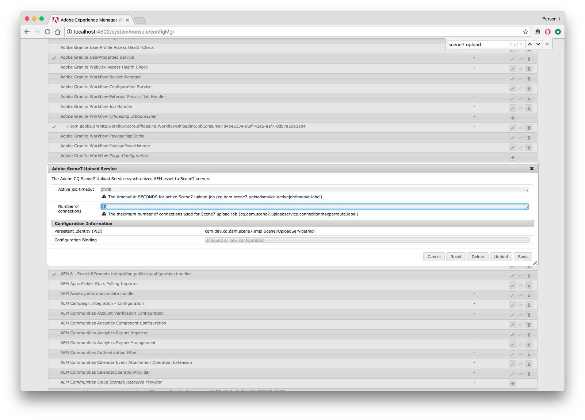

# Configuring Dynamic Media - Scene7 mode{#configuring-dynamic-media-scene-mode}

If you use Adobe Experience Manager set up for different environments, such as one for development, one for staging, and one for live production, you need to configure Dynamic Media Cloud Services for each one of those environments.

## Architecture diagram of Dynamic Media - Scene7 mode {#architecture-diagram-of-dynamic-media-scene-mode}

The following architecture diagram describes how Dynamic Media - Scene7 mode works.

With the new architecture, AEM is responsible for master assets and synchs with Dynamic Media for asset processing and publishing:

1. When the master asset is uploaded to AEM, it is replicated to Dynamic Media. At that point, Dynamic Media handles all asset processing and rendition generation, such as video encoding and dynamic variants of an image. (In Dynamic Media - Scene7 mode, be aware that you can only upload assets whose file sizes are 2 GB or less.)
1. After the renditions are generated, AEM can securely access and preview the remote Dynamic Media renditions (no binaries are sent back to the AEM instance). 
1. After content is ready to be published and approved, it triggers the Dynamic Media service to push content out to delivery servers and cache content at the CDN.

 

## Enabling Dynamic Media in Scene7 mode {#enabling-dynamic-media-in-scene-mode}

[Dynamic media](http://www.adobe.com/solutions/web-experience-management/dynamic-media.html) is disabled by default. To take advantage of dynamic media features, you need to enable it.

>[!NOTE]
>
>Dynamic Media - Scene7 mode is for the AEM Author instance only. As such, you must configure `runmode=dynamicmedia_scene7` on the AEM Author instance, *not* the AEM Publish instance.

To enable dynamic media, you must startup AEM using the `dynamicmedia_scene7` runmode from the command line by entering the folllowing in a terminal window (example port used is 4502):

```shell
java -Xms4096m -Xmx4096m -Doak.queryLimitInMemory=500000 -Doak.queryLimitReads=500000 -jar cq-quickstart-6.5.0.jar -gui -r author,dynamicmedia_scene7 -p 4502
```

## (Optional) Migrating Dynamic Media presets and configurations from 6.3 to 6.5 Zero Downtime {#optional-migrating-dynamic-media-presets-and-configurations-from-to-zero-downtime}

If you are upgrading AEM Dynamic Media from 6.3 to 6.4 or 6.5 (which now includes the ability for zero downtime deployments), you are required to run the following curl command to migrate all your presets and configurations from `/etc` to `/conf` in CRXDE Lite.

**Note**: If you run your AEM instance in compatibility mode--that is, you have the compatibility packaged installed--you do not need to run these commands.

For all upgrades, either with or without the compatibility package, you can copy the default, out-of-the-box viewer presets that originally came with Dynamic Media by running the following Linux curl command:

`curl -u admin:admin -X POST http://<server_address>:<server_port>/libs/settings/dam/dm/presets/viewer.pushviewerpresets.json`

To migrate any custom viewer presets and configurations that you have created from `/etc` to `/conf`, run the following Linux curl command:

`curl -u admin:admin -X POST http://<server_address>:<server_port>/libs/settings/dam/dm/presets.migratedmcontent.json`

## Installing feature pack 18912 for bulk asset migration {#installing-feature-pack-for-bulk-asset-migration}

The installation of feature pack 18912 is *optional*.

Feature pack 18912 lets you either bulk ingest assets by way of FTP, or migrate assets from either Dynamic Media - Hybrid mode or Dynamic Media Classic into Dynamic Media - Scene7 mode on AEM. It is available from [Adobe Professional Services](https://www.adobe.com/experience-cloud/consulting-services.html).

See [Installing feature pack 18912 for bulk asset migration](../../assets/using/bulk-ingest-migrate.md) for more information.

## Configuring Dynamic Media Cloud Services {#configuring-dynamic-media-cloud-services}

**Before you configure Dynamic Media Cloud Services**: After you receive your provisioning email with Dynamic Media credentials, you must [log in](http://www.adobe.com/marketing-cloud/experience-manager/scene7-login.html) to Dynamic Media Classic to change your password. The password provided in the provisioning email is system-generated and intended to be a temporary password only. It is important that you update the password so that Dynamic Media Cloud Service is set up with the correct credentials.

To configure dynamic media cloud services:

1. In AEM, tap or click the AEM logo to access the global navigation console and tap or click the Tools icon, then tap or click **Cloud Services** &gt; **Dynamic Media Configuration**.
1. On the Dynamic Media Configuration Browser page, in the left pane, tap **global** (do not tap or select the folder icon to the left of **global**), then tap **Create**.
1. On the Create Dynamic Media Configuration page, enter a title, the Dynamic Media account email address, password, then select your region. These are provided to you by Adobe in the provisioning email. Please contact support if you did not receive this.

   Click **Connect to Dynamic Media**.

   >[!NOTE]
   >
   >After you receive your provisioning email with Dynamic Media credentials, please [log into](http://www.adobe.com/marketing-cloud/experience-manager/scene7-login.html) Dynamic Media Classic to change your password. The password provided in the provisioning email is system-generated and intended to be a temporary password only. It is important that you update the password so that the Dynamic Media cloud service is set up with the correct credentials.

1. If the connection is successful, you can also set the following:

    * **Company** - the name of the Dynamic Media account. It is possible you may have multiple Dynamic Media accounts for different sub-brands, divisions, or different staging/production environments.  
    
    * **Company Root Folder Path** 
    
    * **Publishing Assets** - the option **Immediately** means that when assets are uploaded, the system ingests the assets and provides the URL/Embed instantly. There is no user intervention necessary to publish assets. The option **Upon Activation** means that you need to explicitly publish the asset first before a URL/Embed link is provided.
    
    * **Secure Preview Server** - lets you specify the URL path to your secure renditions preview server. That is, after renditions are generated, AEM can securely access and preview the remote Dynamic Media renditions (no binaries are sent back to the AEM instance).  
      Unless you have a special arrangment to use your own company's server or a special server, Adobe Systems recommends that you leave this setting as specified.

   >[!NOTE]
   >
   >There is no support for versioning in DMS7. Also, delayed activation applies only if **Publish Assets** in the Edit Dynamic Media Configuration page is set to **Upon Activation**, and then only until the first time the asset is activated.
   >
   >
   >After an asset is activated, any updates are immediately published live to S7 Delivery.

   

1. Tap or click **Save**.
1. To securely preview Dynamic Media content before it gets published, you will need to "whitelist" the AEM author instance to connect to Dynamic Media:

    * Log on to your Dynamic Media Classic account: [http://www.adobe.com/marketing-cloud/experience-manager/scene7-login.html](http://www.adobe.com/marketing-cloud/experience-manager/scene7-login.html). Your credentials and logon were provided by Adobe at the time of provisioning. If you do not have this information, contact Technical Support.
    * On the navigation bar near the top right of the page, click **Setup** &gt; **Application Setup** &gt; **Publish Setup** &gt; **Image Server**.
    
    * On the Image Server Publish page, in the Publish Context drop-down list, select **Test Image Serving**.
    * For the Client Address Filter, click **Add**.
    * Select the check box to enable (turn on) the address, and then enter the IP address of the AEM Author instance (not Dispatcher IP).
    * Click **Save.**

You are now finished with the basic configuration; you are ready to use Dynamic Media - Scene7 mode.

If you want to further customize your configuration, you can optionally complete any of the tasks under [(Optional) Configuring Advanced Settings in Dynamic Media - Scene7 mode](#optionalconfigurationofadvancedsettingindynamicmediascene7mode).

## (Optional) Configuring Advanced Settings in Dynamic Media - Scene7 mode {#optional-configuring-advanced-settings-in-dynamic-media-scene-mode}

If you want to further customize the configuration and setup of Dynamic Media - Scene7 mode, or optimize its performance, you can complete one or more of the following *optional* tasks:

* [(Optional) Setup and configuration of Dynamic Media - Scene7 mode settings](#optionalsetupandconfigurationofdynamicmediascene7modesettings)  

* [(Optional) Tuning the performance of Dynamic Media - Scene7 mode](#optional-tuning-the-performance-of-dynamic-media-scene-mode)
* [(Optional) Filtering assets for replication](#optional-filtering-assets-for-replication)

### (Optional) Setup and configuration of Dynamic Media - Scene7 mode settings</p> {#optional-setup-and-configuration-of-dynamic-media-scene-mode-settings-p}

When you are in runmode **dynamicmedia_scene7**, you use the Dynamic Media Classic (Scene7) user interface to make changes to your Dynamic Media settings.

Some of the tasks above require that you log into Dynamic Media Classic (Scene7) here: [http://www.adobe.com/marketing-cloud/experience-manager/scene7-login.html](http://www.adobe.com/marketing-cloud/experience-manager/scene7-login.html)

Setup and configuration tasks include the following:

* [Publishing setup for Image Server](#publishing-setup-for-image-server)
* [Configuring application general settings](#configuring-application-general-settings)
* [Configuring color management](#configuring-color-management)
* [Configuring asset processing](#configuring-asset-processing)
* [Adding custom MIME types for unsupported formats](#adding-custom-mime-types-for-unsupported-formats)
* [Creating batch set presets to auto-generate Image Sets and Spin Sets](#creating-batch-set-presets-to-auto-generate-image-sets-and-spin-sets)

#### Publishing setup for Image Server {#publishing-setup-for-image-server}

The Publish Setup settings determine how assets are delivered by default from Dynamic Media. If no setting is specified, Dynamic Media delivers an asset according to the default settings defined in Publish Setup. For example, a request to deliver an image that does not include a resolution attribute yields an image with the Default Object Resolution setting.

To configure Publish Setup: in Dynamic Media Classic, click **Setup** &gt; **Application Setup** &gt; **Publish Setup &gt; Image Server**.

The Image Server screen establishes default settings for delivering images. See the UI screen for description of each setting.

* **Request Attributes** - These settings impose limits on images that can be delivered from the server.
* **Default Request Attributes** - These settings pertain to the default appearance of images.
* **Common Thumbnail Attributes** - These settings pertain to the default appearance of thumbnail images.
* **Defaults for Catalog Fields **- These settings pertain to the resolution and default thumbnail type of images.
* **Color Management Attributes** - These settings determine which ICC color profiles are used.
* **Compatibility Attributes** - This setting enables leading and trailing paragraphs in text layers to be treated as they were in version 3.6 for backwards compatibility.
* **Localization Support** - These settings let you manage multiple locale attributes. It also lets you specify a locale map string so you can define which languages you want to support for the various tooltips in Viewers. For more information about setting up **Localization Support**, see [Considerations when setting up localization of assets](http://help.adobe.com/en_US/scene7/using/WS997f1dc4cb0179f034e07dc31412799d19a-8000.html).

#### Configuring application general settings {#configuring-application-general-settings}

To open the Application General Settings page, in Dynamic Media Classic Global Navigation bar, click **Setup** &gt; **Application Setup** &gt; **General Settings**.

**Servers - **On account provisioning, Dynamic Media automatically provides the assigned servers for your company. These servers are used to construct URL strings for your web site and applications. These URL calls are specific to your account. Do not change any of the server names unless explicitly instructed to do so by AEM support.

**Overwrite Images** - Dynamic Media does not allow two files to have the same name. Each item's URL ID (the filename minus the extension) must be unique. These options specify how replacement assets are uploaded: whether they replace the original or become duplicate. Duplicate assets are renamed with a “-1” (for example, chair.tif is renamed chair-1.tif). These options affect assets uploaded to a different folder than the original or assets with a different filename extension from the original (such as JPG, TIF, or PNG).

* **Overwrite in current folder, same base image name/extension** - This option is the strictest rule for replacement. It requires that you upload the replacement image to the same folder as the original, and that the replacement image has the same filename extension as the original. If these requirements are not met, a duplicate is created.

>[!NOTE]
>
>To maintain consistency with AEM, always choose this setting: **Overwrite in current folder, same base image name/extension**

* **Overwrite in any folder, same base asset name/extension** - Requires that the replacement image has the same filename extension as the original image (for example, chair.jpg must replace chair.jpg, not chair.tif). However, you can upload the replacement image to a different folder than the original. The updated image resides in the new folder; the file can no longer be found in its original location
* **Overwrite in any folder, same base asset name regardless of extension** - This option is the most inclusive replacement rule. You can upload a replacement image to a different folder than the original, upload a file with a different filename extension, and replace the original file. If the original file is in a different folder, the replacement image resides in the new folder to which it was uploaded.

**Default Color Profiles** - See [Configuring Color Management](#configuring-color-management) for additional information.

>[!NOTE]
>
>By default, the system shows 15 renditions when you select **Renditions** and 15 viewer presets when you select **Viewers** in the asset's detail view. You can increase this limit. See [Increasing the number of image presets that display](../../assets/using/managing-image-presets.md#increasingthenumberofimagepresetsthatdisplay) or [Increasing the number of viewer presets that display](../../assets/using/managing-viewer-presets.md#increasing-the-number-of-viewer-presets-that-display).
>

#### Configuring color management {#configuring-color-management}

Dynamic media color management lets you color correct assets. With color correction, ingested assets retain their color space (RGB, CMYK, Gray) and embedded color profile. When you request a dynamic rendition, the image color is corrected into the target color space using CMYK, RGB, or Gray output. See [Configuring Image Presets](../../assets/using/managing-image-presets.md).

To configure the default color properties to enable color correction when requesting images:

1. [Log into Dynamic Media Classic](http://www.adobe.com/marketing-cloud/experience-manager/scene7-login.html) using credentials provided during provisioning. Navigate to **Setup** &gt; **Application Setup**.
1. Expand the **Publish Setup** area and select **Image Server**. Set **Publish Context** to **Image Serving** when setting defaults for publish instances. 
1. Scroll to the property you need to change, for example a property in the **Color Management Attributes** area.

   You can set the following color correction properties:

    * CMYK Default Color Space - Name of the default CMYK color profile
    * Gray-Scale Default Color Space - Name of the default Gray color profile
    * RGB Default Color Space - Name of the default RGB color profile
    * Color Conversion Rendering Intent - Specifies the render intent. Acceptable values are: **perceptual, relative colometric, saturation, absolute colometric. ****Adobe recommends **relative ****as the default.

1. Tap or click **Save**.

For example, you could set the **RGB Default Color Space** to *sRGB*, and **CMYK Default Color Space*** *to *WebCoated. *

Doing so would do the following:

* Enables color correction for RGB and CMYK images.
* RGB images that do not have a color profile will be assumed to be in the *sRGB* color space.
* CMYK images that do not have a color profile will be assumed to be in *WebCoated* color space.
* Dynamic renditions that return RGB output, will return it in the *sRGB *color space.
* Dynamic renditions that return CMYK output, will return it in the *WebCoated* color space.

#### Configuring asset processing {#configuring-asset-processing}

You can define which asset types should be processed by Dynamic Media and customize advanced asset processing parameters. For example, you can specifiy asset processing parameters to do the following:

* Convert an Adobe PDF to an eCatalog asset.
* Convert an Adobe Photoshop Document (.PSD) to a banner template asset for personalization.
* Rasterize an Adobe Illustrator file (.AI) or an Adobe Photoshop Encapsulated Postscript file (.EPS).
* Note: Video Profiles and Imaging Profiles can be used to define processing of videos and images, respectively.

See [Uploading Assets](../../assets/using/managing-assets-touch-ui.md#uploading-assets).

**To configure asset processing**:

1. In AEM, click the AEM logo to access the global navigation console, then click the Tools (hammer) icon and navigate to **General **&gt; **CRXDE Lite**.
1. In the left rail, navigate to the following:

   `/conf/global/settings/cloudconfigs/dmscene7/jcr:content/mimeTypes`

   

1. Under the mimeTypes folder, select a mime type. 
1. On the right side of the CRXDE Lite page, in the lower portion:

    * double-click the **enabled **field. By default all asset mime types are enabled (set to **true**), which means the assets will be synched to Dynamic Media for processing. If you wish to exclude this asset mime type from being processed, change this setting to **false**.
    
    * double-click **jobParam** to open its associated text field. See [Supported Mime Types](../../assets/using/assets-formats.md#supported-mime-types) for a list of permitted processing parameter values you can use for a given mime type.

1. Do one of the following:

    * Repeat steps 3-4 to edit additional mime types.
    * On the menu bar of the CRXDE Lite page, click **Save All**.

1. In the upper-left corner of the page, click **CRXDE Lite** to return to AEM.

#### Adding custom MIME types for unsupported formats {#adding-custom-mime-types-for-unsupported-formats}

You can add custom MIME types for unsupported formats in AEM Assets. To ensure that any new node you add in CRXDE Lite is not deleted by AEM, you must ensure that you move the MIME type before `image_` and its enabled value is set to **[!UICONTROL false]**.

**To add custom MIME types for unsupported formats**:

1. From AEM, click **Tools** &gt; **Operations** &gt; **Web Console**.

   

1. A new browser tab opens to the **Adobe Experience Manager Web Console Configuration** page.

   

1. On the page, scroll down to the name *Adobe CQ Scene7 Asset MIME type Service* as seen the following screenshot. To the right of the name, tap the "Edit the configuration values" (pencil icon).

   

1. On the **Adobe CQ Scene7 Asset MIME type Service** page, click any plus sign icon &lt;+&gt;. The location in the table where you click the plus sign to add the new mime type is trivial.

   

1. Type ` `DWG=image/vnd.dwg`` in the empty text field that you just added.

   Note that the example `* `DWG=image/vnd.dwg`*` is for illustration purposes only. The MIME type that you add here can be any other unsupported format.

   

1. In the lower-right corner of the page, click **Save**.

   At this point, you can close the browser tab that has the open Adobe Experience Manager Web Console Configuration page.

1. Return to the browser tab that has your open AEM console.
1. From AEM, click **Tools** &gt; **General** &gt; **CRXDE Lite**.

   

1. In the left rail, navigate to the following:

   ` `conf/global/settings/cloudconfigs/dmscene7/jcr:content/mimeTypes``

1. Drag the mime type ` `image_vnd.dwg`` and drop it directly above ` `image_`` in the tree as seen in the following screenshot.

   

1. With the mime type ` `image_vnd.dwg`` still selected, from the **Properties** tab, in the **enabled** row, under the **Value** column header, double-click the value to open the **[!UICONTROL Value]** drop-down list.
1. Type `false` in the field (or select **[!UICONTROL false]** from the drop-down list).

   

1. Near the upper-left corner of the CRXDE Lite page, click **[!UICONTROL Save All]**.

#### Creating batch set presets to auto-generate Image Sets and Spin Sets {#creating-batch-set-presets-to-auto-generate-image-sets-and-spin-sets}

Use batch set presets to automate the creation of image sets or spin sets while assets are uploaded to Dynamic Media.

First, define the naming convention for how assets should be grouped together in a set. You can then create a batch set preset which is a uniquely named, self-contained set of instructions that defines how to construct the set using images that match the defined naming conventions in the preset recipe.

When you upload files, Dynamic Media automatically creates a set with all files that match the defined naming convention in the active presets.

**Configuring default naming**

Create a default naming convention that is used in any batch set preset recipe. The default naming convention selected in the batch set preset definition may be all your company needs to batch-generate sets. A batch set preset is created to use the default naming convention that you define. You are able to create as many Batch Set presets with alternate, custom naming conventions needed for a particular set of content in cases where there is an exception to the company-defined default naming.

While setting up a default naming convention is not required to use batch set preset functionality, best practice recommends that you use the default naming convention to define as many elements of your naming convention that you want grouped in a set so you can streamline batch set creation.

As an alternative, note that you can use **View Code** with no form fields available. In this view you create your naming convention definitions entirely using regular expressions.

Two elements are available for definition, Match and Base Name. These fields let you define all elements of a naming convention and identify the part of the convention used to name the set in which they are contained. A company’s individual naming convention may make use of one or more lines of definition for each of these elements. You can use as many lines for your unique definition and group them into distinct elements, such as for Main Image, Color element, Alternate View element, and Swatch element.

**To configure default naming:**

1. Log on to your Dynamic Media Classic (Scene7) account: [http://www.adobe.com/marketing-cloud/experience-manager/scene7-login.html](http://www.adobe.com/marketing-cloud/experience-manager/scene7-login.html)

   Your credentials and logon were provided by Adobe at the time of provisioning. If you do not have this information, contact Technical Support.

1. On the navigation bar near the top of the page, click **Setup** &gt; **Application Setup** &gt; **Batch Set Presets **&gt; **Default Naming.**
1. Select **View Form** or **View Code** to specify how you want to view and enter information about each element.

   You can select the View Code check box to view the regular expression value building alongside your form selections. You are able to enter or alter these values to help define the elements of the naming convention, if the form view limits you for any reason. If your values are unable to be parsed in the form view, the form fields become inactive.

   >[!NOTE]
   >
   >De-activated form fields perform no validation that your regular expressions are correct. You see results of the regular expression you are building for each element after the Result line. The complete regular expression is visible at the bottom of the page.

1. Expand each element as necessary and enter the naming conventions you want to use.
1. As necessary, do any of the following:

    * Click **Add** to add another naming convention for an element.
    * Click **Remove** to delete a naming convention for an element.

1. Do one of the following:

    * Click **Save As** and type a name for the preset.
    * Click **Save** if you are editing an existing preset.

**Creating a Batch Set Preset**

Dynamic Media uses batch set presets to organize assets into sets of images (alternate images, color options, 360 spin) for display in viewers. The batch set presets automatically run alongside the asset upload processes in Dynamic Media.

You can create, edit, and manage your batch set presets. There are two forms of batch set preset definitions: one for a default naming convention that you might have set up, and one for custom naming conventions that you create on the fly.

You can use either the form field method to define a batch set preset or the code method, which lets you use regular expressions. As in Default Naming, you can choose View Code at the same time you are defining in the Form View and use regular expressions to build your definitions. Alternately, you can uncheck either view to use one or the other exclusively.

**To create a Batch Set Preset:**

1. Log on to your Dynamic Media Classic (Scene7) account: [http://www.adobe.com/marketing-cloud/experience-manager/scene7-login.html](http://www.adobe.com/marketing-cloud/experience-manager/scene7-login.html)

   Your credentials and logon were provided by Adobe at the time of provisioning. If you do not have this information, contact Technical Support.

1. On the navigation bar near the top of the page, click **Setup** &gt; **Application Setup** &gt; **Batch Set Presets **&gt; **Batch Set Preset.**

   Note that **View Form**, as set in the upper-right corner of the Details page, is the default view.

1. In the Preset List panel, click **Add** to activate the definition fields in the Details panel on the right hand side of the screen.
1. In the Details panel, in the Preset Name field, type a name for the preset.
1. In the Batch Set Type drop-down menu, select a preset type.
1. Do one of the following:

    * If you are using a default naming convention that you previously set up under **Application Setup** &gt; **Batch Set Presets** &gt; **Default Naming**, expand **Asset Naming Conventions**, and then in the File Naming drop-down list, click **Default**.
    
    * To define a new naming convention as you set up the preset, expand **Asset Naming Conventions**, and then in the File Naming drop-down list, click **Custom**.

1. For Sequence order, define the order in which images are displayed after the set is grouped together in Dynamic Media.

   By default, your assets are ordered alphanumerically. However, you can use a comma-separated list of regular expressions to define the order.

1. For Set Naming and Creation Convention, specify the suffix or prefix to the base name you defined in the Asset Naming Convention. Also, define where the set will be created within the Dynamic Media folder structure.

   If you define large numbers of sets, you may prefer to keep these separate from the folders that contain the assets themselves. For example, you can create an Image Sets folder and place generated sets here.

1. In the Details panel, click **Save**.
1. Click **Active** next to the new preset name.

   Activating the preset ensures that when you upload assets to Dynamic Media, the batch set preset is applied to generate the set.

**Creating a Batch Set Preset for the auto-generation of a 2D Spin Set**

You can use the Batch Set Type **Multi-Axis Spin Set** to create a recipe that automates the generation of 2D Spin Sets. The grouping of images uses Row and Column regular expressions so that the image assets are properly aligned in the corresponding location in the multi-dimensional array. There is no minimum or maximum number of rows or columns that you must have in a multi-axis spin set.

As an example, suppose you want to create a multi-axis spin set named `spin-2dspin`. You have a set of spin set images that contain three rows, with 12 images per row. The images are named as follows:

```
spin-01-01 
 spin-01-02 
 … 
 spin-01-12 
 spin-02-01 
 … 
 spin-03-12
```

With this information, your Batch Set Type recipe might be created as follows:


Grouping for the shared asset name part of the spinset is added to the **Match** field (as highlighted). The variable part of the asset name containing the row and column is added to the **Row** and **Column** fields, respectively.

When the Spin Set is uploaded and published, you would activate the name of the 2D Spin Set recipe that is listed under **Batch Set Presets** in the **Upload Job Options** dialog box.

**To create a Batch Set Preset for the auto-generation of a 2D Spin Set:**

1. Log on to your Dynamic Media Classic (Scene7) account: [http://www.adobe.com/marketing-cloud/experience-manager/scene7-login.html](http://www.adobe.com/marketing-cloud/experience-manager/scene7-login.html)

   Your credentials and logon were provided by Adobe at the time of provisioning. If you do not have this information, contact Technical Support.

1. On the navigation bar near the top of the page, click **Setup** &gt; **Application Setup** &gt; **Batch Set Presets **&gt; **Batch Set Preset.**

   Note that **View Form**, as set in the upper-right corner of the Details page, is the default view.

1. In the Preset List panel, click **Add** to activate the definition fields in the Details panel on the right hand side of the screen.
1. In the Details panel, in the Preset Name field, type a name for the preset.
1. In the Batch Set Type drop-down menu, select **Asset Set**.
1. In the Sub Type drop-down list, select **Multi-Axis Spin Set**.
1. Expand **Asset Naming Conventions**, and then in the File Naming drop-down list, click **Custom**.
1. Use the **Match** and, optionally, **Base Name** attributes to define a regular expression for the naming of image assets that make up the grouping.

   For example, your literal Match regular expression might look like the following:

   `(w+)-w+-w+`

1. Expand **Row Column Position**, and then define the name format for the position of the image asset within the 2D Spin Set array.

   Use the parenthesis to embrace the row or column position in the file name.

   For example, for your row regular expression, it might look like the following:

   `\w+-R([0-9]+)-\w+`

   or

   `\w+-(\d+)-\w+`

   For your column regular expression, it might look like the following:

   `\w+-\w+-C([0-9]+)`

   or

   `\w+-\w+-C(\d+)`

   Remember that these are only examples. You can create your regular expression however you want to suit your needs.

   >[!NOTE]
   >
   >If the combination of row and column regular expressions is unable to determine the position of the asset within the multi-dimensional spinset array, then that asset is not added to the set and an error is logged.

1. For Set Naming and Creation Convention, specify the suffix or prefix to the base name you defined in the Asset Naming Convention.

   Also, define where the spin set will be created within the Dynamic Media Classic folder structure.

   If you define large numbers of sets, you may prefer to keep these separate from the folders that contain the assets themselves. For example, create a Spin Sets folder to place generated sets here.

1. In the Details panel, click **Save**.
1. Click **Active** next to the new preset name.

   Activating the preset ensures that when you upload assets to Dynamic Media, the batch set preset is applied to generate the set.

### (Optional) Tuning the performance of Dynamic Media - Scene7 mode {#optional-tuning-the-performance-of-dynamic-media-scene-mode}

To keep Dynamic Media (with dynamicmedia_scene7 runmode) running smoothly, Adobe recommends the following synchronization performance/scalability fine-tuning tips:

* Update the predefined Granite workflow (video assets) queue worker threads.
* Update the predefined Granite transient workflow (images and non-video assets) queue worker threads.
* Update the maximum upload connections to the Dynamic Media Classic server.

#### Updating the Granite Transient Workflow queue {#updating-the-granite-transient-workflow-queue}

The Granite Transit Workflow queue is used for the **DAM Update Asset** workflow. In Dynamic Media, it is used for image ingestion and processing.

**To update the Granite Transient Workflow queue:**

1. Navigate to [http://&lt;server&gt;/system/console/configMgr](http://localhost:4502/system/console/configMgr) and search for **Queue: Granite Transient Workflow Queue**.

   >[!NOTE]
   >
   >A text search is necessary instead of a direct URL because the OSGi PID is dynamically generated.

1. In the **Maximum Parallel Jobs** field, change the number to the desired value.

   By default, the maximum number of parallel jobs depends on the number of available CPU cores. For example, on a 4-core server, it assigns 2 worker threads. (A value between 0.0 and 1.0 is ratio based, or any numbers greater than 1 will assign the number of worker threads.)

   Adobe recommends that 32 **Maximum Parallel Jobs** be configured to adequately support heavy upload of files to Dynamic Media Classic (Scene7).

   

1. Tap or click **Save**.

#### Updating the Granite Workflow queue {#updating-the-granite-workflow-queue}

The Granite Workflow queue is used for non-transient workflows. In Dynamic Media, it used to to process video with the **Dynamic Media Encode Video** workflow.

**To update the Granite Workflow queue:**

1. Navigate to `http://<server>/system/console/configMgr` and search for **Queue: Granite Workflow Queue**.

   >[!NOTE]
   >
   >A text search is necessary instead of a direct URL because the OSGi PID is dynamically generated.

1. In the **Maximum Parallel Jobs** field, change the number to the desired value.

   By default, the maximum number of parallel jobs depends on the number of available CPU cores. For example, on a 4-core server, it assigns 2 worker threads. (A value between 0.0 and 1.0 is ratio based, or any numbers greater than 1 will assign the number of worker threads.)

   For most use cases, the 0.5 default setting is sufficient.

   

1. Tap or click **Save**.

#### Updating the Scene7 upload connection {#updating-the-scene-upload-connection}

The Scene7 Upload Connection setting synchronizes AEM assets to Dynamic Media Classic servers.

**To update the Scene7 upload connection:**

1. Navigate to `http://<server>/system/console/configMgr/com.day.cq.dam.scene7.impl.Scene7UploadServiceImpl`
1. In the **Number of connections** field and/or the **Active job timeout** field, change the number as desired.

   The** Number of connections** setting controls the maximum number of HTTP connections allowed for AEM to Dynamic Media upload; typically, the predefined value of 10 connections is sufficient.

   The **Active job timeout** setting determines the wait time for uploaded Dynamic Media assets to be published in delivery server. This value is 2100 seconds or 35 minutes by default.

   For most use cases, the setting of 2100 is sufficient.

   

1. Tap or click **Save**.

### (Optional) Filtering assets for replication {#optional-filtering-assets-for-replication}

In non-Dynamic Media deployments, you replicate *all *assets (both images and video) from your AEM author environment to the AEM publish node. This workflow is necessary because the AEM publish servers also deliver the assets.

However, in Dynamic Media deployments, because assets are delivered by way of the cloud service, there is no need to replicate those same assets to AEM publish nodes. Such a "hybrid publishing" workflow avoids extra storage costs and longer processing times to replicate assets. Other content, such as Site pages, continue to be served from the AEM publish nodes.

The filters provide a way for you to *exclude* assets from being replicated to the AEM publish node.

#### Using default asset filters for replication {#using-default-asset-filters-for-replication}

If you are using Dynamic Media for imaging and/or video, then you can use the default filters that we provide as-is. The following filters are active by default:

<table border="1" cellpadding="1" cellspacing="0" width="100%"> 
 <tbody> 
  <tr> 
   <td> </td> 
   <td><strong>Filter</strong></td> 
   <td><strong>Mimetype</strong></td> 
   <td><strong>Renditions</strong></td> 
  </tr> 
  <tr> 
   <td>Dynamic Media Image Delivery</td> 
   <td><p>filter-images</p> <p>filter-sets</p> <p> </p> </td> 
   <td><p>Starts with <strong>image/</strong></p> <p>Contains <strong>application/</strong> and ends with <strong>set</strong>.</p> </td> 
   <td>The out-of-the-box "filter-images" (applies to single images assets, including interactive images) and "filter-sets" (applies to Spin Sets, Image Sets, Mixed Media Sets, and Carousel Sets) will: 
    <ul> 
     <li>Exclude from replication the original image and static image renditions.</li> 
    </ul> </td> 
  </tr> 
  <tr> 
   <td>Dynamic Media Video Delivery</td> 
   <td>filter-video</td> 
   <td>Starts with <strong>video/</strong></td> 
   <td>The out-of-the-box "filter-video" will: 
    <ul> 
     <li>Exclude from replication the original video and static thumbnail renditions.<br /> <br /> </li> 
    </ul> </td> 
  </tr> 
 </tbody> 
</table>

>[!NOTE]
>
>Filters apply to mime types and cannot be path specific.

#### Customizing asset filters for replication {#customizing-asset-filters-for-replication}

1. In AEM, tap or click the AEM logo to access the global navigation console and tap or click the Tools icon and navigate to **General **&gt; **CRXDE Lite**.
1. In the left folder tree, navigate to `/etc/replication/agents.author/publish/jcr:content/damRenditionFilters` to review the filters.

   

1. To define the Mime Type for the filter, you can locate the Mime Type as follows:

   In the left rail, expand **content **> **dam **> **<`locate_your_asset`&gt;** &gt; **jcr:content** &gt; **metadata**, and then in the table, locate **dc:format**.

   The following graphic is an example of an asset's path to dc:format.

   

   Notice that the `dc:format` for the asset `Fiji Red.jpg` is `image/jpeg`.

   To have this filter apply to all images, regardless of their format, set the value to `image/*` where `*` is a regular expression that is applied to all images of any format.

   To have the filter apply only to images of the type JPEG, enter a value of `image/jpeg`.

1. Define what renditions you want to include or exclude from replication.

   Characters that you can use to filter for replication include the following:

<table border="1" cellpadding="1" cellspacing="0" width="100%"> 
 <tbody> 
  <tr> 
   <td><strong>Character to use</strong></td> 
   <td><strong>How it filters assets for replication</strong></td> 
  </tr> 
  <tr> 
   <td>*</td> 
   <td>Wildcard character<br /> </td> 
  </tr> 
  <tr> 
   <td>+</td> 
   <td>Includes assets for replication.</td> 
  </tr> 
  <tr> 
   <td>-</td> 
   <td>Excludes assets from replication.</td> 
  </tr> 
 </tbody> 
</table>

   Navigate to **content/dam/<`locate your asset`&gt;/jcr:content/renditions**.

   The following graphic is an example of an asset's renditions.

   

   If you only wanted to replicate the original, then you would enter `+original`.

