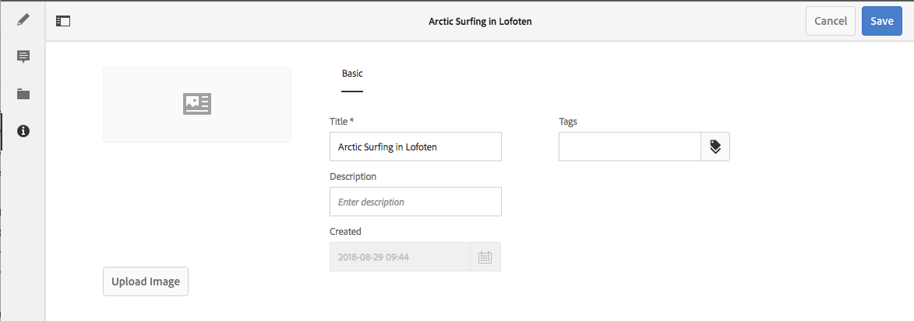

# Metadata - Fragment Properties{#metadata-fragment-properties}

### Editing Properties / Meta data {#editing-properties-meta-data}

You can view and edit the metadata (properties) for content fragments:

1. In the **Assets** console navigate to the location of the content fragment.
1. Either:

    * Select [**View Properties** to open the dialogs](../../assets/using/managing-assets-touch-ui.md#editing-properties). Once open for viewing you can also edit.
    * Open the [content fragment for Edit](../../assets/using/content-fragments-managing.md#opening-the-fragment-editor), then select **Metadata** from the side panel.

   

1. The **Basic** tab provides options that you can view or edit:

    * Thumbnail, for which you can **Upload Image**
    * **Title**
    * **Description**
    * **Tags**
    * Created (display only)

   

