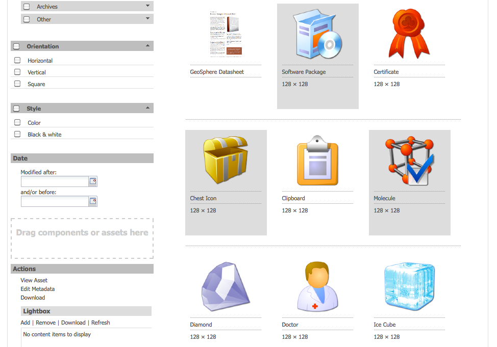
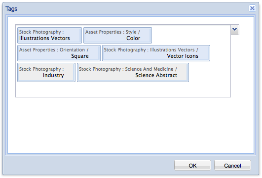

# Sort of assets in AEM{#sort-of-assets-in-aem}

The search capability of Adobe Experience Manager (AEM) Assets is enhanced to efficiently sort a large number of assets in the assets user interface and in the search results pages. The sorting works in list view only. You can also sort timeline entries.

AEM Assets deploys server-side sorting to sort the entire set of assets (howsoever large) within a folder or a search query at one go instead of sorting them in batches on the client side. This way, prefetched results can be quickly displayed on the user interface, which makes the sort operation more responsive and brisk.

## Sort assets in list view {#sort-assets-in-list-view}

AEM Assets lets you sort folder assets based on the following fields:

* Locale
* Status
* Size
* Rating
* Date modified
* Date published
* Usage
* Clicks
* Impressions
* Checked out

1. Navigate to a folder that contains a large a number of assets.
1. Click/tap the Layout icon and toggle to the list view.
1. Click/tap the Sort icon beside any column header in the list of assets.

   The list of assets is sorted based on the field values.

   

>[!NOTE]
>
>To sort the values in the `Name` or the `Title`columns, overlay `/libs/dam/gui/content/commons/availablecolumns` and change the value of `sortable` to `True`.

## Sort assets in search results {#sort-assets-in-search-results}

You can sort search results based on the following fields:

* Title
* Status
* Size
* Date modified
* Date published

1. From the OmniSearch field, search for assets in location Assets.

   

1. Click/tap the Layout icon and toggle to the list view.
1. Click/tap the Sort icon beside any column header in the list of assets. The list of assets is sorted based on the field values.

   

## Sort assets in timeline {#sort-assets-in-timeline}

AEM Assets lets you chronologically sort timeline entries, such as annotations, versions, workflows, and activities.

1. From the Assets UI, select an asset for which you want to display the timeline.
1. Click/tap the GolbalNav icon and select **Timeline**.

   

1. In the timeline, select an entry from the list. For example, select **Comments** to display the list of annotations associated with the asset. 

   

1. Click/tap the **Sort** icon beside the **Date** label. Based on your selection, the annotations are listed in the chronological/reverse chronological order in which they were added to the asset.

   

