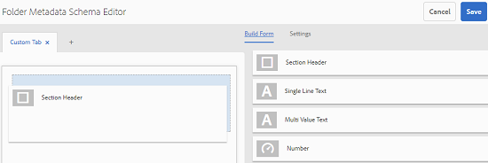
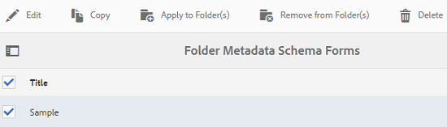
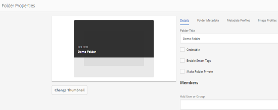

# Folder Metadata Schema{#folder-metadata-schema}

Adobe Experience Manager (AEM) Assets lets you create metadata schemas for asset folders, which define the layout and metadata displayed in folder properties pages.

## Add a folder metadata schema form {#add-a-folder-metadata-schema-form}

Use the Folder Metadata Schema Forms editor to create and edit metadata schemas for folders.

1. Tap/click the AEM logo, and go to **[!UICONTROL Tools]** > **[!UICONTROL Assets]**> **[!UICONTROL Folder Metadata Schemas]**.
1. In the Folder Metadata Schema Forms page, tap/click **[!UICONTROL Create]**.
1. Specify a name for the form, and tap/click **[!UICONTROL Create]**. The new schema form is listed in the Schema Forms page.

## Edit folder metadata schema forms {#edit-folder-metadata-schema-forms}

You can edit a newly added or existing metadata schema form, which includes the following:

* Tabs
* Form items within tabs.

You can map/configure these form items to a field within a metadata node in the CRX repository. You can add new tabs or form items to the metadata schema form.

1. In the Schema Forms page, select the form you created, and then tap/click the **[!UICONTROL Edit]**icon from the toolbar.
1. In the Folder Metadata Schema Editor page, tap/click the ****[!UICONTROL +]**** icon to add a tab to the form. To rename the tab, tap/click the default name and specify the new name under **[!UICONTROL Settings]**.

   

   To add more tabs, tap/click the ****[!UICONTROL +]**** icon. Tap/click **[!UICONTROL X]** to delete a tab.

1. In the active tab, add one or more components from the **[!UICONTROL Build Form]** tab.

   

   If you create multiple tabs, tap/click a particular tab to add components.

1. To configure a component, select it and modify its properties in the** ** **[!UICONTROL Settings]**** **tab.

   If required, delete a component from the **[!UICONTROL Settings]** tab.

   

1. Tap/click **[!UICONTROL Save]** from the toolbar to save the changes.

### Components to build forms {#components-to-build-forms}

The **[!UICONTROL Build Form]**** **tab lists form items that you use in your folder metadata schema form. The **[!UICONTROL Settings]**** **tab displays the attributes for each item that you select in the **[!UICONTROL Build Form]**** **tab. Here is a list the form items available in the **[!UICONTROL Build Form]**** **tab:

<table>
 <tbody> 
  <tr> 
   <td valign="top">
<strong>Component Name</strong>
 </td> 
   <td valign="top">
<strong>Description</strong>
 </td> 
  </tr> 
  <tr> 
   <td valign="top">
Section Header
 </td> 
   <td valign="top">
 Add a section heading for a list of common components.
 </td> 
  </tr> 
  <tr> 
   <td valign="top">
Single Line Text
 </td> 
   <td valign="top">
 Add a single-line text property. It is stored as a string.
 </td> 
  </tr> 
  <tr> 
   <td valign="top">
Multi Value Text
 </td> 
   <td valign="top">
 Add a multi value text property. It is stored as a string array.
 </td> 
  </tr> 
  <tr> 
   <td valign="top">
Number
 </td> 
   <td valign="top">
 Add a number component.
 </td> 
  </tr> 
  <tr> 
   <td valign="top">
Date
 </td> 
   <td valign="top">
 Add a date component.
 </td> 
  </tr> 
  <tr> 
   <td valign="top">
Dropdown
 </td> 
   <td valign="top">
 Add a drop-down list.
 </td> 
  </tr> 
  <tr> 
   <td valign="top">
Standard Tags
 </td> 
   <td valign="top">
 Add a tag. 
 </td> 
  </tr> 
  <tr> 
   <td valign="top">
Hidden Field
 </td> 
   <td valign="top">
 Add a hidden field. It is sent as a POST parameter when the asset is saved.
 </td> 
  </tr> 
 </tbody> 
</table>

### Editing form items {#editing-form-items}

To edit the properties of form items, tap/click the component and edit all or a subset of the following properties in the **[!UICONTROL Settings]** tab.

**[!UICONTROL Field Label]**:** **The name of the metadata property that is displayed on the properties page for the folder.

**[!UICONTROL Map to Property]**: This property specifies the relative path of the folder node in the CRX repository where it is saved. It starts with "**./**", which indicates that the path is under the folder's node.

The following are the valid values for this property:

* `./jcr:content/metadata/dc:title`: Stores the value at the folder's metadata node as the property `dc:title`.

* `./jcr:created`: Displays the JCR property at the folder's node. If you configure these properties in CRXDE, Adobe recommends that you mark them as Disable Edit, because they are protected. Otherwise, the error ' `Asset(s) failed to modify`' occurs when you save the asset's properties.

To ensure that the component is displayed properly in the metadata schema form, do not include a space in the property path.

**[!UICONTROL JSON Path]**:** **Use it to specify the path of the JSON file where you specify key-value pairs for options.

**[!UICONTROL Placeholder]**: Use this property to specify relevant placeholder text regarding the metadata property.

**[!UICONTROL Choices]**: Use this property to specify choices in a list.

**[!UICONTROL Description]**: Use this property to add a short description for the metadata component.

**[!UICONTROL Class]**: Object class the property is associated with.

## Delete folder metadata schema forms {#delete-folder-metadata-schema-forms}

You can delete folder metadata schema forms from the Folder Metadata Schema Forms page. To delete a form, select it and tap/click the Delete icon from the toolbar.

 

## Assign a folder metadata schema {#assign-a-folder-metadata-schema}

You can assign a folder metadata schema to a folder either from the Folder Metadata Schema Forms page or when creating a folder.

If you configure a metadata schema for a folder, the path to the schema form is stored in the `folderMetadataSchema` property of the folder node under .*/jcr:content*.

### Assign to a schema from the Folder Metadata Schema page {#assign-to-a-schema-from-the-folder-metadata-schema-page}

1. Tap/click the AEM logo, and go to **[!UICONTROL Tools]** > **[!UICONTROL Assets]**> **[!UICONTROL Folder Metadata Schemas]**.
1. From the Folder Metadata Schema Forms page, select the schema form you want to apply to a folder.
1. From the toolbar, tap/click** ** **[!UICONTROL Apply to Folder(s)]**.  

1. Select the folder on which to apply the schema and then click/tap **[!UICONTROL Apply]**. If a metadata schema is already applied on the folder, a warning message informs that you are about to overwrite the existing metadata schema. Tap/click **[!UICONTROL Overwrite]**.
1. Open the metadata properties for the folder to which you applied the metadata schema.

   

   To view the folder metadata fields, tap/click the **[!UICONTROL Folder Metadata]** tab. 

   

### Assign a schema when creating a folder {#assign-a-schema-when-creating-a-folder}

You can assign a folder metadata schema when creating a folder. If at least one folder metadata schema exists in the system, an extra list is displayed in the **[!UICONTROL Create Folder]** dialog. You can select the desired schema. By default, no schema is selected.

1. From the AEM Assets user interface, tap/click **[!UICONTROL Create]**from the toolbar.
1. Specify a title and name for the folder.
1. From the Folder Metadata Schema list, select the desired schema. Then, tap/click **[!UICONTROL Create]**.

   

1. Open the metadata properties for the folder to which you applied the metadata schema.
1. To view the folder metadata fields, tap/click the **[!UICONTROL Folder Metadata]** tab.

## Use the folder metadata schema {#use-the-folder-metadata-schema}

Open the properties for a folder configured with a folder metadata schema. A **[!UICONTROL Folder Metadata]** tab is displayed in the folder properties page. To view the folder metadata schema form, select this tab.

Enter metadata values in the various fields and tap/click **[!UICONTROL Save]**to store the values. The values you specify are stored in the folder node in the CRX repository.

