# Getting Started with AEM Assets{#getting-started-with-aem-assets}

<!--
Comment Type: remark
Last Modified By: Rick Brough (rbrough)
Last Modified Date: 2018-02-07T17:56:23.482-0500

This topic needs hyperlinks added to the bullet lists that mention other Help topics by name only. Areas that need the hyperlinks are where the yellow remarks are located.

-->

This Getting Started document walks you through the basic functionality of Adobe Experience Manager (AEM) Assets. Follow this tutorial to get a good handle on the various functionality of AEM Assets, including the following:

* Navigation basics
* Managing assets
* Working with individual assets
* Searching for assets

In addition, links to documentation for more details on more advanced functionality is provided after each tutorial.

<!--
Comment Type: draft

<note type="note">

If you are using Dynamic Media, you may want to walk through the dynamic media getting started topic and if you are an administrator, the administering walkthrough has basic information.

</note>
-->

## Navigation Basics {#navigation-basics}

This section describes navigation basics in AEM Assets. In this tutorial, you will learn how to navigate to tools and assets, how to collapse the pane, and where to see what's been shared, and how to access online help.

1. After logging into AEM, tap or click the Assets icon.

   

   You see the Assets navigation window, where you can choose from the following:

    * Files
    * Collections
    * Shared Links
    * Templates
    * Catalogs

   In this tutorial, you will look at files and shared links, but you could also view your collections, templates, or catalogs.

   

   Select **Files** to see all your assets (assets may be within folders). Select a folder to view your assets. Use your browser's back button to go back to a previous page.

   

   The Assets pane is where you manage all your assets, including uploading and downloading, editing, publishing, and many other functions.

   Clicking **Adobe Experience Manager** in the top left corner toggles you back and forth between the window you are in and the main Assets navigation page.

   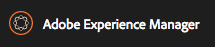

   Assets users and administrators also have tools available. Depending on whether you are an administrator or a user, you see different options in **Tools**. Reports are available to all users, and administrators can also access profiles and presets.

   You access **Tools** by clicking the tool icon (hammer) on the main page and selecting **Assets**.

   

1. Navigate back to the main Assets navigation page and select **Files**. Select the drop-down icon in the upper left corner. This drop-down menu when selected opens a left pane for easy navigation to other parts of Assets, a view of an asset's timeline, an asset's references, and a filter for easy searching.

   Select **Content Only** from the drop-down menu to collapse the rail. 

   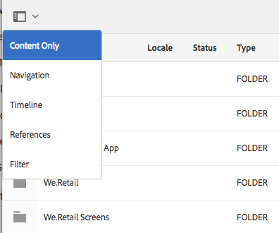

1. On the top menu on the right-hand side of the screen, you can access additional functionality.

   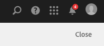

   You can search the folder you are in using filters by selecting the magnifying glass. 

   

   You can also access online documentation by clicking the question mark icon (Help).

   In addition, this is where you access notifications. The number on the bell indicates any unread notifications.

   Clicking the three lines of dots provides you access to any other digital marketing product.

   

   Clicking the person icon lets you sign out.

1. To find out what links you have shared, navigate to the main Assets navigation screen and select **Shared Links**. Any links shared are displayed.

   

## Managing Assets {#managing-assets}

In this tutorial, you learn how to manage your assets by creating folders and uploading and downloading assets.

1. In the main AEM navigation page, select the **Assets** icon.
1. Select** Files**.
1. Tap or click **Create** and select **Folder** from the drop-down list. Folders are one way to organize your assets (Tags are another way).

   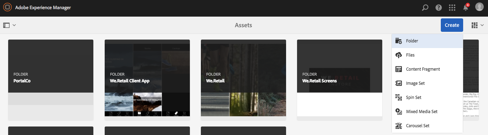

1. Enter a name for the folder and click **Create**. In this example, we create a folder named **My New Folder**.

   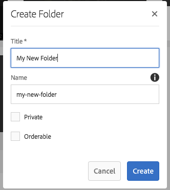

1. Tap or click the folder to open it. You see that there is no content. To add assets, select **Create** and then select **Files** from the drop-down menu. Select some assets to upload and click **Open**.
1. Your selected items appear in the **Upload** window. Click **Upload**. 

   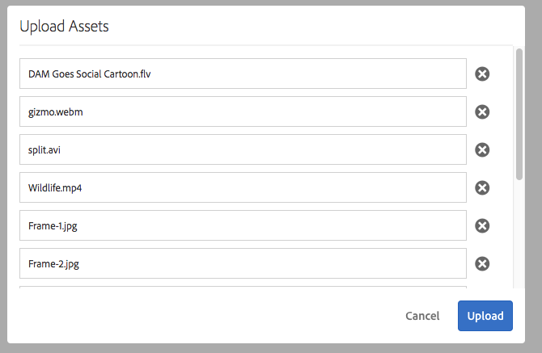

   AEM displays when assets are uploading, if they are new, or if there is an issue.

   

   After they are uploaded, a thumbnail of the asset appears in addition to other information, such as size.

   

1. Change the view of how you see assets by selecting the views drop-down menu in the right-hand corner.

   

1. Select **List** view to get a bulleted list of your assets. Select the **Card** view to return to the previous layout.

   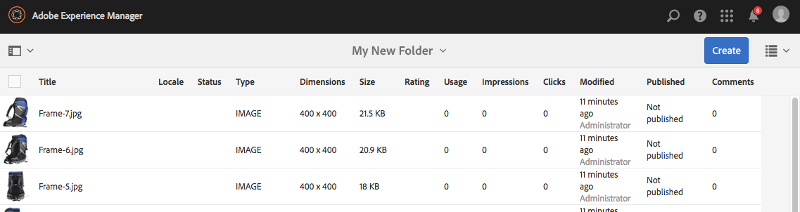

   Select the **Column** view to have an expanded view of your assets.

   

1. Navigate to the parent folder by tapping or clicking the drop-down menu in the center of the menu bar. Select **My New Folder **to return to the list of your assets.

   

1. In **Card View**, hover over an asset and another toolbar appears. These are the actions you can perform on this particular asset. You can select, annotate, view the properties of, download, edit, and copy the asset. Hover over the icons in the toolbar to find out what clicking each icon does.

   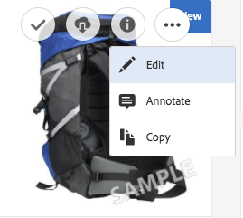

   In **Column View** and **List** **View**, you can tap or click the asset to select it and a toolbar appears where you can select additional actions.

   

1. Select an asset in **Card View** by selecting the checkmark. You can select multiple assets by clicking/tapping them. (In other views, you can click or tap the asset to select it.)

   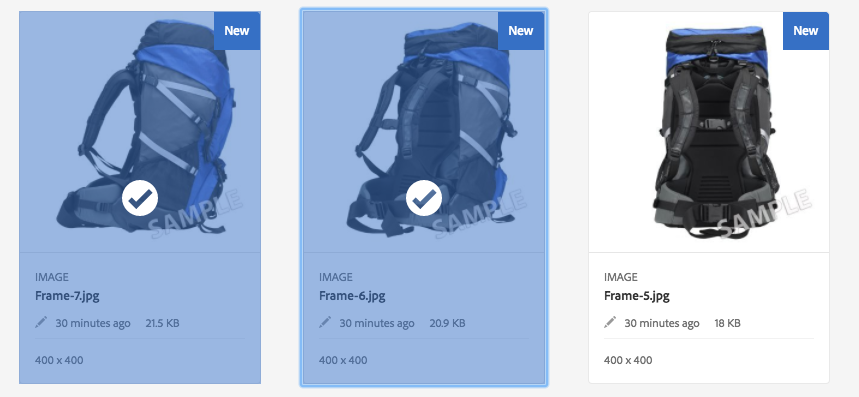

   Notice how the selected image changes color and has a check mark on it. When an assets is selected the toolbar expands with additional options. Click the** **three dots menu to see more action items.

   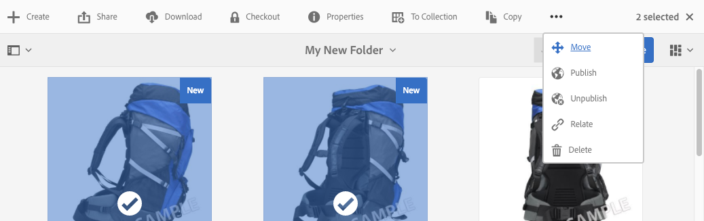

1. Click **Download** to open the **Download** window where you can download assets, renditions, and any dynamic assets, if applicable. After selecting what you want to download, click **Download**.

   

1. Either tap or click the x next to the number of selected items or individually de-select the items by clicking on them.

   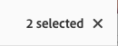

<!--
Comment Type: remark
Last Modified By: Rick Brough (rbrough)
Last Modified Date: 2018-02-07T17:52:18.029-0500

Add hyperlinks to the bullet list below.

-->

In this tutorial, you learned how to navigate in AEM Assets as well as how to upload and download assets and create folders.

For more information, see the following topics:

* [Uploading assets](../../assets/using/managing-assets-touch-ui.md#uploading-assets)
* [Uploading assets via FTP](../../assets/using/managing-assets-touch-ui.md#uploading-assets-using-ftp)
* [Downloading assets](../../assets/using/managing-assets-touch-ui.md#downloading-assets)
* [Organizing assets](/assets/using/best-practices-for-file-management.md)

## Working with Individual Assets {#working-with-individual-assets}

In this tutorial, you learn how to work with individual assets, including using viewer presets, zooming in, and viewing and editing metadata properties, and viewing the timeline.

1. Navigate to **Assets** &gt; **Files** &gt; **My New Folder**, which you created in [Managing Assets](#managing-assets),** **and select an asset.

   Open the asset. Open the drop-down menu on the left to select an overview, timeline, renditions, and viewers. All the editing toolbars for the image above and below the image. Here is where you preview the image.

   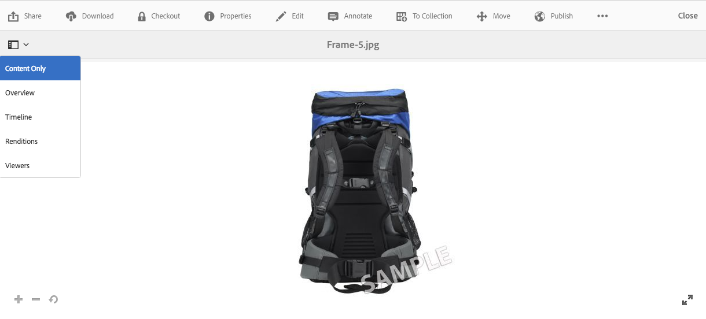

1. From the drop-down menu, select **Overview** to view information on this particular asset. To close this pane, select **Content Only**. 

   

1. Click the + to zoom into the asset. Select **Renditions** from the drop-down menu to see what other renditions are available for this asset. Select a rendition.

   

1. Select **Properties** from the editing toolbar above the asset.

   

   The **Basic**, **Advanced**, **IPTC**, and **IPTC Extension** tabs display asset metadata that you can edit. In addition, you can view insights into this asset's usage and performance statistics in the **Insight** tab. If an asset is tied to a product, that information is available in the **Product Data** tab.

1. In the **Basic** tab, type some additional metadata information, for example **Title** and **Description**. Click **Save** to save your changes. Your changes are visible in the **Basic** tab.

   

1. Select **Close** to navigate back to **My New Folder** and select **Timeline** in the left drop-down menu.

   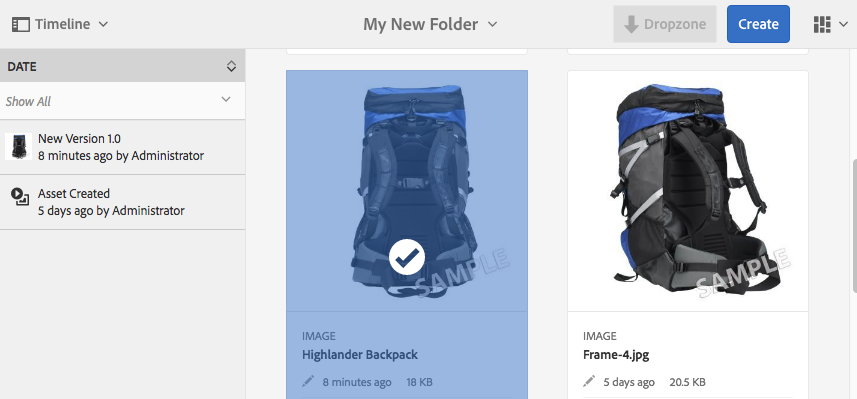

<!--
Comment Type: remark
Last Modified By: Rick Brough (rbrough)
Last Modified Date: 2018-02-07T17:53:15.259-0500

Add hyperlinks to the bullet list below.

-->

In this tutorial, you learned how to work with assets, viewers, renditions, zoom in and out of assets, and view and edit metadata properties, and view the timeline.

For more information, see the following:

* [Organizing assets](/assets/using/best-practices-for-file-management.md)  

* [Applying viewer presets](/assets/using/viewer-presets.md)
* [View and edit metadata properties](/assets/using/meta-edit.md)

## Searching for Assets {#searching-for-assets}

In this tutorial, you learn how to search for assets.

1. Navigate to **Assets** &gt; **Files** to view all your assets.
1. In the top navigation bar, select the magnifying glass to enter search. Enter a keyword. AEM displays possible selections.

   

   Select an asset to navigate directly into that asset's detailed view. Navigate back to the main Assets page.

1. In the left-hand drop-down menu, select Filters. The Filters pane opens.

   

   You can type in a keyword in the Search toolbar as you did in the previous step. In addition, you can modify your search by a variety of filters such as file size or file type.

1. Select **File Type** and select the **Images** check box to view all the images in the Assets folder.

   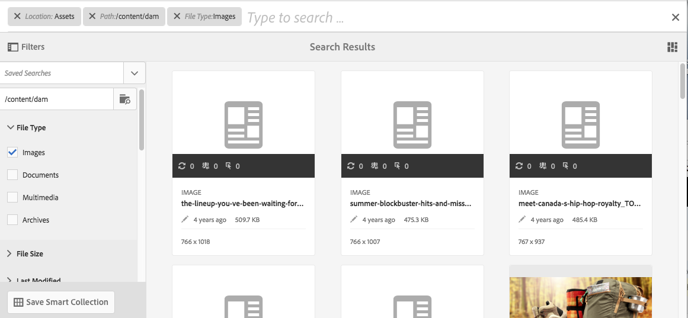

   Notice that checking images adds it to the search toolbar as **File Type:Images**. You can remove that filter by either clicking **x** or removing the checkmark next to the word Images.

<!--
Comment Type: remark
Last Modified By: Rick Brough (rbrough)
Last Modified Date: 2018-02-07T17:53:56.173-0500

Add hyperlinks to the bullet list below.

-->

In this tutorial you learned how to search for an asset. For more information, see the following:

* [Searching video assets](/assets/using/search-video-assets.md)
* [Search facets](/assets/using/custom-search-facets.md)

