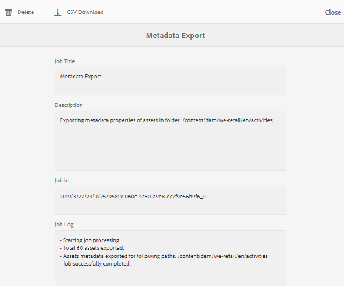

# Import and export asset metadata in bulk{#import-and-export-asset-metadata-in-bulk}

AEM Assets lets you import asset metadata in bulk using a CSV file. You can do bulk updates for the recently uploaded assets or the existing assets by importing a CSV file. You can also ingest asset metadata in bulk from third-party system in CSV format.

## Import metadata {#import-metadata}

The metadata import is asynchronous and does not impede the system performance. Simultaneous update of the metadata for multiple assets can be resource-intensive because of XMP writeback activity if workflow flag is checked. Plan such an import during lean server usage so that performance for other users is not impacted.

>[!NOTE]
>
>To import metadata on custom namespaces, first register the namespaces.

1. Navigate to the Assets user interface, and tap/click **Create** from the toolbar.
1. From the menu, select **Metadata**.
1. In the **Metadata Import** page, tap/click **Select File**. Select the CSV file with the metadata.
1. Specify the following parameters:

   | Batch Size |Number of assets in a batch for which metadata is to be imported. Default value is 50. Maximum value is 100. |
   |---|---|
   | Field Separator |Default value is Comma. You can specify any other character. |
   | Multi value Delimiter |Separator for metadata values. Default value is |. |
   | Launch Workflows |False by default. When set to *true* and default Launcher settings are in effect for the DAM Metadata WriteBack Workflow (that writes metadata to the binary XMP data). Enabling launch workflows slows the system down. |
   | Asset Path Column Name |Defines the column name for the CSV file with assets. |

1. Tap/click **Import** from the toolbar. After the metadata is imported, a notification is sent to your Notification inbox. Navigate to asset property page and verify whether the metadata values are correctly imported for assets.

## Export Metadata {#export-metadata}

You can export metada for multiple assets in a CSV format. The metadata is exported asynchronously and does not impact the performance of the system. To export metadata, AEM traverses through the properties of the asset node `jcr:content/metadata` and its child nodes and exports the metadata properties in a CSV file.

A few use cases for exporting metadata in bulk are:

* Import the metadata in a third-party system when migrating assets.
* Share asset metadata with a wider project team.
* Test or audit the metadata for compliance.
* Externalize the metadata for separate localization.

1. Select the asset folder that contains assets for which you want to export metadata. From the toolbar, select** Export metadata**.
1. In the Metadata Export dialog, specify a name for the CSV file. To export metadata for assets in subfolders, select **Include assets in subfolders**.

   

   Interface and options to export metadata of all assets in a folder

1. Select the desired options. Provide a filename and if necessary a date.  

1. In the **Properties to be exported** field, specify whether you want to export all or specific properties. If you choose Selective properties to be exported, add the desired properties.  

1. From the toolbar, tap/click **Export**. A message confirms that the metadata is exported. Close the message.
1. Open the inbox notification for the export job. Select the job and click **Open** from the toolbar. To download the CSV file with the metadata, tap/click **CSV Download** from the toolbar. Click **Close**.

   

   Dialog  to download the CSV file containing metadata exported in bulk

