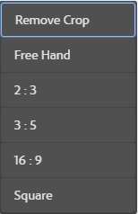
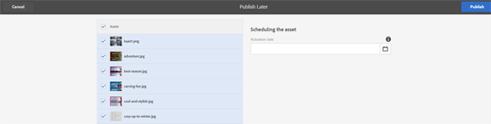
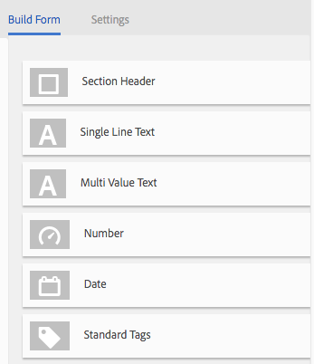
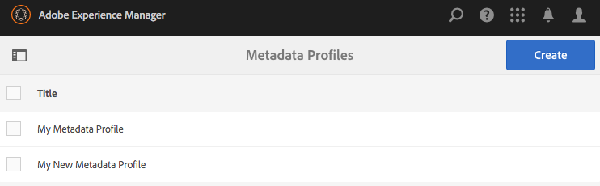
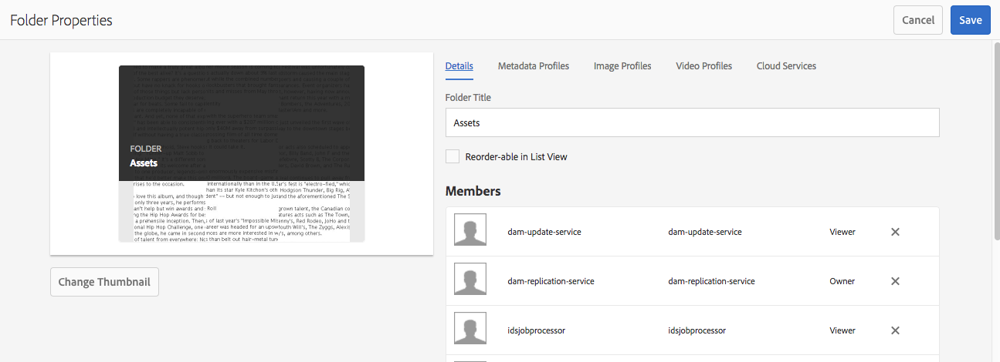

# Metadata Profiles{#metadata-profiles}

A Metadata Profile lets you apply default metadata to assets within a folder. Create a Metadata Profile and apply it to a folder. Any asset that you subsequently upload to the folder inherits the default metadata that you configured in the Metadata Profile.

## Adding a metadata profile {#adding-a-metadata-profile}

1. Tap or click the AEM logo and navigate to **Tools **&gt; **Assets **&gt; **Metadata Profiles**, and then tap or click **Create**.
1. Enter a title for the Metadata Profile, for example Sample Metadata, and click **Submit**. The Edit Form for the Metadata Profile is displayed. 

   

1. Click a component and configure its properties in the **Settings** tab. For example, click the **Description** component and edit its properties.

   

   Edit the following properties for the **Description** component:

    * **Field Label**:** **The display name of the metadata property. It is only for the user reference.
    
    * **Map to Property**: The value of this property provides the relative path/name to the asset node where it is saved in the repository. The value should always start with "**./**" because it indicates that the path is under the asset's node.

   

   The value you specify for **Map to property** is stored as a property under the asset's metadata node. For example, if you specify . `/jcr:content/metadata/dc:desc` as the name of **Map to property**, AEM Assets stores the value `dc:desc` at the asset's metadata node.

    * **Default Value**: Use this property to add a default value for the metadata component. For example, if you specify "My description" then this value is assigned to the property `dc:desc` at the asset's metadata node.

   

   >[!NOTE]
   >
   >Adding a default value to a new metadata property (which doesn't exist already at the . `/jcr:content/metadata` node) does not display the property and its value on the asset's Properties page by default. To view the new property on the assets's Properties page, modify the corresponding schema form.

1. (Optional) Add more components to the Edit Form from the **Build Form** tab, and configure their properties in the **Settings** tab. The following properties are available from the **Build Form **tab:

<table border="1" cellpadding="1" cellspacing="0" width="100%"> 
 <tbody> 
  <tr> 
   <td><strong>Component</strong></td> 
   <td><strong>Properties</strong></td> 
  </tr> 
  <tr> 
   <td>Section Header</td> 
   <td> 
    <ul> 
     <li>Field Label</li> 
     <li>Description</li> 
    </ul> </td> 
  </tr> 
  <tr> 
   <td>Single Line Text</td> 
   <td> 
    <ul> 
     <li>Field Label</li> 
     <li>Map to property</li> 
     <li>Default Value</li> 
    </ul> </td> 
  </tr> 
  <tr> 
   <td>Multi Value Text</td> 
   <td> 
    <ul> 
     <li>Field Label</li> 
     <li>Map to property</li> 
     <li>Default Value</li> 
    </ul> </td> 
  </tr> 
  <tr> 
   <td>Number</td> 
   <td> 
    <ul> 
     <li>Field Label</li> 
     <li>Map to property</li> 
     <li>Default Value</li> 
    </ul> </td> 
  </tr> 
  <tr> 
   <td>Date</td> 
   <td> 
    <ul> 
     <li>Field Label</li> 
     <li>Map to property</li> 
     <li>Default Value</li> 
    </ul> </td> 
  </tr> 
  <tr> 
   <td>Standard Tags</td> 
   <td> 
    <ul> 
     <li>Field Label</li> 
     <li>Map to property</li> 
     <li>Default Value</li> 
     <li>Description</li> 
    </ul> </td> 
  </tr> 
 </tbody> 
</table>

   

1. Click **Done**. The Metadata Profile is added to the list of profiles in the **Metadata Profiles** page. 

   

## Copying a metadata profile {#copying-a-metadata-profile}

1. From the **Metadata Profiles** page, select a Metadata Profile to make a copy of it. 

   

1. Click **Copy** from the toolbar.
1. In the **Copy Metadata Profile** dialog, enter a title for the new copy of the Metadata Profile.
1. Click **Copy**. The copy of the Metadata Profile appears in the list of profiles in the **Metadata Profiles** page. 

   

## Deleting a metadata profile {#deleting-a-metadata-profile}

1. From the **Metadata Profiles** page, select a profile to delete. 

   

1. Click **Delete** **Metadata Profiles **in the toolbar.
1. In the dialog, click **Delete** to confirm the delete operation. The metadata profile is deleted from the list.

## Applying a metadata profile to folders {#applying-a-metadata-profile-to-folders}

When you assign a metadata profile to a folder, any subfolders automatically inherit the profile from its parent folder. This means that you can assign only one metadata profile to a folder. As such, consider carefully the folder structure of where you upload, store, use, and archive assets.

If you assigned a different metadata profile to a folder, the new profile overrides the previous profile. The previously existing folder assets remain unchanged. The new profile is applied on the assets that are added to the folder later.

Folders that have a profile assigned to it are indicated in the user interface by the name of the profile appearing in the card name.

You can apply metadata profiles to specific folders or globally to all assets.

### Applying metadata profiles to specific folders {#applying-metadata-profiles-to-specific-folders}

You can apply a metadata profile to a folder from within the **Tools** menu or if you are in the folder, from **Properties**. This section describes how to apply metadata profiles to folders both ways.

Folders that have a profile already assigned to it are indicated by the display of the profile's name directly below the folder name.

#### Applying metadata profiles to folders from Profiles user interface {#applying-metadata-profiles-to-folders-from-profiles-user-interface}

To apply a metadata profile to folders from the Profiles user interface:

1. Tap or click the AEM logo and navigate to **Tools **&gt; **Assets **&gt; **Metadata Profiles.**
1. Select the metadata profile that you want to apply to a folder or multiple folders.

   

1. Tap/click **Apply Metadata Profile to Folder(s) **and select the folder or multiple folders you want use to receive the newly uploaded assets and tap/click **Done**. Folders that have a profile already assigned to it are indicated by the display of the profile's name directly below the folder name.

#### Applying metadata profiles to folders from Properties {#applying-metadata-profiles-to-folders-from-properties}

To apply a metadata profile to folders from properties:

1. In the left rail, click/tap **Assets** then navigate to the folder that you want to apply a metadata profile to.
1. On the folder, tap or click the check mark to select it and then tap or click **Properties**.  

1. Select the **Metadata Profiles** tab and select the profile from the drop-down menu and click **Save**.

   

   Folders that have a profile already assigned to it are indicated by the display of the profile's name directly below the folder name.

### Applying a metadata profile globally {#applying-a-metadata-profile-globally}

In addition to applying a profile to a folder, you can also apply one globally so that any content uploaded into AEM assets in any folder has the selected profile applied.

To apply a profile globally, do one of the following:

* Navigate to **http://&lt;AEM server&gt;/mnt/overlay/dam/gui/content/assets/foldersharewizard.html/content/dam** and apply the appropriate profile and tap or click **Save**.

  

* Navigate to CRXDE Lite to the following node: **/content/dam/jcr:content. **Add the property** metadataProfile:/etc/dam/metadata/dynamicmedia/&lt;name of metadata profile&gt; **and tap or click **Save All**. 

  

## Removing a metadata profile from folders {#removing-a-metadata-profile-from-folders}

When you remove a metadata profile from a folder, any subfolders automatically inherit the removal of the profile from its parent folder. However, any processing of files that has occurred within the folders remains intact.

You can remove a metadata profile from a folder from within the **Tools** menu or if you are in the folder, from the **Properties**. This section describes how to remove metadata profiles from folders both ways.

#### Removing metadata profiles from folders via Profiles user interface {#removing-metadata-profiles-from-folders-via-profiles-user-interface}

To remove a metadata profile from folders via Profiles user interface:

1. Tap or click the AEM logo and navigate to** Tools** &gt;** Assets **&gt; **Metadata Profiles.**
1. Select the metadata profile that you want to remove from a folder or multiple folders.
1. Tap/click **Remove Metadata Profile from Folder(s) **and select the folder or multiple folders you want use to remove a profile from and tap/click **Done**.

   You can confirm that the metadata profile is no longer applied to a folder because the name no longer appears below the folder name.

#### Removing metadata profiles from folders via Properties {#removing-metadata-profiles-from-folders-via-properties}

To remove a metadata profile from folders via properties:

1. Tap or click the AEM logo and navigate **Assets **and then to the folder that you want to remove an metadata profile from.
1. On the folder, tap or click the check mark to select it and then tap or click **Properties**.
1. Select the **Metadata Profiles** tab and select **None** from the drop-down menu and click **Save**. Folders that have a profile already assigned to it are indicated by the display of the profile's name directly below the folder name.

