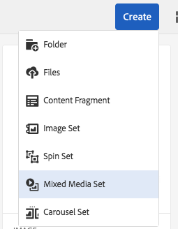

# Mixed Media Sets{#mixed-media-sets}

Mixed Media Sets let you provide a mix of images, Image Sets, Spin Sets, and videos in one presentation.

Mixed Media Sets are designated by a banner with the word **MixedMediaSet**. In addition, if the Mixed Media Set is published, then the publish date, indicated by the **World** icon is on the banner along with the last modification date, indicated by the **Pencil** icon displays. 

>[!NOTE]
>
>For information on the Assets user interface, see [Managing assets with the Touch UI](../../assets/using/managing-assets-touch-ui.md).

## Quick Start: Mixed Media Sets {#quick-start-mixed-media-sets}

To get you up and running quickly with Mixed Media Sets, follow these steps:

1. [Upload your assets](#uploading-assets).

   Start by uploading the images and videos for your Mixed Media Sets. If necessary, create your [Image Sets](../../assets/using/image-sets.md) and [Spin Sets](../../assets/using/spin-sets.md). Because users can zoom on images in the Mixed Media Set Viewer, take zooming into account when you choose images. Make sure that the images are least 2000 pixels in the largest dimension.

   <!--
   Comment Type: draft

   <note type="note">
   
You must publish your assets <strong>before</strong> you publish your mixed media set.

   </note>
   -->

1. [Create Mixed Media Sets.](#creating-mixed-media-sets)

   To create a Mixed Media Set, from the Assets page, tap **Create** &gt; **Mixed Media Set** and then name the set, choose the assets, and choose the order the images appear.

   See [Working with Selectors.](/assets/using/working-with-selectors.md)

1. Set up [Mixed Media Viewer presets](../../assets/using/managing-viewer-presets.md), as needed.

   Administrators can create or modify Mixed Media Set Viewer Presets. To see your mixed media with a viewer preset, select the mixed media set, and in the left-rail drop-down menu, select **Viewers**.

   See **Tools** &gt; **Assets **&gt; **Viewer Presets** to create or edit viewer presets.

   See [Adding and editing viewer presets.](../../assets/using/managing-viewer-presets.md)

1. [Preview Mixed Media Sets.](#previewing-mixed-media-sets)

   Select the Mixed Media Set and you can preview it. Click the thumbnail icons to examine your Mixed Media Set in the selected Viewer. You can choose different Viewers from the **Viewers** menu, available from the left rail drop-down menu.

1. [Publish Mixed Media Sets.](#publishing-mixed-media-sets)

   Publishing a Mixed Media Set activates the URL and Embed string. In addition, you must [publish the viewer preset](../../assets/using/managing-viewer-presets.md#publishing-viewer-presets).

1. [Link URLs to your Web Application](/assets/using/linking-urls-to-yourwebapplication.md) or [Embed the Video or Image Viewer](/assets/using/embed-code.md).

   AEM Assets creates URL calls for Mixed Media Sets and activates them after you publish the mixed media sets. You can copy these URLs when you preview assets. Alternatively you can embed them on your web site.

   Select the Mixed Media Set, then in the left rail drop-down menu, select **Viewers**.

   See [Linking a Mixed Media Set to a web page](/assets/using/linking-urls-to-yourwebapplication.md) and [Embedding the Video or Image Viewer](/assets/using/embed-code.md).

If you need to, you can edit [Mixed Media Sets](#editing-mixed-media-sets). In addition, you can view and modify [Mixed Media Set properties](../../assets/using/managing-assets-touch-ui.md#editing-properties).

>[!NOTE]
>
>If you have issues creating sets, see [Troubleshooting Dynamic Media - Scene7 mode](../../assets/using/troubleshoot-dms7.md).

## Uploading Assets {#uploading-assets}

Start by uploading the images and videos for your Mixed Media Sets. Because users can zoom on images in the Mixed Media Set Viewer, be sure you take zooming into account when you choose images. Make sure that the images are least 2000 pixels in the largest dimension.

In addition, if you want to add spin sets or image sets to the mixed media set, create those as well.

## Creating Mixed Media Sets {#creating-mixed-media-sets}

You can add images, Image Sets, Spin Sets, and videos to your Mixed Media set. Make sure your files, image sets, and spin sets are ready to publish before you add them to the Mixed Media Set.

When you add assets to your set, they are automatically added in alphanumeric order. You can manually re-order or sort assets after they have been added.

<!--
Comment Type: draft

<note type="note">

Assets in the mixed media set must be published before the mixed media set is published.

</note>
-->

To create a Mixed Media Set:

1. In Assets, navigate to where you want to create a mixed media set, and click **Create**, and select** Mixed Media Set**. You can also create the set from inside a folder that contains your assets. The Mixed Media Set Editor displays.

   

1. In the Mixed Media Set Editor, in **Title**, enter a name for the Mixed Media Set. The name appears in the banner across the Mixed Media Set. Optionally, enter a description.

   

   >[!NOTE]
   >
   >When creating the mixed media set, you can change the mixed media set thumbnail or allow AEM to select the thumbnail automatically based on the assets in the mixed media set. To select a thumbnail, click **Change thumbnail **and select any image (you can navigate to other folders to find images as well). If you have selected a thumbnail and then decide that you want AEM to generate one from the mixed media set, select **Switch to Automatic thumbnail**.

1. Tap or click the the Asset Selector to select assets that you want to include in your Mixed Media Set. Select them and click **Select**.

   With the Asset Selector, you can search for assets by typing in a keyword and tapping or clicking Return. You can also apply filters to refine your search results. You can filter by path, collection, file type, and tag. Select the filter and then click/tap the **Filter** icon from the toolbar. Change the view by selecting the View icon and selecting list, column or card view.

   See [Working with Selectors](/assets/using/working-with-selectors.md).

   

1. Re-order the assets by dragging them up or down the list (must select the reorder icon), as necessary.

   

   If you want to add thumbnails, click the **+** **thumbnail** icon next to the image and navigate to the thumbnail you want. When done selecting all the thumbnail images click **Save.**

   >[!NOTE]
   >
   >If you want to add assets, tap or click **Add Asset**.

1. To delete an asset, select the corresponding check box and click **Delete Asset**. 
1. To apply a preset, tap or click **Preset** in the upper right corner and select a preset to apply to the assets.
1. Click **Save**. Your newly created Mixed Media Set appears in the folder you created it in.

## Editing Mixed Media Sets {#editing-mixed-media-sets}

You can perform a variety of editing tasks to assets in Mixed Media Sets directly in the user interface [as you would any asset in Assets](../../assets/using/managing-assets-touch-ui.md). You can also perform the following actions in Mixed Media Sets:

* Add assets to the Mixed Media Set.
* Re-order assets in the Mixed Media Set.
* Delete assets in the Mixed Media Set.
* Apply viewer presets.
* Change the default thumbnail.

To edit a Mixed Media Set:

<!--
Comment Type: draft

<note type="note">

You can create mixed media sets manually or automatically through set automation. Note, however, that you cannot see set members in the user interface. See <a href="#viewingmixedmediasetmembers">Viewing Mixed Media Set Members</a>.

</note>
-->

1. Do any one of the following:

    * Hover over a Mixed Media Set asset, then tap **Edit** (pencil icon).
    * Hover over a Mixed Media Set asset, tap **Select** (checkmark icon), then tap **Edit** on the toolbar.
    
    * Tap on a Mixed Media Set asset, then tap **Edit** (pencil icon) on the toolbar.

1. In the Mixed Media Set Editor, do any of the following:

    * To reorder assets - In the left panel, tap **Assets** (picture icon), drag an asset to a new location.
    * To add assets - On the toolbar, tap **Add Asset**. Navigate to the assets. For each asset that you want to add, hover over the asset's image (not the asset's name), then tap the checkmark icon. In the upper-right corner, tap **Select**.   
    
    * To delete an asset - In the left panel, tap **Assets **(picture icon), then select the asset. On the toolbar bar tap **Delete Asset**.
    
    * To sort assets by their name in ascending or descending order, in the left panel, tap **Assets** (picture icon). To the right of the **Assets** heading, tap the up or down caret icons.

   >[!NOTE]
   >
   >
   >    
   >    
   >    * To delete an entire Mixed Media Set, from any viewing mode (such as Card view or Column view) navigate to the Mixed Media Set. Hover over the asset and tap the checkmark icon to select it. Press **Backspace** on the keyboard, or click **More **(three dots) on the toolbar, then tap **Delete**.
   >    
   >    * You can edit the assets in a Mixed Media Set by navigating to the set, clicking **Set Members** in the left rail, and then clicking or tapping the Pencil icon on an individual asset to open the editing window.
   >    
   >

1. Tap **Save** when you are done editing.

>[!NOTE]
>
>* To edit the assets in a Mixed Media Set - Navigate to the Mixed Media Set. Tap (do not select) the set to open it in the AEM Set Preview page. In the left rail, click the down caret to open the drop-down list, then tap **Set Members**. In the Set Members page, hover on an asset, then tap **Edit** (pencil icon) to open the editing page.
>
>* To delete an entire Mixed Media Set - From any viewing mode (such as Card view or Column view), navigate to the Mixed Media Set. Hover on the set, then tap **Select** (checkmark icon). Press **Backspace** on your keyboard, or tap **More** (row of three dots), then tap **Delete**.
>

## Previewing Mixed Media Sets {#previewing-mixed-media-sets}

See [Previewing Assets](../../assets/using/previewing-assets.md) for details on how to preview Mixed Media Sets.

## Publishing Mixed Media Sets {#publishing-mixed-media-sets}

See [Publishing Assets](/assets/using/publishing-dynamicmedia-assets.md) for details on how to publish Mixed Media Sets.

>[!NOTE]
>
>If the mixed media set does not fully end up in the delivery service the first time you publish it, you may need to publish the mixed media set a second time.

