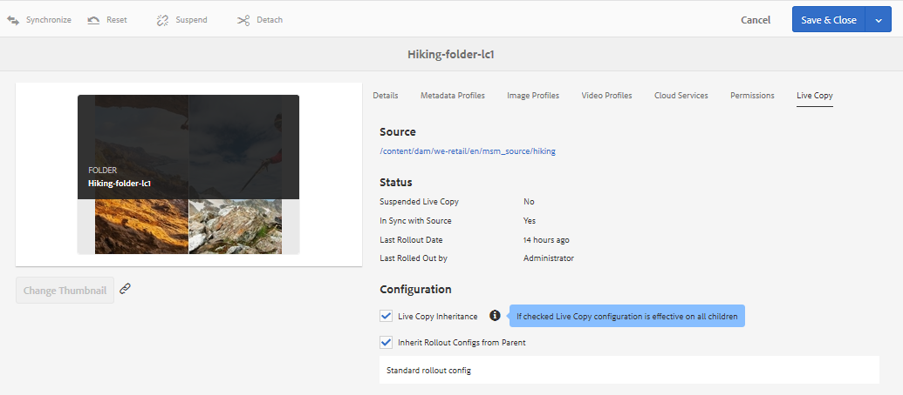
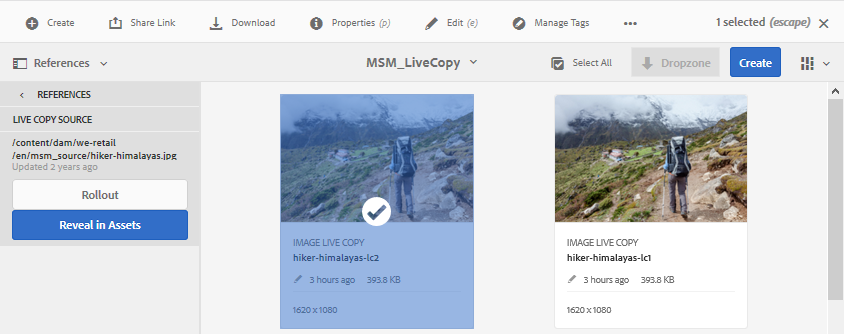
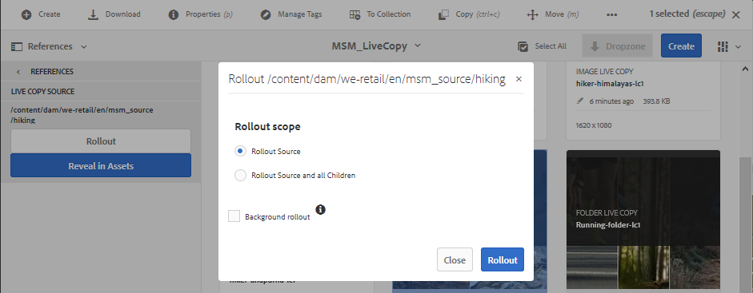

# Reuse assets using MSM for Assets{#reuse-assets-using-msm-for-assets}

Multi Site Manager (MSM) functionality in Adobe Experience Manager (AEM) enables users to reuse content that is authored once and reused across multiple web-locations. The same is available for digital assets as MSM for Assets functionality. Using MSM for Assets, you can:

* Create assets once and then make copies of these assets to reuse in other areas of the site.  
* Keep multiple copies in synchronization and update the original master copy once to push the changes to the child copies.
* Make local changes by temporarily or permanently suspending the linking between parent and child assets.

## Prerequisites {#configprereq}

To use MSM for Assets, install at least Service Pack 1. For more information, see [the release notes](../../release-notes/sp-release-notes.md).

## Understand the benefits and the concepts {#concepts}

### How it works and the benefits {#how-it-works-and-the-benefits}

To understand the usage scenarios for reusing same content (text and assets) across multiple web-locations, see [possible MSM scenarios](/sites/administering/using/msm.md). AEM maintains a link between the original asset and its linked copies, called as live copies (LCs). The maintained linking allows centralized changes to be pushed to many live copies. This allows for faster updates while doing away with the limitations of managing duplicate copies. The propagation of changes is error-free and centralized. The functionality allows room for updates that are limited to selected live copies. Users can detach the linking, that is break inheritance, and make local edits that are not overwritten when next time the master copy is updated and changes are rolled out. The detaching can be done for a few select metadata fields or for an entire asset. It allows for flexibility to locally update assets that are originally inherited from a master copy.

MSM maintains a live relationship between the source asset and its live copies so that:

* Changes to the source assets are applied (rolled out) to live copies as well, that is the live copies are synchronized with the source.  
* You can update the live copies by suspending the live relationship or remove the inheritance for a few limited fields. The modifications to the source are no longer applied to the live copy.

### Glossary of MSM for Assets terms {#glossary}

**Source** The original assets or folders. Master copy from which live copies are derived.

**Live copy** The copy of the source assets/folders that is in synchronization with its source. Live copies can be a source of further live copies. See how to create LCs.

**Inheritance** A link/reference between a live copy asset/folder and its source that the system uses to remember where to send the updates. Inheritance exists at a granular level for metadata fields. Inheritance can be removed for selective metadata fields while preserving the live relationship between source and its live copy.

**Rollout** An action that pushes the modifications made to the source downstream to its live copies. It is possible to update one or more live copies in one go using rollout action. See rollout.

**Rollout config** Rules that determine which properties are synchronized, how and when. These configurations are applied when creating live copies; can be edited later; and a child can inherit rollout configuration from its parent asset. For MSM for Assets, use only the Standard rollout config. The other rollout configurations are not available for MSM for Assets.

**Synchronize** Another action, in addition to rollout, that brings parity between source and its live copy by sending the updates from source to live copies. A sync is initiated for a particular live copy and the action pulls the changes from the source. Using this action, is possible to only update one of the live copies. See synchronize action.

**Suspend** Temporarily remove the live relationship between a live copy and its source asset/folder. You can resume the relationship. See suspend action.

**Resume** Resume the live relationship so that a live copy again starts receiving the updates from source. See resume action.

**Reset** Reset action makes the live copy again a replica of the source by overwriting any local changes. It also removes inheritance cancellations and resets inheritance on all metadata fields. To make local modifications in the future, you must again cancel the inheritance of specific fields. See local modifications to LC.

**Detach** Irrevocably remove the live relationship of a live copy asset/folder. After detach action, the live copies can never receive updates from source and it stops being a live copy anymore. See remove relationship.

## Create live copy of an asset {#createlc}

To create live copy from one or more source assets or folders, follow either of the following:

* Method 1: Select the source assets and click **[!UICONTROL Create > Live Copy]** from toolbar at the top.  

* Method 2: In AEM user interface, click **[!UICONTROL Create > Live Copy]** from upper-right corner of the interface.

You can create live copies of an asset or a folder one at a time. You can create live copies that are derived from an asset or a folder that is a live copy itself.  Content Fragments (CFs) are not supported for the use case. When attempting to create their live copies, CFs are copied over as is without any relationship. The copied CFs are a snapshot in time and does not update when original CFs are updated.

To create live copies using the first method, follow these steps:

1. Select source assets or folders. From the toolbar, click **[!UICONTROL Create > Live Copy]**.

   

   Create live copy from AEM interface

1. Select a destination folder. Click **[!UICONTROL Next]**.
1. Provide title and name. Assets do not have children. When creating live copy of folders, you can choose to include or exclude children.
1. Select a rollout configuration. Click **[!UICONTROL Create]**.

To create live copies using the second method, follow these steps:

1. In AEM interface, from upper-right corner, click **[!UICONTROL Create > Live Copy]**.

   

   Create live copy from AEM interface

1. Select source asset or folder. Click **[!UICONTROL Next]**.
1. Select destination folder. Click **[!UICONTROL Next]**.
1. Provide title and name. Assets do not have children. When creating live copy of folders, you can choose to include or exclude children.
1. Select a rollout configuration. Click **[!UICONTROL Create]**.

>[!NOTE]
>
>When a source or a live copy is moved, the relationships are retained. When a live copy is deleted, the relationships are removed.

## View various properties and statuses of source and live copy {#properties}

You can view the information and MSM-related statuses of live copy such as relationship, synchronization, rollouts, and more from the various areas of the AEM user interface.

The following two methods work for assets and folders:

* Select live copy asset and find the information in its Properties page.
* Select source folder and find the detailed information of each live copy from the Live Copy Console.

**Tip**: To check the status of a few separate live copies, use the first method that is see the Properties page. To check statuses of many live copies, use the second method, that is, see the **[!UICONTROL Relationship Status]** page.

##

### Information and status of a live copy {#statuslcasset}

To check the information and statuses of a live copy asset or a folder, follow these steps.

1. Select a live copy asset or a folder. Click **[!UICONTROL Properties]** from the toolbar. Alternatively, use the keyboard shortcut `p`.
1. Click **[!UICONTROL Live Copy]**. You can check the path of the source, suspension status, synchronization status, last rollout date, and the user who did the last rollout.

   

   Live copy information and statuses

1. You can enable or disable if child assets borrow the live copy configuration.  

1. You can choose the option for the live copy to either inherit the rollout configuration from the parent or change the configuration.

### Information and statuses of all live copies of a folder {#statuslcfolder}

AEM provides a console to check the statues of all the live copies of a source folder. This console displays the status of all child assets.

1. Select a source folder. Click **[!UICONTROL Properties]** from the toolbar. Alternatively, use the keyboard shortcut `p`.
1. Click **[!UICONTROL Live Copy Source]**. To open the console, click **[!UICONTROL Live Copy Overview]**. This dashboard provides a top-level status of all the child assets.

   

   View statuses of live copies in Live Copy Console of source

1. To view the detailed information about each asset in the live copy folder, select an asset and click **[!UICONTROL Relationship Status]** from the toolbar.

   

   Detailed information and status of a live copy child asset in a folder

**Tip**: You can quickly see the statuses of live copies of other folders without having to browse too much. Just change the folder in the pop-up list in the upper middle part of the **[!UICONTROL Live Copy Overview]** interface.

### Quick actions from References rail for source {#refrailsource}

For a source asset or folder, you can see the following information and take the following actions directly from the References rail:

* See the paths of live copies.
* Open or reveal a specific live copy in AEM user interface.
* Synchronize the updates to a specific live copy.
* Suspend relationship or change rollout configuration for a specific live copy.
* Access the live copy overview console.

Select the source asset or folder, open the left rail, and click **[!UICONTROL References]**. Alternatively, select an asset or folder and use the keyboard shortcut `Alt + 4`.  

Actions and information available in the References rail for the selected source

For a specific live copy, click **[!UICONTROL Edit Live Copy]** to suspend relationship or change rollout configuration.

Suspend relationship or change rollout configuration of a specific live copy

### Quick actions from References rail for live copy {#refraillc}

For a live copy asset or folder, you can see the following information and take the following actions directly from the References rail:

* See the path of its source.  
* Open or reveal a specific live copy in AEM user interface.
* Roll out the updates.

Select a live copy asset or folder, open the left rail, and click **[!UICONTROL References]**. Alternatively, select an asset or folder and use the keyboard shortcut `Alt + 4`.  

Actions available in the References rail for the selected live copy

## Propagate modifications from source to live copies {#rolloutsync}

After a source is modified, the changes can be propagated to the live copies using either a synchronize action or a rollout action. To understand the difference between both the actions, see [glossary](#glossary).

### Rollout action {#rollout}

You can initiate a rollout action from the source asset and update all or a few select live copies.

1. Select a live copy asset or a folder. Click **[!UICONTROL Properties]** from the toolbar. Alternatively, use the keyboard shortcut `p`.
1. Click **[!UICONTROL Live Copy Source]**. Click **[!UICONTROL Rollout]** from the toolbar at the top.  

1. Select the live copies you want to update. Click **[!UICONTROL Rollout]**.

   To roll out the updates made to the child assets, select **[!UICONTROL Rollout Source and all Children]**.

   

   Roll out the modifications of source to a few or all live copies

>[!NOTE]
>
>Modifications made in a source asset are rolled out only to the directly related live copies. If a live copy is derived from another live copy, the modifications are not rolled out to the derived live copy.

Alternatively, you can initiate a rollout action from the References rail after selecting a specific live copy. For more information, see [Quick actions from References rail for live copy](#refraillc). In this method of rollout, only the selected live copy and optionally its children are updated.

Roll out the modifications of source to the selected live copy

### About synchronize action {#aboutsync}

A synchronize action pulls the modifications from a source only to the selected live copy. Sync action respects and maintains the local modifications done after canceling inheritance. The local modifications are not overwritten and the canceled inheritance is not re-established. You can initiate a sync action in three ways.

<table border="1" cellpadding="1" cellspacing="0"> 
 <tbody> 
  <tr> 
   <th scope="col" style="text-align: center;"><strong>Where in AEM interface</strong>  </th> 
   <th scope="col" style="text-align: center;"><strong>When and why to use</strong>  </th> 
   <th style="text-align: center;"><strong>How to use</strong>  </th> 
  </tr> 
  <tr> 
   <td>References rail</td> 
   <td>Quickly synchronize when you already have the source selected.  </td> 
   <td>See <a href="#refrailsource">Quick actions from References rail for source</a></td> 
  </tr> 
  <tr> 
   <td>Toolbar in the Properties page  </td> 
   <td>Initiate a sync when you already have the live copy properties open.  </td> 
   <td>See <a href="#synclc">Synchronize a live copy</a></td> 
  </tr> 
  <tr> 
   <td>Live Copy Overview console</td> 
   <td>Quickly synchronize multiple assets (not necessarily all) when source folder is selected or Live Copy Overview console is already open. Sync action is initiated for one asset at a time but is a faster way to do sync for multiple assets in one go.  </td> 
   <td>See <a data-disable-query="false" href="#bulkactions">Actions on many assets in a live copy folder</a></td> 
  </tr> 
 </tbody> 
</table>

### Synchronize a live copy {#synclc}

To start a sync action, open **[!UICONTROL Properties]** page of a live copy, click **[!UICONTROL Live Copy]** and click the desired action from the toolbar.

To see the statuses and information related to a synchronize action, see [Information and status of a live copy](#statuslcasset) and [Information and statuses of all live copies of a folder](#statuslcfolder).

Synchronize action pulls the changes made to the source

>[!NOTE]
>
>If the relationship is suspended, the synchronize action is not available in the toolbar. While synchronize action is available in the References rail, the modifications are not propagated even upon a successful rollout.

## Suspend and resume relationship {#suspendresume}

You can temporarily suspend the relationship to prevent a live copy from receiving modifications made to the source asset or folder. The relationship can also be resumed for live copy to start receiving the modifications from source.

To suspend or resume, open **[!UICONTROL Properties]** page of a live copy, click **[!UICONTROL Live Copy]** and click the desired action from the toolbar.

Alternatively, you can quickly suspend or resume relationships of multiple assets in a live copy folder from the **[!UICONTROL Live Copy Overview]** console. See [Take actions on many assets in live copy folders](#bulkactions).

## Make local modifications to a live copy {#localmods}

A live copy is a replica of the original source when it is created. The metadata values of a live copy are inherited from the source. The metadata fields individually maintain inheritance with the respective fields of the source asset.

However, you have the flexibility to make local modifications to a live copy to change a few select properties. To make local modifications, cancel the inheritance of the desired property. When inheritance of one or more metadata fields is canceled, the live relationship of the asset and the inheritance of the other metadata fields is retained. Any synchronization or rollout does not overwrite the local modifications. To do so, open **[!UICONTROL Properties]** page of a live copy asset, click **[!UICONTROL cancel inheritance]** icon next to a metadata field.

You can undo all the local modifications and revert the asset to the state of its source. Reset action irrevocably and instantly overrides all local modifications and re-establishes inheritance on all metadata fields. To revert, from the **[!UICONTROL Properties]** page of a live copy asset, click **[!UICONTROL Reset]** from the toolbar.

Reset action overwrites local edits and brings the live copy at part with its source.

## Remove live relationship {#detach}

You can completely remove the relationship between a source and a live copy using Detach action. The live copy becomes a stand-alone asset or folder after it is detached. It is displayed as a new asset in AEM interface, immediately after detaching. To detach a live copy from its source, follow these steps.

1. Select a live copy asset or folder. Click **[!UICONTROL Properties]** from the toolbar. Alternatively, use the keyboard shortcut `p`.  

1. Click **[!UICONTROL Live Copy]**. Click **[!UICONTROL Detach]** in the toolbar. Click **[!UICONTROL Detach]** from the dialog presented.

   

   Detach action completely removes the relationship between source and live copy

   >[!CAUTION]
   >
   >The relationship is removed immediately when you click **[!UICONTROL Detach]** from the dialog. You cannot undo it by clicking **[!UICONTROL Cancel]** on the Properties page.

Alternatively, you can quickly detach multiple assets in a live copy folder from the **[!UICONTROL Live Copy Overview]** console. See [Take actions on many assets in live copy folders](#bulkactions).

## Take actions on many assets in a live copy folder {#bulkactions}

If you have multiple assets in a live copy folder, initiating actions on each asset can be tedious. You can quickly initiate the basic actions on many assets from Live Copy Console. The above methods continue to work for individual assets.

1. Select a source folder. Click **[!UICONTROL Properties]** from the toolbar. Alternatively, use the keyboard shortcut `p`.
1. Click **[!UICONTROL Live Copy Source]**. To open the console, click **[!UICONTROL Live Copy Overview]**.  

1. In this dashboard, select a live copy asset from a live copy folder. Click the desired actions from the toolbar. The actions available are **[!UICONTROL Synchronize]**, **[!UICONTROL Reset]**, **[!UICONTROL Suspend]**, and **[!UICONTROL Detach]**.

   You can quickly initiate these actions on any asset in any number of live copy folders that are in a live relationship with the selected source folder.

   

   Easily update many assets in live copy folders from the Live Copy Overview console

## Extend MSM for Assets {#extendapi}

AEM allows you to extend the functionality using the MSM Java APIs. For Assets, the extending works just the same as it works with MSM for Site. For details, see [Extending the MSM](../../sites/developing/using/extending-msm.md) and the following for information about specific tasks:

* [Overview of APIs](../../sites/developing/using/extending-msm.md#overview-of-the-java-api)  

* [Create a new synchronization action](../../sites/developing/using/extending-msm.md#creating-a-new-synchronization-action)
* [Create a new rollout configuration](../../sites/developing/using/extending-msm.md#creating-a-new-rollout-configuration)  

* [Create and use a simple LiveActionFactory class](../../sites/developing/using/extending-msm.md#creating-and-using-a-simple-liveactionfactory-class)

>[!NOTE]
>
>* Blueprint in MSM for Site is called Live Copy source in MSM for Assets.
>* Removing the chapters step in the create site wizard is not supported in MSM for Assets.
>* Configuring MSM locks on page properties (Touch-enabled UI) is not supported in MSM for Assets.
>

## Impact of asset management tasks on live copies {#manageassets}

Live copies and sources are assets or folders that can be managed, to a certain extent, as digital assets. Some asset management tasks in AEM have a specific impact on the live copies.

* Copying a live copy, creates a live copy asset with the same source as the first live copy.
* When you move either a source or its live copy, the live relationship is retained.
* Edit action does not work for live copy assets. If the source of a live copy is a live copy in itself, then edit action does not work for it.  
* Check-out action is not available for live copy assets.
* For source folder, the option to create review tasks is available.
* When viewing the asset listing in list view and column view, a live copy asset or folder displays 'live copy' against it. This helps you easily identify live copies in a folder.

## Compare MSM for Assets and Sites {#comparison}

In more scenarios, MSM for Assets matches the behavior of MSM for Sites functionality. Some key differences to note are:

* Blueprint in MSM for Site is called Live Copy source in MSM for Assets.
* In Sites, you can compare a blueprint and its live copy but it is not possible in Assets to compare a source to its live copy.
* You cannot edit a live copy in Assets.  
* Sites usually have children, but Assets do not. The option to include or exclude children is not present when creating live copies of individual assets.
* Removing the chapters step in the create site wizard is not supported in MSM for Assets.
* Configuring MSM locks on page properties (Touch-enabled UI) is not supported in MSM for Assets.
* For MSM for Assets, use only the **[!UICONTROL Standard rollout config]**. The other rollout configurations are not available for MSM for Assets.

## Best practices {#bestpractices}

Some best practices for MSM are:

* Plan the parent-children relationships of the assets and content flows before starting the implementation.
*

## Limitations and known issues of MSM for Assets {#limitations}

Following is a limitation of MSM for Assets.

* Content Fragments (CFs) are not supported for the use case. When attempting to create their live copies, CFs are copied over as is without any relationship. The copied CFs are a snapshot in time and does not update when original CFs are updated.

