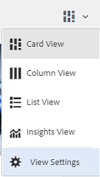
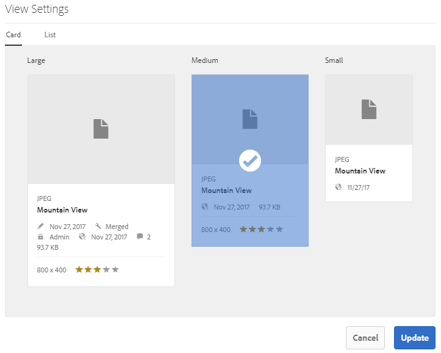
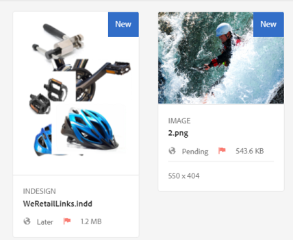
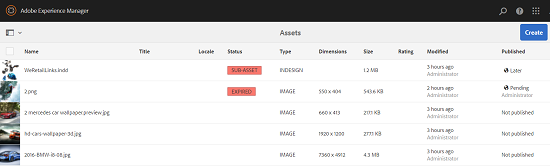
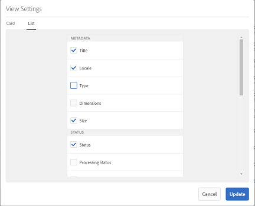
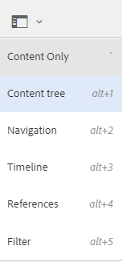
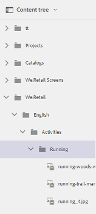

# User experience enhancements in Assets {#user-experience-enhancements-in-assets}

AEM 6.4 Assets includes several usability improvements that provide a seamless user experience and improves productivity. The increase in the speed with which you can create/manage your go-to-market content improves the content velocity of the business.

The interface is more responsive, which helps you efficiently manage a large portfolio of assets. You can quickly search, display, sort, and smoothly scroll through a long list of items.

You can personalize the various views - Card, List, and Column views. For example, you can configure the size of thumbnails you want displayed in the Card view. For the List view, you can configure the level of detail you want to display for assets in the list. AEM 6.4 Assets includes a new Tree view that lets you conveniently navigate through the Assets repository and find your assets.

## Lazy loading {#lazy-loading}

When you browse/search for assets in AEM 6.4 Assets, up to 200 assets are displayed at a time. You can scroll through the results faster, which is especially useful when browsing through a long list of results. Because a significant number of assets are loaded at a time, the browsing experience is smooth.

If you tap/click an asset to review its details page, you can return to the results page simply by tapping/clicking the Back button in the toolbar.

## Card view improvements {#card-view-improvements}

Depending upon the device you use and the amount of detail you require, you can resize the asset thumbnails in the Card view. This way, you can personalize your view and control the number of thumbnails that is displayed.

To resize thumbnails in the Card view, perform these steps:

1. Tap/click the Layout icon from the toolbar, and then choose the **[!UICONTROL View Settings]** option.

   

1. From the **[!UICONTROL View Settings]** dialog, select the desired thumbnail size, and then tap/click **[!UICONTROL Update]**.

   

1. Review the thumbnails that are displayed in the chosen size.

   

The tile in the Card view now displays additional information, such as publication status.

## List view improvements {#list-view-improvements}

In the List view, the first column now displays the filenames of assets by default. Additional information, such as publication and processing status and locale are also displayed.

You can choose to configure the amount of detail you want to display. Tap/click the Layout icon, choose the **[!UICONTROL View Settings]** option, and specify the columns you want displayed in the **[!UICONTROL View Settings]** dialog.

## Column view improvements {#column-view-improvements}

In addition to Card and List views, you can now navigate to the details page of an asset from the Column view. Select an asset from the Column view, and then tap/click **[!UICONTROL More Details]** under the asset snapshot.

## Tree view {#tree-view}

AEM 6.4 Assets includes a Tree view that lets you conveniently browse your asset hierarchy and navigate to the desired asset or folder.

To open the Tree view, tap/click the GlobalNav icon in the `Assets UI`, and choose **[!UICONTROL Content tree]** from the menu.

From the content hierarchy, navigate to the desired asset.

## Navigating asset details {#navigating-asset-details}

The asset details page now includes Previous and Next buttons in the toolbar so you can view all the images in a folder in succession.

Depending on your device, you can also swipe or use the arrow keys on keyboard to move back and forth between images.

Depending upon the chose layout, you can open the details page for an asset in the following ways:

| **View** |**How to open the asset details page** |
|---|---|
| Card view |Tap/click the asset til.  |
| List view |Tap/click on the row entry for the asset in the list. |
| Column view |Tap/click the **[!UICONTROL More Details]** button from the asset snapshot. |

Use the Previous/Next buttons to move back and forth between the assets.

