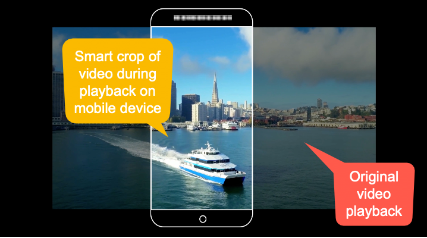
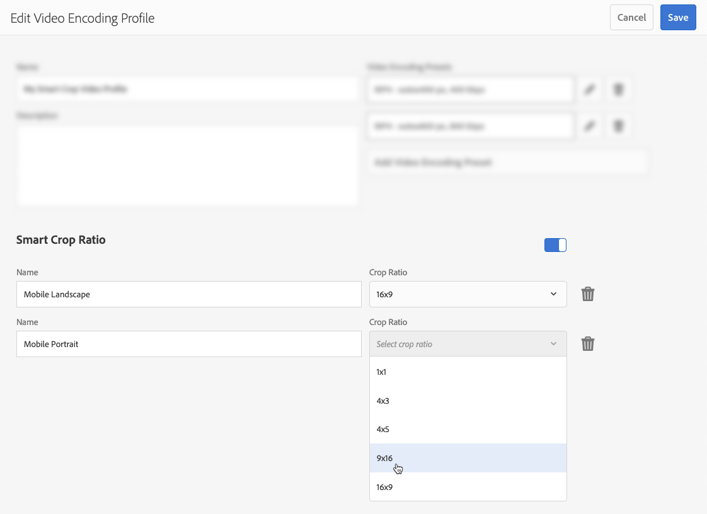
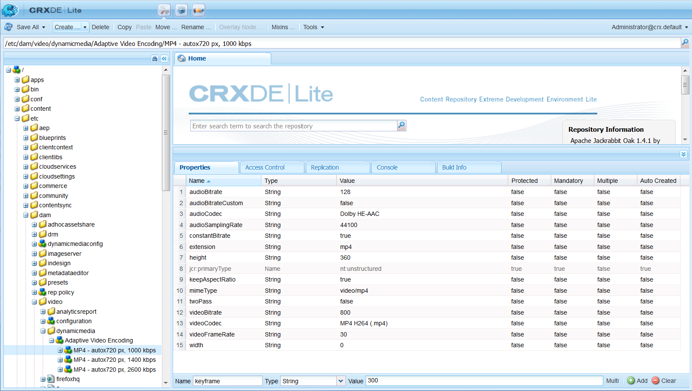
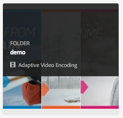
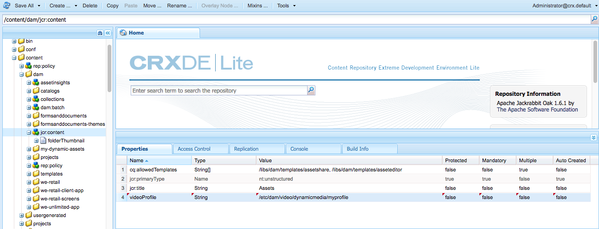

# Video profiles {#video-profiles}

Dynamic Media already comes with a predefined Adaptive Video Encoding profile. The settings in this out-of-the-box profile are optimized to give your customers the best viewing experience possible. When you encode your primary source videos using the Adaptive Video Encoding profile, during playback the video player automatically adjusts the quality of the video stream based on the Internet connection speed of your customers. This functionality is known as adaptive bitrate streaming.

The following are other factors that determine the quality of your videos:

* **Resolution of the uploaded primary source video**

  If the MP4 video was recorded at a lower resolution, such as 240p or 360p, it cannot be streamed in high definition.

* **Video player size**

  By default, the "Width" in the Adaptive Video Encoding profile is set to "Auto." Again, during playback, the best quality is used based on the size of the player.

See [Best Practices for Video Encoding](/help/assets/video.md#best-practices-for-encoding-videos).

See also [Best Practices for Organizing your Digital Assets for using Processing Profiles](/help/assets/organize-assets.md).

>[!NOTE]
>
>To generate a video's metadata and associated video image thumbnails, the video itself must go through the encoding process in Dynamic Media. In Adobe Experience Manager, the **[!UICONTROL Dynamic Media Encode Video]** workflow encodes video if you have enabled Dynamic Media and set up video cloud services. This workflow captures workflow process history and failure information. See [Monitor video encoding and YouTube publishing progress](/help/assets/video.md#monitoring-video-encoding-and-youtube-publishing-progress). If you have enabled Dynamic Media and set up video cloud services, the **[!UICONTROL Dynamic Media Encode Video]** workflow automatically takes effect when you upload a video. (If you are not using Dynamic Media, the **[!UICONTROL DAM Update Asset]** workflow takes effect.)
>
>Metadata is useful when you are searching for assets. The thumbnails are static video images that are generated during encoding. They are required by the Experience Manager system and used in the user interface to help you visually identify videos in the Cards view, Search Results view, and the Asset List view. You can see the generated thumbnails when you select the Renditions icon (paint palette) of an encoded video.

When you are done creating the video profile, you apply it to a folder or multiple folders. See [Apply a video profile to folders](#applying-a-video-profile-to-folders).

To define advanced processing parameters for other asset types, see [Configure asset processing](/help/assets/config-dms7.md#configuring-asset-processing).

See also [Profiles for processing Metadata, Images, and Videos](processing-profiles.md).

## Adaptive video encoding presets {#adaptive-video-encoding-presets}

The following table identifies best practice encoding profiles for adaptive video streaming to mobile and tablet devices, and desktop computers. You can use these presets for any aspect ratio video.

<table>
 <tbody>
  <tr>
   <td><strong>Video Format Codec</strong></td>
   <td><strong>Video Size- Width (px)</strong></td>
   <td><strong>Video Size- Height (px)</strong></td>
   <td><strong>Keep Aspect Ratio?</strong></td>
   <td><strong>Video Bitrate (Kbps)</strong></td>
   <td><strong>Video Frame Rate (Fps)</strong></td>
   <td><strong>Audio Codec</strong></td>
   <td><strong>Audio Bitrate (Kbps)</strong></td>
  </tr>
  <tr>
   <td>
MP4 H.264 (mp4)
 </td>
   <td>auto</td>
   <td>360</td>
   <td>Yes</td>
   <td>730</td>
   <td>30</td>
   <td>Dolby HE-AAC</td>
   <td>128</td>
  </tr>
  <tr>
   <td>
MP4 H.264 (mp4)
 </td>
   <td>auto</td>
   <td>540</td>
   <td>Yes</td>
   <td>2000  </td>
   <td>30</td>
   <td>Dolby HE-AAC</td>
   <td>128</td>
  </tr>
  <tr>
   <td>
MP4 H.264 (mp4)
 </td>
   <td>auto</td>
   <td>720  </td>
   <td>Yes</td>
   <td>3000  </td>
   <td>30</td>
   <td>Dolby HE-AAC</td>
   <td>128</td>
  </tr>
 </tbody>
</table>

## About using smart crop in video profiles {#about-smart-crop-video}

Smart crop for video &ndash; an optional feature available in Video Profiles&ndash; is a tool that uses the power of artificial intelligence in Adobe Sensei. It automatically detects and crops the focal point in any adaptive video or progressive video that you have uploaded, regardless of size. 

Supported video formats for smart cropping include MP4, MKV, MOV, AVI, FLV, and WMV.

The maximum supported video file size for smart crop is the following criteria:

* Duration of five minutes.
* 30 frames per second (FPS).
* 300-MB file size.

Adobe Sensei is limited to 9000 frames. That is, five minutes at 30 FPS. If your video has a higher FPS, the maximum supported video duration decreases. For example, a 60 FPS video must be two and a half minutes long to be supported by Adobe Sensei and smart crop.

>[!IMPORTANT]
>
>For video smart crop to work, you must include one or more video encoding presets with your video profile.

To use smart crop for video, you create an adaptive or progressive video encoding profile. As part of your profile, use the **[!UICONTROL Smart Crop Ratio]** tool to select pre-defined aspect ratios. As an example, after you define your video encoding presets, you can add a "Mobile Landscape" definition with an aspect ratio of 16x9, and a "Mobile Portrait" definition with an aspect ratio of 9x16. Other aspect or crop ratios from which you can choose include 1x1, 4x3, and 4x5.

You can toggle video smart crop in the video profile to either on or off using the slider to the far right of **[!UICONTROL Smart Crop Ratio]** in the user interface.  

After you create and save your video profile, you can apply it to the folders you want.

See [Apply video profiles to specific folders](#applying-video-profiles-to-specific-folders) or [Apply a video profile globally](#applying-a-video-profile-globally). 

See also [Smart crop for images](image-profiles.md).

## Create a video profile for adaptive bitrate streaming {#creating-a-video-encoding-profile-for-adaptive-streaming}

Dynamic Media already comes with a predefined Adaptive Video Encoding profile-a group of video upload settings for MP4 H.264-that is optimized for the best viewing experience. You can use this profile when you upload your videos.

However, if this predefined profile does not meet your needs, you can choose to create your own adaptive video encoding profile. When you use the setting **[!UICONTROL Encode for adaptive streaming]** &ndash; as a best practice &ndash; all encoding presets that you add to the profile are validated to ensure that all videos have the same aspect ratio. In addition, the encoded videos are treated as a multi-bitrate set for streaming.

When you create the video encoding profile, notice that most encoding options are pre-populated with recommended default settings to help you. However, if you select a value other than the recommended default, it can result in poor video quality during playback and other performance issues.

So, for all MP4 H.264 video encoding presets in the profile, the following values are validated to ensure that they are the same across individual encoding presets in the profile, making adaptive bitrate streaming possible:

* Video Format Codec - MP4 H.264 (.mp4)
* Audio Codec
* Audio Bitrate
* Keep Aspect Ratio
* Two Pass Encoding
* Constant Bitrate
* H264 Profile
* Audio Sampling Rate

If the values are not the same, you can continue creating the profile as is. However, adaptive bitrate streaming is not possible. Instead, users experience single-bitrate streaming. It is recommended that you edit the encoding settings to use the same values across individual encoding presets in the profile. (The video profile/preset editor enforces parity of the adaptive video encoding settings if **[!UICONTROL Encode for adaptive streaming]** is enabled.)

See also [Create a video encoding profile for progressive streaming](#creating-a-video-encoding-profile-for-progressive-streaming).

See also [Best practices for video encoding](/help/assets/video.md#best-practices-for-encoding-videos).

To define advanced processing parameters for other asset types, see [Configure asset processing](/help/assets/config-dms7.md#configuring-asset-processing).

**To create a video profile for adaptive bitrate streaming**,

1. Select the Experience Manager logo and navigate to **[!UICONTROL Tools]** > **[!UICONTROL Assets]** > **[!UICONTROL Video Profiles]**.
1. Select **[!UICONTROL Create]** to add a video profile.

1. Enter a name and description for the profile.
1. On the Create/Edit Video Encoding Presets page, select **[!UICONTROL Add Video Encoding Preset]**.
1. On the **[!UICONTROL Basic]** tab, set the video and audio options.
   Select the information icon next to each option for additional descriptions or recommended settings based on the selected video format codec.
1. Under the Video Size heading, ensure that **[!UICONTROL Keep aspect ratio]** is checked.
1. Set the video frame size resolution in pixels. Use the **[!UICONTROL Auto]** value to automatically scale to match the source aspect ratio (width to height ratio). For example, Auto x 480 or 640 x Auto.

1. Do one of the following:

    * In the **[!UICONTROL Width]** field, enter **[!UICONTROL auto]**. In the **[!UICONTROL Height]** field, enter a value in pixels.

    * To help you visualize the size of the video, select the Information icon (i) to the right of **[!UICONTROL Height]** to open the Size Calculator page. Use **[!UICONTROL Size Calculator]** to set the video dimensions (represented by the blue box) you want. Select **[!UICONTROL X]** in the upper-right corner when you are done.

1. (Optional) Select the **[!UICONTROL Advanced]** tab and ensure that the **[!UICONTROL Use Default Values]** check box is selected (recommended). Alternatively, modify advanced video and audio settings.
1. In the upper-right corner of the page, select **[!UICONTROL Save]** to save the preset.
1. Do one of the following:
    * Repeat steps 4-10 to create additional encoding presets. (Adaptive video streaming requires more than one video preset.)
    * Continue to the next step.

1. (Optional) To add video smart crop to the videos that this profile is applied to, do the following:
    * On the Edit Video Profile page, to the right of the Smart Crop Ratio heading, select **[!UICONTROL Add New]**.
    * In the Name field, type a name for the crop ratio that helps you easily identify it.
    * From the **[!UICONTROL Crop Ratio]** drop-down list, select the ratio you want to use.

1. Do one of the following:

    * Continue adding new crop ratios as needed.
    * Continue to the next step.

1. In the upper-right corner of the page, select **[!UICONTROL Save]** again to save the profile.

You can now apply the profile to folders that contain videos. See [Apply a video profile to folders](#applying-a-video-profile-to-folders) or [Apply a video profile globally](#applying-a-video-profile-globally).

## Create a video profile for progressive streaming {#creating-a-video-encoding-profile-for-progressive-streaming}

If you choose not to use the option **[!UICONTROL Encode for adaptive streaming]**, all encoding presets that you add to the profile are treated as individual video renditions for single-bitrate streaming or progressive video delivery. Also, there is no validation to ensure that all the video renditions have the same aspect ratio.

Depending on which mode you are running, the supported video format codecs are the following:

* Dynamic Media-Scene7 mode: H.264 (.mp4)
* Dynamic Media-Hybrid mode: H.264 (.mp4), WebM

See also [Create a video encoding profile for adaptive bitrate streaming](#creating-a-video-encoding-profile-for-adaptive-streaming).

See also [Best practices for video encoding](/help/assets/video.md#best-practices-for-encoding-videos).

To define advanced processing parameters for other asset types, see [Configure asset processing](/help/assets/config-dms7.md#configuring-asset-processing).

**To create a video profile for progressive streaming:**

1. Select the Experience Manager logo and navigate to **[!UICONTROL Tools]** > **[!UICONTROL Assets]** > **[!UICONTROL Video Profiles]**.
1. Select **[!UICONTROL Create]** to add a video profile.
1. Enter a name and description for the profile.
1. On the Create/Edit Video Encoding Presets page, select **[!UICONTROL Add Video Encoding Preset]**.
1. On the **[!UICONTROL Basic]** tab, set the video and audio options.
   Select the information icon next to each option for additional descriptions or recommended settings based on the selected video format codec.
1. (Optional) Under the Video Size heading, uncheck **[!UICONTROL Keep aspect ratio]**.
1. Do the following:
    * In the **[!UICONTROL Width]** field, enter **[!UICONTROL auto]**.
    * In the **[!UICONTROL Height]** field, enter a value in pixels.
        To help you visualize the size of the video, select the Height's information icon to open the **[!UICONTROL Size Calculator]** page. Use the **[!UICONTROL Size Calculator]** page to further set the video dimension (blue box) how you want. When you are done, in the upper-right corner of the dialog box, select **[!UICONTROL X]**.
1. (Optional) Do one of the following:

    * Select the **[!UICONTROL Advanced]** tab, and make sure that the **[!UICONTROL Use Default Values]** check box is selected (recommended).

    * Clear the **[!UICONTROL Use Default Values]** check box and specify the video settings and audio settings you want.
      Select the information icon next to each option for additional descriptions or recommended settings based on the selected video format codec.

1. In the upper-right corner of the page, select **[!UICONTROL Save]** to save the preset.
1. Do one of the following:

    * Repeat steps 4-9 to create additional encoding presets.
    * Continue to the next step.

1. (Optional) To add video smart crop to the videos that this profile is applied to, do the following:

    * On the Edit Video Profile page, to the right of the Smart Crop Ratio heading, select **[!UICONTROL Add New]**.
    * In the Name field, type a name for the crop ratio that helps you easily identify it.
    * From the **[!UICONTROL Crop Ratio]** drop-down list, select the ratio you want to use.

1. Do one of the following:

    * Continue adding new crop ratios as needed.
    * Continue to the next step.

1. In the upper-right corner of the page, select **[!UICONTROL Save]** to save the profile.

You can now apply the profile to folders that contain videos. See [Applying a video profile to folders](#applying-a-video-profile-to-folders) or [Applying a video profile globally](#applying-a-video-profile-globally).

## Use custom-added video encoding parameters {#using-custom-added-video-encoding-parameters}

You can edit an existing video encoding profile to take advantage of advanced video encoding parameters that are not found in the user interface when you create or edit a Video Profile in Experience Manager. Add one or more advanced parameters &ndash; such as minBitrate and maxBitrate &ndash; to your existing profile.

**To use custom-added video encoding parameters:**

1. Select the Experience Manager logo, then navigate to **[!UICONTROL Tools]** > **[!UICONTROL General]** > **[!UICONTROL CRXDE Lite]**.
1. From the CRXDE Lite page, in the Explorer panel on the left, navigate to the following:

   `/conf/global/settings/dam/dm/presets/video/*name_of_video_encoding_profile_to_edit`

1. In the panel on the lower-right side of the page, from the Properties tab, specify the **[!UICONTROL Name]**, **[!UICONTROL Type]**, and **[!UICONTROL Value]** of the parameter you want to use.

   The following advanced parameters are available to use:

<table>
 <tbody>
  <tr>
   <td><strong>Name</strong></td>
   <td><strong>Description</strong>  </td>
   <td><strong>Type</strong>  </td>
   <td><strong>Value</strong></td>
  </tr>
  <tr>
   <td><code>h264Level</code></td>
   <td>H.264 level to use for encoding. Normally this parameter is automatically determined based on the encoding settings you are using.</td>
   <td><code>String</code></td>
   <td>
10 * h264 level
 
For example, 3.0 = 30, 1.3 = 13)
 
No default value.
 </td>
  </tr>
  <tr>
   <td><code>keyframe</code></td>
   <td>The target number of frames between keyframes. Calculate this value so it can generate a keyframe every 2-10 seconds. For example, at 30 frames per second, the keyframe interval should be 60-300.    Lower keyframe intervals improve stream seeking and stream switching behavior for adaptive video encodings and may also improve the quality for videos that have lot of motion. However, because keyframes increase a file's size, a lower keyframe interval usually results in lower overall video quality at a given bitrate.</td>
   <td><code>String</code></td>
   <td>
Positive number.
 
Default is 300.
 
Recommended value for DASH or HLS is 60-90. (To use DASH for your videos, it must first be enabled on your account. See <a href="/help/assets/video.md#enable-dash">Enable DASH on your account</a>.)
 </td>
  </tr>
  <tr>
   <td><code>minBitrate</code></td>
   <td>
Minimum bitrate to allow for variable bitrate encodings, in Kbps (kilobits per second).
 
This parameter only applies when<strong> Use Constant Bitrate</strong> is deselected in the Advanced tab when you create or edit a video encoding profile.
 
See also <a href="/help/assets/video.md#bitrate">Bitrate</a>.
 </td>
   <td><code>String</code></td>
   <td>
Positive number, in Kbps.
 
No default value.
 </td>
  </tr>
  <tr>
   <td><code>maxBitrate</code></td>
   <td>
Maximum bitrate to allow for variable bitrate encodings, in Kbps.
 
This parameter only applies when<strong> Use Constant Bitrate</strong> is deselected in the Advanced tab when you create or edit a video encoding profile.
 
See also <a href="/help/assets/video.md#bitrate">Bitrate</a>.
 </td>
   <td><code>String</code></td>
   <td>
Positive number, in Kbps.
 
No default value. However, the recommended value is up to two times of the encoding bitrate.
 </td>
  </tr>
  <tr>
   <td><code>audioBitrateCustom</code></td>
   <td>Set value to <code>true</code> to force a constant bitrate for the audio stream, if supported by audio codec.</td>
   <td><code>String</code></td>
   <td>
<code>true</code>/<code>false</code>
 
Default is <code>false</code>.
 
Recommended value for DASH or HLS is <code>false</code>. (To use DASH for your videos, it must first be enabled on your account. See <a href="/help/assets/video.md#enable-dash">Enable DASH on your account</a>.)
 
 
 </td>
  </tr>
 </tbody>
</table>

   

1. Near the lower-right corner of the page, select **[!UICONTROL Add]**.
1. Do one of the following:

    * Repeat steps 3 and 4 to add another parameter to your video encoding profile.
    * Near the upper-left corner of the page, select **[!UICONTROL Save All]**.

1. In the upper-left corner of the CRXDE Lite page, select the **[!UICONTROL Back Home]** icon to return to Experience Manager.

### Edit a video profile {#editing-a-video-encoding-profile}

You can edit any video profile that you have created to add, edit, or delete video presets within that profile.

By default, you cannot edit the predefined, out-of-the-box **[!UICONTROL Adaptive Video Encoding]** profile that came with Dynamic Media. Instead, you can easily copy the profile and save it with a new name. You can then edit the desired presets in the copied profile.

See also [Best practices for video encoding](/help/assets/video.md#best-practices-for-encoding-videos).

To define advanced processing parameters for other asset types, see [Configure asset processing](/help/assets/config-dms7.md#configuring-asset-processing).

**To edit a video profile:**

1. Select the Experience Manager logo and navigate to **[!UICONTROL Tools]** > **[!UICONTROL Assets]** > **[!UICONTROL Video Profiles]**.
1. On the Video Profiles page, check one video profile name.
1. On the toolbar, select **[!UICONTROL Edit]**.
1. On the Video Encoding Profile page, edit the name and description, as desired.
1. As a best practice, ensure that the **[!UICONTROL Encode for adaptive bitrate streaming]** check box is selected.
   Select the information icon for a description of adaptive bitrate streaming. (If you are editing a progressive video profile, do not select this check box.)
1. Under the Video Encoding Presets heading, add, edit, or delete video encoding presets that make up the profile.

   Select the information icon next to each option on the **[!UICONTROL Basic]** and **[!UICONTROL Advanced]** tabs for additional descriptions or recommended settings based on the selected video format codec.

1. In the upper-right corner ofthepage, select **[!UICONTROL Save]**.

### Copy a video profile {#copying-a-video-encoding-profile}

1. Select the Experience Manager logo and navigate to **[!UICONTROL Tools]** > **[!UICONTROL Assets]** > **[!UICONTROL Video Profiles]**.
1. On the Video Profiles page, check one video profile name.
1. On the toolbar, select **[!UICONTROL Copy]**.
1. On the Video Encoding Profile page, enter a new name for the profile.
1. As a best practice, ensure that the **[!UICONTROL Encode for adaptive streaming]** check box is selected. Select the information icon for a description of adaptive bitrate streaming. (If you are copying a progressive video profile, do not select the check box.)

   In Dynamic Media - Hybrid mode, if a WebM video preset is part of the video profile, then **[!UICONTROL Encode for adaptive streaming]** is not possible because all presets must be MP4.
1. Under the Video Encoding Presets heading, add, edit, or delete video encoding presets that make up the profile.

   Select the information icon next to each option on the Basic and Advanced tabs for recommended settings and descriptions.

1. In the upper-right corner ofthepage, select **[!UICONTROL Save]**.

### Delete a video profile {#deleting-a-video-encoding-profile}

1. Select the Experience Manager logo and navigate to **[!UICONTROL Tools]** > **[!UICONTROL Assets]** > **[!UICONTROL Video Profiles]**.
1. On the Video Profiles page, check one or more video profile names.
1. On the toolbar, select **[!UICONTROL Delete]**.
1. Select **[!UICONTROL OK]**.

## Apply a video profile to folders {#applying-a-video-profile-to-folders}

When you assign a video profile to a folder, any subfolders automatically inherit the profile from its parent folder. This rule means that you can assign only one video profile to a folder. As such, consider carefully the folder structure of where you upload, store, use, and archive assets.

If you assigned a different video profile to a folder, the new profile overrides the previous profile. The previously existing folder assets remain unchanged. The new profile is applied on the assets that are added to the folder later.

Folders that have a profile assigned to it are indicated in the user interface by the appearance of the profile name in the card name.

You can apply video profiles to specific folders or globally to all assets.

You can reprocess assets in a folder that already has an existing video profile that you later changed. See [Reprocess assets in a folder after you have edited its processing profile](processing-profiles.md#reprocessing-assets).

### Apply a video profile to specific folders {#applying-video-profiles-to-specific-folders}

You can apply a video profile to a folder from within the **[!UICONTROL Tools]** menu or if you are in the folder, from the **[!UICONTROL Properties]**. This section describes how to apply video profiles to folders both ways.

Folders that have a profile already assigned to it are indicated by the display of the profile's name directly below the folder name.

See also [Reprocess assets in a folder after you have edited its processing profile](processing-profiles.md#reprocessing-assets).

#### Apply a video profile to folders by way of the Profiles user interface {#applying-video-profiles-to-folders-by-way-of-the-profiles-user-interface}

1. Select the Experience Manager logo and navigate to **[!UICONTROL Tools]** > **[!UICONTROL Assets]** > **[!UICONTROL Video Profiles]**.
1. Select the video profile that you want to apply to a folder or multiple folders.
1. Select **[!UICONTROL Apply Profile to Folders]** and select the folder or multiple folders you want use to receive the newly uploaded assets and select **[!UICONTROL Apply]**. Folders that have a profile already assigned to it are indicated by the display of the profile's name directly below the folder name while in **[!UICONTROL Card View]**.
    You can [monitor the progress of a video profile processing job](#monitoring-the-progress-of-an-encoding-job).

#### Apply a video profile to folders from Properties {#applying-video-profiles-to-folders-from-properties}

1. Select the Experience Manager logo and navigate to **[!UICONTROL Assets]** and then to the folder that you want to apply a video profile to.
1. On the folder, select the check mark to select it and then select **[!UICONTROL Properties]**.
1. Select the **[!UICONTROL Video Profiles]** tab and select the profile from the drop-down menu and select **[!UICONTROL Save & Close]**. Folders that have a profile already assigned to it are indicated by the display of the profile's name directly below the folder name.

   
You can [monitor the progress of a video profile processing job](#monitoring-the-progress-of-an-encoding-job).

### Applying a video profile globally {#applying-a-video-profile-globally}

In addition to applying a profile to a folder, you can also apply one globally so that any content uploaded into Experience Manager Assets in any folder has the selected profile applied.

See also [Reprocess assets in a folder after you have edited its processing profile](processing-profiles.md#reprocessing-assets).

**To apply a video profile globally:**

* Navigate to CRXDE Lite to the following node: `/content/dam/jcr:content`. Add the property `videoProfile:/libs/settings/dam/video/dynamicmedia/<name of video encoding profile>` and select **[!UICONTROL Save All]**.

  
* You can [monitor the progress of a video profile processing job](#monitoring-the-progress-of-an-encoding-job).

## Monitor the progress of a video profile processing job {#monitoring-the-progress-of-an-encoding-job}

A processing indicator (or progress bar) is displayed so you can visually monitor the progress of a video profile processing job.

You can also view the `error.log` file to monitor the progress of an encoding job, to see if encoding is finished, or to see any job errors. The `error.log` is found in the `logs` folder where your instance of Experience Manager is installed.

## Remove a video profile from folders {#removing-a-video-profile-from-folders}

When you remove a video profile from a folder, any subfolders automatically inherit the removal of the profile from its parent folder. However, any processing of files that has occurred within the folders remains intact.

You can remove a video profile from a folder from within the **[!UICONTROL Tools]** menu or if you are in the folder, from the **[!UICONTROL Folder Settings]**. This section describes how to remove video profiles from folders both ways.

### Remove a video profile from folders by way of the Profiles user interface {#removing-video-profiles-from-folders-by-way-of-the-profiles-user-interface}

1. Select the Experience Manager logo and navigate to **[!UICONTROL Tools]** > **[!UICONTROL Assets]** > **[!UICONTROL Video Profiles]**.
1. Select the video profile that you want to remove from a folder or multiple folders.
1. Select **[!UICONTROL Remove Profile from Folders]** and select the folder or multiple folders you want use to remove the profile from and select **[!UICONTROL Remove]**.

   You can confirm that the video profile is no longer applied to a folder because the name no longer appears below the folder name.

### Remove a video profile from folders by way of Properties {#removing-video-profiles-from-folders-by-way-of-properties}

1. Select the Experience Manager logo and navigate to **[!UICONTROL Assets]** and then to the folder that you want to remove a video profile from.
1. On the folder, select the check mark, and then select **[!UICONTROL Properties]**.
1. Select the **[!UICONTROL Video Profiles]** tab and select **[!UICONTROL None]** from the drop-down menu and select **[!UICONTROL Save & Close]**. Folders that have a profile already assigned to it are indicated by the display of the profile's name directly below the folder name.
