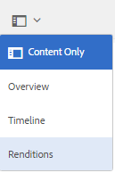
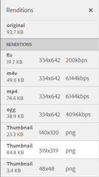

# Video renditions {#video-renditions}

Adobe Experience Manager Assets generates video renditions for video assets of various formats including OGG, FLV, and so on.

Experience Manager Assets supports static and dynamic renditions (DM-encoded renditions) for media assets.

Static renditions are generated natively using FFMPEG (installed and available on the system path) and stored in the content repository.

The DM-encoded renditions are stored in the proxy server and served at runtime.

Experience Manager Assets provide playback support for these renditions on the client side.

To view the renditions of a particular video asset, open its asset page, and select the Global Navigation icon. Then, choose **[!UICONTROL Renditions]** from the list.

The list of video renditions is displayed in the **[!UICONTROL Renditions]** panel.

To configure the proxy server for DM-encoded renditions, [configure Dynamic Media Cloud services](config-dynamic.md).

To generate video renditions with desired parameters, [create a corresponding video profile](video-profiles.md).

After you configure the proxy server and create video profiles, you can include this video preset in a processing profile and apply the processing profile to a folder.

>[!NOTE]
>
>Audio playback does not work for OGG and WAV files on Microsoft&reg; Internet Explorer 11. An error `Invalid Source` displays up on the asset details page for assets with extension OGG or WAV.
>
>On MS&reg; Edge and iPad, OGG files do not play and raise an unsupported format error.
