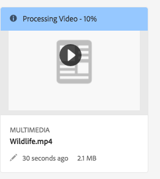
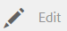

# Video{#video}

This section describes working with video in Dynamic Media.

## Quick Start: Videos {#quick-start-videos}

The following step-by-step workflow description is designed to help you get up and running quickly with adaptive video sets in Dynamic Media. After each step are cross-references to topic headings where you can find more information.

>[!NOTE]
>
>Before you work with video in Dynamic Media, make sure that your AEM admininistrator has already enabled and configured Dynamic Media Cloud Services in either Dynamic Media - Scene7 mode or Dynamic Media - Hybrid mode.
>
>* See [Configuring Dynamic Media Cloud Services](/help/assets/config-dms7.md#configuring-dynamic-media-cloud-services) in Configuring Dynamic Media - Scene7 mode and [Troubleshooting Dynamic Media - Scene7 mode.](/help/assets/troubleshoot-dms7.md)
>
>* See [Configuring Dynamic Media Cloud Services](/help/assets/config-dynamic.md#configuring-dynamic-media-cloud-services) in Configuring Dynamic Media - Hybrid mode.
>

1. **Upload your Dynamic Media videos** by doing the following:

    * Create your own video encoding profile. Or, you can simply use the predefined "Adaptive Video Encoding" profile that comes with Dynamic Media.

        * [Creating a video encoding profile](/help/assets/video-profiles.md#creating-a-video-encoding-profile-for-adaptive-streaming).
        * Learn more about [Best practices for video encoding](#best-practices-for-encoding-videos).

    * Associate the video processing profile to one or more folders where you are going to upload your master videos.

        * [Applying a video profile to folders](/help/assets/video-profiles.md#applying-a-video-profile-to-folders).
        * Learn more about [Best practices for organizing your digital assets for using processing profiles](/help/assets/best-practices-for-file-management.md).
        * Learn more about [Organizing digital assets](/help/assets/organize-assets.md).

    * Upload your master videos to the folders. You can upload video files that are up to 20 GB each. When you add videos to the folder, they are encoded according to the video processing profile that you assigned to the folder.

        * [Upload your videos](/help/assets/managing-video-assets.md#uploadingandpreviewingvideoassets).
        * Learn more about [Supported input file formats](/help/assets/assets-formats.md#supported-multimedia-formats).

    * Monitor how [video encoding is progressing](#monitoring-video-encoding-and-youtube-publishing-progress) either from the asset or workflow view.

1. **Manage your Dynamic Media videos** by doing any of the following:

    * Organize, browse, and search video assets

        * [Organizing digital assets](/help/assets/organize-assets.md)
          Learn more about [Best practices for organizing your digital assets for using processing profiles](/help/assets/best-practices-for-file-management.md)

        * [Searching video assets](/help/assets/search-video-assets.md) or [Searching assets](/help/assets/managing-assets-touch-ui.md#searchingassets)

    * Preview and publish video assets

        * View the source video and encoded renditions of the video along with its associated thumbnails:
          [Previewing videos](/help/assets/managing-video-assets.md#uploadingandpreviewingvideoassets) or [Previewing assets](/help/assets/previewing-assets.md)
          [Viewing video renditions](/help/assets/video-renditions.md)
          [Managing video renditions](/help/assets/managing-assets-touch-ui.md#managing-renditions)

        * [Manage viewer presets](/help/assets/managing-viewer-presets.md)
        * [Publishing assets](/help/assets/publishing-dynamicmedia-assets.md)

    * Work with video metadata

        * View the properties of an encoded video rendition such as frame rate, audio and video bitrate, and codec:
          [Viewing video rendition properties](/help/assets/video-renditions.md)

        * Edit the properties of video such as the title, description, and tags, custom metadata fields:
          [Editing video properties](/help/assets/managing-assets-touch-ui.md#editing-properties)

        * [Managing metadata for digital assets](/help/assets/metadata.md)
        * [Metadata schemas](/help/assets/metadata-schemas.md)

    * Review, approve, and annotate videos, and maintain full version control

        * [Annotating videos](/help/assets/managing-video-assets.md#annotatingvideoassets) or [Annotating assets](/help/assets/managing-assets-touch-ui.md#annotating)

        * [Creating a version](/help/assets/managing-assets-touch-ui.md#asset-versioning)
        * [Applying workflows to assets](/help/assets/assets-workflow.md) or see [Starting a workflow on an asset](/help/assets/managing-assets-touch-ui.md#starting-a-workflow-on-an-asset)

        * [Review folder assets](/help/assets/bulk-approval.md)
        * [Projects](/help/sites-authoring/projects.md)

1. **Publish your Dynamic Media videos** by doing one of the following:

    * If you are using Adobe Experience Manager as your web content management system you can add videos directly to your web pages.

        * [Adding videos to your web pages](/help/assets/adding-dynamic-media-assets-to-pages.md).

    * If you are using a third-party web content management system, you can link or embed videos to your web pages.

        * Integrate video using URL:
          [Linking URLs to your web application](/help/assets/linking-urls-to-yourwebapplication.md).

        * Integrate video using embed code on web page:
          [Embedding the video viewer on a web page](/help/assets/embed-code.md).

    * [Publishing videos to YouTube](#publishing-videos-to-youtube).
    * [Generating video reports](#viewing-video-reports).

    * [Adding captions to video](#adding-captions-to-video).

## Working with video in Dynamic Media {#working-with-video-in-dynamic-media}

Video in Dynamic Media is an end-to-end solution that makes it easy to publish high-quality Adaptive Video for streaming across multiple screens, including desktop, iOS, Android, Blackberry, and Windows mobile devices. An Adaptive Video Set groups versions of the same video that are encoded at different bit rates and formats such as 400 kbps, 800 kbps, and 1000 kbps. The desktop computer or mobile device detects the available bandwidth.

For example, on an iOS mobile device, it detects a bandwidth such as 3G, 4G, or Wi-Fi. Then, it automatically selects the right encoded video from among the various video bit rates within the Adaptive Video Set. The video is streamed to desktops, mobile devices, or tablets.

In addition, video quality is dynamically switched automatically if network conditions change on the desktop or on the mobile device. Also, if a customer enters full-screen mode on a desktop, the Adaptive Video Set responds by using a better resolution, thereby improving the customer’s viewing experience. Using Adaptive Video Sets provides you with the best possible playback for customers playing Dynamic Media video on multiple screens and devices.

The logic that a video player uses to determine which encoded video to play or to select during playback is based on the following algorithm:

1. Video player loads the initial video fragment based on the bit rate that is closest to the value that is set for "initial bitrate" in the player itself.
1. Video player switches based on changes to the bandwidth speed using the following criteria:

    1. Player picks the highest bandwidth stream below or equal to the estimated bandwidth.
    1. Player considers only 80% of the available bandwidth. However, if it is switching up, it is more conservative at only 70% to avoid overestimating and immediately switching back.

For detailed technical information about the algorithm, see [https://android.googlesource.com/platform/frameworks/av/+/master/media/libstagefright/httplive/LiveSession.cpp](https://android.googlesource.com/platform/frameworks/av/+/master/media/libstagefright/httplive/LiveSession.cpp)

For managing single video and Adaptive Video Sets, the following is supported:

* Uploading video from numerous supported video formats and audio formats and encoding video to MP4 H.264 format for playback across multiple screens. You can use predefined adaptive video presets, single video encoding presets, or customize your own encoding to control the quality and size of the video.

    * When an adaptive video set is generated, it includes MP4 videos.
    * **Note**: Master/source videos are not added to an Adaptive Video Set.

* Video captioning in all HTML5 video viewers.
* Organize, browse, and search video with full metadata support for efficient management of video assets.
* Deliver Adaptive Video Sets to the web as well as to desktops, and mobile devices, including the iPhone, iPad, Android, Blackberry, and Windows phone.

Adaptive video streaming is supported on a variety of iOS platforms. See [Scene7 Viewers Reference Guide](https://marketing.adobe.com/resources/help/en_US/s7/viewers_ref/c_html5_video_reference.html).

Dynamic Media supports mobile video playback for MP4 H.264 video. You can find Blackberry devices that support this video format at the following: [Supported video formats on Blackberry](https://support.blackberry.com/kb/articleDetail?ArticleNumber=000005482).

You can find Windows devices that support this video format at the following: [Supported video formats on Windows Phone](https://msdn.microsoft.com/library/windows/apps/ff462087%28v=vs.105%29.aspx)

* Play back the video using Dynamic Media Video Viewer Presets, including the following:

    * Single video viewers.
    * Mixed Media viewers that combine both video and image content.

* Configure video players to meet your branding needs.
* Integrate video to your website, mobile site, or mobile application with a simple URL or embed code.

See [Dynamic video playback](https://s7d9.scene7.com/s7/uvideo.jsp?asset=GeoRetail/Mop_AVS&config=GeoRetail/Universal_Video1&stageSize=640,480) sample.

See also [Viewers for AEM and Scene7](https://marketing.adobe.com/resources/help/en_US/s7/viewers_ref/c_html5_s7_aem_asset_viewers.html) and [Viewers for AEM assets only](https://marketing.adobe.com/resources/help/en_US/s7/viewers_ref/c_html5_aem_asset_viewers.html) in the Adobe Scene7 Viewers Reference Guide.

## Best practice: Using the HTML5 video viewer {#best-practice-using-the-html-video-viewer}

The Dynamic Media HTML5 Video viewer presets are robust video players. You can use them to avoid many common issues that are associated with HTML5 video playback and issues associated with mobile devices such as lack of adaptive streaming delivery and limited desktop browser reach.

On the design side of the player, you can design all of the video player’s functionality using standard web development tools. For example, you can design the buttons, controls, and custom poster image background using HTML5 and CSS to help you reach your customers with a customized appearance.

On the playback side of the viewer, it automatically detects the browser’s video capability. It then serves the video using HLS (HTTP Live Streaming), also known as adaptive video streaming. Or, if those delivery methods are not present then HTML5 progressive is used instead.

By combining into a single player the ability to design the playback components using HTML5 and CSS, have embedded playback, and use adaptive and progressive streaming depending on the browser’s capability, you extend the reach of your rich media content to both desktop and mobile users and ensure a streamlined video experience.

See also [About HTML5 Viewers](https://marketing.adobe.com/resources/help/en_US/s7/viewers_ref/c_html5_viewers_about.html) in the Adobe Scene7 Viewers Reference Guide.

### Playback of video on desktop computers and mobile devices using the HTML5 video viewer {#playback-of-video-on-desktop-computers-and-mobile-devices-using-the-html-video-viewer}

For desktop and mobile adaptive video streaming, the videos used for bit rate switching are based on all MP4 videos in the Adaptive Video Set.

Video playback occurs using either HLS or progressive video download. In prior versions of AEM, such as 6.0, 6.1, and 6.2, videos were streamed over HTTP.

However, in AEM 6.3 and on, videos are now streamed over HTTPS (that is, HLS) because the DM gateway service URL always uses HTTPS as well. Note that there is no customer impact in this default behavior. That is, video streaming will always occur over HTTPS unless it is not supported by the browser. (see the following table). Therefore,

* If you have an HTTPS website with HTTPS video streaming, streaming is fine.
* If you have an HTTP website with HTTPS video streaming, streaming is fine and there are no mixed content issues from the web browser.

HLS is an Apple standard for adaptive video streaming that automatically adjusts playback based on network bandwidth capacity. It also lets the customer “seek” to any point in the video without the need to wait for the rest of the video to download.

Progressive video is delivered by downloading and storing the video locally on a user’s desktop system or mobile device.

The following table describes the device, browser, and playback method of videos on desktop computers and mobile devices using the Scene7 Video Viewer.

<table>
 <tbody>
  <tr>
   <td><strong>Device</strong></td>
   <td><strong>Browser</strong></td>
   <td><strong>Video playback mode</strong></td>
  </tr>
  <tr>
   <td>Desktop</td>
   <td>Internet Explorer 9 and 10</td>
   <td>Progressive download.</td>
  </tr>
  <tr>
   <td>Desktop</td>
   <td>Internet Explorer 11+</td>
   <td>On Windows 8 and Windows 10 - Force use of HTTPS whenever HLS is requested. Known limitation: HTTP on HLS does not work in this browser/operating system combination<br /> <br /> On Windows 7 - Progressive download. Uses standard logic for selecting HTTP versus HTTPS protocol.</td>
  </tr>
  <tr>
   <td>Desktop</td>
   <td>Firefox 23-44</td>
   <td>Progressive download.</td>
  </tr>
  <tr>
   <td>Desktop</td>
   <td>Firefox 45 or later</td>
   <td>HLS</td>
  </tr>
  <tr>
   <td>Desktop</td>
   <td>Chrome</td>
   <td>HLS</td>
  </tr>
  <tr>
   <td>Desktop</td>
   <td>Safari (Mac)</td>
   <td>HLS</td>
  </tr>
  <tr>
   <td>Mobile</td>
   <td>Chrome (Android 6 or earlier)</td>
   <td>Progressive download.</td>
  </tr>
  <tr>
   <td>Mobile</td>
   <td>Chrome (Android 7 or later)</td>
   <td>HLS</td>
  </tr>
  <tr>
   <td>Mobile</td>
   <td>Android (default browser)</td>
   <td>Progressive download.</td>
  </tr>
  <tr>
   <td>Mobile</td>
   <td>Safari (iOS)</td>
   <td>HLS</td>
  </tr>
  <tr>
   <td>Mobile</td>
   <td>Chrome (iOS)</td>
   <td>HLS</td>
  </tr>
  <tr>
   <td>Mobile</td>
   <td>Blackberry</td>
   <td>HLS</td>
  </tr>
 </tbody>
</table>

## Architecture of Dynamic Media video solution {#architecture-of-dynamic-media-video-solution}

The following graphic shows the overall authoring workflow of videos that are uploaded and encoded by way of DMGateway (in Dynamic Media Hybrid mode) and made available for public consumption.


## Hybrid publishing architecture for videos {#hybrid-publishing-architecture-for-videos}


## Best practices for encoding videos {#best-practices-for-encoding-videos}

The **Dynamic Media Encode Video** workflow encodes video if you have enabled dynamic media and set up video cloud services. This workflow captures workflow process history and failure information. See [Monitoring video encoding and YouTube publishing progress](#monitoring-video-encoding-and-youtube-publishing-progress). If you have enabled dynamic media and set up video cloud services, the **Dynamic Media Encode Video** workflow automatically takes effect when you upload a video. (If you are not using dynamic media, the **DAM Update Asset** workflow takes effect.)

The following are best-practice tips for encoding source video files.

For advice about video encoding, see the following:

* Article: *Streaming 101: The Basics — Codecs, Bandwidth, Data Rate, and Resolution: * [www.adobe.com/go/learn_s7_streaming101_en](https://www.adobe.com/go/learn_s7_streaming101_en).
* Video: *Video Encoding Basics: * [www.adobe.com/go/learn_s7_encoding_en](https://www.adobe.com/go/learn_s7_encoding_en).

### Source video files {#source-video-files}

When you encode a video file, use a source video file of the highest possible quality. Avoid using previously encoded video files because these files are already compressed, and further encoding creates a subpar quality video.

The following table describes the recommended size, aspect ratio, and minimum bit rate that your source video files should have before you encode them:

<table>
 <tbody>
  <tr>
   <th><p>Size</p> </th>
   <th><p>Aspect ratio</p> </th>
   <th><p>Minimum bit rate</p> </th>
  </tr>
 </tbody>
 <tbody>
  <tr>
   <td valign="top" width="NaN%"><p>1024 X 768</p> </td>
   <td valign="top" width="NaN%"><p>4:3</p> </td>
   <td valign="top" width="NaN%"><p>4500 kbps for most videos.</p> </td>
  </tr>
  <tr>
   <td valign="top" width="NaN%"><p>1280 X 720</p> </td>
   <td valign="top" width="NaN%"><p>16:9</p> </td>
   <td valign="top" width="NaN%"><p>3000 - 6000 kbps, depending on the amount of motion in the video.</p> </td>
  </tr>
  <tr>
   <td valign="top" width="NaN%"><p>1920 X 1080</p> </td>
   <td valign="top" width="NaN%"><p>16:9</p> </td>
   <td valign="top" width="NaN%"><p>6000 - 8000 kbps, depending on the amount of motion in the video.</p> </td>
  </tr>
 </tbody>
</table>

### Obtaining a file's metadata {#obtaining-a-file-s-metadata}

You can obtain a file’s metadata by viewing its metadata using a video editing tool, or using an application designed for obtaining metadata. Following are instructions for using MediaInfo, a third-party application, to obtain a video file’s metadata:

1. Go to this web page: [https://mediainfo.sourceforge.net/en/Download](https://mediainfo.sourceforge.net/en/Download).
1. Select and download the installer for the GUI version, and follow the installation instructions.
1. After installation, either right-click the video file (Windows only) and select MediaInfo, or open MediaInfo and drag your video file into the application. You see all metadata associated with your video file, including its width, height, and fps.

### Aspect ratio {#aspect-ratio}

When you choose or create a video encoding preset for your master video file, make sure that the preset has the same aspect ratio as the master video file. The aspect ratio is the ratio of the width to the height of the video.

To determine the aspect ratio of a video file, obtain the file’s metadata and note the file’s width and height (see Obtaining a file's metadata above). Then use this formula to determine the aspect ratio:

width/height = aspect ratio

The following table describes how formula results translate to common aspect ratio choices:

<table>
 <tbody>
  <tr>
   <th><p>Formula result</p> </th>
   <th><p>Aspect ratio</p> </th>
  </tr>
 </tbody>
 <tbody>
  <tr>
   <td valign="top" width="NaN%"><p>1.33</p> </td>
   <td valign="top" width="NaN%"><p>4:3</p> </td>
  </tr>
  <tr>
   <td valign="top" width="NaN%"><p>0.75</p> </td>
   <td valign="top" width="NaN%"><p>3:4</p> </td>
  </tr>
  <tr>
   <td valign="top" width="NaN%"><p>1.78</p> </td>
   <td valign="top" width="NaN%"><p>16:9</p> </td>
  </tr>
  <tr>
   <td valign="top" width="NaN%"><p>0.56</p> </td>
   <td valign="top" width="NaN%"><p>9:16</p> </td>
  </tr>
 </tbody>
</table>

For example, a video that is 1440 width x 1080 height has an aspect ratio of 1440/1080, or 1.33. In this case you choose a video encoding preset with a 4:3 aspect ratio to encode the video file.

### Bitrate {#bitrate}

Bitrate is the amount of data that is encoded to make up a single second of video playback. The bitrate is measured in kilobits per second (Kbps).

>[!NOTE]
>
>Because all codecs use lossy compression, bitrate is the most important factor in video quality. With lossy compression, the more you compress a video file, the more the quality is degraded. For this reason, all other characteristics being equal (the resolution, frame rate, and codec), the lower the bitrate, the lower the quality of the compressed file.

When selecting a bitrate encoding, there are two types you can choose:

* **Constant Bitrate Encoding** (CBR) - During CBR encoding, the bitrate or the number of bits per second is kept the same throughout the encoding process. CBR encoding persists the set data rate to your setting over the entire video. Also, CBR encoding does not optimize media files for quality but does save on storage space.
  Use CBR if your video contains a similar motion level throughout the entire video. CBR is most commonly used for streaming video content. See also [Using custom-added video encoding parameters](/help/assets/video-profiles.md#using-custom-added-video-encoding-parameters).

* **Variable Bitrate Encoding** (VBR) - VBR encoding adjusts the data rate down and to the upper limit you set, based on the data required by the compressor. This means that during a VBR encoding process the bitrate of the media file dynamically increases or decreases depending on the media files bitrate needs.
  VBR takes longer to encode but produces the most favorable results; the quality of the media file is superior. VBR is most commonly used for http progressive delivery of video content.

When should you use VBR versus CRB?
When it comes to selecting VBR versus CBR, it is almost always recommended that you use VBR for your media files. VBR provides higher quality files at competitive bitrates. When you use VBR, be sure you use with two-pass encoding, and set the maximum bitrate to be 1.5x the target video bitrate.

When you choose a video encoding preset, take into account the target end user’s connection speed. Choose a preset with a data rate that is 80 percent of that speed. For example, if the target end user’s connection speed is 1000 Kbps, the best preset is one with a video data rate of 800 Kbps.

This table describes the data rate of typical connection speeds.

<table>
 <tbody>
  <tr>
   <th><p>Speed (Kbps)</p> </th>
   <th><p>Connection type</p> </th>
  </tr>
 </tbody>
 <tbody>
  <tr>
   <td valign="top" width="NaN%"><p>256</p> </td>
   <td valign="top" width="NaN%"><p>Dial-up connection.</p> </td>
  </tr>
  <tr>
   <td valign="top" width="NaN%"><p>800</p> </td>
   <td valign="top" width="NaN%"><p>Typical mobile connection. For this connection, target a data rate in the range of 400 to a maximum of 800 for 3G experiences.</p> </td>
  </tr>
  <tr>
   <td valign="top" width="NaN%"><p>2000</p> </td>
   <td valign="top" width="NaN%"><p>Typical broadband desktop connection. For this connection, target a data rate in the 800-2000 Kbps range, with most targets averaging 1200-1500 Kbps.</p> </td>
  </tr>
  <tr>
   <td valign="top" width="NaN%"><p>5000</p> </td>
   <td valign="top" width="NaN%"><p>Typical high-broadband connection. Encoding in this upper range is not recommended because video delivery at this speed is not available to most consumers.</p> </td>
  </tr>
 </tbody>
</table>

### Resolution {#resolution}

**Resolution **describes a video file’s height and width in pixels. Most source video is stored at a high resolution (for example, 1920 x 1080). For streaming purposes, source video is compressed to a smaller resolution (640 x 480 or smaller).

Resolution and data rate are two integrally linked factors that determine video quality. To maintain the same video quality, the higher the number of pixels in a video file (the higher the resolution), the higher the data rate must be. For example, consider the number of pixels per frame in a 320 x 240 resolution and a 640 x 480 resolution video file:

<table>
 <tbody>
  <tr>
   <th><p>Resolution</p> </th>
   <th><p>Pixels per frame</p> </th>
  </tr>
 </tbody>
 <tbody>
  <tr>
   <td valign="top" width="NaN%"><p>320 x 240</p> </td>
   <td valign="top" width="NaN%"><p>76,800</p> </td>
  </tr>
  <tr>
   <td valign="top" width="NaN%"><p>640 x 480</p> </td>
   <td valign="top" width="NaN%"><p>307,200</p> </td>
  </tr>
 </tbody>
</table>

The 640 x 480 file has four times more pixels per frame. To achieve the same data rate for these two example resolutions, you apply four times the compression to the 640 x 480 file, which can reduce the quality of the video. Therefore, a video data rate of 250 Kbps produces high-quality viewing at a 320 x 240 resolution, but not at a 640 x 480 resolution.

In general, the higher data rate you use, the better your video looks, and the higher resolution you use, the higher data rate you need to maintain viewing quality (compared to lower resolutions).

Because resolution and data rate are linked, you have two options when encoding video:

* Choose a data rate and then encode at the highest resolution that looks good at the data rate you chose.
* Choose a resolution and then encode at the data rate necessary to achieve high-quality video at the resolution you chose.

When you choose (or create) a video encoding preset for your master video file, use this table to target the correct resolution:

<table>
 <tbody>
  <tr>
   <th><p>Resolution</p> </th>
   <th><p>Height (pixels)</p> </th>
   <th><p>Screen size</p> </th>
  </tr>
 </tbody>
 <tbody>
  <tr>
   <td valign="top" width="NaN%"><p>240p</p> </td>
   <td valign="top" width="NaN%"><p>240</p> </td>
   <td valign="top" width="NaN%"><p>Tiny screen</p> </td>
  </tr>
  <tr>
   <td valign="top" width="NaN%"><p>300p</p> </td>
   <td valign="top" width="NaN%"><p>300</p> </td>
   <td valign="top" width="NaN%"><p>Small screen typically for mobile devices</p> </td>
  </tr>
  <tr>
   <td valign="top" width="NaN%"><p>360p</p> </td>
   <td valign="top" width="NaN%"><p>360</p> </td>
   <td valign="top" width="NaN%"><p>Small screen</p> </td>
  </tr>
  <tr>
   <td valign="top" width="NaN%"><p>480p</p> </td>
   <td valign="top" width="NaN%"><p>480</p> </td>
   <td valign="top" width="NaN%"><p>Medium screen</p> </td>
  </tr>
  <tr>
   <td valign="top" width="NaN%"><p>720p</p> </td>
   <td valign="top" width="NaN%"><p>720</p> </td>
   <td valign="top" width="NaN%"><p>Large screen</p> </td>
  </tr>
  <tr>
   <td valign="top" width="NaN%"><p>1080p</p> </td>
   <td valign="top" width="NaN%"><p>1080</p> </td>
   <td valign="top" width="NaN%"><p>High-definition large screen</p> </td>
  </tr>
 </tbody>
</table>

### Fps (Frames per second) {#fps-frames-per-second}

In the United States and Japan, most video is shot at 29.97 frames per second (fps); in Europe, most video is shot at 25 fps. Film is shot at 24 fps.

Choose a video encoding preset that matches the fps rate of your master video file. For example, if your master video is 25 fps, choose an encoding preset with 25 fps. By default, all custom encoding uses the master video file’s fps. For this reason, you do not need to explicitly specify the fps setting when you create a video encoding preset.

### Video encoding dimensions {#video-encoding-dimensions}

For optimal results, select encoding dimensions such that the source video is a whole multiple of all your encoded videos.

To calculate this ratio, you divide source width by encoded width to get the width ratio. Then, you divide source height by encoded height to get the height ratio.

If the resulting ratio is a whole integer, it means that the video is optimally scaled. If the resulting ratio is not a whole integer, it impacts video quality by leaving leftover pixel artifacts on the display. This effect is most noticeable when the video has text.

As an example, suppose that your source video is 1920 x 1080. In the following table, the three encoded videos provide the optimal encoding settings to use.

<table>
 <tbody>
  <tr>
   <th><p>Video Type</p> </th>
   <th><p>Width x Height</p> </th>
   <th><p>Width Ratio</p> </th>
   <th><p>Height Ratio</p> </th>
  </tr>
 </tbody>
 <tbody>
  <tr>
   <td valign="top" width="NaN%"><p>Source</p> </td>
   <td valign="top" width="NaN%"><p>1920 x 1080</p> </td>
   <td valign="top" width="NaN%"><p>1</p> </td>
   <td valign="top" width="NaN%"><p>1</p> </td>
  </tr>
  <tr>
   <td valign="top" width="NaN%"><p>Encoded</p> </td>
   <td valign="top" width="NaN%"><p>960 x 540</p> </td>
   <td valign="top" width="NaN%"><p>2</p> </td>
   <td valign="top" width="NaN%"><p>2</p> </td>
  </tr>
  <tr>
   <td valign="top" width="NaN%"><p>Encoded</p> </td>
   <td valign="top" width="NaN%"><p>640 x 360</p> </td>
   <td valign="top" width="NaN%"><p>3</p> </td>
   <td valign="top" width="NaN%"><p>3</p> </td>
  </tr>
  <tr>
   <td valign="top" width="NaN%"><p>Encoded</p> </td>
   <td valign="top" width="NaN%"><p>480 x 270</p> </td>
   <td valign="top" width="NaN%"><p>4</p> </td>
   <td valign="top" width="NaN%"><p>4</p> </td>
  </tr>
 </tbody>
</table>

### Encoded video file format {#encoded-video-file-format}

Dynamic Media recommends using MP4 H.264 video encoding presets. Because MP4 files use the H.264 video codec, it provides high-quality video but in a compressed file size.

## Publishing videos to YouTube {#publishing-videos-to-youtube}

You can publish on-premise AEM video assets directly to a YouTube channel that you have previously created.

To publish video assets to YouTube, you set up AEM Assets with tags. You associate these tags with a YouTube channel. If a video asset's tag matches the tag of a YouTube channel, then the video is published to YouTube. Publish to YouTube occurs along with a normal publish of the video as long as an associated tag is used.

YouTube does its own encoding. As such, the original video file that was uploaded into AEM is published to YouTube instead of any video rendition that Dynamic Media’s encoding has created. While it is not required to process videos using Dynamic Media, it is expected that they will do so in case a viewer preset is needed for playback.

When you bypass the video processing profile and publish directly to YouTube, it simply means that your video asset in AEM Asset may not get a viewable thumbnail. It also means that if you run in dynamicmedia or dynamicmedia_scene7 run modes, videos that are not encoded will not work with any of the Dynamic Media asset types.

Publishing video assets to YouTube servers involves completing the following tasks to ensure safe and secure server-to-server authentication with YouTube:

1. [Configuring Google Cloud settings](#configuring-google-cloud-settings)
1. [Creating a YouTube channel](#creating-a-youtube-channel)
1. [Adding tags for publishing](#adding-tags-for-publishing)
1. [Enabling the YouTube Publish Replication agent](#enabling-the-youtube-publish-replication-agent)
1. [Setting up YouTube in AEM](#setting-up-youtube-in-aem)
1. [(Optional) Automating the setting of default YouTube properties for your uploaded videos](#optional-automating-the-setting-of-default-youtube-properties-for-your-uploaded-videos)
1. [Publishing videos to your YouTube channel](#publishing-videos-to-your-youtube-channel)
1. [(Optional) Verifying the published video on YouTube](/help/assets/video.md#optional-verifying-the-published-video-on-youtube)
1. [Linking YouTube URLs to your Web Application](#linking-youtube-urls-to-your-web-application)

You can also [unpublish videos to remove them from YouTube](#unpublishing-videos-to-remove-them-from-youtube).

### Configuring Google Cloud settings {#configuring-google-cloud-settings}

To publish to YouTube, you need a Google account. If you have a GMAIL account then you already have a Google account; if you do not have a Google account, you can easily create one. You need the account because you need credentials to publish video assets to YouTube. If you have an account already created, then skip this task and proceed directly to [Creating a YouTube channel](#creating-a-youtube-channel).

The account used with Google Cloud and the Google account used for YouTube do not need to be the same.

Be aware that Google periodically makes changes to their user interface. As such, the steps to publish videos to YouTube may vary slightly from what is documented below. This caveat also applies to YouTube when you try to check if videos are uploaded to it.

>[!NOTE]
>
>The following steps were accurate at the time of this writing. However, Google periodically updates their websites without notice. As such, these steps may be slightly different.

To configure Google Cloud settings:

1. Create a new Google account.
   [https://accounts.google.com/SignUp?service=mail](https://accounts.google.com/SignUp?service=mail)

   If you already have a Google account, skip to the next step.

1. Go to [https://cloud.google.com/](https://cloud.google.com/).
1. On the Google Cloud page, near the upper-right corner, click **Console**.

   If necessary, you may need to **Sign in** using your Google account credentials to see the **Console** option.

1. On the Dashboard page, to the right of **Google Cloud Platform**, click the Project drop-down list to open the Select a Project dialog box.
1. In the Select a project dialog box, tap **New Project**.

   

1. In the New Project dialog box, in the Project Name field, type the name of your new project.

   Note that your Project ID is based on your project name. As such, choose the project name carefully; it cannot be changed after it is created. Also, you will need to enter the same Project ID again when you set up YouTube in AEM later on; you may want to write it down.

1. Click **Create**.

1. Do either one of the following:

    * On your project’s Dashboard, in the Getting Started card, tap **Explore and enable APIs**.
    * On your project's Dashboard, in the APIs card, tap **Go to APIs overview**.

   

1. Near the top of the APIs & Services page, tap **Enable APIs and Services**.
1. On the API Library page, on the left side, under **Category**, tap **YouTube**. On the right side of the page, tap **YouTube Data API**.
1. On the YouTube Data API v3 page, tap **Enable**.

   

1. To use the API, you may need credentials. If necessary, click **Create Credentials**.

   

1. On the **Add credentials to your project** page, step 1, do the following:

    * From the **Which API are you using?** drop-down list, select **YouTube Data API v3**.

    * From the **Where will you be calling the API from?** drop-down list, select **Web Server (e.g. node.js, Tomcat)**

    * From the **What data will you be accessing?** drop-down list, tap **User data**.

   

1. Tap **What credentials do I need?**
1. On the **Add credentials to your project** page, step 2, under the **Create an OAuth 2.0 client ID** heading, in the Name field, enter a unique name if desired. Or, you can use the default name specified by Google.
1. Under the **Authorized Javascript origins** heading, in the text field, enter the following path, substituting your own domain and port number in the path, then press **Enter** to add the path to the list:

   `https://<servername.domain>:<port_number>`

   For example, `https://1a2b3c.mycompany.com:4321`

   **Note**: The path examples above is intended for illustration purposes only.

   

1. Under the **Authorized redirect URIs** heading, in the text field, enter the following path, substituting your own domain and port number in the path, then press **Enter** to add the path to the list:

   `https://<servername.domain>:<port_number>/etc/cloudservices/youtube.youtubecredentialcallback.json`

   For example, `https://1a2b3c.mycompany.com:4321/etc/cloudservices/youtube.youtubecredentialcallback.json`

   **Note**: The path example above is intended for illustration purposes only.

1. Click **Create OAuth client ID**.
1. On the **Add credentials to your project** page, step 3, under the **Set up the OAuth 2.0 consent screen** heading, select the Gmail email address that you are currently using.

   

1. Under the **Product name shown to users** heading, in the text field, enter what you want to show on the consent screen.

   The consent screen is displayed to the AEM administrator when they authenticate to YouTube; AEM will contact YouTube for permission.

1. Click **Continue**.
1. On the Add credentials to your project page, step 4, under the **Download credentials** heading, tap **Download**.

   

1. Save the `client_id.json` file.

   You will need this downloaded json file when you set up YouTube in Adobe Experience Manager later on.

1. Click **Done**.

   Log out of your Google account. You will now create a YouTube channel.

### Creating a YouTube channel {#creating-a-youtube-channel}

Publishing videos to YouTube requires that you have one or more channels. If you have already created a YouTube channel, you can skip this task and go to [Adding tags for publishing](/help/assets/video.md#adding-tags-for-publishing).

>[!CAUTION]
>
>Be sure you have already set up one or more channels in YouTube &#42;before&#42; you add channels under YouTube Settings in AEM (see [Setting up YouTube in AEM](#setting-up-youtube-in-aem) below). If you fail to do this, you are not given any warning of no existing channels. However, Google authentication still occurs when you add a channel, but there is not an option to choose which channel the video is sent.

To create a YouTube channel:

1. Go to [https://www.youtube.com](https://www.youtube.com/) and sign in using your Google account credentials.
1. In the upper-right corner of the YouTube page, click your profile picture (may also appear as a letter within a solid colored circle), then click **YouTube settings** (round gear icon).
1. On the Overview page, under the Additional Features heading, click **See all my channels or create a new channel**.
1. On the Channels page, click **Create a new channel**.
1. On the Brand Account page, in the Brand Account Name field, enter a business name or any other channel name you choose where you want to publish your video assets, then click **Create**.

   Remember the name you enter here because you will need to enter it again when you setup YouTube in AEM.

1. (Optional) If necessary, add more channels.

   Now you will add tags for publishing.

### Adding tags for publishing {#adding-tags-for-publishing}

To publish to your videos to YouTube, AEM associates tags to one or more YouTube channels. To add tags for publishing, see [Administering Tags](/help/sites-administering/tags.md).

Or, if you intend to use the default tags in AEM, you can skip this task and go to [Enabling the YouTube Publish replication agent](#enabling-the-youtube-publish-replication-agent).

### Enabling the YouTube Publish replication agent {#enabling-the-youtube-publish-replication-agent}

After you enable the YouTube Publish replication agent, if you want to test the connection to the Google Cloud account, tap **Test Connection**. A browser tab displays the connection results. If you have added YouTube Channels, then a listing of those is displayed as part of the test.

1. In the upper-left corner of AEM, click the AEM logo, then in the left rail, click **Tools** &gt; **Deployment** &gt; **Replication** &gt; **Agents on Author**.
1. On the Agents of Author page, click **YouTube Publish (youtube)**.
1. On the toolbar, to the right of Settings, click **Edit**.
1. Select the **Enabled** checkbox to turn on the replication agent.
1. Click **OK**.

   Now you will set up YouTube in AEM.

### Setting up YouTube in AEM {#setting-up-youtube-in-aem}

Starting with AEM 6.4, a new touch user interface method was introducted to set up YouTube publishing in AEM. Based on the installed instance of AEM that you are using, do one of the following:

* To configure YouTube in AEM before 6.4, see [Setting up YouTube in AEM before 6.4](/help/assets/video.md#setting-up-youtube-in-aem-before).
* To configure YouTube in AEM 6.4 or later, see [Setting up YouTube in AEM 6.4 and later](#setting-up-youtube-in-aem-and-later).

#### Setting up YouTube in AEM 6.4 and later {#setting-up-youtube-in-aem-and-later}

1. Be sure you log in to your instance of Dynamic Media as an Administrator.
1. In the upper-left corner of AEM, tap the AEM logo, then in the left rail, tap **Tools **(hammer icon) &gt; **Cloud Services** &gt; **YouTube Publishing Configuration**.
1. Tap **global** (do not select it).

1. Near the upper-right corner of the global page, tap **Create**.
1. On the Create YouTube Configuration page, under Google Cloud Platform Settings, in the **Application Name** field, enter the Google Project ID.

   You specified the project ID when you initially configured Google Cloud settings earlier.
   Leave the Create YouTube Configuration page open; you will return to it in a moment.

   

1. Using a plain text editor, open the JSON file that you downloaded and saved earlier in the task [Configuring Google Cloud settings](/help/assets/video.md#configuring-google-cloud-settings).
1. Select and copy the entire JSON text.
1. Return to the YouTube Account Settings dialog box. In the **JSON Config** field, paste the JSON text.
1. Near the upper-right corner of the page, tap **Save**.

   You will now setup YouTube channels in AEM.

1. Tap **Add Channel**.
1. In the Channel Name field, enter the name of the channel that you created in the task **Adding one or more channels to YouTube** earlier.

   You can optionally add a description, if desired.

1. Tap **Add**.
1. YouTube/Google authentication is displayed. If you are not already logged into the Google Cloud account, then skip this step.

    * Enter the Google username and password associated with the Google Project ID and the JSON text above.
    * Depending on how many channels your account has you see two or more items. Select a channel. Do not select the e-mail address; it is not a channel.
    * On the next page, tap **Accept** to allow access to this channel.

1. Tap **Allow**.

   You will now setup tags for publishing.

1. **Setting up tags for publishing** - On the Cloud Services &gt; YouTube page, tap the pencil icon to edit the list of tags that you want to use.
1. Tap the drop-down list icon (upside-down caret) to display the list of available tags in AEM.
1. Tap one or more tags to add them.

   To delete a tag you have added, select the tag, and tap **X**.

1. When you are finished adding the tags you want, tap **Save.
   **
   Now you publish videos to your YouTube channel.

#### Setting up YouTube in AEM before 6.4 {#setting-up-youtube-in-aem-before}

1. Be sure you log in to your instance of Dynamic Media as an Administrator.

1. In the upper-left corner of AEM, tap the AEM logo, then in the left rail, tap **Tools **(hammer icon) &gt; **Deployment** &gt; **Cloud Services**.
1. Under the Third Party Services heading, under YouTube, tap **Configure now**.
1. In the Create Configuration dialog box, enter a title (mandatory) and name (optional) in the respective fields.
1. Tap **Create**.
1. In the YouTube Account Settings dialog box, in the **Application Name** field, enter the Google Project ID.

   You specified the project ID when you initially [configured Google Cloud settings](/help/assets/video.md#configuring-google-cloud-settings) earlier.
   Leave the YouTube Account Setting dialog box open; you will return to it in a moment.

1. Using a plain text editor, open the JSON file that you downloaded and saved earlier in the task Configuring Google Cloud settings.
1. Select and copy the entire JSON text.
1. Return to the YouTube Account Settings dialog box. In the **JSON Config** field, paste the JSON text.
1. Tap **OK**.

   You will now setup YouTube channels in AEM.

1. To the right of **Available Channels**, tap **+** (plus sign icon).
1. In the YouTube Channel Settings dialog box, in the Title field, enter the name of the channel that you created in the task **Adding one or more channels to YouTube** earlier.

   You can optionally add a description, if desired.

1. Tap **OK**.
1. YouTube/Google authentication is displayed. If you are not already logged into the Google Cloud account, then skip this step.

    * Enter the Google username and password associated with the Google Project ID and the JSON text above.
    * Depending on how many channels your account has you see two or more items. Select a channel. Do not select the e-mail address; it is not a channel.
    * On the next page, tap **Accept** to allow access to this channel.

1. Tap **Allow**.

   You will now setup tags for publishing.

1. **Setting up tags for publishing** - On the Cloud Services &gt; YouTube page, tap the pencil icon to edit the list of tags that you want to use.
1. Tap the drop-down list icon (upside-down caret) to display the list of available tags in AEM.
1. Tap one or more tags to add them.

   To delete a tag you have added, select the tag, and tap **X**.

1. When you are finished adding the tags you want, tap **OK.
   **
   Now you publish videos to your YouTube channel.

### (Optional) Automating the setting of default YouTube properties for your uploaded videos {#optional-automating-the-setting-of-default-youtube-properties-for-your-uploaded-videos}

You can optionally automate the setting of YouTube properties on upload of your videos. You accomplish this by creating a metadata processing profile in AEM.

To create the metadata processing profile, you are first going to copy values from the **Field Label**, **Map to property**, and **Choices** fields, all found in Metadata Schemas for video. Then, you will build your YouTube video metadata processing profile by adding those values to it.

To automate the setting of default YouTube properties for your uploaded videos:

1. In the upper-left corner of AEM, click the AEM logo, then in the left rail, click **Tools **(hammer icon) &gt; **Assets** &gt; **Metadata Schemas**.
1. Click **default**. (Do not add a checkmark to the selection box to the left of "default".)
1. On the **default **page, check the box to the left of **video**, then click **Edit**.
1. On the Metadata Schema Editor page, click the **Advanced** tab.
1. Under the YouTube Publishing heading, click **YouTube Category**.
1. On the right side of the page, under the **Settings** tab, do the following:

    * In the **Map to property** text field, select and copy the value.
      Paste the copied value into the open text editor. You are going to need this value later when you create your metadata processing profile. Leave the text editor open.

    * Under **Choices**, select and copy the default value that you want to use (such as People & Blogs or Science & Technology).
      Paste the copied value into the open text editor. You are going to need this value later when you create your metadata processing profile. Leave the text editor open.

1. Under the YouTube Publishing heading, click **YouTube Privacy**.
1. On the right side of the page, under the **Settings** tab, do the following:

    * In the **Map to property** text field, select and copy the value.
      Paste the copied value into the open text editor. You are going to need this value later when you create your metadata processing profile. Leave the text editor open.

    * Under **Choices**, select and copy the default value that you want to use. Notice that the Choices are grouped in pairs of two. The bottom field in the pair is the default value that you want to copy, such as public, unlisted, or private.
      Paste the copied value into the open text editor. You are going to need this value later when you create your metadata processing profile. Leave the text editor open.

1. Near the upper-right corner of the Metadata Schema Editor page, click **Cancel**.
1. In the upper-left corner of AEM, tap the AEM logo, then in the left rail, click **Tools **(hammer icon) &gt; **Assets** &gt; **Metadata Profiles**.

1. On the Metadata Profiles page, near the upper-right corner of the page, click **Create**.
1. In the Add Metadata Profile dialog box, in the **Profile title** text field, enter the name `YouTube Video` then click **Create**.
1. On the Metadata Profile Editor page, click the **Advance** tab.
1. Add the copied YouTube Publishing values to the profile by doing the following:

    * On the right side of the page, click the **Build Form** tab.
    * (Optional) Drag the component labeled **Section Header** to the left and drop it in the form area.
    * (Optional) Click **Field Label** to select the component.
    * (Optional) On the right side of the page, under the Settings tab, in the Field Label text field, enter `YouTube Publishing`.
    * Click the **Build Form** tab, then drag the component labeled **Multi Value Text** and drop it below the **YouTube Publishing** heading that you just created.

    * Click **Field Label **to select the component.
    * On the right side of the page, under the Settings tab, paste the YouTube Publishing values (Field Label value and Map to property value) that you copied earlier, into their respective fields on the form. Paste the Choices value into the Default Value field.

1. Add the copied YouTube Privacy values to the profile by doing the following:

    * On the right side of the page, click the **Build Form** tab.
    * (Optional) Drag the component labeled **Section Header** to the left and drop it in the form area.
    * (Optional) Click **Field Label **to select the component.
    * (Optional) On the right side of the page, under the Settings tab, in the Field Label text field, enter `YouTube Privacy`.
    * Click the **Build Form** tab, then drag the component labeled **Multi Value Text** and drop it below the **YouTube Privacy** heading you just created.

    * Click **Field Label **to select the component.
    * On the right side of the page, under the Settings tab, paste the YouTube Publishing values (Field Label value and Map to property value) that you copied earlier, into their respective fields on the form. Paste the Choices value into the Default Value field.

1. Near the upper-right corner of the page, click **Save**.
1. Apply the YouTube Publishing metadata profile to the folders where you are going to upload videos. You will need to have both the Metadata Profile and the Video Profile set.

   See [Metadata Profiles](/help/assets/metadata-profiles.md) and [Video Profiles](/help/assets/video-profiles.md).

### Publishing videos to your YouTube channel {#publishing-videos-to-your-youtube-channel}

Now you associate the tags that you added earlier to video assets. This process lets AEM know which assets to publish to your YouTube channel.

>[!NOTE]
>
>When running in Dynamic Media - Scene7 mode, note that publish immediately does not automatically publish to YouTube. When Dynamic Media - Scene7 mode is set up, there are two publish options to choose from: **Immediately** or **Upon Activation**.
>
>**Publish Immediately** means that the uploaded asset--after it is synched with IPS--is published automatically to the delivery system. While that is true for Dynamic Media, it is not true for YouTube. To publish to YouTube, you must publish by way of AEM Author.

>[!NOTE]
>
>To publish content from YouTube, AEM uses the **Publish to YouTube** workflow, which lets you monitor progress and view any failure information.
>
>See [Monitoring video encoding and YouTube publishing progress](#monitoring-video-encoding-and-youtube-publishing-progress).
>
>For more detailed progress information, you can monitor the YouTube log under replication. Be aware, however, that such monitoring requires administrator access.

To publish videos to your YouTube channel:

1. In AEM, navigate to a video asset that you want to publish to your YouTube channel.
1. Select the video asset (the adaptive video set).
1. On the toolbar, click **Properties**.
1. In the Basic tab, under the Metadata heading, click **Open Selection Dialog **to the right of the Tags field.
1. On the Select Tags page, navigate to the tags you want to use, and then select one or more tags.

   Remember that the tags must be associated with the YouTube channel.

1. In the upper-right corner of the page, click **Select**.
1. In the upper-right corner of the video's properties page, click **Save and Close**.
1. On the toolbar, click **Quick Publish**.

   See also [Using Publication Management with AEM Sites](https://helpx.adobe.com/experience-manager/kt/sites/using/publication-management-feature-video-use.html).

   You can optionally verify the published video on your YouTube channel.

### (Optional) Verifying the published video on YouTube {#optional-verifying-the-published-video-on-youtube}

You can optionally monitor progress of your YouTube publishing (or unpublishing).

See [Monitoring video encoding and YouTube publishing progress](#monitoring-video-encoding-and-youtube-publishing-progress).

Publishing times can vary greatly depending on numerous factors that include the format of your master video, file size, and upload traffic. The publishing process can take anywhere from a few minutes to several hours. Also, be aware that higher resolution formats are rendered much more slowly. For example, 720p and 1080p take significantly longer to appear than 480p.

After eight hours if you you still see a status message that says **Uploaded (processing, please wait)**, try removing the video from our site and uploading it again.

### Linking YouTube URLs to your Web Application {#linking-youtube-urls-to-your-web-application}

You can obtain a YouTube URL string that is generated by Dynamic Media after you publish the video. When you copy the YouTube URL, it lands on the Clipboard so you can paste it as necessary to pages in your website or application.

>[!NOTE]
>
>The YouTube URL is not available to copy until you have published the video asset to YouTube.

To link YouTube URLs to your web application:

1. Navigate to the* YouTube published *video asset whose URL you want to copy, then select it.

   Remember that YouTube URLs are only available to copy *after* you have first *published* the video assets to YouTube.

1. On the toolbar, click **Properties**.
1. Click the** Advanced** tab.
1. Under the YouTube Publishing heading, in the YouTube URL List, select and copy the URL text to your web browser to preview the asset or to add to your web content page.

### Unpublishing videos to remove them from YouTube {#unpublishing-videos-to-remove-them-from-youtube}

When you unpublish a video asset in AEM, the video is removed from YouTube.

>[!CAUTION]
>
>If you remove a video directly from within YouTube, AEM is unaware and continues to behave as if the video is still published to YouTube. Always unpublish a video asset from YouTube by way of AEM.

>[!NOTE]
>
>To remove content from YouTube, AEM uses the **Unpublish from YouTube** workflow, which lets you monitor progress and view any failure information.
>
>See [Monitoring video encoding and YouTube publishing progress](#monitoring-video-encoding-and-youtube-publishing-progress).

To unpublish videos to remove them from YouTube:

1. Navigate to the video assets that you want to unpublish from your YouTube channel.
1. In an asset selection mode, select one or more published video assets.
1. On the toolbar, click **Manage Publication**. You may need to tap the three dots icon (. . .) on the toolbar to see **Manage Publication**.
1. On the Manage Publication page, tap **Unpublish**.
1. In the upper-right corner of the page, tap **Next**.
1. In the upper-right corner of the page, tap **Unpublish**.

## Monitoring video encoding and YouTube publishing progress {#monitoring-video-encoding-and-youtube-publishing-progress}

When you upload a new video to a folder that has video encoding applied or you publish your video to Youtube, you can monitor how your video encoding/Youtube publishing is progressing (or failing) in a number of ways. Actual YouTube publishing progress is only available by way of the logs but whether it fails or succeeds is listed in additional ways described in the following procedure. In addition, you may receive email notifications when a YouTube publish workflow or video encoding completes or is interrupted.

### Monitoring progress {#monitoring-progress}

To monitor progress (including failed encoding/YouTube publish):

1. View video encoding progress in your assets folder:

    * In card view, video encoding progress displays on the asset by percent. If there is an error, this information also displays on the asset.

   

    * In list view, video encoding progress displays in the **Processing Status** column. If there is an error, this message displays in that same column.

   

   This column does not display by default. To enable the column, select **View Settings** from the views drop-down menu, and add the **Processing Status** column and tap or click **Update**.

   

1. View progress in the asset details. When you tap or click an asset, open the drop-down menu and select **Timeline**. To narrow it down to workflow activities like encoding or YouTube publishing, select **Workflows**.

   

   Any workflow information--such as encoding--displays in the timeline. For YouTube publish, the Workflow timeline also includes the name of the YouTube channel and the YouTube video URL. In addition, you see any failure notifications in the Workflow timeline after the publish is complete.

   >[!NOTE]
   >
   >It may take a long time for failure/error messages to finally be recorded due to multiple workflow configurations on **retries**, **retry delay**, and **timeout** from [https://localhost:4502/system/console/configMgr](https://localhost:4502/system/console/configMgr), for example:
   >
   >    * Apache Sling Job Queue Configuration
   >    * Adobe Granite Workflow External Process Job Handler
   >    * Granite Workflow Timeout Queue
   >
   >You may adjust the **retries**, **retry delay**, and **timeout** properties in these configurations.

1. For workflows in progress, see Workflow Instances available from **Tools** &gt; **Workflow** &gt; **Instances**.

   >[!NOTE]
   >
   >You may need administrative rights to access the **Tools** menu.

   

   Select the instance and tap or click **Open History**.

   

   From the Workflow Instances area, you can also suspend, terminate, or rename workflows. See [Administering workflows](/help/sites-administering/workflows-administering.md) for more information.

1. For failed jobs, see Workflow Failures available from **Tools** &gt; **Workflow** &gt; **Failures**. The **Workflow Failure** lists all failed workflow activities.

   >[!NOTE]
   >
   >You may need administrative rights to access the **Tools** menu.

   

   >[!NOTE]
   >
   >It may take a long time for the error message to finally be recorded due to multiple workflow configurations on **retries**, **retry delay**, and **timeout** from [https://localhost:4502/system/console/configMgr](https://localhost:4502/system/console/configMgr), for example:
   >
   >
   >
   >    * Apache Sling Job Queue Configuration
   >    * Adobe Granite Workflow External Process Job Handler
   >    * Granite Workflow Timeout Queue
   >
   >
   >You may adjust the **retries**, **retry delay**, and **timeout** properties in these configurations.

1. For completed workflows, see Workflow Archive available from **Tools** &gt; **Workflow** &gt; **Archive**. The **Workflow Archive** lists all completed workflow activities.

   >[!NOTE]
   >
   >You may need administrative rights to access the **Tools** menu.

   

1. You may receive email notifications about aborted or failed workflow jobs. These email notifications are configurable by an administrator. See [Configuring email notifications](#configuring-e-mail-notifications).

#### Configuring e-mail notifications {#configuring-e-mail-notifications}

>[!NOTE]
>
>You may need administrative rights to access the **Tools** menu.

How you configure notification depends on whether you want notifications for encoding jobs or YouTube publishing jobs:

* For encoding jobs, you can access the configuration page for all AEM workflow email notifications at **Tools** &gt; **Operations** &gt; **Web Console** and by searching for **Day CQ Workflow Email Notification Service**. See [Configuring Email Notification in AEM](/help/sites-administering/notification.md). You can select or clear the check boxes for **Notify on Abort** or **Notify on Complete** accordingly.

* For YouTube publishing jobs, do the following:

1. In AEM, tap **Tools** &gt; **Workflow** &gt; **Models**.
1. On the Workflow Models page, select **Publish to YouTube**, then tap **Edit** on the toolbar.
1. Near the upper-right corner of the Publish to YouTube workflow page, tap **Edit**.
1. Hover the mouse pointer on the YouTube Upload component, then tap once to display the inline toolbar.

   

1. On the inline toolbar, tap the Configuration icon (wrench). Click the **Arguments** tab.

   

1. In the YouTube Upload Process - Step Properties dialog box, tap the **Arguments** tab.

   

1. You can select or clear the following check boxes:

    * Publish Start
    * Publish Failure
    * Publish Completion - includes information on channels and URLs

   Clearing a check box means that you will not receive the specified email notification from the YouTube Publish workflow.

   >[!NOTE]
   >
   >These emails are specific to YouTube and are in addition to the generic workflow email notifications. As a result, you may receive two sets of email notification - the generic notification available in the **Day CQ Workflow Email Notification Service** and one specific to YouTube depending on your configuration settings.

1. When you are finished, near the upper-right corner of the dialog box, tap the **Done** icon (check mark).
1. On the Publish to YouTube workflow page, near the upper-right corner, tap **Sync**.

## Viewing video reports {#viewing-video-reports}

>[!NOTE]
>
>Video reports are only available when you run Dynamic Media - Hybrid mode.

Video Reports display several aggregate metrics across a specified period of time to help you monitor that *published *individual and aggregate videos are performing as expected. The following top metrics data are aggregated for all published videos across your entire website:

* Video Starts
* Completion Rate
* Average time on video
* Total time on video
* Videos per visit

A table of all *published *videos is also listed so you can track the top viewed videos on your website based on total video starts.

When you tap a video name in the list it shows you the video’s audience retention (drop-off) report in the form of a line chart. The chart displays the number of views for any given moment of time during video playback. When you play the video, the vertical bar tracks in synchronization with the time indicator in the player. Drops in the line chart data indicate where your audience drops off from disinterest.

If the video was encoded outside of Adobe Experience Manager Dynamic Media, the audience retention (drop-off) chart and the Play Percentage data in the table are not available.

See also [Configuring Dynamic Media Cloud Services](/help/assets/config-dynamic.md).

>[!NOTE]
>
>Tracking and reporting data is based exclusively on the use of Dynamic Media’s own video player and associated video player preset. As such, you cannot track and report on videos that are played by way of other video players.

By default, the first time you enter Video Reports, the report displays video data starting at the first of the current month and ends with the current month's date. However, you can override the default date range by specifying your own date range. The next time you enter Video Reports, the date range you specified is used.

For video reports to work correctly, a Report Suite ID is automatically created when Dynamic Media Cloud Services is configured. At the same time, the Report Suite ID is pushed to the Publish server so that it is available for the Copy URL feature when you preview assets. However, this requires that the Publish server be already set up. If the Publish server is not set up, you can still publish to see the video report, however, you will need to return to the Dynamic Media Cloud Configuration and tap **OK**.

To view video reports:

1. In the upper-left corner of AEM, tap the AEM logo, then in the left rail, tap **Tools **(hammer icon) &gt; **Assets** &gt; **Video Reports**.
1. On the Video Reports page, do one of the following:

    * Near the upper-right corner, tap the **Refresh Video Report **icon.
      You only need to use Refresh if the end date of the report is the current day. This ensures that you see the video tracking that has occurred since the last time you ran the report.

    * Near the upper-right corner, tap the **Date Picker **icon.
      Specify the beginning and end date range for which you want video data, and then tap **Run Report**.

   The Top Metrics group box identifies various aggregate measurements for all *published *videos across your site.

1. In the table that lists the top published videos, tap a video name to play the video and also see the video’s audience retention (drop-off) report.

### Viewing video reports based on a video viewer that you created using the Scene7 HMTL5 Viewer SDK {#viewing-video-reports-based-on-a-video-viewer-that-you-created-using-the-scene-hmtl-viewer-sdk}

If you are using an out-of-box video viewer provided by Dynamic Media, or if you created a custom viewer preset based off of an out-of-box video viewer, then no additional steps are required to view video reports. However, if you have created your own video viewer based off the Scene7 HTML5 Viewer SDK, then use the following steps to ensure the your video viewer is sending tracking events to Dynamic Media Video Reports.

Use the Scene7 Viewers Reference and the Scene7 HTML5 Viewers SDK to create your own video viewers.

See [Scene7 Viewers Reference Guide](https://marketing.adobe.com/resources/help/en_US/s7/viewers_ref/index.html).

Download the Scene7 HTML Viewer SDK from Adobe Developer Connection.

See [Adobe Developer Connection](https://help.adobe.com/en_US/scene7/using/WSef8d5860223939e2-43dedf7012b792fc1d5-8000.html).

To view Video Reports based on a video viewer that you created using the Scene7 HTML5 Viewer SDK:

1. Navigate to any published video asset.
1. Near the upper-left corner of the asset's page, from the drop-down list, select **Viewers**.
1. Select any video viewer preset and copy the embed code.
1. In the embed code, find the line with the following:

   `videoViewer.setParam("config2", "<value>");`

   The `config2` parameter enables tracking in HTML5 Viewers. It is also a company-specific preset that contains the configuration information for Video Reporting, and for customer-specific Adobe Analytics configurations.

   The correct value for the config2 parameter is found in both the **Embed Code **and in the copy **URL **function. In the URL from the copy **URL **command, the parameter to look for is `&config2=<value>` . The value is almost always `companypreset`, but in some instances it can also be `companypreset-1`, `companypreset-2`, and so forth.

1. In your custom video viewer code, add AppMeasurementBridge .jsp to the viewer page by doing the following:

    * First, determine if you need the `&preset` parameter.
      If the `config2` parameter is `companypreset`, you do *not *need `&preset=parameter`.
      If `config2` is anything else, set the preset parameter the same as the `config2` parameter. For example, if `config2=companypreset-2`, add `&param2=companypreset-2` to the AppMeasurmentBridge.jsp URL.

    * Then, add the AppMeasurementBridge.jsp script:
      `<script language="javascript" type="text/javascript" src="https://s7d1.scene7.com/s7viewers/AppMeasurementBridge.jsp?company=robindallas&preset=companypreset-2"></script>`

1. Create the TrackingManager component by doing the following:

    * After calling `s7sdk.Utils.init();` create a TrackingManager instance to track events by adding the following:
      `var trackingManager = new s7sdk.TrackingManager();`

    * Connect components to TrackingManager by doing the following:
      In the `s7sdk.Event.SDK_READY` event handler, attach the component you want to track to the TrackingManager.
      For example, if the component is `videoPlayer`, add
      `trackingManager.attach(videoPlayer);`
      to attach the component to the trackingManager. To track multiple viewers on a page, use multiple tracking mangaer components.

    * Create the AppMeasurementBridge object by adding the following:

      ```
      var appMeasurementBridge = new AppMeasurementBridge(); appMeasurementBridge.setVideoPlayer(videoPlayer);
      ```

    * Add the tracking function by adding the following:

      ```
      trackingManager.setCallback(appMeasurementBridge.track,
       appMeasurementBridge);
      ```

   The appMeasurementBridge object has a built-in track function. However, you can provide your own to support multiple tracking systems or other functionality.

   For more information, see *Using the TrackingManager Component* in the *Scene7 HTML5 Viewer SDK User Guide* available for download from [Adobe Developer Connection](https://help.adobe.com/en_US/scene7/using/WSef8d5860223939e2-43dedf7012b792fc1d5-8000.html).

## Adding captions to video {#adding-captions-to-video}

You can extend the reach of your videos to global markets by adding captioning to single videos or to Adaptive Video Sets. By adding captioning you avoid the need to dub the audio, or the need to use native speakers to rerecord the audio for each different language. The video is played in the language that it was recorded. Foreign language subtitles appear so that people of different languages can still understand the audio portion.

Captioning also allows for greater accessibility by using closed captioning for people who are deaf or hard of hearing.

>[!NOTE]
>
>The video player that you use must support the display of captions.

Dynamic Media has the capability of converting caption files to JSON (JavaScript Object Notation) format. This conversion means you can embed the JSON text into a web page as a hidden but complete transcript of the video. Search engines can then crawl and index the content to make the videos more easily discoverable and give customers additional details about the video content.

See [Serving static (non-image) contents](https://marketing.adobe.com/resources/help/en_US/s7/is_ir_api/is_api/c_serving_static_nonimage_contents.html) in the *Scene7 Image Serving API Help* for more information about using the JSON function in a URL.

To add captions or subtitles to video:

1. Use a third-party application or service to create your video caption/subtitle file.

   Ensure that the file you create follows the WebVTT (Web Video Text Tracks) standard. The captioning filename extension is .vtt. You can learn more information about the WebVTT captioning standard.

   See [WebVTT: The Web Video Text Tracks format](https://dev.w3.org/html5/webvtt/).

   There are both free and premium tools and services that you can use to author caption/subtitle files outside Dynamic Media. For example, to create a simple video caption file with no styling, you can use the following free online caption authoring and editing tool:

   [WebVTT Caption Maker](https://testdrive-archive.azurewebsites.net/Graphics/CaptionMaker/Default.html)

   For best results, use the tool in Internet Explorer 9 or above, Google Chrome, or Safari.

   In the tool, in the **Enter URL of video file** field, paste the copied URL of your video file and then click **Load**. See [Obtaining a URL for an Asset](/help/assets/linking-urls-to-yourwebapplication.md#obtainingaurlstringforanasset) to get the URL to the video file itself which you can then paste into the **Enter URL of video file field**. Internet Explorer, Chrome, or Safari can then natively play back the video.

   Now follow the onscreen instructions from the site to author and save your WebVTT file. When you have finished, copy the caption file contents and paste it into a plain text editor and save it with a .vtt filename extension.

   >[!NOTE]
   >
   >For global support of video subtitles in multiple languages, be aware that the WebVTT standard requires that you create separate .vtt files and calls for each language you want to support.

   Generally, you want to name the caption VTT file the same name as the video file, and append it with the language locale, such as -EN, or -FR, or -DE, and so on. By doing so, it can help you with automating the generation of the video URLs using your existing web content management system.

1. In AEM, upload your WebVTT caption file into DAM.
1. Navigate to the *published *video asset that you want to associate with the caption file that you uploaded.

   Remember that URLs are only available to copy *after* you have first *published* the assets.

   See [Publishing Assets.](/help/assets/publishing-dynamicmedia-assets.md)

1. Do one of the following:

    * For a pop-up video viewer experience, tap **URL**. In the URL dialog box, select and copy the URL to the Clipboard and then past the URL into a simple text editor. Append the copied URL of the video with the following syntax:

      `&caption=<server_path>/is/content/<path_to_caption.vtt_file,1>`

      Note the `,1` at the end of the caption path. Immediately following the .vtt filename extension in the path, you have the option to enable (turn on) or disable (turn off) the closed caption button on the video player bar by setting to `,1` or `,0`, respectively.

    * For an embedded video viewer experience, tap **Embed Code**. In the Embed Code dialog box, select and copy the embed code to the Clipboard and then paste the code into a simple text editor. Append the copied embed code with the following syntax:

      `videoViewer.setParam("caption","<path_to_caption.vtt_file,1>");`

      Note the `,1` at the end of the caption path. Immediately following the .vtt filename extension in the path, you have the option to enable (turn on) or disable (turn off) the closed caption button on the video player bar by setting to `,1` or `,0`, respectively.

## Adding chapter markers to video {#adding-chapter-markers-to-video}

You can make your long form videos easier to watch and navigate by adding chapter markers to single videos or to Adaptive Video Sets. When a user plays the video, they can click the chapter markers on the video timeline (also known as the video scrubber) to easily navigate to their point of interest, or immediately jump to new new content, demonstrations, tutorials, and so on.

>[!NOTE]
>
>The video player that is used must support the use of chapter markers. Dynamic Media video players do support chapter markers but using third party video players may not.

If desired, you can create and brand your own custom video viewer with chapters instead of using a video viewer preset. For instructions on creating your own HTML5 viewer with chapter navigation, in the Adobe Scene7 Viewer SDK for HTML5 guide, reference the heading “Customizing Behavior Using Modifiers” under the classes `s7sdk.video.VideoPlayer` and `s7sdk.video.VideoScrubber`. The Adobe Scene7 Viewer SDK is available as a download from [Adobe Developer Connection](https://help.adobe.com/en_US/scene7/using/WSef8d5860223939e2-43dedf7012b792fc1d5-8000.html).

You create a chapter list for your video in much the same way that you create captions. That is, you create a WebVTT file. Note, however, that this file must be separate from any WebVTT caption file that you may also be using; you cannot combine captions and chapters into one WebVTT file.

You can use the following sample as an example of the format you use to create a WebVTT file with chapter navigation:

### WebVTT file with video chapter navigation {#webvtt-file-with-video-chapter-navigation}

```xml
WEBVTT
Chapter 1
00:00.000 --> 01:04.364
The bicycle store behind it all.
Chapter 2
01:04.364 --> 02:00.944
Creative Cloud.
Chapter 3
02:00.944 --> 03:02.937
Ease of management for a working solution.
Chapter 4
03:02.937 --> 03:35.000
Cost-efficient access to rapidly evolving technology.
```

In the example above, `Chapter 1` is the cue identifier and is optional. The cue time of `00:00:000 --> 01:04:364` specifies the start time and end time of the chapter, in `00:00:000` format. That last three digits are milliseconds and can be left as `000`, if preferred. The chapter title of `The bicycle store behind it all` is the actual description of the chapter’s contents. The cue identifier, the starting cue time, and the chapter title all appear in a pop-up in the video player when a user hovers their mouse pointer over a visual cue point in the video’s timeline.

Because you are using an HTML5 video viewer, ensure that the chapter file you create follows the WebVTT (Web Video Text Tracks) standard. The chapter filename extension is .vtt. You can learn more information about the WebVTT captioning standard.

See [WebVTT: The Web Video Text Tracks format](https://dev.w3.org/html5/webvtt/)

**To add chapter markers to video:**

1. Save the .vtt file in UTF8 encoding to avoid problems with character rendition in the chapter title text.

   Generally, you want to name the chapter VTT file the same name as the video file, and append it with chapters. By doing so, it can help you with automating the generation of the video URLs using your existing web content management system.
1. In AEM, upload your WebVTT chapter file.

   See [Uploading Assets](/help/assets/managing-assets-touch-ui.md#uploading-assets).

1. Do one of the following:

<table>
 <tbody>
  <tr>
   <td colspan="2" rowspan="2">
    <table>
     <tbody>
      <tr>
       <td>For a pop-up video viewer experience</td>
       <td>
        <ol>
         <li>Navigate to the <i>published </i>video asset that you want to associate with the chapter file that you uploaded. Remember that URLs are only available to copy <i>after</i> you have first <i>published</i> the assets. See <a href="/help/assets/publishing-dynamicmedia-assets.md">Publishing Assets.</a></li>
         <li>From the drop-down menu, then click or tap <strong>Viewers</strong>.</li>
         <li>In the left rail, tap or click the video viewer preset name. A preview of the video is opened in a separate page.</li>
         <li>In the left rail, at the bottom, click <strong>URL</strong>.</li>
         <li>In the URL dialog box, select and copy the URL to the Clipboard, then past the URL into a simple text editor.</li>
         <li>Append the copied URL of the video with the following syntax to associate it with the copied URL to your chapter file:<br /> <br /> <code>&amp;navigation=&lt;<i>full_copied_URL_path_to_chapter_file</i>.vtt&gt;</code><br /> </li>
        </ol> </td>
      </tr>
      <tr>
       <td>For an embedded video viewer experience<br /> </td>
       <td>
        <ol>
         <li>Navigate to the <i>published </i>video asset that you want to associate with the chapter file that you uploaded. Remember that URLs are only available to copy <i>after</i> you have first <i>published</i> the assets. See <a href="/help/assets/publishing-dynamicmedia-assets.md">Publishing Assets.</a></li>
         <li>From the drop-down menu, then click or tap <strong>Viewers</strong>.</li>
         <li>In the left rail, tap or click the video viewer preset name. A preview of the video is opened in a separate page.</li>
         <li>In the left rail, at the bottom, click <strong>Embed</strong>.</li>
         <li>In the Embed Code dialog box, select and copy the entire code to the Clipboard, then paste it into a simple text editor.</li>
         <li>Append the embed code of the video with the following syntax to associate it with the copied URL to your chapter file:<br /> <br /> <code>videoViewer.setParam("navigation","&lt;<i>full_copied_URL_path_to_chapter_file</i>.vtt&gt;"</code></li>
        </ol> </td>
      </tr>
     </tbody>
    </table> </td>
  </tr>
  <tr></tr>
 </tbody>
</table>

## About video thumbnails in Dynamic Media - Scene7 mode {#about-video-thumbnails-in-dynamic-media-scene-mode}

A video thumbnail is a reduced-size version of a video frame or an image asset representing the video to the customer. The thumbnail should serve to encourage a customer to click on the video.

All videos in AEM must have an associated thumbnail; you cannot delete a thumbnail without replacing it. By default, when you upload a video to AEM, the first frame is used as the thumbnail. However, you can customize the thumbnail for branding purposes or visual search, for example. When you customize a video thumbnail, you can either play the video and pause on the frame you want to use, or you can select an image asset that you have already uploaded and *published* in your digital asset manager.

Note that a custom video thumbnail image that you select from a video is not extracted and saved in the DAM as a separate and distinct asset. However, a custom video thumbnail that you select from an existing image asset is saved to the JCR. The path of the selected asset gets stored under the video asset's node as in the following example path:

`/content/dam/*<folder_name*>/<*video_name*>/jcr:content/manualThumbnail`

The ability to customize a video thumbnail is only available after you have applied a video profile to the folder where the video is located.

See also [About video thumbnails in Dynamic Media - Hybrid mode](#about-video-thumbnails-in-dynamic-media-hybrid-mode).

### Adding a custom video thumbnail {#adding-a-custom-video-thumbnail}

These steps apply only to Dynamic Media running in "Dynamicmedia_Scene7" mode.

T**o add a custom video thumbnail**,

1. Be sure you have already done the following:

    * Created a folder for your video assets.
    * [Applied a video profile to the folder](/help/assets/video-profiles.md#applying-a-video-profile-to-folders).

    * [Uploaded your videos to the folder](/help/assets/managing-video-assets.md#uploadingandpreviewingvideoassets).

1. Navigate to an uploaded video asset whose thumbnail image you want to change.
1. In asset selection mode either from **List View** or **Card View**, tap the video asset.
1. On the toolbar, tap the **Properties** icon (a circle with an "i" in it).
1. On the video's Properties page, tap **Change Thumbnail**.
1. On the Change Thumbnail page, do one of the following:

    * To use a frame from the video as the new thumbnail:

        * On the toolbar, tap **Select Frame from video**.
        * Tap the Play button, then tap the Pause button on the frame you want to capture as the video's new thumbnail.

    * To use an image asset as the new thumbnail:

        * On the toolbar, tap **Select Thumbnail from Assets**.
        * Tap **Select Thumbnail**.
        * Navigate to a previously uploaded and published image asset you want to use. Note that the asset will automatically be resized to serve as a thumbnail image for the video.
        * Select the image asset, then tap **Select**.

1. On the Change Thumbnail page, tap **Save Change**.
1. On the video's Properties page, in the upper-right corner, tap **Save & Close**.

## About video thumbnails in Dynamic Media - Hybrid mode {#about-video-thumbnails-in-dynamic-media-hybrid-mode}

You can choose from one of ten thumbnail images automatically generated by Dynamic Media to add to your video. The video player displays your selected thumbnail when a video asset is used with the Dynamic Media component in the authoring environment of AEM Sites, AEM Mobile, or AEM Screens. The thumbnail serves as a static picture that best represents the contents of your entire video and further encourages users to click the Play button.

Based on the total time of the video, Dynamic Media captures ten (default) thumbnail images at 1%, 11%, 21%, 31%, 41%, 51%, 61%, 71%, 81%, and 91% into the video. The ten thumbnails persist meaning that if you decide to choose a different thumbnail later on, you do not need to regenerate the series. You preview the ten thumbnail images and then select the one you want to use with your video. If you want to change to default you can use CRXDE Lite to configure the time interval that thumbnail images are generated. For example, if you only wanted to generate a series of four evenly spaced thumbnail images from your video, you can configure the interval time at 24%, 49%, 74%, and 99%.

Ideally, you can add a video thumbnail anytime after you upload your video but before you publish the video on your website.

If you prefer, you can choose to upload a custom thumbnail to represent your video instead of using a thumbnail generated by Dynamic Media. For example, you could create a custom thumbnail image that has the title of your video, an eye-catching opening image, or a very specific image captured from your video. The custom video thumbnail image that you upload should have a maximum resolution of 1280 x 720 pixels (minimum width of 640 pixels) and be no larger than 2MB.

See also [About video thumbnails in Dynamic Media - Scene7 mode](/help/assets/video.md#about-video-thumbnails-in-dynamic-media-scene-mode).

### Adding a video thumbnail {#adding-a-video-thumbnail}

These steps apply only to Dynamic Media running in Hybrid mode.

T**o add a video thumbnail**,

1. Navigate to an uploaded video asset that you want to add a video thumbnail.
1. In asset selection mode either from the List View or the Card View, tap the video asset.
1. On the toolbar, tap the **View Properties** icon (a circle with an "i" in it).
1. On the video's Properties page, tap **Change Thumbnail**.
1. On the Change Thumbnail page, on the toolbar, tap **Select Frame**.

   Dynamic Media generates a series thumbnail images from your video, based on the default time interval or time interval you customized.

1. Preview the generated thumbnail images, then select the one you want to add to your video.
1. Tap **Save Change**.

   The video's thumbnail image is updated to use the thumbnail you selected. If you later decide to change the thumbnail image, you can return to the **Change Thumbnail** page and select a new one.

   If you configured new default time intervals, or you uploaded a new video to replace the existing video, you will need to have Dynamic Media regenerate the thumbnails.

   See [Configuring the default time interval that video thumbnails are generated](#configuring-the-default-time-interval-that-video-thumbnails-are-generated).

#### Configuring the default time interval that video thumbnails are generated {#configuring-the-default-time-interval-that-video-thumbnails-are-generated}

When you configure and save the new default time interval, your change automatically applies only to videos that you upload in the future. It does not automatically apply the new default to videos that you previously uploaded. For existing videos, you must regenerate the thumbnails.

See [Adding a video thumbnail](#adding-a-video-thumbnail).

**To configure the default time interval that video thumbnails are generated,**

1. In AEM, tap **Tools** &gt; **General** &gt; **CRXDE Lite**.

1. In the CRXDE Lite page, in the directory panel on the left, navigate t `o etc/dam/imageserver/configuration/jcr:content/settings.`

   if the directory panel is not visible, you may need to tap the &gt;&gt; icon to the left of the Home tab.

1. On the lower-right panel, in the Properties tab, double-tap `thumbnailtime`.
1. In the Edit thumbnailtime dialog box, use the text fields to enter interval values as percentages.

    * Tap the plus sign (+) icon to add one or more interval value fields. You may need to scroll to the bottom of the dialog box to see the icon.
    * Tap the minus sign (-) icon to the right of an interval value field to delete it from the list.
    * Tap the up arrow icon and the down arrow icon to reorder the interval values.

1. Tap **OK** to return to the Properties tab.
1. Near the upper-left corner of the CRXDE Lite page, tap **Save All**, then tap the Back Home icon in the upper-left corner to return to AEM.

   See [Adding a video thumbnail.](#adding-a-video-thumbnail)

### Adding a custom video thumbnail {#adding-a-custom-video-thumbnail-1}

These steps apply only to Dynamic Media running in Hybrid mode.

T**o add a custom video thumbnail**,

1. Navigate to an uploaded video asset that you want to add a custom video thumbnail.
1. In asset selection mode either from the List View or the Card View, tap the video asset.
1. On the toolbar, tap the **View Properties** icon (a circle with an "i" in it).
1. On the video's Properties page, tap **Change Thumbnail**.
1. On the Change Thumbnail page, on the toolbar, tap **Upload New Thumbnail**.
1. Navigate to a thumbnail image you want to use, select it, then tap **Open** to begin uploading the image into AEM. Following the upload, be sure you publish the image.
1. After you have successfully uploaded and published the image, in the Change Thumbnail page, tap **Save Changes**.

   The custom thumbnail is added to your video.

