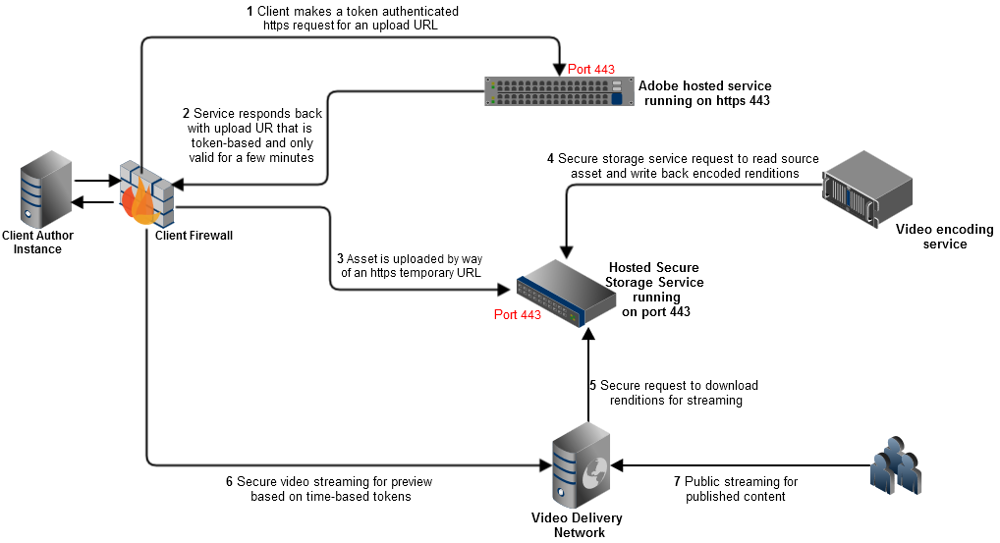
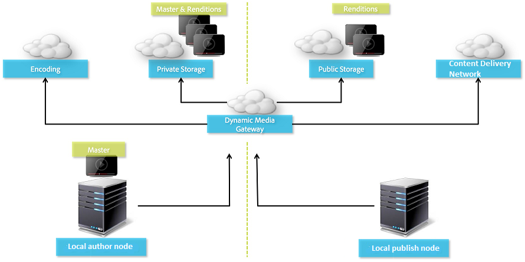

# Video in Dynamic Media {#video}

This section describes working with video in Dynamic Media.

## Quick Start: Videos {#quick-start-videos}

The following step-by-step workflow description is designed to help you get up and running quickly with adaptive video sets in Dynamic Media. After each step, there are cross-references to topic headings where you can find more information.

>[!IMPORTANT]
>
>Before you work with video in Dynamic Media, make sure that your Adobe Experience Manager administrator has already enabled and configured Dynamic Media Cloud Services in either Dynamic Media - Scene7 mode or Dynamic Media - Hybrid mode.
>
>* See [Configure Dynamic Media Cloud Services](/help/assets/config-dms7.md#configuring-dynamic-media-cloud-services) in Configuring Dynamic Media - Scene7 mode and [Troubleshoot Dynamic Media - Scene7 mode](/help/assets/troubleshoot-dms7.md).
>
>* See [Configure Dynamic Media Cloud Services](/help/assets/config-dynamic.md#configuring-dynamic-media-cloud-services) in Configuring Dynamic Media - Hybrid mode.
>
>Currently known video playback issue in Dynamic Media *on Experience Manager 6.5.9.0 only*:
>
>* If a published video is updated, it must be published again to reflect changes on delivery.
>

1. **Upload your Dynamic Media videos** by doing the following:

    * Create your own video encoding profile. Or, you can simply use the predefined _Adaptive Video Encoding_ profile that comes with Dynamic Media.

        * [Create a video encoding profile](/help/assets/video-profiles.md#creating-a-video-encoding-profile-for-adaptive-streaming).
        * Learn more about [Best practices for video encoding](#best-practices-for-encoding-videos).

    * Associate the video processing profile to one or more folders where you are going to upload your primary source videos.

        * [Apply a video profile to folders](/help/assets/video-profiles.md#applying-a-video-profile-to-folders).
        * Learn more about [Best practices for organizing your digital assets for using processing profiles](/help/assets/organize-assets.md).
        * Learn more about [Organize digital assets](/help/assets/organize-assets.md).

    * Upload your primary source videos to the folders. When you add videos to the folder, they are encoded according to the video processing profile that you assigned to the folder.

        * Dynamic Media supports primarily short-form videos with a maximum length of 30 minutes and a minimum resolution that is greater than 25 x 25.
        * You can upload video files that are up to 15 GB each.
        * [Upload your videos](/help/assets/managing-video-assets.md#upload-and-preview-video-assets).
        * Learn more about [Supported input file formats](/help/assets/assets-formats.md#supported-multimedia-formats).

    * Monitor how [video encoding is progressing](#monitoring-video-encoding-and-youtube-publishing-progress) either from the asset or workflow view.

1. **Manage your Dynamic Media videos** by doing any of the following:

    * Organize, browse, and search video assets

        * [Organize digital assets](/help/assets/organize-assets.md)
          Learn more about [Best practices for organizing your digital assets for using processing profiles](organize-assets.md)

        * [Search video assets](search-assets.md#custompredicates) or [Search assets](/help/assets/search-assets.md)

    * Preview and publish video assets

        * View the source video and encoded renditions of the video along with its associated thumbnails:
          [Preview videos](managing-video-assets.md#upload-and-preview-video-assets) or [Preview assets](previewing-assets.md)
          [View video renditions](video-renditions.md)
          [Manage video renditions](manage-assets.md#managing-renditions)

        * [Manage viewer presets](managing-viewer-presets.md)
        * [Publish assets](publishing-dynamicmedia-assets.md)

    * Work with video metadata

        * View the properties of an encoded video rendition such as frame rate, audio and video bitrate, and codec:
          [View video rendition properties](video-renditions.md)

        * Edit the properties of video such as the title, description, and tags, custom metadata fields:
          [Edit video properties](manage-assets.md#editing-properties)

        * [Manage metadata for digital assets](metadata.md)
        * [Metadata schemas](metadata-schemas.md)

    * Review, approve, and annotate videos, and maintain full version control

        * [Annotate videos](managing-video-assets.md#annotate-video-assets) or [Annotate assets](manage-assets.md#annotating)

        * [Create a version](manage-assets.md#asset-versioning)
        * [Apply workflows to assets](assets-workflow.md) or see [Start a workflow on an asset](manage-assets.md#starting-a-workflow-on-an-asset)

        * [Review folder assets](bulk-approval.md)
        * [Projects](../sites-authoring/projects.md)

1. **Publish your Dynamic Media videos** by doing one of the following:

    * If you use Adobe Experience Manager as your web content management system, you can add videos directly to your web pages.

        * [Add videos to your web pages](adding-dynamic-media-assets-to-pages.md).

    * If you are using a third-party web content management system, you can link or embed videos to your web pages.

        * Integrate video using URL:
          [Link URLs to your web application](linking-urls-to-yourwebapplication.md).

        * Integrate video using embed code on web page:
          [Embed the video viewer on a web page](embed-code.md).
    
    * [Generate video reports](#viewing-video-reports).

    * [Add captions to video](#adding-captions-to-video).

## Work with video in Dynamic Media {#working-with-video-in-dynamic-media}

Video in Dynamic Media is an end-to-end solution that makes it easy to publish high-quality Adaptive Video for streaming across multiple screens, including desktop, iOS, Android&trade;, BlackBerry&reg;, and Windows mobile devices. An Adaptive Video Set groups versions of the same video that are encoded at different bit rates and formats such as 400 kbps, 800 kbps, and 1000 kbps. The desktop computer or mobile device detects the available bandwidth.

For example, on an iOS mobile device, it detects a bandwidth such as 3G, 4G, or Wi-Fi. Then, it automatically selects the right encoded video from among the various video bit rates within the Adaptive Video Set. The video is streamed to desktops, mobile devices, or tablets.

In addition, video quality is dynamically switched automatically if network conditions change on the desktop or on the mobile device. Also, if a customer enters full-screen mode on a desktop, the Adaptive Video Set responds by using a better resolution, improving the customer's viewing experience. Using Adaptive Video Sets provides you with the best possible playback for customers playing Dynamic Media video on multiple screens and devices.

The logic that a video player uses to determine which encoded video to play or to select during playback is based on the following algorithm:

1. Video player loads the initial video fragment based on the bit rate that is closest to the value that is set for "initial bitrate" in the player itself.
1. Video player switches based on changes to the bandwidth speed using the following criteria:

    1. Player picks the highest bandwidth stream below or equal to the estimated bandwidth.
    1. Player considers only 80% of the available bandwidth. However, if it is switching up, it is more conservative at only 70% to avoid overestimating and immediately switching back.

For detailed technical information about the algorithm, see [https://android.googlesource.com/platform/frameworks/av/+/master/media/libstagefright/httplive/LiveSession.cpp](https://android.googlesource.com/platform/frameworks/av/+/master/media/libstagefright/httplive/LiveSession.cpp)

For managing single video and Adaptive Video Sets, the following is supported:

* Uploading video from numerous-supported video formats and audio formats and encoding video to MP4 H.264 format for playback across multiple screens. You can use predefined adaptive video presets, single video encoding presets, or customize your own encoding to control the quality and size of the video.

  * When an adaptive video set is generated, it includes MP4 videos.
  * **Note**: Master/source videos are not added to an Adaptive Video Set.

* Video captioning in all HTML5 video viewers.
* Organize, browse, and search video with full metadata support for efficient management of video assets.
* Deliver Adaptive Video Sets to the web and to desktops, and mobile devices, including the iPhone, iPad, Android&trade;, BlackBerry&reg;, and Windows phone.

Adaptive video streaming is supported on various iOS platforms. See [Dynamic Media Viewers Reference Guide](https://experienceleague.adobe.com/docs/dynamic-media-developer-resources/library/viewers-aem-assets-dmc/video/c-html5-video-reference.html#video).

Dynamic Media supports mobile video playback for MP4 H.264 video. You can find BlackBerry&reg; devices that support this video format at the following: [Supported video formats on BlackBerry&reg;](https://support.blackberry.com/kb/articleDetail?ArticleNumber=000005482).

You can find Windows devices that support this video format at the following: [Supported media codecs for Windows Phone 8](https://learn.microsoft.com/en-us/windows/uwp/audio-video-camera/supported-codecs)

* Play back the video using Dynamic Media Video Viewer Presets, including the following:

  * Single video viewers.
  * Mixed Media viewers that combine both video and image content.

* Configure video players to meet your branding needs.
* Integrate video to your website, mobile site, or mobile application with a simple URL or embed code.

<!-- See [Dynamic video playback](https://s7d9.scene7.com/s7/uvideo.jsp?asset=GeoRetail/Mop_AVS&config=GeoRetail/Universal_Video1&stageSize=640,480) sample. -->

See also [Viewers for Experience Manager Assets and Dynamic Media Classic](https://experienceleague.adobe.com/docs/dynamic-media-developer-resources/library/viewers-aem-assets-dmc/c-html5-s7-aem-asset-viewers.html#viewers-aem-assets-dmc) and [Viewers for Experience Manager assets only](https://experienceleague.adobe.com/docs/dynamic-media-developer-resources/library/viewers-for-aem-assets-only/c-html5-aem-asset-viewers.html#viewers-for-aem-assets-only).

## Best practice: Using the HTML5 video viewer {#best-practice-using-the-html-video-viewer}

The Dynamic Media HTML5 Video viewer presets are robust video players. You can use them to avoid many common issues that are associated with HTML5 video playback. And, issues associated with mobile devices such as lack of adaptive bitrate streaming delivery and limited desktop browser reach.

On the design side of the player, you can design the video player's functionality using standard web development tools. For example, you can design the buttons, controls, and custom poster image background using HTML5 and CSS to help you reach your customers with a customized appearance.

On the playback side of the viewer, it automatically detects the browser's video capability. It then serves the video using HLS (HTTP Live Streaming) or DASH (Dynamic Adaptive Streaming over HTTP) , also known as adaptive bitrate streaming. Or, if those delivery methods are not present then HTML5 progressive is used instead.

By combining into a single player the following:

* The ability to design the playback components using HTML5 and CSS
* Have embedded playback
* Use adaptive and progressive streaming depending on the browser's capability

You extend the reach of your rich media content to both desktop and mobile users and ensure a streamlined video experience.

See also [About HTML5 Viewers](https://experienceleague.adobe.com/docs/dynamic-media-developer-resources/library/viewers-for-aem-assets-only/c-html5-aem-asset-viewers.html#viewers-for-aem-assets-only).

### Playback of video on desktop computers and mobile devices using the HTML5 video viewer {#playback-of-video-on-desktop-computers-and-mobile-devices-using-the-html-video-viewer}

For desktop and mobile adaptive video streaming, the videos used for bit rate switching are based on all MP4 videos in the Adaptive Video Set.

Video playback occurs using either DASH or HLS, or progressive video download. In prior versions of Experience Manager, such as 6.0, 6.1, and 6.2, videos were streamed over HTTP. 

In Experience Manager 6.3 and on, videos are now streamed over HTTPS (that is, DASH or HLS) because the DM gateway service URL always uses HTTPS as well. There is no customer impact in this default behavior. That is, video streaming always occurs over HTTPS unless it is not supported by the browser. (see the following table). Therefore,

* If you have an HTTPS website with HTTPS video streaming, streaming is fine.
* If you have an HTTP website with HTTPS video streaming, streaming is fine and there are no mixed content issues from the web browser.

DASH is the international standard and HLS is an Apple standard. Both are used for adaptive video streaming. And, both technologies automatically adjust playback based on network bandwidth capacity. It also lets the customer "seek" to any point in the video without the need to wait for the rest of the video to download.

Progressive video is delivered by downloading and storing the video locally on a user's desktop system or mobile device.

The following table describes the device, browser, and playback method of videos on desktop computers and mobile devices using the Dynamic Media Video Viewer.

<table>
 <tbody>
  <tr>
   <td><strong>Device</strong></td>
   <td><strong>Browser</strong></td>
   <td><strong>Video playback mode</strong></td>
  </tr>
  <tr>
   <td>Desktop</td>
   <td>Internet Explorer 9 and 10</td>
   <td>Progressive download.</td>
  </tr>
  <tr>
   <td>Desktop</td>
   <td>Internet Explorer 11+</td>
   <td>On Windows 8 and Windows 10 - Force use of HTTPS whenever DASH* or HLS is requested. Known limitation: HTTP on DASH* or HLS does not work in this browser/operating system combination<br /> <br /> On Windows 7 - Progressive download. Uses standard logic for selecting HTTP versus HTTPS protocol.</td>
  </tr>
  <tr>
   <td>Desktop</td>
   <td>Firefox 23-44</td>
   <td>Progressive download.</td>
  </tr>
  <tr>
   <td>Desktop</td>
   <td>Firefox 45 or later</td>
   <td>DASH* or HLS adaptive bitrate streaming.</td>
  </tr>
  <tr>
   <td>Desktop</td>
   <td>Chrome</td>
   <td>DASH* or HLS adaptive bitrate streaming.</td>
  </tr>
  <tr>
   <td>Desktop</td>
   <td>Safari (Mac)</td>
   <td>HLS adaptive bitrate streaming.</td>
  </tr>
  <tr>
   <td>Mobile</td>
   <td>Chrome (Android&trade; 6 or earlier)</td>
   <td>Progressive download.</td>
  </tr>
  <tr>
   <td>Mobile</td>
   <td>Chrome (Android&trade; 7 or later)</td>
   <td>DASH* or HLS adaptive bitrate streaming.</td>
  </tr>
  <tr>
   <td>Mobile</td>
   <td>Android&trade; (default browser)</td>
   <td>Progressive download.</td>
  </tr>
  <tr>
   <td>Mobile</td>
   <td>Safari (iOS)</td>
   <td>HLS adaptive bitrate streaming.</td>
  </tr>
  <tr>
   <td>Mobile</td>
   <td>Chrome (iOS)</td>
   <td>HLS adaptive bitrate streaming.</td>
  </tr>
  <tr>
   <td>Mobile</td>
   <td>BlackBerry&reg;</td>
   <td>DASH* or HLS adaptive bitrate streaming./td>
  </tr>
 </tbody>
</table>

>[!IMPORTANT]
>
>*To use DASH for your videos, it must first be enabled by Adobe Technical Support on your account. See [Enable DASH on your account](#enable-dash).

## Architecture of Dynamic Media video solution {#architecture-of-dynamic-media-video-solution}

The following graphic shows the overall authoring workflow of videos that are uploaded and encoded by way of DMGateway (in Dynamic Media Hybrid mode) and made available for public consumption.



## Hybrid publishing architecture for videos {#hybrid-publishing-architecture-for-videos}



## Best practices for encoding videos {#best-practices-for-encoding-videos}

The **Dynamic Media Encode Video** workflow encodes video if you have enabled Dynamic Media and set up video cloud services. This workflow captures workflow process history and failure information. If you have enabled Dynamic Media and set up video cloud services, the **[!UICONTROL Dynamic Media Encode Video]** workflow automatically takes effect when you upload a video. (If you are not using Dynamic Media, the **[!UICONTROL DAM Update Asset]** workflow takes effect.)

<!-- DEAD The following are best-practice tips for encoding source video files.

For advice about video encoding, see [Video Encoding Basics](https://www.adobe.com/go/learn_s7_encoding_en).

* [Streaming 101: The Basics — Codecs, Bandwidth, Data Rate, and Resolution](https://www.adobe.com/go/learn_s7_streaming101_en). -->

### Source video files {#source-video-files}

When you encode a video file, use a source video file of the highest possible quality. Avoid using previously encoded video files because these files are already compressed, and further encoding creates a subpar quality video.

* Dynamic Media supports primarily short-form videos with a maximum length of 30 minutes and a minimum resolution that is greater than 25 x 25.
* You can upload primary source video files that are up to 15 GB each.

The following table describes the recommended size, aspect ratio, and minimum bit rate that your source video files must have before you encode them:

|Size|Aspect ratio|Minimum bit rate|
|--- |--- |--- |
|1024 X 768|4:3|4500 kbps for most videos.|
|1280 X 720|16:9|3000 - 6000 kbps, depending on the amount of motion in the video.|
|1920 X 1080|16:9|6000 - 8000 kbps, depending on the amount of motion in the video.|

### Obtain a file's metadata {#obtaining-a-file-s-metadata}

You can obtain a file's metadata by viewing its metadata using a video editing tool, or using an application designed for obtaining metadata. Following are instructions for using MediaInfo, a third-party application, to obtain a video file's metadata:

1. Go to [MediaInfo Download](https://mediaarea.net/en/MediaInfo/Download).
1. Select and download the installer for the GUI version, and follow the installation instructions.
1. After installation, either right-click the video file (Windows only) and select MediaInfo, or open MediaInfo and drag your video file into the application. You see all metadata associated with your video file, including its width, height, and fps.

### Aspect ratio {#aspect-ratio}

When you choose or create a video encoding preset for your primary source video file, make sure that the preset has the same aspect ratio as the primary source video file. The aspect ratio is the ratio of the width to the height of the video.

To determine the aspect ratio of a video file, obtain the file's metadata and note the file's width and height (see Obtaining a file's metadata above). Then use this formula to determine the aspect ratio:

width/height = aspect ratio

The following table describes how formula results translate to common aspect ratio choices:

|Formula result|Aspect ratio|
|--- |--- |
|1.33|4:3|
|0.75|3:4|
|1.78|16:9|
|0.56|9:16|

For example, a video that is 1440 width x 1080 height has an aspect ratio of 1440/1080, or 1.33. In this case, you choose a video encoding preset with a 4:3 aspect ratio to encode the video file.

### Bitrate {#bitrate}

Bitrate is the amount of data that is encoded to make up a single second of video playback. The bitrate is measured in kilobits per second (Kbps).

>[!NOTE]
>
>Because all codecs use lossy compression, bitrate is the most important factor in video quality. With lossy compression, the more you compress a video file, the more the quality is degraded. For this reason, all other characteristics being equal (the resolution, frame rate, and codec), the lower the bitrate, the lower the quality of the compressed file.

When selecting a bitrate encoding, there are two types you can choose:

* **[!UICONTROL Constant Bitrate Encoding]** (CBR) - During CBR encoding, the bitrate, or the number of bits per second is kept the same throughout the encoding process. CBR encoding persists the set data rate to your setting over the entire video. Also, CBR encoding does not optimize media files for quality but does save on storage space.
  Use CBR if your video contains a similar motion level throughout the entire video. CBR is most commonly used for streaming video content. See also [Use custom-added video encoding parameters](/help/assets/video-profiles.md#using-custom-added-video-encoding-parameters).

* **[!UICONTROL Variable Bitrate Encoding]** (VBR) - VBR encoding adjusts the data rate down and to the upper limit that you set, based on the data required by the compressor. This functionality means that during a VBR encoding process the bitrate of the media file dynamically increases or decreases depending on the media files bitrate needs.
  VBR takes longer to encode but produces the most favorable results; the quality of the media file is superior. VBR is most commonly used for http progressive delivery of video content.

When do you use VBR versus CRB?
When selecting VBR versus CBR, it is almost always recommended that you use VBR for your media files. VBR provides higher-quality files at competitive bitrates. When you use VBR, be sure you use with two-pass encoding, and set the maximum bitrate to be 1.5x the target video bitrate.

When you choose a video encoding preset, remember the target end user's connection speed. Choose a preset with a data rate that is 80 percent of that speed. For example, if the target end user's connection speed is 1000 Kbps, the best preset is one with a video data rate of 800 Kbps.

This table describes the data rate of typical connection speeds.

|Speed (Kbps)|Connection type|
|--- |--- |
|256|Dial-up connection.|
|800|Typical mobile connection. For this connection, target a data rate in the range of 400 to a maximum of 800 for 3G experiences.|
|2000|Typical broadband desktop connection. For this connection, target a data rate in the 800-2000 Kbps range, with most targets averaging 1200-1500 Kbps.|
|5000|Typical high-broadband connection. Encoding in this upper range is not recommended because video delivery at this speed is not available to most consumers.|

### Resolution {#resolution}

**Resolution** describes a video file's height and width in pixels. Most source video is stored at a high resolution (for example, 1920 x 1080). For streaming purposes, source video is compressed to a smaller resolution (640 x 480 or smaller).

Resolution and data rate are two integrally linked factors that determine video quality. To maintain the same video quality, the higher the number of pixels in a video file (the higher the resolution), the higher the data rate must be. For example, consider the number of pixels per frame in a 320 x 240 resolution and a 640 x 480 resolution video file:

|Resolution|Pixels per frame|
|--- |--- |
|320 x 240|76,800|
|640 x 480|307,200|

The 640 x 480 file has four times more pixels per frame. To achieve the same data rate for these two example resolutions, you apply four times the compression to the 640 x 480 file, which can reduce the quality of the video. Therefore, a video data rate of 250 Kbps produces high-quality viewing at a 320 x 240 resolution, but not at a 640 x 480 resolution.

In general, the higher data rate you use, the better your video looks, and the higher resolution you use, the higher data rate you must maintain viewing quality (compared to lower resolutions).

Because resolution and data rate are linked, you have two options when encoding video:

* Choose a data rate and then encode at the highest resolution that looks good at the data rate you chose.
* Choose a resolution and then encode at the data rate necessary to achieve high-quality video at the resolution you chose.

When you choose (or create) a video encoding preset for your primary source video file, use this table to target the correct resolution:

|Resolution|Height (pixels)|Screen size|
|--- |--- |--- |
|240p|240|Tiny screen|
|300p|300|Small screen typically for mobile devices|
|360p|360|Small screen|
|480p|480|Medium screen|
|720p|720|Large screen|
|1080p|1080|High-definition large screen|

### Fps (Frames per second) {#fps-frames-per-second}

In the United States and Japan, most video is shot at 29.97 frames per second (fps); in Europe, most video is shot at 25 fps. Film is shot at 24 fps.

Choose a video encoding preset that matches the fps rate of your primary source video file. For example, if your primary source video is 25 fps, choose an encoding preset with 25 fps. By default, all custom encoding uses the primary source video file's fps. For this reason, you do not need to explicitly specify the fps setting when you create a video encoding preset.

### Video encoding dimensions {#video-encoding-dimensions}

For optimal results, select encoding dimensions such that the source video is a whole multiple of all your encoded videos.

To calculate this ratio, you divide source width by encoded width to get the width ratio. Then, you divide source height by encoded height to get the height ratio.

If the resulting ratio is a whole integer, it means that the video is optimally scaled. If the resulting ratio is not a whole integer, it impacts video quality by leaving leftover pixel artifacts on the display. This effect is most noticeable when the video has text.

As an example, suppose that your source video is 1920 x 1080. In the following table, the three encoded videos provide the optimal encoding settings to use.

|Video Type|Width x Height|Width Ratio|Height Ratio|
|--- |--- |--- |--- |
|Source|1920 x 1080|1|1|
|Encoded|960 x 540|2|2|
|Encoded|640 x 360|3|3|
|Encoded|480 x 270|4|4|

### Encoded video file format {#encoded-video-file-format}

Dynamic Media recommends using MP4 H.264 video encoding presets. Because MP4 files use the H.264 video codec, it provides high-quality video but in a compressed file size.

### Enable DASH on your account {#enable-dash}

DASH (Digital Adaptive Streaming over HTTP) is the international standard for video streaming and is widely adopted across different video viewers. When DASH is enabled on your account, you get the option to choose from either DASH or HLS for adaptive video streaming. Or, you can opt for both with automatic switching between players when **[!UICONTROL auto]** is selected as the playback type in the Viewer preset.

Some key benefits from enabling DASH on your account include the following:
     
* Package DASH stream video for adaptive bitrate streaming. This method leads to higher efficiency of delivery. Adaptive streaming ensures the best viewing experience for your customers.
* Browser optimized streaming with Dynamic Media players switches between HLS and DASH streaming to ensure the best quality of service. The video player auto-switches to HLS when a Safari browser is used.
* You can configure your preferred streaming method (HLS or DASH) by editing the video viewer preset.
* Optimized video encoding ensures that no additional storage is used while enabling DASH capability. A single set of video encodes are created for both HLS and DASH to optimize video storage costs.
* Helps make video delivery more accessible for your customers.
* Get the streaming URL by way of APIs, too.

Enabling DASH on your account requires two steps: 

* Configuring Dynamic Media to use DASH which you can easily do yourself.
* Configuring Experience Manager 6.5 to use DASH which is done by way of an Adobe Customer Support case that you create and submit. 

**To enable DASH on your account:**

1. **Configure Dynamic Media** - In Dynamic Media on Experience Manager 6.5, navigate to [https://localhost:4502/system/console/configMgr](https://localhost:4502/system/console/configMgr).
1. Search for **AEM Assets Dynamic Media Video Advanced Streaming** feature flag.
1. To enable (turn on) DASH, select the checkbox.
1. Select **[!UICONTROL Save]**.
1. **Configure Experience Manager 6.5** - [Use the Admin Console to start the creation of a new support case](https://helpx.adobe.com/enterprise/using/support-for-experience-cloud.html).
1. To create a support case, follow the instructions while ensuring you provide the following information:

    * Primary contact name, email, phone.
    * Name of your Dynamic Media account.
    * Specify that you want DASH enabled on Experience Manager 6.5.
   
1. Adobe Customer Support adds you to the DASH customer Wait List based on the order in which requests are submitted.
1. When Adobe is ready to handle your request, Customer Support contacts you to coordinate and set a target date for DASH enablement.
1. You are notified after completion by Customer Support.
1. Create your [video viewer preset](/help/assets/managing-viewer-presets.md#creating-a-new-viewer-preset) as usual.

## View video reports {#viewing-video-reports}

>[!NOTE]
>
>Video reports are only available when you run Dynamic Media - Hybrid mode.

Video Reports display several aggregate metrics across a specified time to help you monitor that *published* individual and aggregate videos are performing as expected. The following top metrics data are aggregated for all published videos across your entire website:

* Video Starts
* Completion Rate
* Average time on video
* Total time on video
* Videos per visit

A table of all *published* videos is also listed so you can track the top viewed videos on your website based on total video starts.

When you tap a video name in the list, it shows you the video's audience retention (drop-off) report in the form of a line chart. The chart displays the number of views for any given moment of time during video playback. When you play the video, the vertical bar tracks in synchronization with the time indicator in the player. Drops in the line chart data indicate where your audience drops off from disinterest.

If the video was encoded outside of Adobe Experience Manager Dynamic Media, the audience retention (drop-off) chart and the Play Percentage data in the table are not available.

See also [Configure Dynamic Media Cloud Services](/help/assets/config-dynamic.md).

>[!NOTE]
>
>Tracking and reporting data is based exclusively on the use of Dynamic Media's own video player and associated video player preset. As such, you cannot track and report on videos that are played by way of other video players.

By default, the first time you enter Video Reports, the report displays video data starting at the first of the current month and ends with the current month's date. However, you can override the default date range by specifying your own date range. The next time you enter Video Reports, the date range you specified is used.

For video reports to work correctly, a Report Suite ID is automatically created when Dynamic Media Cloud Services is configured. At the same time, the Report Suite ID is pushed to the Publish server so that it is available for the Copy URL feature when you preview assets. However, this functionality requires that the Publish server is already set up. If the Publish server is not set up, you can still publish to see the video report. However, you must return to the Dynamic Media Cloud Configuration and tap **[!UICONTROL OK]**.

**To view video reports:**

1. In the upper-left corner of Experience Manager, tap the Experience Manager logo, then in the left rail, tap **[!UICONTROL Tools]** (hammer icon) > **[!UICONTROL Assets]** > **[!UICONTROL Video Reports]**.
1. On the Video Reports page, do one of the following:

    * Near the upper-right corner, tap the **Refresh Video Report** icon.
      Use Refresh only if the end date of the report is the current day. Doing so ensures that you see the video tracking that has occurred since the last time you ran the report.

    * Near the upper-right corner, tap the **Date Picker** icon.
      Specify the beginning and end date range for which you want video data, and then tap **[!UICONTROL Run Report]**.

   The Top Metrics group box identifies various aggregate measurements for all *published* videos across your site.

1. In the table that lists the top published videos, tap a video name to play the video and also see the video's audience retention (drop-off) report.

### View video reports based on a video viewer that you created using the Dynamic Media HTML5 Viewer SDK {#viewing-video-reports-based-on-a-video-viewer-that-you-created-using-the-scene-hmtl-viewer-sdk}

If you use an out-of-box video viewer provided by Dynamic Media, or if you created a custom viewer preset based off an out-of-box video viewer, then no additional steps are required to view video reports. However, if you have created your own video viewer based off the HTML5 Viewer SDK API, then use the following steps to ensure that your video viewer is sending tracking events to Dynamic Media Video Reports.

Use the [Adobe Dynamic Media Viewers Reference Guide](https://experienceleague.adobe.com/docs/dynamic-media-developer-resources.html) and the [HTML5 Viewer SDK API](https://s7d1.scene7.com/s7sdk/3.10/docs/jsdoc/index.html) to create your own video viewers.

**To view video reports based on a video viewer that you created using the Dynamic Media HTML5 Viewer SDK:**

1. Navigate to any published video asset.
1. Near the upper-left corner of the asset's page, from the drop-down list, select **[!UICONTROL Viewers]**.
1. Select any video viewer preset and copy the embed code.
1. In the embed code, find the line with the following:

   `videoViewer.setParam("config2", "<value>");`

   The `config2` parameter enables tracking in HTML5 Viewers. It is also a company-specific preset that contains the configuration information for Video Reporting, and for customer-specific Adobe Analytics configurations.

   The correct value for the config2 parameter is found in both the **[!UICONTROL Embed Code]** and in the copy **[!UICONTROL URL]** function. In the URL from the copy **[!UICONTROL URL]** command, the parameter to look for is `&config2=<value>` . The value is almost always `companypreset`, but in some instances it can also be `companypreset-1`, `companypreset-2`, and so forth.

1. In your custom video viewer code, add AppMeasurementBridge .jsp to the viewer page by doing the following:

    * First, determine if you need the `&preset` parameter. 

      If the `config2` parameter is `companypreset`, you do *not* need `&preset=parameter`.  

      If `config2` is anything else, set the preset parameter the same as the `config2` parameter. For example, if `config2=companypreset-2`, add `&param2=companypreset-2` to the AppMeasurmentBridge.jsp URL.
  
    * Then, add the AppMeasurementBridge.jsp script: 

      `<script language="javascript" type="text/javascript" src="https://s7d1.scene7.com/s7viewers/AppMeasurementBridge.jsp?company=robindallas&preset=companypreset-2"></script>`

1. Create the TrackingManager component by doing the following:

    * After you call `s7sdk.Util.init();`, create a TrackingManager instance to track events by adding the following: 

      `var trackingManager = new s7sdk.TrackingManager();`
  
    * Connect components to TrackingManager by doing the following:

      In the `s7sdk.Event.SDK_READY` event handler, attach the component you want to track to the TrackingManager.

      For example, if the component is `videoPlayer`, add

      `trackingManager.attach(videoPlayer);`

      to attach the component to the trackingManager. To track multiple viewers on a page, use multiple tracking manager components. 

    * Create the AppMeasurementBridge object by adding the following:

      ```
      var appMeasurementBridge = new AppMeasurementBridge(); appMeasurementBridge.setVideoPlayer(videoPlayer);
  
      ```

    * Add the tracking function by adding the following:

      ```
      trackingManager.setCallback(appMeasurementBridge.track, 
       appMeasurementBridge);
      ```

   The appMeasurementBridge object has a built-in track function. However, you can provide your own to support multiple tracking systems or other functionality.

<!--    For more information, see *Using the TrackingManager Component* in the *Scene7 HTML5 Viewer SDK User Guide* available for download from [Adobe Developer Connection](https://help.adobe.com/en_US/scene7/using/WSef8d5860223939e2-43dedf7012b792fc1d5-8000.html). -->

## Add closed captions or subtitles to video {#adding-captions-to-video}

You can extend the reach of your videos to global markets by adding closed captioning to single videos or to Adaptive Video Sets. By adding closed captioning, you avoid the need to dub the audio, or the need to use native speakers to rerecord the audio for each different language. The video is played in the language that it was recorded. Foreign language subtitles appear so that people of different languages can still understand the audio portion.

Closed captioning also allows for greater accessibility by people who are deaf or hard of hearing.

>[!NOTE]
>
>The video player that you use must support the display of captions.

See also [Accessibility in Dynamic Media](/help/assets/accessibility-dm.md).

Dynamic Media converts caption files to JSON (JavaScript Object Notation) format. This conversion means you can embed the JSON text into a web page as a hidden but complete transcript of the video. Search engines can then crawl and index the content to make the videos more easily discoverable and give customers additional details about the video content.

See [Serve static (non-image) contents](https://experienceleague.adobe.com/docs/dynamic-media-developer-resources/image-serving-api/image-serving-api/c-serving-static-nonimage-contents.html#image-serving-api) in the *Dynamic Media Image Serving and Rendering API Help* for more information about using the JSON function in a URL.

**To add captions or subtitles to video:**

1. Use a third-party application or service to create your video caption/subtitle file.

   Ensure the file that you create follows the WebVTT (Web Video Text Tracks) standard. The captioning filename extension is .vtt. You can learn more information about the WebVTT captioning standard.

   See [WebVTT: The Web Video Text Tracks format](https://w3c.github.io/webvtt/).

   There are both free and premium tools and services that you can use to author caption/subtitle files outside Dynamic Media. For example, to create a simple video caption file with no styling, you can use the following free online caption authoring and editing tool:

   [WebVTT Caption Maker](https://testdrive-archive.azurewebsites.net/Graphics/CaptionMaker/Default.html)

   For best results, use the tool in Internet Explorer 9 or above, Google Chrome, or Safari.

   In the tool, in the **[!UICONTROL Enter URL of video file]** field, paste the copied URL of your video file and then click **[!UICONTROL Load]**. See [Obtain a URL for an Asset](/help/assets/linking-urls-to-yourwebapplication.md#obtaining-a-url-for-an-asset) to get the URL to the video file itself which you can then paste into the **[!UICONTROL Enter URL of video file field]**. Internet Explorer, Chrome, or Safari can then natively play back the video.

   Now follow the onscreen instructions from the site to author and save your WebVTT file. When you have finished, copy the caption file contents and paste it into a plain text editor and save it with a `.vtt` filename extension.

   >[!NOTE]
   >
   >For global support of video subtitles in multiple languages, the WebVTT standard requires that you create separate .vtt files and calls for each language you want to support.

   Generally, you want to name the caption VTT file the same name as the video file, and append it with the language locale, such as -EN, -FR, or -DE. By doing so, it can help you with automating the generation of the video URLs using your existing web content management system.

1. In Experience Manager, upload your WebVTT caption file into DAM.
1. Navigate to the *published* video asset that you want to associate with the caption file that you uploaded.

   Remember that URLs are only available to copy *after* you have first *published* the assets.

   See [Publish assets](/help/assets/publishing-dynamicmedia-assets.md).

1. Do one of the following:

    * For a pop-up video viewer experience, tap **[!UICONTROL URL]**. In the URL dialog box, select and copy the URL to the Clipboard and then past the URL into a simple text editor. Append the copied URL of the video with the following syntax:

      `&caption=<server_path>/is/content/<path_to_caption.vtt_file,1>`

      Note the `,1` at the end of the caption path. Immediately following the `.vtt` filename extension in the path, you can optionally enable (turn on) or disable (turn off) the closed caption button on the video player bar by setting to `,1` or `,0`, respectively.

    * For an embedded video viewer experience, tap **[!UICONTROL Embed Code]**. In the Embed Code dialog box, select, and copy the embed code to the Clipboard and then paste the code into a simple text editor. Append the copied embed code with the following syntax:

      `videoViewer.setParam("caption","<path_to_caption.vtt_file,1>");`

      Note the `,1` at the end of the caption path. Immediately following the `.vtt` filename extension in the path, you can optionally enable (turn on) or disable (turn off) the closed caption button on the video player bar by setting to `,1` or `,0`, respectively.

## Add chapter markers to video {#adding-chapter-markers-to-video}

You can make your long form videos easier to watch and navigate by adding chapter markers to single videos or to Adaptive Video Sets. When a user plays the video, they can click the chapter markers on the video timeline (also known as the video scrubber) to easily navigate to their point of interest. Or, they can immediately jump to new content, demonstrations, and tutorials.

>[!NOTE]
>
>The video player that is used must support the use of chapter markers. Dynamic Media video players do support chapter markers but using third-party video players may not.

If desired, you can create and brand your own custom video viewer with chapters instead of using a video viewer preset. For instructions on creating your own HTML5 viewer with chapter navigation, in the Adobe HTML5 Viewer SDK API, reference the heading "Customizing Behavior Using Modifiers" under the classes `s7sdk.video.VideoPlayer` and `s7sdk.video.VideoScrubber`. See the [HTML5 Viewer SDK API](https://s7d1.scene7.com/s7sdk/3.10/docs/jsdoc/index.html) documentation.

<!-- If desired, you can create and brand your own custom video viewer with chapters instead of using a video viewer preset. For instructions on creating your own HTML5 viewer with chapter navigation, in the Adobe Scene7 Viewer SDK for HTML5 guide, reference the heading "Customizing Behavior Using Modifiers" under the classes `s7sdk.video.VideoPlayer` and `s7sdk.video.VideoScrubber`. The Adobe Scene7 Viewer SDK is available as a download from [Adobe Developer Connection](https://help.adobe.com/en_US/scene7/using/WSef8d5860223939e2-43dedf7012b792fc1d5-8000.html). -->

You create a chapter list for your video in much the same way that you create captions. That is, you create a WebVTT file. Note, however, that this file must be separate from any WebVTT caption file that you are also using; you cannot combine captions and chapters into one WebVTT file.

You can use the following sample as an example of the format you use to create a WebVTT file with chapter navigation:

### WebVTT file with video chapter navigation {#webvtt-file-with-video-chapter-navigation}

```xml
WEBVTT
Chapter 1
00:00.000 --> 01:04.364
The bicycle store behind it all.
Chapter 2
01:04.364 --> 02:00.944
Creative Cloud.
Chapter 3
02:00.944 --> 03:02.937
Ease of management for a working solution.
Chapter 4
03:02.937 --> 03:35.000
Cost-efficient access to rapidly evolving technology.
```

In the example above, `Chapter 1` is the cue identifier and is optional. The cue time of `00:00:000 --> 01:04:364` specifies the start time and end time of the chapter, in `00:00:000` format. That last three digits are milliseconds and can be left as `000`, if preferred. The chapter title of `The bicycle store behind it all` is the actual description of the chapter's contents. The cue identifier, the starting cue time, and the chapter title all appear in a video player pop-up when a user hovers their mouse pointer over a visual cue point in the video's timeline.

Because you are using an HTML5 video viewer, ensure that the chapter file you create follows the WebVTT (Web Video Text Tracks) standard. The chapter filename extension is `.vtt`. You can learn more information about the WebVTT captioning standard.

See [WebVTT: The Web Video Text Tracks format](https://w3c.github.io/webvtt/)

**To add video chapter navigation:**

1. Save the `.vtt` file in UTF8 encoding so you avoid problems with character rendition in the chapter title text.

   Generally, you want to name the chapter VTT file the same name as the video file, and append it with chapters. By doing so, it can help you with automating the generation of the video URLs using your existing web content management system.
1. In Experience Manager, upload your WebVTT chapter file.

   See [Uploading Assets](/help/assets/manage-assets.md#uploading-assets).

1. Do one of the following:

   <table>
     <tbody>
      <tr>
       <td>For a pop-up video viewer experience</td>
       <td>
       <ol>
       <li>Navigate to the <i>published </i>video asset that you want to associate with the chapter file that you uploaded. Remember that URLs are only available to copy <i>after</i> you have first <i>published</i> the assets. See <a href="/help/assets/publishing-dynamicmedia-assets.md">Publishing Assets.</a></li>
       <li>From the drop-down menu, then click or tap <strong>Viewers</strong>.</li>
       <li>In the left rail, tap or click the video viewer preset name. A preview of the video is opened in a separate page.</li>
       <li>In the left rail, at the bottom, click <strong>URL</strong>.</li>
       <li>In the URL dialog box, select and copy the URL to the Clipboard, then past the URL into a simple text editor.</li>
       <li>Append the copied URL of the video with the following syntax so you can associate it with the copied URL to your chapter file:<br /> <br /> <code>&navigation=<<i>full_copied_URL_path_to_chapter_file</i>.vtt></code><br /> </li>
       </ol> </td>
      </tr>
      <tr>
       <td>For an embedded video viewer experience<br /> </td>
       <td>
       <ol>
       <li>Navigate to the <i>published </i>video asset that you want to associate with the chapter file that you uploaded. Remember that URLs are only available to copy <i>after</i> you have first <i>published</i> the assets. See <a href="/help/assets/publishing-dynamicmedia-assets.md">Publishing Assets.</a></li>
       <li>From the drop-down menu, then click or tap <strong>Viewers</strong>.</li>
       <li>In the left rail, tap or click the video viewer preset name. A preview of the video is opened in a separate page.</li>
       <li>In the left rail, at the bottom, click <strong>Embed</strong>.</li>
       <li>In the Embed Code dialog box, select, and copy the entire code to the Clipboard, then paste it into a simple text editor.</li>
       <li>Append the embed code of the video with the following syntax so you can associate it with the copied URL to your chapter file:<br /> <br /> <code>videoViewer.setParam("navigation","&lt;<i>full_copied_URL_path_to_chapter_file</i>.vtt&gt;"</code></li>
       </ol> </td>
      </tr>
     </tbody>
   </table>

## About video thumbnails in Dynamic Media - Scene7 mode {#about-video-thumbnails-in-dynamic-media-scene-mode}

A video thumbnail is a reduced-size version of a video frame or an image asset representing the video to the customer. The thumbnail serves to encourage a customer to select the video.

All videos in Experience Manager must have an associated thumbnail; you cannot delete a thumbnail without replacing it. By default, when you upload a video to Experience Manager, the first frame is used as the thumbnail. However, you can customize the thumbnail for branding purposes or visual search, for example. When you customize a video thumbnail, you can play the video and pause on the frame you want to use. Or, you can select an image asset that you have already uploaded and *published* in your digital asset manager.

A custom video thumbnail image that you select from a video is not extracted and saved in the DAM as a separate and distinct asset. However, a custom video thumbnail that you select from an existing image asset is saved to the JCR. The path of the selected asset gets stored under the video asset's node as in the following example path:

`/content/dam/*<folder_name*>/<*video_name*>/jcr:content/manualThumbnail`

The ability to customize a video thumbnail is only available after you have applied a video profile to the folder where the video is located.

See also [About video thumbnails in Dynamic Media - Hybrid mode](#about-video-thumbnails-in-dynamic-media-hybrid-mode).

### Add a custom video thumbnail {#adding-a-custom-video-thumbnail}

These steps apply only to Dynamic Media running in "Dynamicmedia_Scene7" mode.

**To add a custom video thumbnail:**

1. Be sure you have already done the following:

    * Created a folder for your video assets.
    * [Apply a video profile to the folder](/help/assets/video-profiles.md#applying-a-video-profile-to-folders).

    * [Uploaded your videos to the folder](/help/assets/managing-video-assets.md#upload-and-preview-video-assets).

1. Navigate to an uploaded video asset whose thumbnail image you want to change.
1. In asset selection mode either from **[!UICONTROL List View]** or **[!UICONTROL Card View]**, tap the video asset.
1. On the toolbar, tap the **[!UICONTROL Properties]** icon (a circle with an "i" in it).
1. On the video's Properties page, tap **[!UICONTROL Change Thumbnail]**.
1. On the Change Thumbnail page, do one of the following:

    * To use a frame from the video as the new thumbnail:

        * On the toolbar, tap **[!UICONTROL Select Frame from video]**.
        * Tap the Play button, then tap the Pause button on the frame you want to capture as the video's new thumbnail.

    * To use an image asset as the new thumbnail:

        * On the toolbar, tap **[!UICONTROL Select Thumbnail from Assets]**.
        * Tap **[!UICONTROL Select Thumbnail]**.
        * Navigate to a previously uploaded and published image asset that you want to use. The asset is automatically resized to serve as a thumbnail image for the video.
        * Select the image asset, then tap **[!UICONTROL Select]**.

1. On the Change Thumbnail page, tap **[!UICONTROL Save Change]**.
1. On the video's Properties page, in the upper-right corner, tap **[!UICONTROL Save & Close]**.

## About video thumbnails in Dynamic Media - Hybrid mode {#about-video-thumbnails-in-dynamic-media-hybrid-mode}

You can choose from one of ten thumbnail images automatically generated by Dynamic Media to add to your video. The video player displays your selected thumbnail when a video asset is used with the Dynamic Media component in the authoring environment of Experience Manager Sites, Experience Manager Mobile, or Experience Manager Screens. The thumbnail serves as a static picture that best represents the contents of your entire video and further encourages users to click the Play button.

Based on the total time of the video, Dynamic Media captures ten (default) thumbnail images. The images are captured at 1%, 11%, 21%, 31%, 41%, 51%, 61%, 71%, 81%, and 91% into the video. The ten thumbnails persist meaning that if you decide to choose a different thumbnail later on, you do not need to regenerate the series. You preview the ten thumbnail images and then select the one you want to use with your video. If you want to change to the default, you can use CRXDE Lite to configure the time interval that thumbnail images are generated. For example, if you only wanted to generate a series of four evenly spaced thumbnail images from your video, you can configure the interval time at 24%, 49%, 74%, and 99%.

Ideally, you can add a video thumbnail anytime after you upload your video but before you publish the video on your website.

If you prefer, you can choose to upload a custom thumbnail to represent your video instead of using a thumbnail generated by Dynamic Media. For example, you could create a custom thumbnail image that has the title of your video, an eye-catching opening image, or a specific image captured from your video. The custom video thumbnail image that you upload must have a maximum resolution of 1280 x 720 pixels (minimum width of 640 pixels) and be no larger than 2 MB.

See also [About video thumbnails in Dynamic Media - Scene7 mode](/help/assets/video.md#about-video-thumbnails-in-dynamic-media-scene-mode).

### Add a video thumbnail {#adding-a-video-thumbnail}

These steps apply only to Dynamic Media running in Hybrid mode.

**To add a video thumbnail:**

1. Navigate to an uploaded video asset that you want to add a video thumbnail.
1. In asset selection mode either from the List View or the Card View, tap the video asset.
1. On the toolbar, tap the **[!UICONTROL View Properties]** icon (a circle with an "i" in it).
1. On the video's Properties page, tap **[!UICONTROL Change Thumbnail]**.
1. On the Change Thumbnail page, on the toolbar, tap **[!UICONTROL Select Frame]**.

   Dynamic Media generates a series of thumbnail images from your video, based on the default time interval or time interval you customized.

1. Preview the generated thumbnail images, then select the one you want to add to your video.
1. Tap **[!UICONTROL Save Change]**.

   The video's thumbnail image is updated to use the thumbnail you selected. If you later decide to change the thumbnail image, you can return to the **[!UICONTROL Change Thumbnail]** page and select a new one.

   If you configured new default time intervals, or you uploaded a new video to replace the existing video, have Dynamic Media regenerate the thumbnails.

   See [Configure the default time interval that video thumbnails are generated](#configuring-the-default-time-interval-that-video-thumbnails-are-generated).

#### Configure the default time interval that video thumbnails are generated {#configuring-the-default-time-interval-that-video-thumbnails-are-generated}

When you configure and save the new default time interval, your change automatically applies only to videos that you upload in the future. It does not automatically apply the new default to videos that you previously uploaded. For existing videos, you must regenerate the thumbnails.

See [Add a video thumbnail](#adding-a-video-thumbnail).

**To configure the default time interval that video thumbnails are generated:**

1. In Experience Manager, tap **[!UICONTROL Tools]** > **[!UICONTROL General]** > **[!UICONTROL CRXDE Lite]**.

1. In the CRXDE Lite page, in the directory panel on the left, navigate t `o etc/dam/imageserver/configuration/jcr:content/settings.`

   if the directory panel is not visible, tap the &gt;&gt; icon to the left of the Home tab.

1. On the lower-right panel, in the Properties tab, double-tap `thumbnailtime`.
1. In the **[!UICONTROL Edit thumbnailtime]** dialog box, use the text fields to enter interval values as percentages.

    * Tap the plus sign (+) icon if you want to add one or more interval value fields. If necessary, scroll to the bottom of the dialog box to see the icon.
    * Tap the minus sign (-) icon to the right of an interval value field if you want to delete it from the list.
    * Tap the up arrow icon and the down arrow icon if you want to reorder the interval values.

1. Tap **[!UICONTROL OK]** and return to the Properties tab.
1. Near the upper-left corner of the CRXDE Lite page, tap **[!UICONTROL Save All]**, then tap the Back Home icon in the upper-left corner to return to Experience Manager.

   See [Add a video thumbnail](#adding-a-video-thumbnail).

### Add a custom video thumbnail {#adding-a-custom-video-thumbnail-1}

These steps apply only to Dynamic Media running in Hybrid mode.

**To add a custom video thumbnail:**

1. Navigate to an uploaded video asset that you want to add a custom video thumbnail.
1. In asset selection mode either from the List View or the Card View, tap the video asset.
1. On the toolbar, tap the **[!UICONTROL View Properties]** icon (a circle with an "i" in it).
1. On the video's Properties page, tap **[!UICONTROL Change Thumbnail]**.
1. On the Change Thumbnail page, on the toolbar, tap **[!UICONTROL Upload New Thumbnail]**.
1. Navigate to a thumbnail image that you want to use, select it, then tap **[!UICONTROL Open]** to begin uploading the image into Experience Manager. Following the upload, be sure you publish the image.
1. After you have successfully uploaded and published the image, in the Change Thumbnail page, tap **[!UICONTROL Save Changes]**.

   The custom thumbnail is added to your video.

## Change the Dynamic Media URL for Dynamic Media assets {#manifest-urls}

Videos processed into Dynamic Media can be used by way of out-of-the-box viewers and also by directly accessing the manifest URLs and playing them through your own custom viewers. The following is the API for fetching manifest URLs for a video. 

### About the getVideoManifestURI API

The `getVideoManifestURI`API is exposed through c`q-scene7-api:com.day.cq.dam.scene7.api` and can be used to generate the following manifest URLs: 
 
``` java
/**   
* Returns the manifest url for videos 
* @param resource video resource 
* @param manifestType type of video streaming manifest being requested 
* @param onlyIfPublished return a manifest only if the video is published 
* @return the manifest url for videos 
* 
* @throws Exception 
*/
@Nullable 
String getVideoManifestURI(Resource resource, ManifestType manifestType, boolean onlyIfPublished) throws Exception;
```

#### getVideoManifestURI API parameters 

This API takes in the following three parameters:

| Parameter | Description |
| --- | --- |
| `resource` | The resource corresponding to the video that Dynamic Media has ingested.|
| `manifestType` | Can be either `ManifestType.DASH` or `ManifestType.HLS`|
| `onlyIfPublished` | Set to true in case the manifest uri is generated only if it is published and available on the delivery tier.|

To fetch the manifest URLs for videos using the method above, add a [video encoding profile](/help/assets/video-profiles.md#creating-a-video-encoding-profile-for-adaptive-streaming) to an "upload videos" folder. Dynamic Media processes these videos based on the encodings found in the video encoding file that was assigned to the folder. Now you can invoke the above API for fetching manifest URLs for the uploaded videos. 

### Error scenarios 

The API returns null if there are errors. Exceptions are logged in Experience Manager error logs. All such logged errors start with `Could not generate Video Manifest URI`. The following scenarios can make such errors occur: 

*   An `IllegalArgumentException` gets logged for any of the following: 

    * The `resource` parameter passed is null.
    * The `resource` parameter passed is not a video.
    * The `manifestType` parameter passed is null.
    * The `onlyIfPublished` parameter is passed as true, but the video is not published. 
    * The video was not ingested using an adaptive video set from Dynamic Media.

*   `IOException` gets logged when there is an issue connecting to Dynamic Media. 
*   `UnsupportedOperationException` gets logged when a `manifestType` parameter passed is `ManifestType.DASH`, while the video has not been processed using DASH format. 

The following is an example of the above API using servlets written in *HTTPWhiteBoard* specification. Select each tab for the code syntax.

>[!BEGINTABS]

>[!TAB Add dependency in pom.xml]

+++**Add dependency in pom.xml** 

```java
dependency> 
     <groupId>com.day.cq.dam</groupId> 
     <artifactId>cq-scene7-api</artifactId> 
     <version>5.12.64</version> 
     <scope>provided</scope> 
</dependency> 
```

+++

>[!TAB Sample servlet]

+++**Sample servlet** 

```java
@Component
        service = Servlet.class 
) 
@HttpWhiteboardServletPattern(value = ManifestServlet.SERVLET_PATTERN) 
@HttpWhiteboardContextSelect(value = Constants.SERVLET_CONTEXT_SELECTOR) 
public class ManifestServlet extends HttpServlet { 

   private static final Logger LOGGER = LoggerFactory.getLogger(ManifestServlet.class); 

   private final ObjectMapper objectMapper; 

    @Reference 
    private Scene7Service scene7Service; 

   public static final String SERVLET_PATTERN = Constants.VIDEO_API_PREFIX + "/manifestUrl"; 

   public ManifestServlet() {
         this.objectMapper = new ObjectMapper(); 
         objectMapper.setSerializationInclusion(JsonInclude.Include.NON_NULL); 
   }

   @Override 

   protected void doGet(HttpServletRequest request, HttpServletResponse response) throws IOException {
        final ResourceResolver resolver = getResourceResolver(request); 
        String assetPath = request.getParameter("assetPath"); 
        String manifest = request.getParameter("manifestType"); 
        String onlyIfPublished = request.getParameter("onlyIfPublished"); 
        Resource resource = resolver.getResource(assetPath); 
        response.setCharacterEncoding(StandardCharsets.UTF_8.toString()); 
        response.setContentType("application/json"); 
        if(resource == null) { 
            LOGGER.info("could not retrieve the resource from JCR"); 
            error("could not retrieve the resource from JCR", response); 
            return; 
        }

        String manifestUri = null; 

        try{ 
            ManifestType manifestType =  ManifestType.DASH; 
            if(manifest != null) { 
                manifestType = ManifestType.valueOf(manifest); 
            } 
            manifestUri = scene7Service.getVideoManifestURI(resource, manifestType, onlyIfPublished != null); 
            objectMapper.writeValue(response.getWriter(), new ManifestUrl(manifestUri)); 
            response.setContentType("application/json"); 
        } catch (Exception e) { 
            LOGGER.error(e.getMessage(), e); 
            error(String.format("Unable to get the manifest url for %s. %s", assetPath, e.getMessage()), response); 
        } 
    } 

    private ResourceResolver getResourceResolver(HttpServletRequest request) { 
        Object rr = request.getAttribute(AuthenticationSupport.REQUEST_ATTRIBUTE_RESOLVER); 
        if (!(rr instanceof ResourceResolver)) { 
            throw new IllegalStateException( 
                    "The request does not seem to have been created via Apache Sling's authentication mechanism."); 
        } else { 
            return (ResourceResolver) rr; 
        } 
    } 

    private void error(String errorMessage, HttpServletResponse response) throws IOException { 
        ManifestUrl errorManifest = new ManifestUrl(null); 
        errorManifest.setErrorMessage(errorMessage); 
        response.setStatus(HttpServletResponse.SC_INTERNAL_SERVER_ERROR); 
        objectMapper.writeValue(response.getWriter(), errorManifest); 
    } 
} 
```

+++

>[!TAB Response Class for servlet]

+++**Response Class for servlet** 

```java
public class ManifestUrl extends VideoResponse { 
     String manifestUrl; 
     public ManifestUrl(String manifestUrl) { 
         this.manifestUrl = manifestUrl; 
     } 
     public String getManifestUrl() { 
         return manifestUrl; 
     } 
} 

public abstract class VideoResponse { 
     String errorString; 

     public String getErrorString() { 
         return errorString; 
     } 

     public void setErrorMessage(String errorString) { 
         this.errorString = errorString; 
     } 
} 
```

+++

>[!TAB Constants file referenced in servlet]

+++**Constants file referenced in servlet** 

```java
public final class Constants { 

     private Constants() { 
     } 

     public static final String VIDEO_API_PREFIX = "/dynamicmedia/video"; 
     public static final String SERVLET_CONTEXT_SELECTOR = "(" + HttpWhiteboardConstants.HTTP_WHITEBOARD_CONTEXT_NAME + "=" + 
             DMSampleApiHttpContext.CONTEXT_NAME + ")"; 

 } 
```

+++

>[!TAB ServletContext]

+++**ServletContext** 

Mount the above servlet using a `servletContext`. The following is an example of `servletContext`. 

```java
public class DMSampleApiHttpContext extends ServletContextHelper { 

 public static final String CONTEXT_NAME = "com.adobe.dmSample"; 
 public static final String CONTEXT_PATH = "/dmSample"; 

 private final MimeTypeService mimeTypeService; 

 private final AuthenticationSupport authenticationSupport; 

 /** 
  * Constructs a new context that will use the given dependencies. 
  * 
  * @param mimeTypeService Used when providing mime type of requests. 
  * @param authenticationSupport Used to authenticate requests with sling. 
  */ 
 @Activate 
 public DMSampleApiHttpContext(@Reference final MimeTypeService mimeTypeService, 
                               @Reference final AuthenticationSupport authenticationSupport) { 
     this.mimeTypeService = mimeTypeService; 
     this.authenticationSupport = authenticationSupport; 
 } 

 // ---------- HttpContext interface ---------------------------------------- 
 /** 
  * Returns the MIME type as resolved by the <code>MimeTypeService</code> or 
  * <code>null</code> if the service is not available. 
  */ 
 @Override 
 public String getMimeType(String name) { 
     MimeTypeService mtservice = mimeTypeService; 
     if (mtservice != null) { 
         return mtservice.getMimeType(name); 
     } 
     return null; 
 } 

 /** 
  * Returns the real context path that is used to mount this context. 
  * @param req servlet request 
  * @return the context path 
  */ 
 public static String getRealContextPath(HttpServletRequest req) { 
     final String path = req.getContextPath(); 
     if (path.equals(CONTEXT_PATH)) { 
         return ""; 
     } 
     return path.substring(CONTEXT_PATH.length()); 
 } 

 /** 
  * Returns a request wrapper that transforms the context path back to the original one 
  * @param req request 
  * @return the request wrapper 
  */ 
 public static HttpServletRequest createContextPathAdapterRequest(HttpServletRequest req) { 
     return new HttpServletRequestWrapper(req) { 

         @Override 
         public String getContextPath() { 
             return getRealContextPath((HttpServletRequest) getRequest()); 
         } 

     }; 

 } 

 /** 
  * Always returns <code>null</code> because resources are all provided 
  * through individual endpoint implementations. 
  */ 
 @Override 
 public URL getResource(String name) { 
     return null; 
 } 

 /** 
  * Tries to authenticate the request using the 
  * <code>SlingAuthenticator</code>. If the authenticator or the Repository 
  * is missing this method returns <code>false</code> and sends a 503/SERVICE 
  * UNAVAILABLE status back to the client. 
  */ 
 @Override 
 public boolean handleSecurity(HttpServletRequest request, 
                               HttpServletResponse response) throws IOException { 

     final AuthenticationSupport authenticator = this.authenticationSupport; 
     if (authenticator != null) { 
         return authenticator.handleSecurity(createContextPathAdapterRequest(request), response); 
     } 

     // send 503/SERVICE UNAVAILABLE, flush to ensure delivery 
     response.sendError(HttpServletResponse.SC_SERVICE_UNAVAILABLE, 
             "AuthenticationSupport service missing. Cannot authenticate request."); 
     response.flushBuffer(); 

     // terminate this request now 
     return false; 
 } 
}
```

+++

>[!ENDTABS]

### Use the sample servlet

You invoke the servlet by performing a `GET` operation at `/dmSample/dynamicmedia/video/manifestUrl`. The following query parameters are passed: 

| Query parameter | Description |
| --- | --- |
| `assetPath` | Mandatory. The path to the video for which `manifestUrl` is generated. |
| `manifestType` | Optional. Parameter can be DASH or HLS. If it is not passed, it defaults to DASH. |
| `onlyIfPublished` | Optional. If passed, the `manifestUrl` is returned only if the video is published.  |

In this example, let us assume the following setup: 

* The company is `samplecompany`.
* The authoring instance is `http://sample-aem-author.com`.
* The folder `/content/dam/video-example` has a video encoding profile applied to it. 
* The video `scenery.mp4` is uploaded to the folder `/content/dam/video-example`.

You can invoke the servlet in following ways: 
     
| Type | Description |
| :--- | --- |
| HLS | `http://sample-aem-author.com/dmSample/dynamicmedia/video/manifestUrl?manifestType=HLS&assetPath=/content/dam/video-example/scenery.mp4`<br><br>In case DASH delivery is enabled:<br>`{"manifestUrl":"https://s7d1.scene7.com/is/content/samplecompany/scenery-AVS.m3u8?packagedStreaming=true"}`<br><br>In case DASH delivery is disabled:<br>`{"manifestUrl":"https://s7d1.scene7.com/is/content/samplecompany/scenery-AVS.m3u8"}` |
| DASH | `http://sample-aem-author.com/dmSample/dynamicmedia/video/manifestUrl?manifestType=DASH&assetPath=/content/dam/video-example/scenery.mp4`<br><br>In case DASH delivery is enabled:<br>`{"manifestUrl":"https://s7d1.scene7.com/is/content/samplecompany/scenery-AVS.mpd"}`<br><br>In case DASH delivery is disabled:<br>`{}` |
| Error: asset path is wrong | `http://sample-aem-author.com/dmSample/dynamicmedia/video/manifestUrl?manifestType=DASH&assetPath=/content/dam/video-example/scennnnnnery.mp4`<br><br>`{"errorString":"could not retrieve the resource from JCR"}` |


