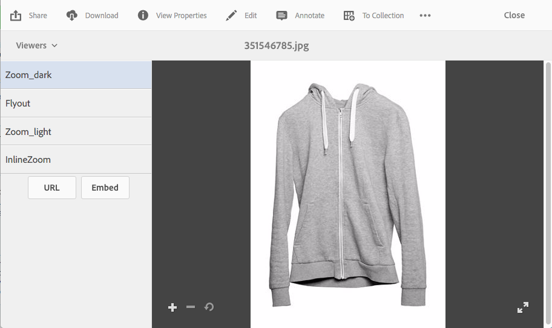

# Apply Dynamic Media viewer presets {#applying-viewer-presets}

A Viewer Preset is a collection of settings that determine how users view rich-media assets on their computer screens and mobile devices. You can apply any viewer presets created by your administrator to an asset.

If you are an administrator and must manage, create, sort, and delete viewer presets, see [Manage Viewer Presets](managing-viewer-presets.md).

See also [Publish Viewer Presets](managing-viewer-presets.md#publishing-viewer-presets).

You do not need to publish viewer presets depending on what publish mode you are using.
Any problems with viewer presets, see [Troubleshoot Dynamic Media - Scene7](troubleshoot-dms7.md#viewers).

## Apply a Dynamic Media viewer preset to an asset {#applying-a-viewer-preset-to-an-asset}

1. Open the asset and in the left rail, and select **[!UICONTROL Viewers]**.

   

   * The **[!UICONTROL URL]** and **[!UICONTROL Embed]** buttons appear after you select a viewer preset.
   * The system shows numerous viewer presets when you select Viewers in an asset's **[!UICONTROL Detail View]**. You can increase the number of presets seen. See [Increase the number of viewer presets that are displayed](managing-viewer-presets.md).

1. Select a viewer from the left pane so you can apply it to the asset as seen in the right pane. You can also [copy the URL to share](linking-urls-to-yourwebapplication.md) with others users.

## Obtain viewer preset URLs {#obtaining-viewer-preset-urls}

To get the URLs for Viewer Presets, see [Link URLs to your web application](linking-urls-to-yourwebapplication.md).
