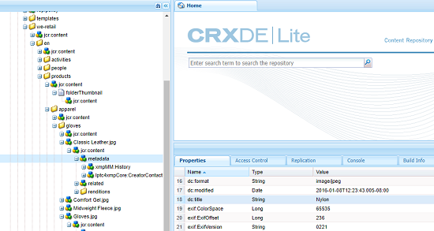
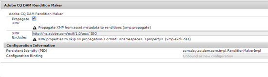
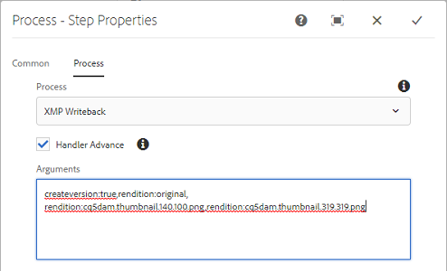
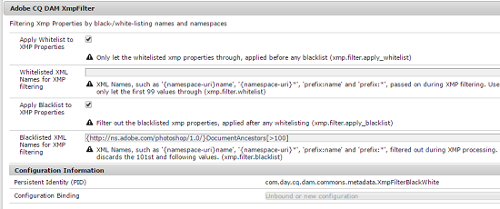

# XMP writeback to renditions {#xmp-writeback-to-renditions}

This XMP Writeback feature in Adobe Experience Manager (AEM) Assets replicates asset metadata changes to the renditions of the asset.

When you change the metadata for an asset from within AEM Assets or while uploading the asset, changes are initially stored within the asset node in Crx-De.

The XMP Writeback feature propagates the metadata changes to all or specific renditions of the asset.

Consider a scenario where you modify the Title property of the asset titled "**Classic Leather**" to "**Nylon**."

In this case, the AEM Assets saves the changes to the **[!UICONTROL Title]** property in the `dc:title` parameter for the asset metadata stored in the asset hierarchy.

However, AEM Assets does not automatically propagate any metadata changes to the renditions of an asset.

The XMP Writeback feature lets you propagate the metadata changes to all or specific renditions of the asset. However, the changes are not stored under the metadata node in the asset hierarchy. Instead, this feature embeds the changes in the binary files for the renditions.

## Enabling XMP writeback {#enabling-xmp-writeback}

To enable the metadata changes to be propagated to the renditions of the asset when uploading it, modify the **Adobe CQ DAM Rendition Maker** configuration in Configuration Manager.

1. Open Configuration Manager from *https://&lt;Server&gt;:&lt;Port&gt;/system/console/configMgr*.
1. Open the **[!UICONTROL Adobe CQ DAM Rendition Maker]** configuration.
1. Select the **[!UICONTROL Propagate XMP]** option, and then save the changes. 

   

## Enabling XMP writeback for specific renditions {#enabling-xmp-writeback-for-specific-renditions}

To let the XMP Writeback feature propagate metadata changes to select renditions, specify these renditions to the XMP Writeback Process workflow step of DAM Metadata WriteBack workflow. By default, this step is configured with the original rendition.

For the XMP Writeback feature to propagate metadata to the rendition thumbnails 140.100.png and 319.319.png, perform these steps.

1. Tap/click the AEM logo, and then navigate to **[!UICONTROL Tools > Workflow > Models]**.
1. From the Models page, open the **DAM Metadata Writeback** workflow model.
1. In the **[!UICONTROL DAM Metadata Writeback]** properties page, open the **[!UICONTROL XMP Writeback Process]** step.
1. In the Step Properties dialog box, tap/click the **[!UICONTROL Process]** tab.
1. In the **[!UICONTROL Arguments]** box, add `rendition:cq5dam.thumbnail.140.100.png,rendition:cq5dam.thumbnail.319.319.png`, andd then tap/click **[!UICONTROL OK]**.

   

1. Save the changes.
1. To regenerate the pyramid TIF renditions for Dynamic Media images with the new attributes, add the **[!UICONTROL Dynamic Media Process Image Assets]** step to the DAM Metadata Writeback workflow.
PTIFF renditions are only created and stored locally in a Dynamic Media Hybrid implementation.

1. Save the workflow.

The metadata changes are propagated to the renditions renditions thumbnail.140.100.png and thumbnail.319.319.png of the asset, and not the others.

>[!NOTE]
>
>For XMP writeback issues in 64 bit Linux, see [How to enable XMP write-back on 64-bit RedHat Linux](https://helpx.adobe.com/experience-manager/kb/enable-xmp-write-back-64-bit-redhat.html).
>
>For more information about supported platforms, see [XMP metadata write-back prerequisites](/help/sites-deploying/technical-requirements.md#requirements-for-aem-assets-xmp-metadata-write-back).

## Filtering XMP metadata {#filtering-xmp-metadata}

AEM Assets supports both blacklist and whitelist filtering of properties/nodes for XMP metadata that is read from asset binaries and stored in JCR when assets are ingested.

Blacklist filtering lets you import all XMP metadata properties except the properties that are specified for exclusion. However, for asset types such as INDD files that have huge amounts of XMP metadata (for example 1000 nodes with 10,000 properties), the names of nodes to be filtered are not always known in advance. If blacklist filtering allows a large number of assets with numerous XMP metadata to be imported, the AEM instance/cluster can encounter stability issues, for example clogged observation queues.

Whitelist filtering of XMP metadata resolves this issue by letting you define the XMP properties to be imported. This way, other/unknown XMP properties are ignored. You can add some of these properties to the blacklist filter for backward compatibility.

>[!NOTE]
>
>Filtering works only for the properties derived from XMP sources in asset binaries. For the properties derived from non-XMP sources, such as EXIF and IPTC formats, the filtering does not work. For example, the date of asset creation is stored in property named `CreateDate` in EXIF TIFF. AEM stories this value in the metadata field named `exif:DateTimeOriginal`. As the source is a non-XMP source, filtering does not work on this property.

1. Open Configuration Manager from *https://&lt;Server&gt;:&lt;Port&gt;/system/console/configMgr*.
1. Open the **[!UICONTROL Adobe CQ DAM XmpFilter]** configuration.
1. To apply whitelist filtering, select **[!UICONTROL Apply Whitelist to XMP Properties]**, and specify the properties to be imported in the **[!UICONTROL Whitelisted XML Names for XMP filtering]** box.

   

1. To filter out blacklisted XMP properties after applying whitelist filtering, specify them in the **[!UICONTROL Blacklisted XML Names for XMP filtering]** box.

   >[!NOTE]
   >
   >The **[!UICONTROL Apply Blacklist to XMP Properties]** option is selected by default. In other words, blacklist filtering is enabled by default. To disable blacklist filtering, unselect the **[!UICONTROL Apply Blacklist to XMP Properties]** option.

1. Save the changes.

