# Customize AEM CIF Core Components {#customize-cif-components}

The [CIF Venia Project](https://github.com/adobe/aem-cif-guides-venia) is a reference code base for using [CIF Core Components](https://github.com/adobe/aem-core-cif-components). In this tutorial you will further extend the [Product Teaser](https://github.com/adobe/aem-core-cif-components/tree/master/ui.apps/src/main/content/jcr_root/apps/core/cif/components/commerce/productteaser/v1/productteaser) component to display a custom attribute from Magento. You will also learn more about the GraphQL integration between AEM and Magento and the extension hooks provided by the CIF Core Components.

>[!TIP]
>
> Use the [AEM Project archetype](https://github.com/adobe/aem-project-archetype) when starting your own commerce implementation.

## What You Will Build

The Venia brand recently started manufacturing some products using sustainable materials and the business would like to display an **Eco Friendly** badge as part of the Product Teaser. A new custom attribute will be created in Magento to indicate if a product uses the **Eco friendly** material. This custom attribute will then be added as part of the GraphQL query and displayed on the Product Teaser for specified products.

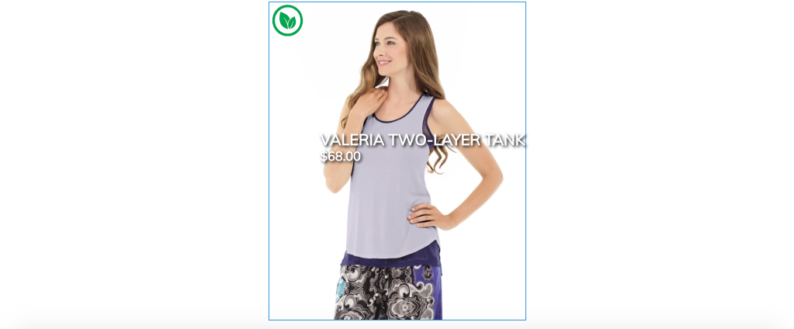

## Prerequisites {#prerequisites}

A local development environment is required to complete this tutorial. This includes a running instance of AEM that is configured and connected to a Magento instance. Review the requirements and steps for [setting up a local development with AEM as a Cloud Service SDK](../develop.md). To follow the tutorial completely, you will need permissions to add [Attributes to a Product](https://docs.magento.com/user-guide/catalog/product-attributes-add.html) in Magento.

You will also need GraphQL IDE such as [GraphiQL](https://github.com/graphql/graphiql) or a browser extension to run the code samples and tutorials. If you install a browser extension, make sure it has the ability to set request headers. On Google Chrome, [Altair GraphQL Client](https://chrome.google.com/webstore/detail/altair-graphql-client/flnheeellpciglgpaodhkhmapeljopja) is one extension that can do the job.

## Clone the Venia Project {#clone-venia-project}

We will clone the [Venia Project](https://github.com/adobe/aem-cif-guides-venia) and then override the default styles.

>[!NOTE]
>
> **Feel free to use an existing project** (based on the AEM Project Archetype with CIF included) and skip this section.

1. Run the following git command to clone the project:

   ```shell
   $ git clone git@github.com:adobe/aem-cif-guides-venia.git
   ```

1. Build and deploy the project to a local instance of AEM:

   ```shell
   $ cd aem-cif-guides-venia/
   $ mvn clean install -PautoInstallPackage,cloud
   ```

1. Add the necessary OSGi configurations to connect your AEM instance to a Magento instance or add the configurations to the newly created project.

1. At this point you should have a working version of a storefront that is connected to a Magento instance. Navigate to the `US` > `Home` page at: [http://localhost:4502/editor.html/content/venia/us/en.html](http://localhost:4502/editor.html/content/venia/us/en.html).

   You should see that the storefront currently is using the Venia theme. Expanding the Main Menu of the storefront, you should see various categories, indicating that the connection Magento is working.

   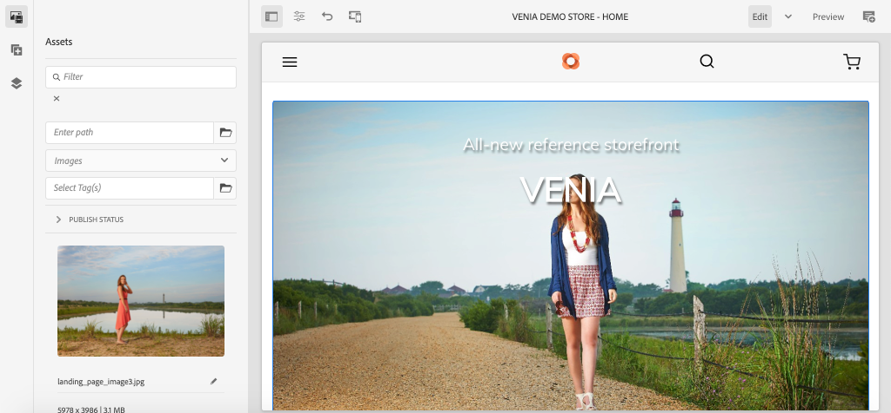

## Author the Product Teaser {#author-product-teaser}

The Product Teaser Component will be extended throughout this tutorial. As a first step, add a new instance of the Product Teaser to the Home page to understand the baseline functionality.

1. Navigate to the **Home Page** of the site: [http://localhost:4502/editor.html/content/acme/us/en.html](http://localhost:4502/editor.html/content/acme/us/en.html)

2. Insert a new **Product Teaser** Component into the main layout container on the page.

   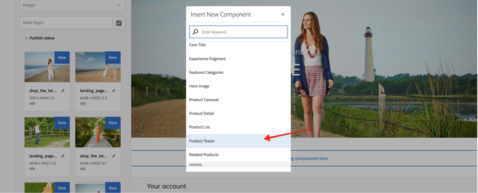

3. Expand the Side Panel (if not already toggled) and switch the asset finder dropdown to **Products**. This should display a list of available products from a connected Magento instance. Select a product and **drag+drop** it onto the **Product Teaser** component on the page.

   

   >[!NOTE]
   >
   > Note, you can also configure the displayed product by configuring the component using the dialog (clicking the _wrench_ icon).

4. You should now see a Product being displayed by the Product Teaser. The Name of the product and the Price of the product are default attributes that are displayed.

   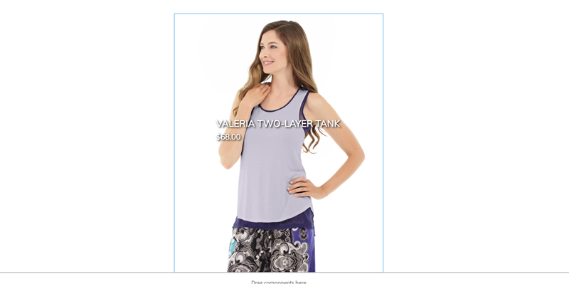

## Add a Custom Attribute in Magento {#add-custom-attribute}

The products and product data displayed in AEM are stored in Magento. Next add a new attribute for **Eco Friendly** as part of the product attribute set by using the Magento UI.

>[!TIP]
>
> Already have a custom **Yes/No** attribute as part of your product attribute set? Feel free to use it and skip this section.

1. Login to your Magento instance.
1. Navigate to **Catalog** > **Products**.
1. Update the search filter to find the **Configurable Product** used when added to the Teaser component in the previous exercise. Open the product in edit mode.

   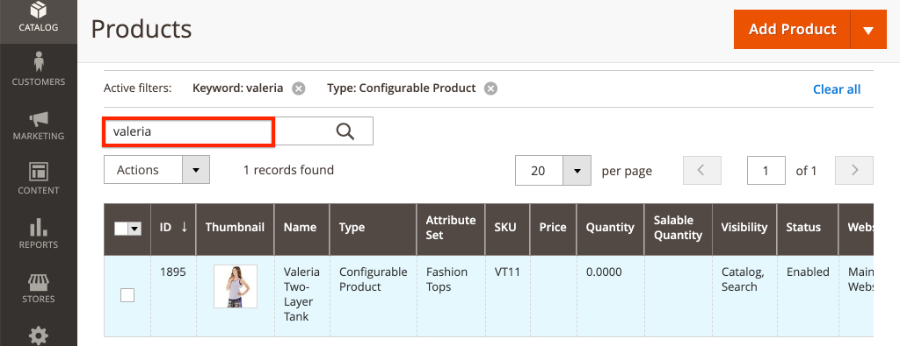

1. From the product view, click **Add Attribute** > **Create New Attribute**.
1. Fill out the **New Attribute** form with the following values (leave default settings for other values)

   | Field Set                     | Field Label        | Value            |
   | ----------------------------- | ------------------ | ---------------- |
   | Attribute Properties          | Attribute Label    | **Eco Friendly** |
   | Attribute Properties          | Catalog Input Type | **Yes/No**       |
   | Advanced Attribute Properties | Attribute Code     | **eco_friendly** |

   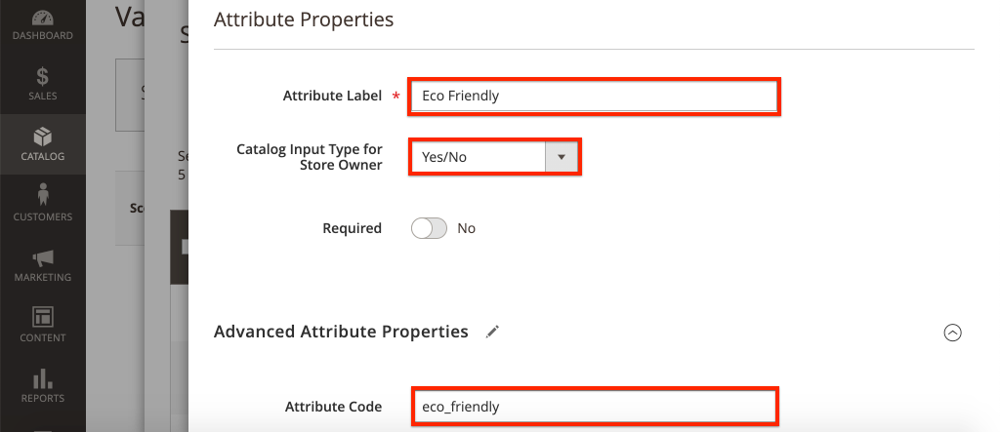

   Click **Save Attribute** when finished.

1. Scroll to the bottom of the product and expand the **Attributes** heading. You should see the new **Eco Friendly** field. Switch the toggle to **Yes**.

   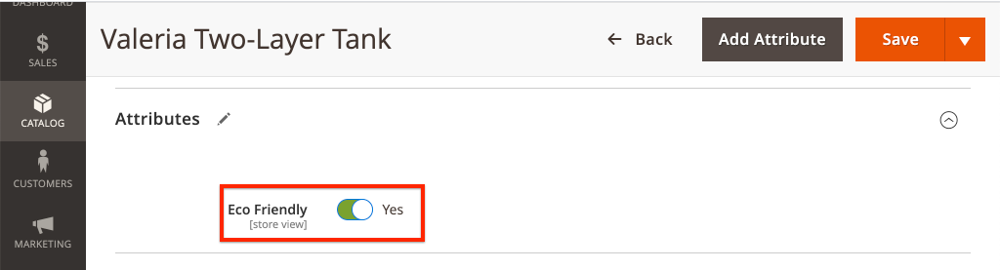

   **Save** the changes to the product.

   >[!TIP]
   >
   > More details about managing [Product Attributes can be found in the Magento user guide](https://docs.magento.com/user-guide/catalog/attribute-best-practices.html).

1. Navigate to **System** > **Tools** > **Cache Management**. Since an update has been made to the data schema we need to invalidate some of the Cache Types in Magento.
1. Check the box next to **Configuration** and submit the cache type for **Refresh**

   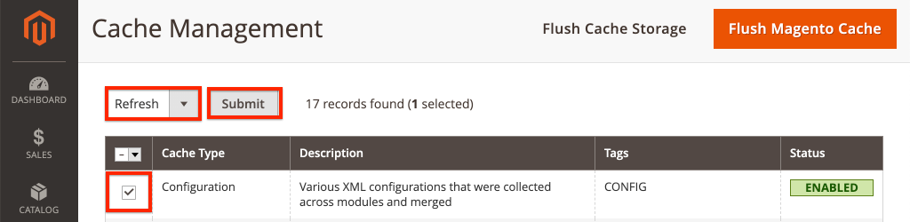

   >[!TIP]
   >
   > More details about [Cache Management can be found in the Magento user guide](https://docs.magento.com/user-guide/system/cache-management.html).

## Use a GraphQL IDE to Verify Attribute {#use-graphql-ide}

Before jumping into AEM code it is useful to explore the [Magento GraphQL](https://devdocs.magento.com/guides/v2.4/graphql/) using a GraphQL IDE. The Magento integration with AEM is primarily done via a series of GraphQL queries. Understanding and modifying the GraphQL queries is one of the key ways in which the CIF Core Components can be extended.

Next, use a GraphQL IDE to verify that the `eco_friendly` attribute has been added to the product attribute set. Screenshots in this tutorial are using the [Altair GraphQL Client](https://chrome.google.com/webstore/detail/altair-graphql-client/flnheeellpciglgpaodhkhmapeljopja).

1. Open the GraphQL IDE and enter the URL `http://<magento-server>/graphql` in the URL bar of your IDE or extension.
2. Add the following [products query](https://devdocs.magento.com/guides/v2.4/graphql/queries/products.html) where `YOUR_SKU` is the **SKU** of the product used in the previous exercise:

   ```json
     {
       products(
       filter: { sku: { eq: "YOUR_SKU" } }
       ) {
           items {
           name
           sku
           eco_friendly
           }
       }
   }
   ```

3. Execute the query and you should get a response like the following:

   ```json
   {
     "data": {
       "products": {
         "items": [
           {
             "name": "Valeria Two-Layer Tank",
             "sku": "VT11",
             "eco_friendly": 1
           }
         ]
       }
     }
   }
   ```

   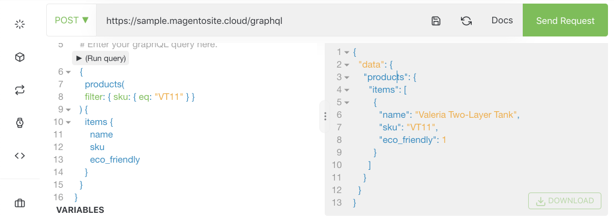

   Note that the value of **Yes** is an integer of **1**. This will be useful when we write the GraphQL query in Java.

   >[!TIP]
   >
   > More detailed documentation about [Magento GraphQL can be found here](https://devdocs.magento.com/guides/v2.4/graphql/index.html).

## Update the Sling Model for the Product Teaser {#updating-sling-model-product-teaser}

Next, we will extend the business logic of the Product Teaser by implementing a Sling Model. [Sling Models](https://sling.apache.org/documentation/bundles/models.html), are annotation driven "POJOs" (Plain Old Java Objects) that implement any of the business logic needed by the component. Sling Models are used in conjunction with the HTL scripts as part of the component. We will follow the [delegation pattern for Sling Models](https://github.com/adobe/aem-core-wcm-components/wiki/Delegation-Pattern-for-Sling-Models) so that we can just extend parts of the existing Product Teaser model.

Sling Models are implemented as Java and can be found in the **core** module of the generated project.

Use [the IDE of your choice](https://docs.adobe.com/content/help/en/experience-manager-learn/cloud-service/local-development-environment-set-up/development-tools.html#set-up-the-development-ide) to import the Venia project. Screenshots used are from the [Visual Studio Code IDE](https://docs.adobe.com/content/help/en/experience-manager-learn/cloud-service/local-development-environment-set-up/development-tools.html#microsoft-visual-studio-code).

1. In your IDE, navigate under the **core** module to: `core/src/main/java/com/venia/core/models/commerce/MyProductTeaser.java`.

   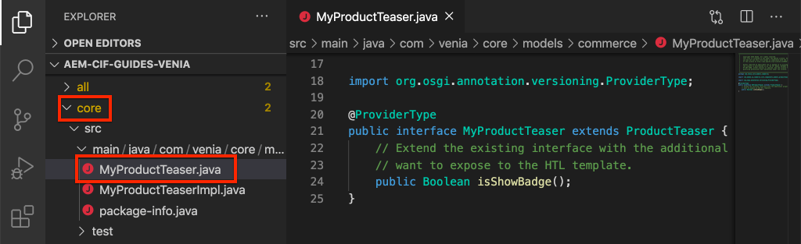

   `MyProductTeaser.java` is a Java Interface that that extends the CIF [ProductTeaser](https://github.com/adobe/aem-core-cif-components/blob/master/bundles/core/src/main/java/com/adobe/cq/commerce/core/components/models/productteaser/ProductTeaser.java) interface.

   Already a new method has been added named `isShowBadge()` to display a badge if the product is considered "New".

1. Add a new method, `isEcoFriendly()` to the interface:

   ```java
   @ProviderType
   public interface MyProductTeaser extends ProductTeaser {
       // Extend the existing interface with the additional properties which you
       // want to expose to the HTL template.
       public Boolean isShowBadge();

       public Boolean isEcoFriendly();
   }
   ```

   This is a new method we will introduce to encapsulate the logic to indicate if the product has the `eco_friendly` attribute set to **Yes** or **No**.

1. Next, inspect the `MyProductTeaserImpl.java` at `core/src/main/java/com/venia/core/models/commerce/MyProductTeaserImpl.java`.

   The [delegation pattern for Sling Models](https://github.com/adobe/aem-core-wcm-components/wiki/Delegation-Pattern-for-Sling-Models) allows `MyProductTeaserImpl` to reference `ProductTeaser` model via the `sling:resourceSuperType` property:

   ```java
   @Self
   @Via(type = ResourceSuperType.class)
   private ProductTeaser productTeaser;
   ```

   For all of the methods that we don't want to override or change, we can simply return the value that the `ProductTeaser` returns. For example:

   ```java
   @Override
   public String getImage() {
       return productTeaser.getImage();
   }
   ```

   This minimizes the amount of Java code an implementation needs to write.

1. One of the extra extension points provided by AEM CIF Core Components is the `AbstractProductRetriever` which provides access to specific product attributes. Inspect the `initModel()` method:

   ```java
   import javax.annotation.PostConstruct;
   ...
   @Model(adaptables = SlingHttpServletRequest.class, adapters = MyProductTeaser.class, resourceType = MyProductTeaserImpl.RESOURCE_TYPE)
   public class MyProductTeaserImpl implements MyProductTeaser {
       ...
       private AbstractProductRetriever productRetriever;

       /* add this method to intialize the proudctRetriever */
       @PostConstruct
       public void initModel() {
           productRetriever = productTeaser.getProductRetriever();

           if (productRetriever != null) {
               productRetriever.extendProductQueryWith(p -> p.createdAt());
           }

       }
   ...

   ```

   The `@PostConstruct` annotation ensures that this method is called as soon as the Sling Model is initialized.

   Notice that that the product GraphQL query has already been extended using the `extendProductQueryWith` method to retrieve the additional `created_at` attribute. This attribute is later used as part of the `isShowBadge()` method.

1. Update the GraphQL query to include the `eco_friendly` attribute in the partial query:

   ```java
   //MyProductTeaserImpl.java

   private static final String ECO_FRIENDLY_ATTRIBUTE = "eco_friendly";

   @PostConstruct
   public void initModel() {
       productRetriever = productTeaser.getProductRetriever();

       if (productRetriever != null) {
           productRetriever.extendProductQueryWith(p ->
                productRetriever.extendProductQueryWith(p -> p
                   .createdAt()
                   .addCustomSimpleField(ECO_FRIENDLY_ATTRIBUTE)
               );
           );
       }
   }
   ```

   Adding to the `extendProductQueryWith` method is a powerful way to ensure additional product attributes are available to the rest of the model. It also minimizes the number of queries executed.

   In the above code the`addCustomSimpleField` is used to retrieve the `eco_friendly` attribute. This illustrates how you can query for any custom attributes that are part of the Magento schema.

   >[!NOTE]
   >
   > The `createdAt()` method has actually been implemented as part of the [Product Interface](https://github.com/adobe/commerce-cif-magento-graphql/blob/master/src/main/java/com/adobe/cq/commerce/magento/graphql/ProductInterface.java). Most of the commonly found schema attributes have been implemented, so only use the `addCustomSimpleField` for truly custom attributes.

1. Add a logger to help debug the Java code:

   ```java
   import org.slf4j.Logger;
   import org.slf4j.LoggerFactory;
   ...
   @Model(adaptables = SlingHttpServletRequest.class, adapters = MyProductTeaser.class, resourceType = MyProductTeaserImpl.RESOURCE_TYPE)
   public class MyProductTeaserImpl implements MyProductTeaser {

   private static final Logger LOGGER = LoggerFactory.getLogger(MyProductTeaserImpl.class);
   ```

1. Next, implement the `isEcoFriendly()` method:

   ```java
   @Override
   public Boolean isEcoFriendly() {

       Integer ecoFriendlyValue;
       try {
           ecoFriendlyValue = productRetriever.fetchProduct().getAsInteger(ECO_FRIENDLY_ATTRIBUTE);
           if(ecoFriendlyValue != null && ecoFriendlyValue.equals(Integer.valueOf(1))) {
               LOGGER.info("*** Product is Eco Friendly**");
               return true;
           }
       } catch (SchemaViolationError e) {
           LOGGER.error("Error retrieving eco friendly attribute");
       }
       LOGGER.info("*** Product is not Eco Friendly**");
       return false;
   }
   ```

   In the above method the `productRetriever` is used to fetch the product and the `getAsInteger()` method is used to get the value of the `eco_friendly` attribute. Based on the GraphQL queries we ran earlier we know that the expected value when the `eco_friendly` attribute is set to "**Yes**" is actually an integer of **1**.

   Now that the Sling Model has been updated, the Component markup needs to be updated to actually display an indicator of **Eco Friendly** based on the Sling Model.

## Customizing the Markup of the Product Teaser {#customize-markup-product-teaser}

A common extension of AEM components is to modify the markup generated by the component. This is done by overriding the [HTL script](https://docs.adobe.com/content/help/en/experience-manager-htl/using/overview.html) that the component uses to render its markup. HTML Template Language (HTL), is a lightweight templating language that AEM components use to dynamically render markup based on authored content, allowing the components to be re-used. The Product Teaser, for example, can be re-used over and over again to display different products.

In our case we want to render a banner on top of the teaser to indicate that the product is "Eco Friendly" based on a custom attribute. The design pattern for [customizing the markup](https://docs.adobe.com/content/help/en/experience-manager-core-components/using/developing/customizing.html#customizing-the-markup) of a component is actually standard for all AEM Components, not just for the AEM CIF Core Components.

1. In the IDE, navigate and expand the `ui.apps` module and expand the folder hierarchy to: `ui.apps/src/main/content/jcr_root/apps/venia/components/commerce/productteaser` and inspect the `.content.xml` file.

   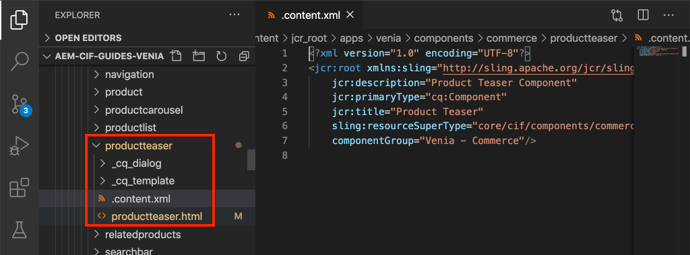

   ```xml
   <?xml version="1.0" encoding="UTF-8"?>
   <jcr:root xmlns:sling="http://sling.apache.org/jcr/sling/1.0" xmlns:cq="http://www.day.com/jcr/cq/1.0" xmlns:jcr="http://www.jcp.org/jcr/1.0"
       jcr:description="Product Teaser Component"
       jcr:primaryType="cq:Component"
       jcr:title="Product Teaser"
       sling:resourceSuperType="core/cif/components/commerce/productteaser/v1/productteaser"
       componentGroup="Venia - Commerce"/>
   ```

   Above is the Component definition for the Product Teaser Component in our project. Notice the property `sling:resourceSuperType="core/cif/components/commerce/productteaser/v1/productteaser"`. This is an example of creating a [Proxy component](https://docs.adobe.com/content/help/en/experience-manager-core-components/using/get-started/using.html#create-proxy-components). Instead of copying and pasting all of the Product Teaser HTL scripts from the AEM CIF Core Components, we can use the `sling:resourceSuperType` to inherit all of the functionality.

1. Open the file `productteaser.html`. This is a copy of the `productteaser.html` file from the [CIF Product Teaser](https://github.com/adobe/aem-core-cif-components/blob/master/ui.apps/src/main/content/jcr_root/apps/core/cif/components/commerce/productteaser/v1/productteaser/productteaser.html)

   ```html
   <!--/* productteaser.html */-->
   <sly
     data-sly-use.product="com.venia.core.models.commerce.MyProductTeaser"
     data-sly-use.templates="core/wcm/components/commons/v1/templates.html"
     data-sly-use.actionsTpl="actions.html"
     data-sly-test.isConfigured="${properties.selection}"
     data-sly-test.hasProduct="${product.url}"
   ></sly>
   ```

   Notice that the Sling Model for `MyProductTeaser` is used and assigned to the `product` variable.

1. Modify `productteaser.html` to make a call to the `isEcoFriendly` method implemented in the previous exercise:

   ```html
   ...
   <div
     data-sly-test="${isConfigured && hasProduct}"
     class="item__root"
     data-cmp-is="productteaser"
     data-virtual="${product.virtualProduct}"
   >
     <div data-sly-test="${product.showBadge}" class="item__badge">
       <span>${properties.text || 'New'}</span>
     </div>
     <!--/* Insert call to Eco Friendly here */-->
     <div data-sly-test="${product.ecoFriendly}" class="item__eco">
       <span>Eco Friendly</span>
     </div>
     ...
   </div>
   ```

   When calling a Sling Model method in HTL the `get` and `is` portion of the method is dropped and the first letter is lowercased. So `isShowBadge()` becomes `.showBadge` and `isEcoFriendly` becomes `.ecoFriendly`. Based on the boolean value returned from `.isEcoFriendly()` determines if the `<span>Eco Friendly</span>` is displayed.

   More information about `data-sly-test` and other [HTL block statements can be found here](https://docs.adobe.com/content/help/en/experience-manager-htl/using/htl/block-statements.html#test).

1. Save the changes and deploy the updates to AEM using your Maven skills, from a command line terminal:

   ```shell
   $ cd aem-cif-guides-venia/
   $ mvn clean install -PautoInstallPackage,cloud
   ```

1. Open a new browser window and navigate to AEM and the **OSGi console** > **Status** > **Sling Models**: [http://localhost:4502/system/console/status-slingmodels](http://localhost:4502/system/console/status-slingmodels)

1. Search for `MyProductTeaserImpl` and you should see a line like the following:

   ```plain
   com.venia.core.models.commerce.MyProductTeaserImpl - venia/components/commerce/productteaser
   ```

   This indicates that the Sling Model has been properly deployed and mapped to the correct component.

1. Refresh to the **Venia Home Page** at [http://localhost:4502/editor.html/content/venia/us/en.html](http://localhost:4502/editor.html/content/venia/us/en.html) where the Product Teaser has been added.

   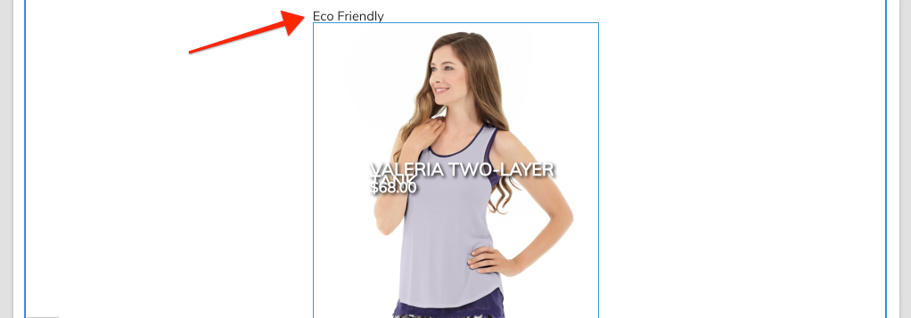

   If the product has the `eco_friendly` attribute set to **Yes**, you should see the text "Eco Friendly" on the page. Try switching to different products to see the behavior change.

1. Next open up the AEM `error.log` to see the log statements we added. The `error.log` is located at `<AEM SDK Install Location>/crx-quickstart/logs/error.log`.

   Search the AEM logs to see the log statements added in the Sling Model:

   ```plain
   2020-08-28 12:57:03.114 INFO [com.venia.core.models.commerce.MyProductTeaserImpl] *** Product is Eco Friendly**
   ...
   2020-08-28 13:01:00.271 INFO [com.venia.core.models.commerce.MyProductTeaserImpl] *** Product is not Eco Friendly**
   ...
   ```

   >[!CAUTION]
   >
   > You also may see some stack traces if the product used in the teaser does not have the `eco_friendly` attribute as part of it's attribute set.

## Add Styles for the Eco Friendly Badge {#add-styles}

At this point the logic for when to display the **Eco Friendly** badge is working, however the plain text could use some styles. Next add an icon and styles to the `ui.frontend` module to complete the implementation.

1. Download the [eco_friendly.svg](../assets/customize-cif-components/eco_friendly.svg) file. This will be used as the **Eco Friendly** badge.
1. Return to the IDE and navigate to the `ui.frontend` folder.
1. Add the `eco_friendly.svg` file to the `ui.frontend/src/main/resources/images` folder:

   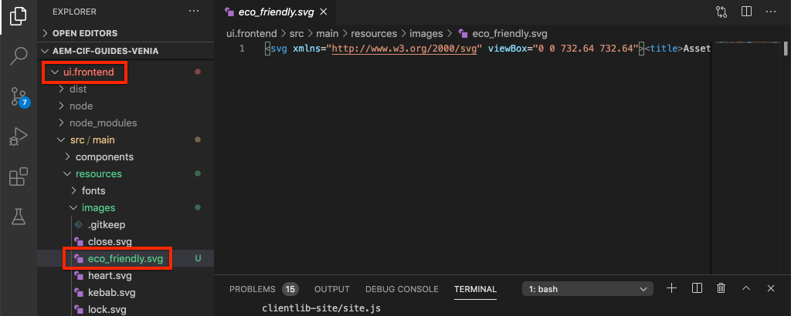

1. Open the file `productteaser.scss` at `ui.frontend/src/main/styles/commerce/_productteaser.scss`.
1. Add the following Sass rules inside the `.productteaser` class:

   ```scss
   .productteaser {
       ...
       .item__eco {
           width: 60px;
           height: 60px;
           left: 0px;
           overflow: hidden;
           position: absolute;
           padding: 5px;

       span {
           display: block;
           position: absolute;
           width: 45px;
           height: 45px;
           text-indent: -9999px;
           background: no-repeat center center url('../resources/images/eco_friendly.svg');
           }
       }
   ...
   }
   ```

   >[!NOTE]
   >
   > Check out [Styling CIF Core Components](./style-cif-component.md) for more details around front-end workflows.

1. Save the changes and deploy the updates to AEM using your Maven skills, from a command line terminal:

   ```shell
   $ cd aem-cif-guides-venia/
   $ mvn clean install -PautoInstallPackage,cloud
   ```

1. Refresh to the **Venia Home Page** at [http://localhost:4502/editor.html/content/venia/us/en.html](http://localhost:4502/editor.html/content/venia/us/en.html) where the Product Teaser has been added.

   

## Congratulations {#congratulations}

You just customized your first AEM CIF component! Download the [finished solution files here](../assets/customize-cif-components/customize-cif-component-SOLUTION_FILES.zip).

## Bonus Challenge {#bonus-challenge}

Review the functionality of the **New** badge that has already be implemented in the Product Teaser. Try to add an additional checkbox for authors to control when the **Eco Friendly** badge should be displayed. You will need to update the component dialog at `ui.apps/src/main/content/jcr_root/apps/venia/components/commerce/productteaser/_cq_dialog/.content.xml`.

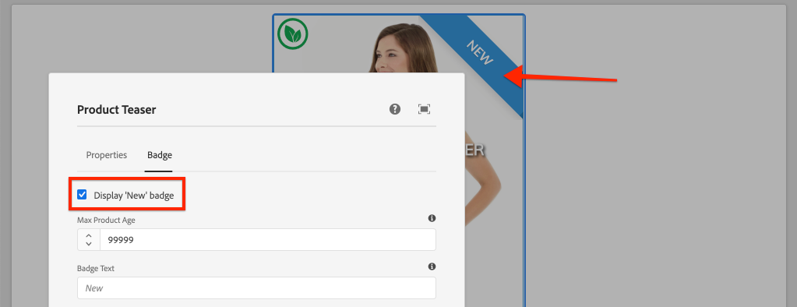

## Additional Resources {#additional-resources}

- [AEM Archetype](https://docs.adobe.com/content/help/en/experience-manager-core-components/using/developing/archetype/overview.html)
- [AEM CIF Core Components](https://github.com/adobe/aem-core-cif-components)
- [Customizing AEM CIF Core Components](https://github.com/adobe/aem-core-cif-components/wiki/Customizing-CIF-Core-Components)
- [Customizing Core Components](https://docs.adobe.com/content/help/en/experience-manager-core-components/using/developing/customizing.html)
- [Getting Started with AEM Sites](https://docs.adobe.com/content/help/en/experience-manager-learn/getting-started-wknd-tutorial-develop/overview.html)
