# Style AEM CIF Core Components {#style-aem-cif-core-components}

The [CIF Venia Project](https://github.com/adobe/aem-cif-guides-venia) is a reference code base for using [CIF Core Components](https://github.com/adobe/aem-core-cif-components). In this tutorial you will inspect the Venia reference project and understand how CSS and JavaScript used by AEM CIF Core components are organized. You will also create a new style using CSS to update the default style of the **Product Teaser** component.

>[!TIP]
>
> Use the [AEM Project archetype](https://github.com/adobe/aem-project-archetype) when starting your own commerce implementation.

## What You Will Build

In this tutorial a new style will be implemented for the Product Teaser component that resembles a card. Lessons learned in the tutorial can be applied to other CIF Core Components.


## Prerequisites {#prerequisites}

A local development environment is required to complete this tutorial. This includes a running instance of AEM that is configured and connected to a Magento instance. Review the requirements and steps for [setting up a local development with AEM as a Cloud Service SDK](../develop.md).

## Clone the Venia Project {#clone-venia-project}

We will clone the [Venia Project](https://github.com/adobe/aem-cif-guides-venia) and then override the default styles.

>[!NOTE]
>
> **Feel free to use an existing project** (based on the AEM Project Archetype with CIF included) and skip this section.

1. Run the following git command to clone the project:

    ```shell
    $ git clone git@github.com:adobe/aem-cif-guides-venia.git
    ```

1. Build and deploy the project to a local instance of AEM:

    ```shell
    $ cd aem-cif-guides-venia/
    $ mvn clean install -PautoInstallPackage,cloud
    ```

1. Add the necessary OSGi configurations to connect your AEM instance to a Magento instance or add the configurations to the newly created project.

1. At this point you should have a working version of a storefront that is connected to a Magento instance. Navigate to the `US` > `Home` page at: [http://localhost:4502/editor.html/content/venia/us/en.html](http://localhost:4502/editor.html/content/venia/us/en.html).

    You should see that the storefront currently is using the Venia theme. Expanding the Main Menu of the storefront, you should see various categories, indicating that the connection Magento is working.

    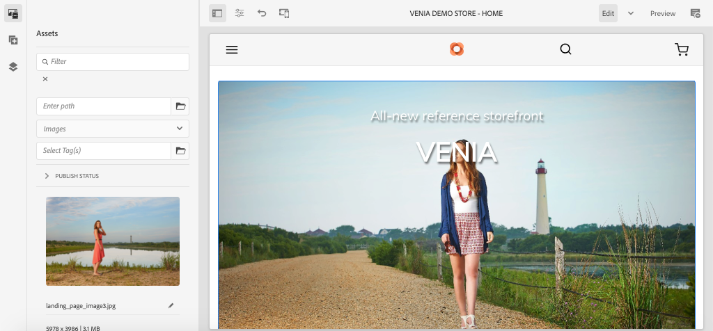

## Client Libraries and ui.frontend Module {#introduction-to-client-libraries}

The CSS and JavaScript responsible for rendering the theme/styles of the storefront is managed in AEM by a [Client library](/help/implementing/developing/introduction/clientlibs.md) or clientlibs for short. Client libraries provide a mechanism to organize CSS and Javascript in a project's code and then deliver onto the page.

Brand specific styles can be applied to AEM CIF Core Components by adding and overriding the CSS managed by these client libraries. Understanding how client libraries are structured and included on the page is critical.

The [ui.frontend](https://docs.adobe.com/content/help/en/experience-manager-core-components/using/developing/archetype/uifrontend.html) is a dedicated [webpack](https://webpack.js.org/) project to manage all of the front-end assets for a project. This allows front-end developers to use any number of languages and technologies like [TypeScript](https://www.typescriptlang.org/), [Sass](https://sass-lang.com/) and much more.

The `ui.frontend` module is also a Maven module and integrated with the larger project through the use of an NPM module the [aem-clientlib-generator](https://github.com/wcm-io-frontend/aem-clientlib-generator). During a build, the `aem-clientlib-generator` copies the compiled CSS and JavaScript files into a Client Library in the `ui.apps` module.

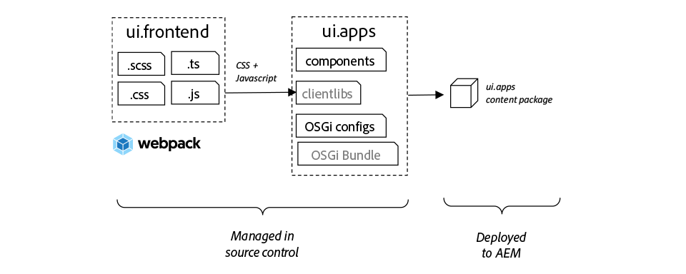

*Compiled CSS and Javascript are copied from the `ui.frontend` module into the `ui.apps` module as a Client library during a Maven build*

## Update the Teaser Style {#ui-frontend-module}

Next, make a small change to the Teaser style to see how the `ui.frontend` module and client libraries work. Use [the IDE of your choice](https://docs.adobe.com/content/help/en/experience-manager-learn/cloud-service/local-development-environment-set-up/development-tools.html#set-up-the-development-ide) to import the Venia project. Screenshots used are from the [Visual Studio Code IDE](https://docs.adobe.com/content/help/en/experience-manager-learn/cloud-service/local-development-environment-set-up/development-tools.html#microsoft-visual-studio-code).

1. Navigate and expand the **ui.frontend** module and expand the folder hierarchy to: `ui.frontend/src/main/styles/commerce`:

    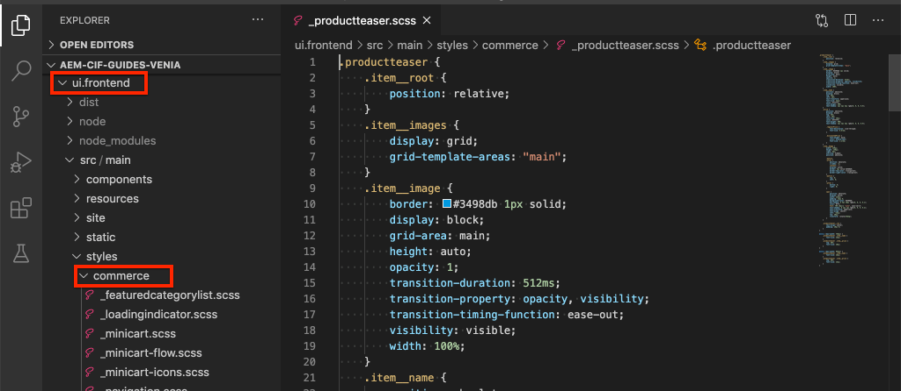

    Notice that there are multiple Sass (`.scss`) files beneath the folder. These are the Commerce specific styles for each of the Commerce components.

1. Open the file `_productteaser.scss`.

1. Update the `.item__image` rule and modify the border rule:

    ```scss
    .item__image {
        border: #ea00ff 8px solid; /* <-- modify this rule */
        display: block;
        grid-area: main;
        height: auto;
        opacity: 1;
        transition-duration: 512ms;
        transition-property: opacity, visibility;
        transition-timing-function: ease-out;
        visibility: visible;
        width: 100%;
    }
    ```

    The above rule should add a very bold pink border to the Product Teaser Component.

1. Open a new terminal window and navigate to the `ui.frontend` folder:

    ```shell
    $ cd <project-location>/aem-cif-guides-venia/ui.frontend
    ```

1. Run the following Maven command:

    ```shell
    $ mvn clean install
    ...
    [INFO] ------------------------------------------------------------------------
    [INFO] BUILD SUCCESS
    [INFO] ------------------------------------------------------------------------
    [INFO] Total time:  29.497 s
    [INFO] Finished at: 2020-08-25T14:30:44-07:00
    [INFO] ------------------------------------------------------------------------
    ```

    Inspect the terminal output. You will see that the Maven command executed several NPM scripts including `npm run build`. The `npm run build` command is defined in the `package.json` file and has the effect of compiling the webpack project and triggering the client library generation.

1. Inspect the file `ui.frontend/dist/clientlib-site/site.css`:

    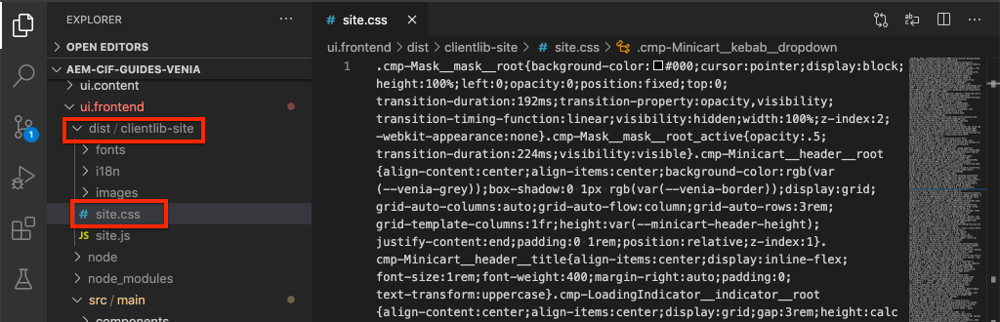

    The file is the compiled and minified version of all the Sass files in the project.

    >[!NOTE]
    >
    > Files like this are ignored from source control since they should be generated during build time.

1. Inspect the file `ui.frontend/clientlib.config.js`.

    ```js
    /* clientlib.config.js*/
    ...
    // Config for `aem-clientlib-generator`
    module.exports = {
        context: BUILD_DIR,
        clientLibRoot: CLIENTLIB_DIR,
        libs: [
            {
                ...libsBaseConfig,
                name: 'clientlib-site',
                categories: ['venia.site'],
                dependencies: ['venia.dependencies', 'aem-core-cif-react-components'],
                assets: {
    ...
    ```

    This is the configuration file for [aem-clientlib-generator](https://github.com/wcm-io-frontend/aem-clientlib-generator) and determines where and how the compiled CSS and JavaScript will transformed into an AEM client library.

1. In the `ui.apps` module inspect the file: `ui.apps/src/main/content/jcr_root/apps/venia/clientlibs/clientlib-site/css/site.css`:

    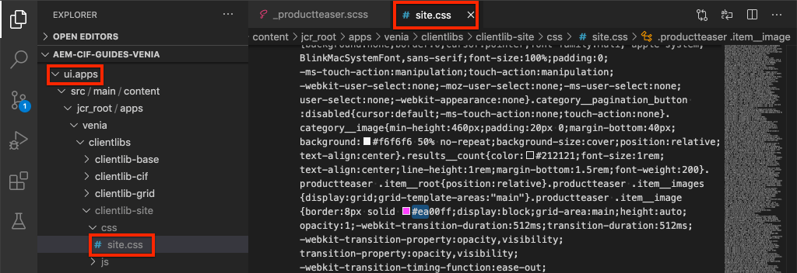

    This the copied `site.css` file into the `ui.apps` project. It is now part of a clientlibrary named `clientlib-site` with a category of `venia.site`. Once the file is part of the `ui.apps` module it can be deployed to AEM.

    >[!NOTE]
    >
    > Files like this are also ignored from source control since they should be generated during build time.

1. Next inspect the other client libraries generated by the project:

    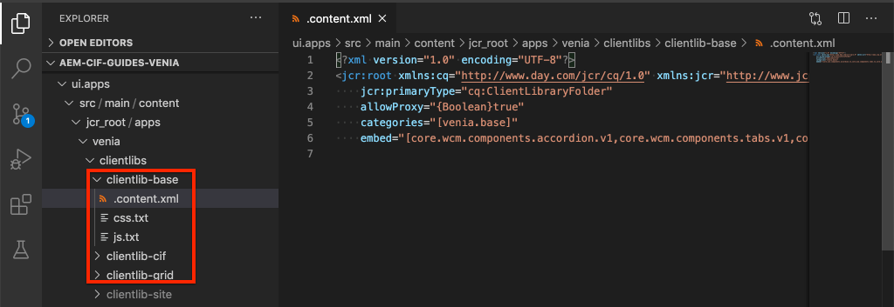

    These client libraries are not managed by the `ui.frontend` module. Instead these client libraries include CSS and JavaScript dependencies provided by Adobe. The definition for these clientlibraries is in the `.content.xml` file beneath each folder.

    **clientlib-base** - This is an empty client library that simply embeds the necessary dependencies from [AEM Core Components](https://docs.adobe.com/content/help/en/experience-manager-core-components/using/introduction.html). The category is `venia.base`.

    **clientlib-cif** - This is also an empty client library that simply embeds the necessary dependencies from [AEM CIF Core Components](https://github.com/adobe/aem-core-cif-components). The category is `venia.cif`.

    **clientlib-grid** - This includes the CSS needed to enable AEM's Responsive Grid feature. Using the AEM grid enables [Layout Mode](/help/sites-cloud/authoring/features/responsive-layout.md) in the AEM editor and gives content authors the ability to re-size components. The category is `venia.grid` and is embedded in the `venia.base` library.

1. Inspect the files `customheaderlibs.html` and `customfooterlibs.html` beneath `ui.apps/src/main/content/jcr_root/apps/venia/components/page`:

    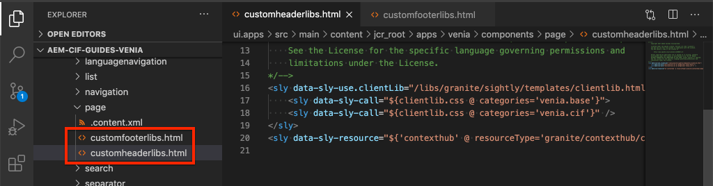

    These scripts include **venia.base** and **venia.cif** libraries as a part of all pages.

    >[!NOTE]
    >
    > Only the base libraries are "hard-coded" as part of the page scripts. `venia.site` is not included in these files and instead included as part of the page template for greater flexibility. This will be inspected later.

1. From the terminal, build and deploy the entire project to a local instance of AEM:

    ```shell
    $ cd aem-cif-guides-venia/
    $ mvn clean install -PautoInstallPackage,cloud
    ```

## Author a Product Teaser {#author-product-teaser}

Now that the code updates has been deployed, add a new instance of the Product Teaser component to the home page of the site using the AEM authoring tools. This will allow us to view the updated styles.

1. Open a new browser tab and navigate to the **Home Page** of the site: [http://localhost:4502/editor.html/content/venia/us/en.html](http://localhost:4502/editor.html/content/venia/us/en.html).

1. Expand the Asset finder (the side rail) in **Edit** mode. Switch the Asset filter to **Products**.

    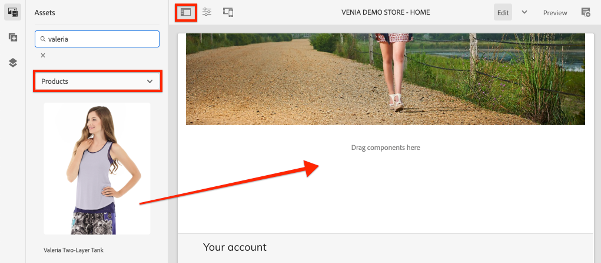

1. Drag and drop a new Product onto the home page in the main Layout Container:

    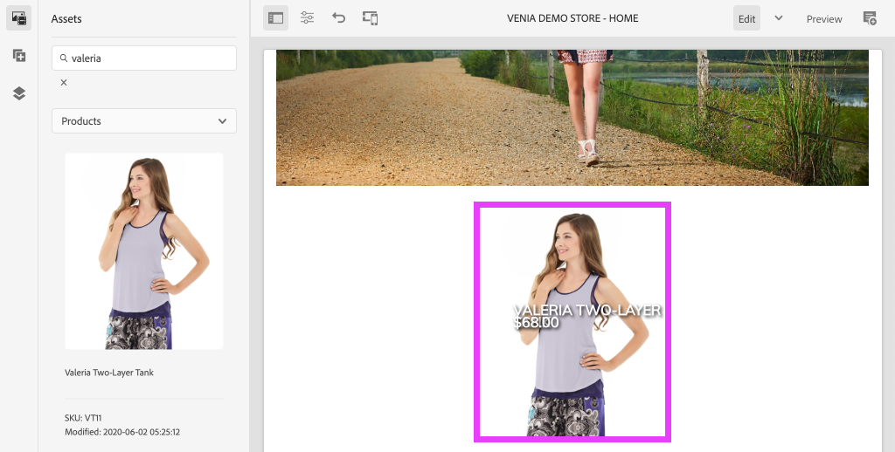

    You should see the Product Teaser now has a bright pink border based on the CSS rule change created earlier.

## Verify Client Libraries on the Page {#verify-client-libraries}

Next verify the inclusion of the client libraries on the page.

1. Navigate to the **Home Page** of the site: [http://localhost:4502/editor.html/content/venia/us/en.html](http://localhost:4502/editor.html/content/venia/us/en.html).

1. Select the **Page Information** menu and click **View as Published**:

    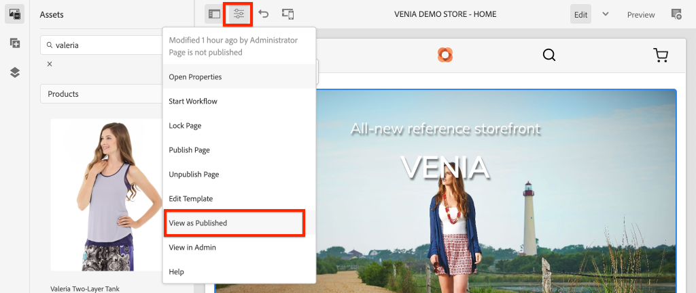

    This will open the page without any of the AEM author javascript loaded, as it would appear on the published site. Notice that the url has the query parameter `?wcmmode=disabled` appended. When developing CSS and Javascript it is a good practice to use this parameter to simplify the page with out anything from AEM author.

1. View the page source and you should be able to identify several client libraries are included:

    ```html
    <!DOCTYPE html>
    <html lang="en-US">
    <head>
        ...
        <link rel="stylesheet" href="/etc.clientlibs/venia/clientlibs/clientlib-base.min.css" type="text/css">
        <link rel="stylesheet" href="/etc.clientlibs/venia/clientlibs/clientlib-site.min.css" type="text/css">
    </head>
    ...
        <script type="text/javascript" src="/etc.clientlibs/venia/clientlibs/clientlib-site.min.js"></script>
        <script type="text/javascript" src="/etc.clientlibs/core/wcm/components/commons/site/clientlibs/container.min.js"></script>
        <script type="text/javascript" src="/etc.clientlibs/venia/clientlibs/clientlib-base.min.js"></script>
    <script type="text/javascript" src="/etc.clientlibs/core/cif/clientlibs/common.min.js"></script>
    <script type="text/javascript" src="/etc.clientlibs/venia/clientlibs/clientlib-cif.min.js"></script>
    </body>
    </html>
    ```

    Client libraries when delivered to the page are prefixed with `/etc.clientlibs` and are served via a [proxy](/help/implementing/developing/introduction/clientlibs.md) to avoid exposing anything sensitive in `/apps` or `/libs`.

    Notice `venia/clientlibs/clientlib-site.min.css` and `venia/clientlibs/clientlib-site.min.js`. These are the compiled CSS and Javascript files derived from the `ui.frontend` module.

## Client Library Inclusion with Page Templates {#client-library-inclusion-pagetemplates}

There are several options for how to include a client-side library. Next inspect how the generated project includes the `clientlib-site` libraries via [Page Templates](/help/implementing/developing/components/templates.md).

1. Navigate to the **Home Page** of the site within the AEM Editor: [http://localhost:4502/editor.html/content/venia/us/en.html](http://localhost:4502/editor.html/content/venia/us/en.html).

1. Select the **Page Information** menu and click **Edit Template**:

    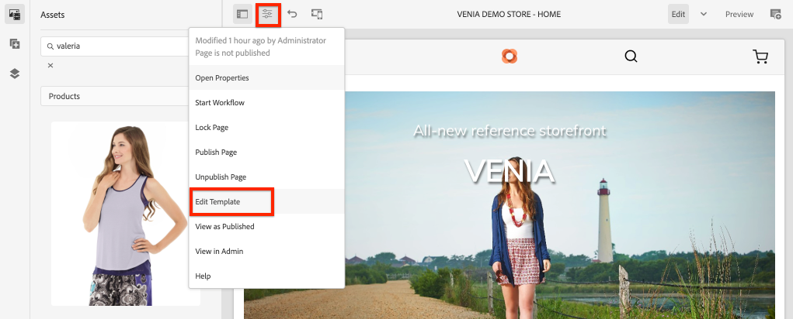

    This will open the **Landing Page** template the **Home** page is based on.

    >[!NOTE]
    >
    > To view all available templates from the AEM Start screen navigate to **Tools** > **General** > **Templates**.

1. In the upper left-hand corner, select the **Page Information** icon and click **Page Policy**.

    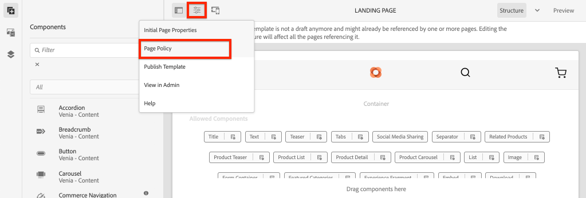

1. This will open the Page Policy for the Landing Page template:

    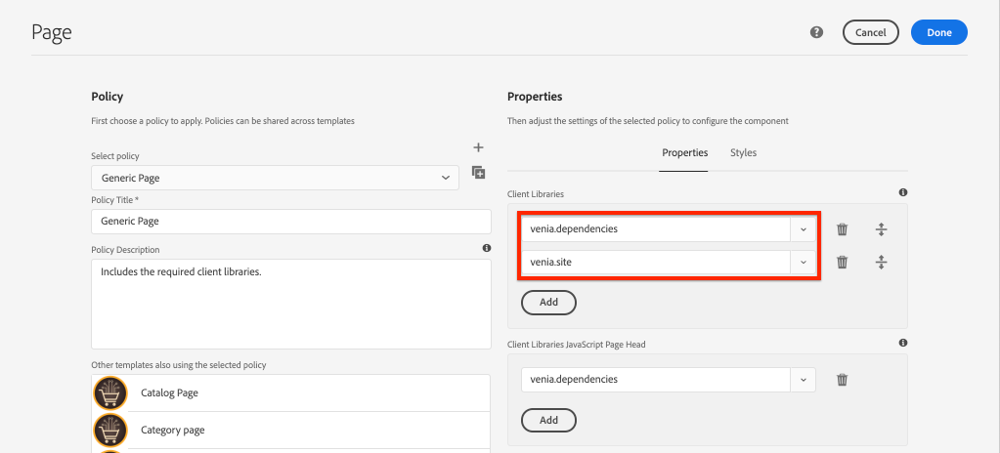

    On the right-hand side you can see a listing of Client Libraries **categories** that will be included on all pages that use this template.

    * `venia.dependencies` - Provides any vendor libraries that `venia.site` depends on.
    * `venia.site` - This is the category for `clientlib-site` that the `ui.frontend` module generates.

    Notice that other templates use the same policy, **Content Page**, **Landing Page**, etc... By re-using the same policy, we can ensure that the same client libraries are included on all of the pages.

    The advantage of using Templates and Page policies to manage the inclusion of client libraries is that you can change the policy per template. For example, perhaps you are managing two different brands within the same AEM instance. Each brand will have its own unique style or *theme* but the base libraries and code will be the same. Another example, if you had a larger client library that you only wanted to appear on certain pages, you could make a unique page policy just for that template.

## Local Webpack Development {#local-webpack-development}

In the previous exercise, an update was made to a Sass files in the `ui.frontend` module and then after performing a Maven build the changes are deployed to AEM. Next we will look at leveraging a webpack-dev-server to rapidly develop the front-end styles.

The webpack-dev-server proxies images and some of the CSS/JavaScript from the local instance of AEM but allows the developer to modify the styles and JavaScript in the `ui.frontend` module.

1. In the browser navigate to the **Home** page and **View as Published**: [http://localhost:4502/content/venia/us/en.html?wcmmode=disabled](http://localhost:4502/content/venia/us/en.html?wcmmode=disabled).

1. View the source of the page and the **copy** the raw HTML of the page.

1. Return to the IDE of your choice beneath the `ui.frontend` module open the file: `ui.frontend/src/main/static/index.html`

    

1. Overwrite the contents of `index.html` and **paste** the HTML copied in the previous step.

1. Find the includes for `clientlib-site.min.css`, `clientlib-site.min.js` and **remove** them.

    ```html
    <head>
        <!-- remove this link -->
        <link rel="stylesheet" href="/etc.clientlibs/venia/clientlibs/clientlib-base.min.css" type="text/css">
        ...
    </head>
    <body>
        ...
         <!-- remove this link -->
        <script type="text/javascript" src="/etc.clientlibs/venia/clientlibs/clientlib-site.min.js"></script>
    </body>
    ```

    These are removed because they represent the compiled version of the CSS and JavaScript generated by the `ui.frontend` module. Leave the other client libraries as they will be proxied from the running AEM instance.

1. Open a new terminal window and navigate into the `ui.frontend` folder. Run the command `npm start`:

    ```shell
    $ cd ui.frontend
    $ npm start
    ```

    This will start the webpack-dev-server on [http://localhost:8080/](http://localhost:8080/)

    >[!CAUTION]
    >
    > If you get a Sass related error, stop the server and run the command `npm rebuild node-sass` and repeat the above steps. This can occur if have a different version of `npm` and `node` then specified in the project `aem-cif-guides-venia/pom.xml`.

1. Navigate to the [http://localhost:8080/](http://localhost:8080/) in a new tab with the same browser as a logged in instance of AEM. You should see the Venia home page via the webpack-dev-server:

    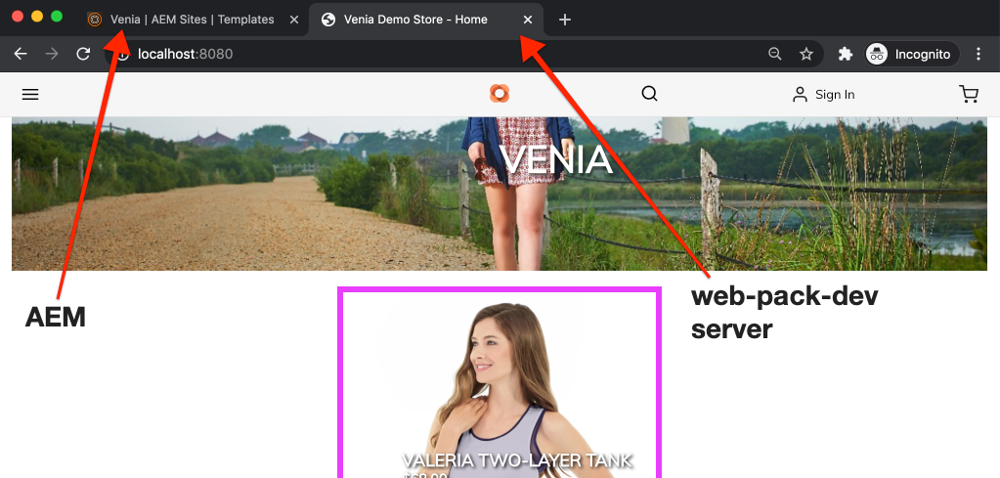

    Leave the webpack-dev-server running. It will be used in the next exercise.

## Implement Card style for Product Teaser {#update-css-product-teaser}

Next modify the Sass files in the `ui.frontend` module to implement a card-like style for the Product Teaser. The webpack-dev-server will be used to rapidly see the changes.

Return to the IDE and the generated project.

1. In the **ui.frontend** module re-open the file `_productteaser.scss` at `ui.frontend/src/main/styles/commerce/_productteaser.scss`.

1. Make the following changes to the Product Teaser border:

    ```diff
        .item__image {
    -       border: #ea00ff 8px solid;
    +       border-bottom: 1px solid #c0c0c0;
            display: block;
            grid-area: main;
            height: auto;
            opacity: 1;
            transition-duration: 512ms;
            transition-property: opacity, visibility;
            transition-timing-function: ease-out;
            visibility: visible;
            width: 100%;
        }
    ```

    Save the changes and the webpack-dev-server should automatically refresh with the new styles.

1. Add a drop-shadow and include rounded corners to the Product Teaser.

    ```scss
     .item__root {
         position: relative;
         box-shadow: 0 4px 8px 0 rgba(0,0,0,0.2);
         transition: 0.3s;
         border-radius: 5px;
         float: left;
         margin-left: 12px;
         margin-right: 12px;
    }

    .item__root:hover {
       box-shadow: 0 8px 16px 0 rgba(0,0,0,0.2);
    }
    ```

1. Update the Product's name to appear at the bottom of the teaser and modify the text color.

    ```css
    .item__name {
        color: #000;
        display: block;
        float: left;
        font-size: 22px;
        font-weight: 900;
        line-height: 1em;
        padding: 0.75em;
        text-transform: uppercase;
        width: 75%;
    }
    ```

1. Update the Product's price to also appear in the bottom of the teaser and modify the text color.

    ```css
    .price {
        color: #000;
        display: block;
        float: left;
        font-size: 18px;
        font-weight: 900;
        padding: 0.75em;
        padding-bottom: 2em;
        width: 25%;

        ...
    ```

1. Update the media query at the bottom, to stack the name and price in screens smaller than **992px**.

    ```css
    @media (max-width: 992px) {
        .productteaser .item__name {
            font-size: 18px;
            width: 100%;
        }
        .productteaser .item__price {
            font-size: 14px;
            width: 100%;
        }
    }
    ```

    You should now see the card-style reflected in the webpack-dev-server:

    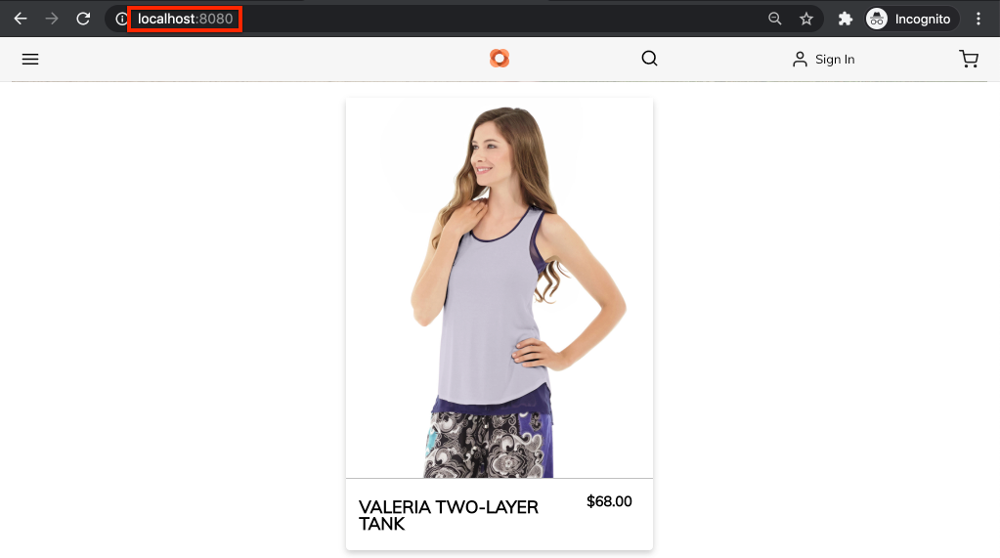

    However, the changes have not been deployed to AEM yet. You can download the [solution file here](../assets/style-cif-component/_productteaser.scss).

1. Deploy the updates to AEM using your Maven skills, from a command line terminal:

    ```shell
    $ cd aem-cif-guides-venia/
    $ mvn clean install -PautoInstallPackage,cloud
    ```

    >[!NOTE]
    >There are additional [IDE Setup and Tools](https://docs.adobe.com/content/help/en/experience-manager-learn/foundation/development/set-up-a-local-aem-development-environment.html#set-up-an-integrated-development-environment) that can sync project files directly to a local AEM instance without having to perform a full Maven build.

## View Updated Product Teaser {#view-updated-product-teaser}

After the code for the project has been deployed to AEM, we should now be able to see the changes to the Product Teaser.

1. Return to your browser and re-fresh the Home page: [http://localhost:4502/editor.html/content/venia/us/en.html](http://localhost:4502/editor.html/content/venia/us/en.html). You should see the updated product teaser styles applied.

    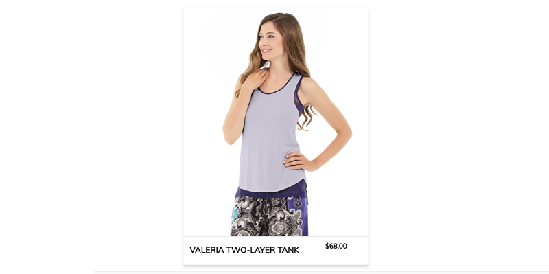

1. Experiment by adding additional Product teasers. Use Layout Mode to change the width and offset of the components in order to display multiple teasers in a row.

    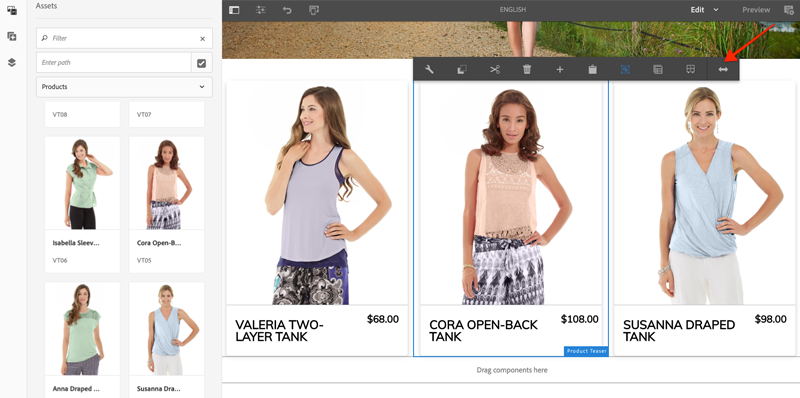

## Troubleshooting {#troubleshooting}

You can verify in [CRXDE-Lite](http://localhost:4502/crx/de/index.jsp) that the updated CSS file has been deployed: [http://localhost:4502/crx/de/index.jsp#/apps/venia/clientlibs/clientlib-site/css/site.css](http://localhost:4502/crx/de/index.jsp#/apps/venia/clientlibs/clientlib-site/css/site.css)

When deploying new CSS and/or JavaScript files it is also important to ensure the browser is not serving stale files. You can eliminate this by clearing the browser cache or starting a fresh browser session.

AEM also attempts to cache client libraries for performance. Occasionally, following a code deployment the older files are served. You can manually invalidate AEM's client library cache using the [Rebuild Client Libraries tool](http://localhost:4502/libs/granite/ui/content/dumplibs.rebuild.html). *Invalidate Caches is the preferred method if you suspect AEM has cached an old version of a client library. Rebuild Libraries is inefficient and time consuming.*

## Congratulations {#congratulations}

You just styled your first AEM CIF Core Component and you used a webpack dev server!

## Bonus Challenge {#bonus-challenge}

Use the [AEM Style system](/help/sites-cloud/authoring/features/style-system.md) to create two styles that can be toggled on/off by a content author. [Developing with the Style System](https://docs.adobe.com/content/help/en/experience-manager-learn/getting-started-wknd-tutorial-develop/style-system.html) includes detailed steps and information on how to accomplish this.

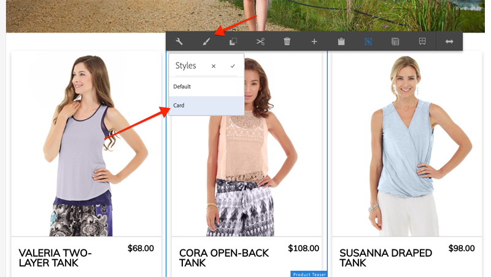

## Additional Resources {#additional-resources}

* [AEM Project Archetype](https://github.com/adobe/aem-project-archetype)
* [AEM CIF Core Components](https://github.com/adobe/aem-core-cif-components)
* [Set up a Local AEM Development Environment](https://docs.adobe.com/content/help/en/experience-manager-learn/cloud-service/local-development-environment-set-up/overview.html)
* [Client-Side Libraries](/help/implementing/developing/introduction/clientlibs.md)
* [Getting Started with AEM Sites](https://docs.adobe.com/content/help/en/experience-manager-learn/getting-started-wknd-tutorial-develop/overview.html)
* [Developing with the Style System](https://docs.adobe.com/content/help/en/experience-manager-learn/getting-started-wknd-tutorial-develop/style-system.html)
