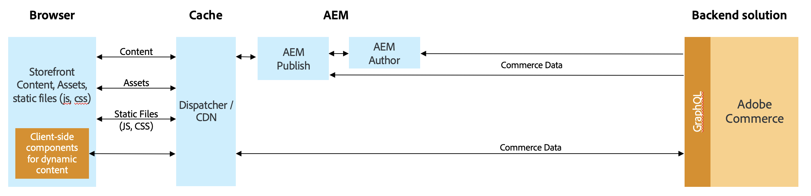
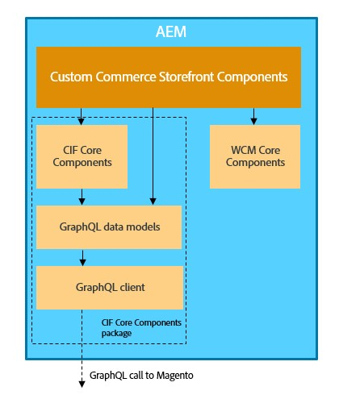

# AEM and Adobe Commerce (Magento) integration Using Commerce Integration Framework {#aem-commerce-framework}

The Experience Manager and Adobe Commerce are seamlessly integrated using the Commerce Integration Framework (CIF). CIF enables AEM to directly access and communicate with the commerce instance using Adobe Commerce's [GraphQL APIs](https://devdocs.magento.com/guides/v2.4/graphql/).

>[!NOTE]
>
>Minimum supported GraphQL API version is 2.3.5. Certain features are only supported in newer versions or just in the Adobe Commerce edition.

## Architecture Overview {#overview}

The overall architecture is as follows:

Within CIF, there is support for server-side and client-side communication patterns.
Server-side APIs calls are implemented using the build-in, generic [GraphQL client](https://github.com/adobe/commerce-cif-graphql-client) in combination with a [set of generated data models](https://github.com/adobe/commerce-cif-magento-graphql) for the commerce GraphQL schema. Additionally, any GraphQL query or mutation in GQL format can be used.

For the client-side components, which are build using [React](https://reactjs.org/), the [Apollo Client](https://www.apollographql.com/docs/react/) is used.

## AEM CIF Core Component Architecture {#cif-core-components}

[AEM CIF Core Components](https://github.com/adobe/aem-core-cif-components) follow very similar design patterns and best practices as the [AEM WCM Core Components](https://github.com/adobe/aem-core-wcm-components).

The business logic and backend communication with Adobe Commerce for the AEM CIF Core Components is implemented in Sling Models. In case it is necessary to customize this logic to fulfill project-specific requirements, the delegation Pattern for Sling Models can be used.

>[!TIP]
>
>The [Customizing AEM CIF Core Components](../customizing/customize-cif-components.md) page has a detailed example and best practice on how to customize CIF Core Components.

Within projects, AEM CIF Core Components and custom project components can easily retrieve the configured client for an Adobe Commerce store associated with an AEM page via Sling Context-Aware configuration.
