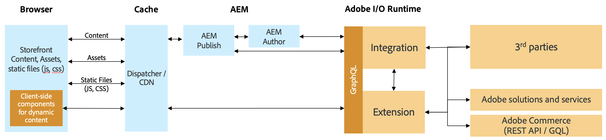

# AEM and 3rd Party Commerce Integration using Commerce Integration Framework {#aem-third-party}

The integration of non-Adobe Commerce solution is a common scenario for CIF. 3rd party solutions with different APIs and schemas get connected via an integration layer.

## Architecture {#architecture}

The overall architecture is as follows:

The purpose of this integration layer is to map 3rd-party APIs and schemas against the supported Adobe Commerce GraphQL APIs and schemas outside of the Experience Manager. Thanks to this encapsulation, the integration logic and systems can get updated without changing code inside the Experience Manager.

## Solution requirements for an integration

As the Experience Manager retrieves data on-demand, real-time APIs for product catalog are required.

>[!TIP]
>
>If no real-time APIs are available, an external product cache with APIs should be used for the integration. Example [Magento open-source](https://magento.com/products/magento-open-source).

There is no need to implement the complete GraphQL schema, just the objects of the schema to enable the desired use-cases.

## Backend use-cases

CIF extends the Experience Manager with real-time product catalog access and product experience management tools. This seamless integration enables authors to access commerce data using embedded UIs whenever needed without leaving the content context.

The integration of product catalog APIs are required to unlock these use-cases.

## Frontend use-cases

[AEM CIF Core Components](https://github.com/adobe/aem-core-cif-components) retrieve and exchage data via the CIF supported Adobe Commerce APIs. To re-use components, the respective APIs need to be implemented.

The recommendation for performance critical client-side components is to communicate directly with the 3rd party solution to avoid latency.

## Developing an Integration {#develop-integration}

We recommend to use [Adobe I/O Runtime](https://www.adobe.io/apis/experienceplatform/runtime.html) for the integration layer. It is included in the CIF add-on for 3rd parties. As it works with a microservice-like approach, it is suited well to integrate easily multiple solutions.

The [reference implementation](https://github.com/adobe/commerce-cif-graphql-integration-reference) is a great starting point to build the integration to your commerce solution. Although it supports GraphQL, it can also be integrated with any other type of API such as REST.

This integration layer is not required if a 3rd party layer is available (e.g. Mulesoft) or the integration gets build on top of the 3rd party solution.
