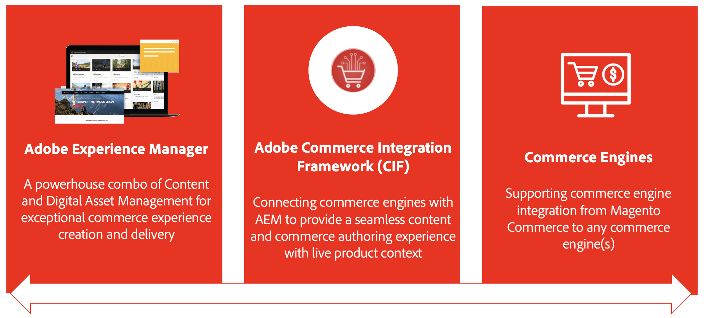

# Content and Commerce {#content-commerce}

With Adobe Experience Manager content and commerce, brands can scale and innovate faster to differentiate commerce experiences and capture accelerating online spend. AEM Content and Commerce combines the immersive, omnichannel, and personalized experiences in Experience Manager with any number of commerce solutions to bring differentiated experiences to all parts of the shopping journey, reducing time to value and driving higher conversion.

## How Content and Commerce Helps Customers Being Successful

With ever-increasing customer expectations for online commerce experiences, brands are pressured to deliver differentiated experiences and more content faster. However, implementing a content management platform often requires heavy time and budget investments in developing foundational elements, such as custom components and authoring tools, and accrues costs in maintenance and upgrades. Experience Manager Sites offers Content and Commerce as an add-on module for Experience Manager as a Cloud Service that provides out-of-the-box commerce core components, authoring tools, and a reference storefront to accelerate go-live, enable seamless collaboration across teams, and drive conversion.

Brands can integrate Experience Manager with Adobe Commerce, part of Adobe Experience Cloud, as well as any commerce engine of choice. With Experience Manager Content and Commerce, brands can:

* Scale and innovate faster
* Personalize experiences to drive conversion
* reate once, and publish everywhere
* Enrich and differentiate experiences for customers
* Streamline authoring with commerce data access

## Introducing AEM Commerce Integration Framework (CIF) {#cif-intro}

As these projects have to deal with the complexity of integrating a commerce solution. A commerce solution can be anything from a commercial solution such as the Adobe Commerce Cloud to a set of custom commerce services. The integration is highly dependent on the use-cases and ecosystem. It usually touches various places and comes in many different flavors:

* Integration of a complex and dynamic ecosystem (example product catalogs)
* Business needs to manage product content with its own lifecycle in an efficient and omnichannel way
* Building complex and personalized shopping journeys for various heads
* Ability to quickly adapt and innovate on the back- and front-end
* Running a scalable and stable E2E infrastructure that is built for peak performance (Flash sale, Black Friday, ...). This includes unified search and cache management.

This complexity opens up the door to potential point of failures, increased TCO, delays, and reduced value realization. These reasons have led to the development of the Commerce Integration Framework (CIF) which is an add-on for the Experience Manager. CIF extends the Experience Manager with commerce capabilities and standardizes the integration with a commerce engine. The result is a future-proof, stable and scalable solution with lower TCO. It unlocks technical and business innovation with agile tooling and seamlessly integrated features to build compelling commerce experiences.

## CIF Successfully Supporting Customers since 2013

With over 200 customers, CIF has established itself as a successful ingredient for a successful content & commerce project. This provides value for IT and business today and in the future. Recent customer projects describe CIF as a “Great accelerator and a huge time saver with a lot of value”.

## CIF Benefits {#cif-benefits}

CIF provides out-of-the-box commerce core components that reduce the need for custom code, accelerating the time to market for brands. All core components are integrated out of the box with Adobe’s client-side data layer to hydrate customer profiles, such as the unified profile. This profile captures in detail a visitor’s behavior, which can be used to predict and personalize the customer journey in real time.

The CIF add-on brings product context into Experience Manager and provides authoring tools such as a product console and product/category pickers that empower the marketer to create and deliver shoppable experiences in Experience Manager without relying on the developer. Advantages include:

### Experiences

Powerful CIF tools in AEM enable content creators to rapidly build rich and personalized commerce experiences in a scalable and delivery agnostic way to capitalize on business opportunities.

### Time-To-Value (TTV)

Accelerates project development with [AEM Core Components](https://www.aemcomponents.dev/), [AEM Venia reference storefront](https://github.com/adobe/aem-cif-guides-venia), [AEM Project Archetype](https://docs.adobe.com/content/help/en/experience-manager-core-components/using/developing/archetype/overview.html), and integration patterns for PWAs (Headless content & commerce).

CIF is built for continuous innovation with an always up-to-date add-on, allowing customer to access new and improved features.

### Integrations

Connect your ecosystem (e.g. commerce solution) with the Experience Cloud using  [Adobe I/O Runtime](https://www.adobe.io/apis/experienceplatform/runtime.html), a micro-service based server-less PaaS, and [CIF's reference implementation](https://github.com/adobe/commerce-cif-graphql-integration-reference).

## Proven Patterns and Best Practices

CIF supports customers with standardized integration patterns based on best practices. This helps customers to be successful today and is flexible to grow with the customer and adapt to future requirements:

* Eliminates typical challenges around product catalog integrations that may occur. Examples:
  * Performance issues with increased catalog volume or complexity
  * No access to staged data
  * Need for real-time product data and experiences
* A growing digital maturity results in a need for experience management. CIF comes with product experience management capabilities that can be incorporated incrementally without additional IT effort.
* Ready for omnichannel: CIF supports a variety of touchpoint technologies (server-side, hybrid, client-side) with patterns, accelerators and core components.
