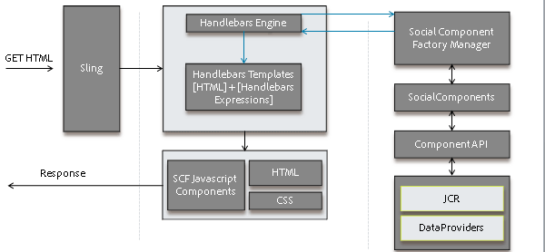
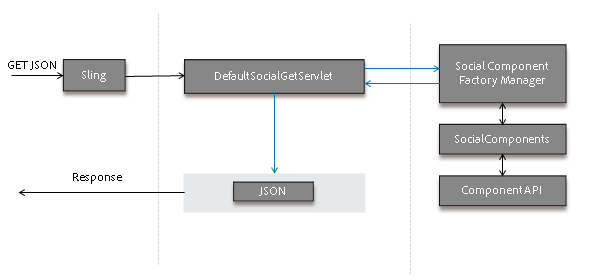
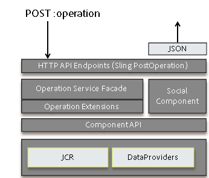

# Activity Streams Feature {#activity-streams-feature}

## Introduction {#introduction}

The activities of a signed in community member, such as posting to a forum or blog, are collected into a stream which may be filtered and displayed in various ways through configuration of the `Activity Streams` component.

The ability to follow adds another view of activities when community members follow postings of interest or follow the activities of other community members.

The document describes:

* Adding the Activity Streams component to an AEM site
* Configuration settings for Activity Streams component

### Adding Activity Streams to a Page {#adding-activity-streams-to-a-page}

If it is desired to add an `Activity Streams` component to a page in author mode, use the component browser to locate

* `Communities / Activity Streams`

and drag it into place on a page where activity streams should appear.

For necessary information, visit [Communities Components Basics](/help/communities/basics.md).

When the [required client-side libraries](/help/communities/essentials-activities.md#essentials-for-client-side) are included, this is how the `Activity Streams` component will appear :

### Configuring Activity Streams {#configuring-activity-streams}

Select the placed `Activity Streams` component to access and select the `Configure` icon which opens the edit dialog.

Under the **User Activities** tab, specify which activities to display :

* **Max number of activities**

  The number of activities to display

* **Stream Resource Path**

  Leave blank to default to the community site or community group. The stream resource path identifies the source of activities. Default is blank.

* **Display User Activities View**
  
  If checked, the activities page will include a tab which filters activities based on those generated within the community by the current member. Default is checked.

* **Display All Activities View**
  
  If checked, the activities page will include a tab which includes all activities generated within the community to which the current member has access. Default is checked.

* **Display Following View**
  
  If checked, the activities page will include a tab which filters activities based on those the current member is following. Default is checked.

### Following View {#following-view}

Components must be configured to enable following. Features that allow following are [blog](/help/communities/blog-feature.md), [forum](/help/communities/forum.md), [QnA](/help/communities/working-with-qna.md), [calendar](/help/communities/calendar.md), [filelibrary](/help/communities/file-library.md), and [comments](/help/communities/comments.md).

The **Follow** button provides a means to follow entries as activities, [notifications](/help/communities/notifications.md), or [subscriptions](/help/communities/subscriptions.md). Each time the **Follow** button is selected, it is possible to toggle on or off a selection. The `Email Subscriptions` selection is only present when configured.

If any method of following is selected, the text of the button changes to **Following**. For convenience, it is possible to select `Unfollow All` to toggle off all methods.

The **Follow** button will appear

* when viewing another member's profile
* on a main feature page, such as forums, QnA, and blogs

    * follows all activity for that general feature

* for a specific entry, such as a forum topic, QnA question, or blog article

    * follows all activity for that specific entry

### Additional Information {#additional-information}

More information may be found on the [Activity Streams Essentials](/help/communities/essentials-activities.md) page for developers.
