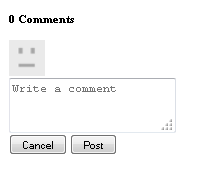
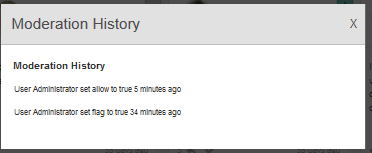

# Add Clientlibs {#add-clientlibs}

## Add a ClientLibraryFolder (clientlibs) {#add-a-clientlibraryfolder-clientlibs}

Create a ClientLibraryFolder named `clientlibs`which will contain the JS and CSS used to render the pages of your site.

The `categories`property value given to this client library is the identifier used to directly include this clientlib from a content page or to embed it in other clientlibs.

1. Using **[!UICONTROL CRXDE Lite]**, expand `/etc/designs`

1. Right click on `an-scf-sandbox` and select `Create Node`

    * Name: `clientlibs`
    * Type: `cq:ClientLibraryFolder`
    
1. Click **[!UICONTROL OK]**


In the **[!UICONTROL Properties]** tab for the new `clientlibs` node, enter the **`categories`** property:

* Name: **[!UICONTROL categories]**
* Type: **[!UICONTROL String]**
* Value: **[!UICONTROL apps.an-scf-sandbox]**
* Click **[!UICONTROL Add]**
* Click **[!UICONTROL Save All]**

Note: prefacing the categories value with 'apps.' is a convention to identify the 'owning application' as being in the /apps folder, not /libs.  IMPORTANT: Add placeholder `js.txt` and `css.txt` files. (It's not officially a cq:ClientLibraryFolder without them.)


1. Right click on **`/etc/designs/an-scf-sandbox/clientlibs`**
1. Select **[!UICONTROL Create File...]**
1. Enter **[!UICONTROL Name]**: `css.txt`

1. Select **[!UICONTROL Create File...]**
1. Enter **[!UICONTROL Name]**: `js.txt`

1. Click **[!UICONTROL Save All]**


The first line of the css.txt and js.txt identifies the base location from which the following lists of files are to be found.

Try setting the content of css.txt to:

```
#base=.
 style.css
```

Then create a file under clientlibs named style.css, and set the content to:

`body {`

`background-color: #b0c4de;`

`}`

## Embed SCF Clientlibs {#embed-scf-clientlibs}

In the **[!UICONTROL Properties]** tab for the `clientlibs` node, enter the multi-value String property **[!UICONTROL embed]**. This will embed the necessary [client-side libraries (clientlibs) for SCF components](client-customize.md#clientlibs-for-scf). For this tutorial we will add many of the clientlibs necessary for the Communities components.

**Note** that this may or may not be the desired approach to use for a production site as there are considerations of convenience versus size/speed of the clientlibs downloaded for every page.

If only using one feature on one page, you could include that feature's complete clientlib directly on the page, e.g., &lt;% ui:includeClientLib categories=cq.social.hbs.forum" %&gt;

In this case, we're including them all, and so would prefer the more basic SCF clientlibs which are the author clientlibs:

* Name: **`embed`**
* Type: **`String`**

* Click **`Multi`**
* Value: **`cq.social.scf`** 

  *&lt;enter&gt; will pop up a dialog*  

  *Click **[+]** after each entry to add the following clientlib categories:*

  * **`cq.ckeditor`**
  * **`cq.social.author.hbs.comments`**
  * **`cq.social.author.hbs.forum`**
  * **`cq.social.author.hbs.rating`**
  * **`cq.social.author.hbs.reviews`**
  * **`cq.social.author.hbs.voting`**
  * Click **[!UICONTROL OK]**

* Click **[!UICONTROL Save All]**


This is how `/etc/designs/an-scf-sandbox/clientlibs` should now appear in the repository:

 

## Include Clientlibs in PlayPage Template {#include-clientlibs-in-playpage-template}

Without including the `apps.an-scf-sandbox` ClientLibraryFolder category on the page, the SCF components will not be functional nor styled as the necessary Javascript(s) and style(s) will not be available.

For example, without including the clientlibs, the SCF comments component appears unstyled:



Once apps.an-scf-sandbox clientlibs is included, the SCF comments component appears styled:


The include statement belongs in the <head> section of the <html> script. The default **`foundation head.jsp`** includes a script that can be overlaid: **`headlibs.jsp`**.

**Copy headlibs.jsp and include clientlibs:**

1. Using **[!UICONTROL CRXDE Lite]**, select **`/libs/foundation/components/page/headlibs.jsp`**
1. Right click and select **[!UICONTROL Copy]** (or select Copy from the tool bar)
1. Select **`/apps/an-scf-sandbox/components/playpage`**
1. Right click and select **[!UICONTROL Paste]** (or select Paste from the tool bar)
1. Double click on **`headlibs.jsp`** to open it
1. Append the following line to the end of the file

   **`<ui:includeClientLib categories="apps.an-scf-sandbox"/>`**

1. Click **[!UICONTROL Save All]**


```xml
<%@ page session="false" %><%
%><%@include file="/libs/foundation/global.jsp" %><%
%><ui:includeClientLib categories="cq.foundation-main"/><%
%>
<cq:include script="/libs/cq/cloudserviceconfigs/components/servicelibs/servicelibs.jsp"/>
<% currentDesign.writeCssIncludes(pageContext); %>
<ui:includeClientLib categories="apps.an-scf-sandbox"/>

```

Load your website in the browser and see if the background is not a shade of blue.

[http://localhost:4502/content/an-scf-sandbox/en/play.html](http://localhost:4502/content/an-scf-sandbox/en/play.html)



## Saving Your Work So Far {#saving-your-work-so-far}

At this point, there exists a minimalist sandbox, and it might be worth saving as a package so that, while playing, if your respository becomes corrupt and you desire to start over, you can turn your server off, rename or delete the folder crx-quickstart/, turn your server on, upload and install this saved package, and not have to repeat these most basic of steps.

This package exists on the [Create a Sample Page](create-sample-page.md) tutorial for those who can't wait to just jump in and start playing!...

To create a package:


* From **[!UICONTROL CRXDE Lite]**, click the [Package icon](http://localhost:4502/crx/packmgr/) 
* Click **[!UICONTROL Create Package]**

    * Package Name: `an-scf-sandbox-minimal-pkg`
    * Version: `0.1`
    * Group: &lt;leave as default&gt;
    * Click **[!UICONTROL OK]**

* Click **[!UICONTROL Edit]**

    * Select **[!UICONTROL Filters]** tab

        * Click **[!UICONTROL Add filter]**
        * Root Path: &lt;browse to `/apps/an-scf-sandbox`&gt;
        * Click **[!UICONTROL Done]**
        * Click **[!UICONTROL Add filter]**
        * Root Path: &lt;browse to `/etc/designs/an-scf-sandbox`&gt;
        * Click **[!UICONTROL Done]**
        * Click **[!UICONTROL Add filter]**
        * Root Path: &lt;browse to `/content/an-scf-sandbox`&gt;
        * Click **[!UICONTROL Done]**

    * Click **[!UICONTROL Save]**

* Click **[!UICONTROL Build]**

Now you can select **[!UICONTROL Download]** to save it to disk and **[!UICONTROL Upload Package]** elsewhere, as well as select **[!UICONTROL More > Replicate]** in order to push the sandbox to a localhost publish instance to expand the realm of your sandbox.
