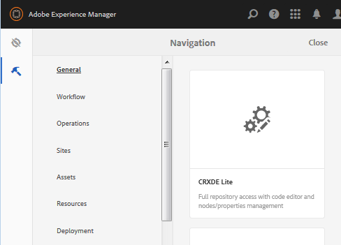

# Create An SCF Sandbox  {#create-an-scf-sandbox}

As of AEM 6.1 Communities, the easiest way to quickly create a sandbox is to create a community site. See [Getting Started with AEM Communities](getting-started.md).

Another useful tool for developers is the [Community Components guide](components-guide.md), which allows for exploration and quick prototyping of Communities components and features.

The exercise of creating a website can be useful for understanding the structure of an AEM website which may include Communities features, while also providing simple pages on which to explore working with the [social component framework (SCF)](scf.md).

This tutorial is primarily for developers, new to AEM, who are interested in using SCF components. It walks through the creation of An SCF Sandbox site, similar to the tutorial for [How to Create a Fully Featured Internet Website](../../help/sites-developing/website.md) which focuses on-site structures, such as navigation, logo, search, toolbar, and listing child pages.

Development takes place on an author instance, while experimenting with the site is best on a publish instance.

The steps in this tutorial are:

* [Setup Website Structure](setup-website.md)
* [Initial Sandbox Application](initial-app.md)
* [Initial Sandbox Content](initial-content.md)
* [Develop Sandbox Application](develop-app.md)
* [Add Clientlibs](add-clientlibs.md)
* [Develop Sandbox Content](develop-content.md)

>[!CAUTION]
>
>This tutorial does not create a community site with the functionality created using the [Communities Sites console](sites-console.md). For example, this tutorial does not describe how to set up login, self-registration, [social login](social-login.md), messaging, profiles, and so on.
>
>If a simple community site is preferred, follow the [Create a Sample Page](create-sample-page.md) tutorial.

## Prerequisites {#prerequisites}

This tutorial assumes you have one AEM author and one AEM publish instance installed that has the [latest release](deploy-communities.md#latest-releases) of Communities.

Following are some helpful links for developers new to the AEM platform:

* [Getting Started](../../help/sites-deploying/deploy.md#getting-started): for deploying AEM instances.

  * [The Basics](../../help/sites-developing/the-basics.md): for developers of websites and features.
  * [First Steps for Authors](../../help/sites-authoring/first-steps.md): for authoring page content.

## Using CRXDE Lite Development Environment {#using-crxde-lite-development-environment}

AEM developers spend much of their time in the [CRXDE Lite](../../help/sites-developing/developing-with-crxde-lite.md) development environment on an author instance. CRXDE Lite provides a less restricted access to the CRX repository. Classic UI tools and touch-enabled UI consoles provide more structured access to specific portions of the CRX repository.

After signing in with administrative privileges, there are various ways to access CRXDE Lite:

1. From global navigation, select navigation **[!UICONTROL Tools > CRXDE Lite]**.

   

2. From the [classic UI welcome page](http://localhost:4502/welcome.html), scroll down and click **[!UICONTROL CRXDE Lite]** in the right panel.

   

3. Browse directly to `CRXDE Lite`: `<server>:<port>/crx/de`

   For example, on a local author instance: [http://localhost:4502/crx/de](http://localhost:4502/crx/de)

To work with CRXDE Lite, you must sign in with developer or administrator privileges. For the default localhost instance, you can log in with

* `username: admin`
* `password: admin`

This login times out and you must relogin periodically using the pull-down on the right end of the CRXDE Lite tool bar.

If not logged in, you will be unable to navigate the JCR repository or perform any edit/save operations.

***When in doubt, relogin!***

