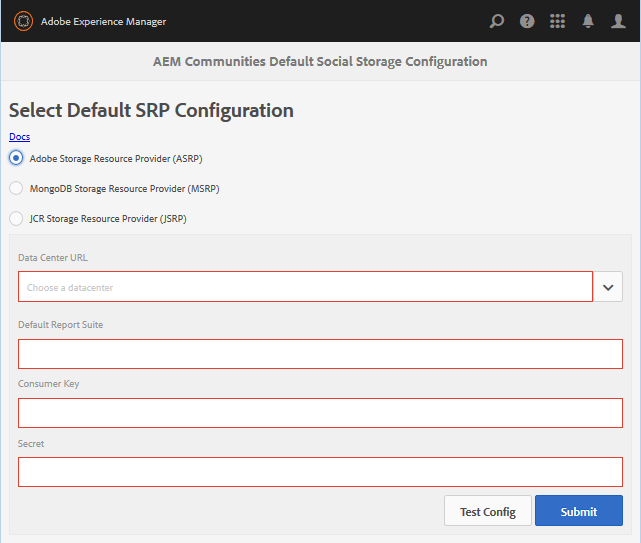

# ASRP - Adobe Storage Resource Provider {#asrp-adobe-storage-resource-provider}

## About ASRP {#about-asrp}

When AEM Communities is configured to use ASRP as its common store, user generated content (UGC) is accessible from all author and publish instances without the need for synchronization nor replication.

See also [Characteristics of SRP Options](/help/communities/working-with-srp.md#characteristics-of-srp-options) and [Recommended Topologies](/help/communities/topologies.md).

## Requirements {#requirements}

An additional license is required for the use of ASRP.

To configure your AEM Communities site to use ASRP for UGC, contact your account representative for:

* Data Center URL (address of the ASRP endpoint)
* Consumer Key
* Secret Key
* Report Suite ID(s)

The consumer and secret keys are shared across all report suites for a company. There is one report suite per tenant.

## Configuration {#configuration}

### Select ASRP {#select-asrp}

The [Storage Configuration console](/help/communities/srp-config.md) allows for the selection of the default storage configuration, which identifies which implementation of SRP to use.

**On AEM Author instance:**

* From global navigation, navigate to **[!UICONTROL Tools > Communities > Storage Configuration]** and select **[!UICONTROL Adobe Storage Resource Provider (ASRP)]**.

The following information comes from the provisioning process:

* **Data Center URL**: Pull-down to select the production data center identified by your account representative.
* **Default Report Suite**: Enter the name of the default report suite.
* **Consumer Key**: Enter the consumer key.
* **Secret**: Enter the secret.
* Select **Submit**.

Prepare the publish instances:

* [Replicate the crypto key](#replicate-the-crypto-key)
* [Replicate the configuration](#publishing-the-configuration)

After submitting the configuration, test the connection:

* Select **Test Config**. 
  
  For each author and publish instance, test the connection to the data center from the Storage Configuration console.

* Ensure that the site URLs for profile data are routable from the Data Center by [externalizing links](#externalize-links).

### Replicate the Crypto Key {#replicate-the-crypto-key}

The Consumer Key and Secret Key are encrypted. In order for the keys to be encrypted/decrypted properly, the primary Granite Crypto key must be the same on all AEM instances.

Follow the instructions at [Replicate the Crypto Key](/help/communities/deploy-communities.md#replicate-the-crypto-key).

### Externalize Links {#externalize-links}

For correct profile and profile image links, be sure to properly [Configure the Link Externalizer](/help/sites-developing/externalizer.md).

Be sure to set the domains to be URLs that are routable from the Data Center URL (ASRP endpoint).

### Time Synchronization {#time-synchronization}

In order for authentication with the ASRP endpoint to succeed, the machines running your hosted AEM Communities must be time synchronized, such as with the [Network Time Protocol (NTP)](https://www.ntp.org/).

### Publishing the Configuration {#publishing-the-configuration}

ASRP must be identified as the common store on all author and publish instances.

To make the identical configuration available in the publish environment:

On AEM Author instance:

* Navigate from main menu to **[!UICONTROL Tools]** > **[!UICONTROL Deployment]** > **[!UICONTROL Replication]**
* Select **Activate Tree**
* **Start Path**: browse to `/conf/global/settings/communities/srpc/`
* Deselect **Only Modified**
* Select **Activate**

## Upgrading from AEM 6.0 {#upgrading-from-aem}

>[!CAUTION]
>
>If you enable ASRP on a published community site, any UGC already stored in [JCR](/help/communities/jsrp.md) is no longer visible, as there is no synchronization of data between on-premise storage and cloud storage.

**`AEM Communities Extension`** was previously introduced in AEM 6.0 social communities as a cloud service. As of AEM 6.1 Communities, no cloud configuration is necessary, simply select ASRP from the [storage configuration console](/help/communities/srp-config.md).

Due to the new storage structure, it is necessary to follow the [upgrade](/help/communities/upgrade.md#adobe-cloud-storage) instructions when upgrading from social communities to Communities.

## Managing User Data {#managing-user-data}

For information regarding *users*, *user profiles* and *user groups*, often entered in the publish environment, visit

* [User Synchronization](/help/communities/sync.md)
* [Managing Users and User Groups](/help/communities/users.md)

## Troubleshooting {#troubleshooting}

### UGC Disappears after Upgrade {#ugc-disappears-after-upgrade}

If upgrading from an existing AEM 6.0 social community site, be sure to follow the [upgrade instructions](/help/communities/upgrade.md#adobe-cloud-storage), else UGC appears to be lost.

### Authentication Errors {#authentication-errors}

If receiving authentication errors against the Data Center URL, and the AEM error.log contains messages about stale timestamps, then verify that time synchronization is happening.

Use a tool such as the [Network Time Protocol (NTP)](https://www.ntp.org/) to time synchronize all AEM author and publish servers.

### New Content Does Not Appear in Searches {#new-content-does-not-appear-in-searches}

The Adobe cloud storage infrastructure uses *eventual consistency* to achieve its scaling and performance goals. For this reason, new content is not instantly available and it takes several seconds for it to appear in search results.

While the interval affecting eventual consistency is monitored, contact your account representative if it takes longer than a few seconds for new content to appear in searches.

### UGC Not Visible in ASRP {#ugc-not-visible-in-asrp}

Make sure that the ASRP has been configured to be the default provider by checking the configuration of the storage option. By default, the storage resource provider is JSRP, not ASRP.

On all author and publish AEM instances, revisit the Storage Configuration console, or check the AEM repository.

In JCR, if [/conf/global/settings/communities](https://localhost:4502/crx/de/index.jsp#/etc/socialconfig/):

* Does not contain an [srpc](https://localhost:4502/crx/de/index.jsp#/conf/global/settings/communities/srp) node, it means that the storage provider is JSRP.
* If the srpc node exists and contains [defaultconfiguration](https://localhost:4502/crx/de/index.jsp#/conf/global/settings/communities/srp/defaultconfiguration) node, the defaultconfiguration's properties define ASRP to be the default provider.
