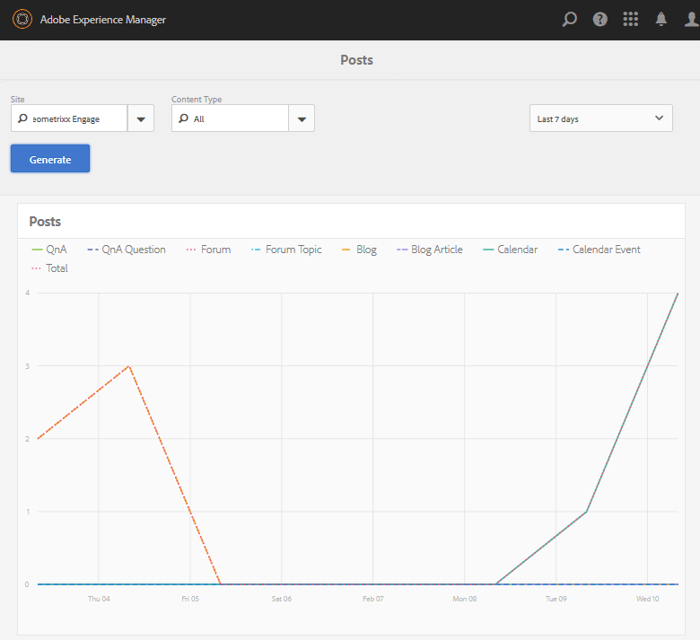
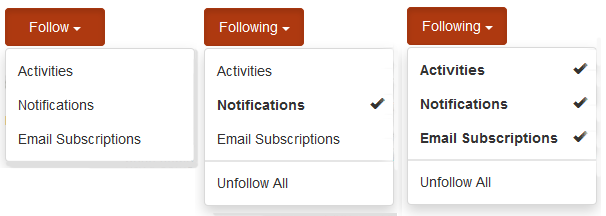

# Badges Console {#badges-console}

## About Badges {#about-badges}

The Communities Badges console provides the ability to add custom badges which can be displayed for a member when earned (awarded) or when they take on a specific role in the community (assigned).

### Badge Visibility {#badge-visibility}

Currently, badges a community member earns or is assigned will appear along with their name and avatar in the following locations:

* Profiles
* [Forums](forum.md)
* [QnA](working-with-qna.md)
* [Leaderboards](enabling-leaderboard.md)
* [Ideation](ideation-feature.md)

In the author environment, to reach the Badges console

* From global navigation: **[!UICONTROL Tools > Communities > Badges]**

This console displays the badges currently available and from which new badges can be added.

## Create Badge {#create-badge}

A badge is created by uploading a suitably small image (72dpi with a height ranging from 26-32 pixels) and providing a name. The badge image is stored in the repository at `/etc/community/badging/images` and is automatically replicated to the publish environment.

If the publish environment is a farm of publishers, it is necessary to configure [user sync](sync.md).

* **[!UICONTROL Upload Image]** 

  (*Required*) A badge image with a recommended size of 32 x 32 pixels at 72dpi in either the JPEG or PNG format.

* **[!UICONTROL Name]** 

  (*Required*) The badge name. It is the default `Display Name` as well as the repository node name. If the `Name` is not a valid repository node name, it will be modified.

* **[!UICONTROL Display Name]** 

  (*Optional*) The name to display for the badge in the UI. Default is the unaltered text entered for the `Name`.

* **[!UICONTROL Description]** 

  (*Optional*) A description for the badge.

## Additional Information {#additional-information}

For details on setting up scoring and badging rules, see [Scoring and Badges](implementing-scoring.md).

For managing badges for members, see [Members Console](members.md).
