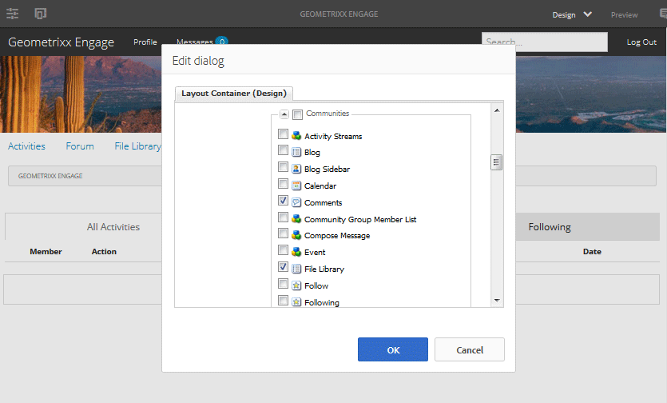

# Communities Components Basics {#communities-components-basics}

## Overview {#overview}

The authoring section of the documentation describes adding Communities features to AEM sites in author edit mode, as well as describing component configurations.

Components may be explored using an AEM instance and the interactive [Community Components guide](components-guide.md).

## Accessing Communities Components {#accessing-communities-components}

When authoring page content, if the underlying template permits changes to the design of the page, it is possible to enable components that are not already available in the components browser as part of the site design.

The available Communities components are listed [here](author-communities.md#available-communities-components).

>[!NOTE]
>
>For general authoring information, view the [quick guide to authoring pages](../../help/sites-authoring/qg-page-authoring.md).
>
>If not familiar with AEM, view the documentation on [basic handling](../../help/sites-authoring/basic-handling.md).

### Entering Design Mode {#entering-design-mode}

If a **Communities** component is not found in the components browser (sidekick), it will be necessary to enter `Design Mode` to add other Communities components. [Required client-side libraries](#required-clientlibs) (clientlibs) may also need to be added.

For details, see [Configuring Components in Design Mode](../../help/sites-authoring/default-components-designmode.md).

Following are images of selecting a few Communities components and viewing them in the components browser:

The selected components are now available in the components browser:

## Required Clientlibs {#required-clientlibs}

[Client-side libraries](../../help/sites-developing/clientlibs.md) (clientlibs) are required for the proper functioning (JavaScript) and styling (CSS) of a component.

When adding a Communities component to a page, if the result is an error or an unexpected appearance, the first thing to try is adding the required clientlibs for the Communities component. For details, see [Clientlibs for Communities Components](clientlibs.md).

### Example: Initially placed reviews without client libraries... {#example-initially-placed-reviews-without-client-libraries}

### ... And with client libraries {#and-with-client-libraries}

## Tagging {#tagging}

Many Communities features may be configured to allow members to tag content entered (posted) in the publish environment.

If tagging is allowed, the community site's configuration may be set to limit the namespaces presented to members in the publish environment. See the [Community Sites console](sites-console.md#tagging).

Features which allow tagging: [blog](blog-feature.md), [calendar](calendar.md), [file library](file-library.md), [forum](forum.md)

Features which use tags: [search](search.md), [social tag cloud](tagcloud.md)

For authoring information:

* [Using Tags](../../help/sites-authoring/tags.md)

For administrative information:

* Creating tag namespaces (taxonomy): [Administering Tags](../../help/sites-administering/tags.md)
* Community Site configuration: see [TAGGING](sites-console.md#tagging)
* [Tagging User Generated Content](../../help/sites-authoring/tags.md)

For developer information:

* [AEM Tagging Framework](../../help/sites-developing/framework.md)
* [Tagging Essentials](tag.md)
