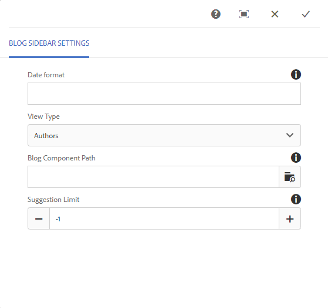
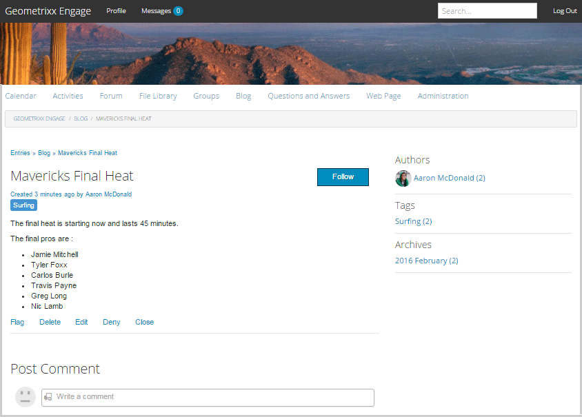

# Blog Feature {#blog-feature}

## Introduction {#introduction}

The blog feature for AEM Communities has transformed from an authoring activity to a true community activity that takes place in the publish environment.

The blog feature supports providing community information in a journaling format. Blog entries are made in the publish environment by authorized members (registered, signed-in users).

The blog feature provides :

* Publish-side creation of blog articles and comments
* Rich text editing
* Inline images (with support for drag and drop)
* Embedded social networking content ([oEmbed support](/help/communities/blog-developer-basics.md#allowing-rich-media))
* Draft mode
* Scheduled publishing
* Compose on-behalf (a [privileged member](/help/communities/users.md#privileged-members-group) can create content on behalf of a different community member)
* [In-context and bulk moderation](/help/communities/moderate-ugc.md) of blog articles and comments

This section of the documentation describes:

* Adding the blog feature to an AEM site
* Configuration settings for blog components

>[!NOTE]
>
>The components `Journal` and `Journal Sidebar` are titled `Blog` and `Blog Sidebar`.
>
>The blog feature found in AEM 6.0 and earlier releases is now removed. It was based on a template and only allowed authors to create content in the author environment.

## Adding Blog Components to a Page {#adding-blog-components-to-a-page}

If it is desired to add a blog to a page in author mode, use the component browser to locate

* `Communities / Blog`
* `Communities / Blog Sidebar`

And drag them into place on a page where the blog should appear.

For necessary information, visit [Communities Components Basics](/help/communities/basics.md).

When the [required client-side libraries](/help/communities/blog-developer-basics.md#essentials-for-client-side) are included, the `Blog` component appears follows:

### Configuring Blog {#configuring-blog}

Select the placed `Blog` component so you can access and select the `Configure` icon which opens the edit dialog box.

 

#### Settings tab {#settings-tab}

Under the **Settings** tab, specify the basic features of the blog :

* **Allow Attachment Thumbnail**
  
  If checked, a thumbnail of the attached image is created.

* **Max Attach Thumbnail Size**
  
  Maximum size (in pixels) of the attachment thumbnail image. The default value is 800 x 800.

* **Min Image Size for Thumbnail**
  
  Minimum size (in bytes) of image for generating thumbnail for inline images. The default value is 100000bytes (100 kb).

* **Max Thumbnail Size**
  
  Maximum size (in pixels) of the thumbnail image for inline image. The default value is 800 x 800.

* **Allow Privileged Members**
  
  If checked, only Privileged members are allowed to create content.

* **Allowed Privileged Members**
  
  Add the privileged members allowed to create content.

* **Block User-Generated Content in Author Edit Mode**
  
  If enabled, blocks User-Generated Content while editing in Author Mode.

* **Journal Title**
  
  The blog title to display on the page.

>[!NOTE]
>
>The Journal Title is used to automatically create URL for the blog.
>
>Maximum 50 characters (with 5 characters additional for uniqueness) are used from the journal title you specify here to create URL for the blog.

* **Journal Description** 
  
  The blog description.

* **Topics Per Page**
  
  Defines the number of blog entries/comments shown per page. The default is 10.

* **Moderated**
  
  If checked, posting of blog entries and comments must be approved before they appear on a published site. The default is unchecked.

* **Closed**
  
  If checked, the blog is closed to new blog entries and comments. Default is unchecked.

* **Rich Text Editor**
  
  If checked, blog entries and comments may be entered with markup. Default is checked.

* **Allow Tagging**
  
  If checked, allow members to add tag labels to their post (see **Tag field** tab). Default is unchecked.

* **Allow File Uploads**
  
  If checked, allow file attachments to be added to a blog entry or comment. Default is unchecked.

* **Max File Size**
  
  Relevant only if `Allow File Uploads` is checked. This field limits the size (in bytes) of an uploaded file. Default is 104857600 (10 Mb).

* **Allowed File Types**
  
  Relevant only if `Allow File Uploads` is checked. A comma-separated list of file extensions with the "dot" separator. For example: .jpg, .jpeg, .png, .doc, .docx, .pdf. If any file types are specified, then those file types that are not specified, cannot be uploaded. Default is none specified such that all file types are allowed.

* **Max Attach Image File Size**
  
  Relevant only if Allow File Uploads is checked. Maximum number of bytes an uploaded image file may have. Default is 2097152 (2 Mb).

* **Allow Replies**
  
  If checked, allow replies to comments posted to the blog entry. Default is unchecked.

* **Allow Voting**
  
  If checked, include the Voting feature with a blog entry. Default is unchecked.

* **Allow Users to Delete Comments and Topics**
  
  If checked, allow members to delete the comments and blog entries they posted. Default is unchecked.

* **Allow Following**
  
  If checked, include the following feature for blog articles, which allows members to be [notified](/help/communities/notifications.md) of new posts. Default is unchecked.

* **Allow Email Subscriptions**
  
  If checked, allow members to be notified of new posts by email ([subscription](/help/communities/subscriptions.md)). Requires `Allow Following` to be checked and [email configured](/help/communities/email.md). Default is unchecked.

* **Display Badges**
  
  If checked, display earned and assigned [badges](/help/communities/implementing-scoring.md) with a member's blog entry. Default is unchecked.

* **Do Not Get Replies on Listing Page**

* **Allow Featured Content**
  
  If checked, the idea is identified as [featured content](/help/communities/featured.md). Default is unchecked.

* **Enable Mention**
  
  If enabled, allows registered community users to identify other registered members (using first name, last name, user name) and tag them using the common @user-name syntax. The tagged users receive notifications about their own mentions.

* **Max Mentions**
  
  Restrict the maximum number of mentions allowed in a post. Default is 10.

* **UI Mention Pattern**
  
  Specify the allowed pattern string to tag (@mention) the registered user in a post. For example, `~{{familyName}}{{givenName}}`.

#### User Moderation tab {#user-moderation-tab}

Under the **User Moderation** tab, specify the moderation settings :

* **Deny Posts**
  
  If checked, trusted member moderators are allowed to deny posts and prevent the post from appearing on the public forum. Default is unchecked.

* **Close / Reopen Topics**
  
  If checked, trusted member moderators may close a topic to further edits and comments, and may also reopen a topic. Default is unchecked.

* **Flag Posts**
  
  If checked, allow members to flag others' topics or comments as inappropriate. Default is unchecked.

* **Flag Reason List**
  
  If checked, allow members to choose, from a drop-down list, their reason for flagging a topic or comment as inappropriate. Default is unchecked.

* **Custom Flag Reason**
  
  If checked, allow members to enter their own reason for flagging a topic or comment as inappropriate. Default is unchecked.

* **Moderation Threshold**
  
  Enter the number of times a topic or comment has to be flagged by members before moderators are notified. Default is 1 ( one time).

* **Flagging Limit**
  
  Enter the number of times a topic or comment has to be flagged before it is hidden from public view. If set to -1, the flagged topic or comment is never hidden from public view. Else, this number must be greater than or equal to the Moderation Threshold. Default is 5.

#### Tag field tab {#tag-field-tab}

Under the **Tag field** tab, specify which tags can be applied if **Allow Tagging** is check on the **Settings** tab :

* **Allowed Namespaces**
  
  Relevant if `Allow Tagging` is checked under the **Settings** tab. The tags which may be applied are limited to those tags within the namespace categories checked. The list of namespaces includes "Standard Tags" (the default namespace) and "Include All Tags". Default is none checked, which means all namespaces are allowed.

* **Suggestion Limit**
  
  Enter the number of tags to be displayed as a suggestion to the member posting to the forum. A value of -1 means no limits. Default is 0.

### Configuring Blog Sidebar {#configuring-blog-sidebar}

When you double-click the `Blog Sidebar` component, an edit dialog opens up.

Under the **Journal Sidebar Settings** tab, specify the date format for archives and what type of entries to display in the sidebar :

* **Date format**
  
  The format used to display for archives of blog entries. The format uses placeholders following the Java&trade; convention.

    * yyyy : full year, like '2015'
    * yy : short year, like '15'
    * MMMMM : full month, like June
    * MMM : short month, like Jun
    * MM : month number, like 06

  Default is "yyyy MMMMM" which would display, for example, "2015 June"

* **View Type**
  
  The Title and type of blog entries to display in the sidebar. The choice is between

    * Authors
    * Categories
    * Archives

* **Blog Component Path**
  
  *(Optional)* The location of the blog resource from which blog articles are to be listed. If left blank, it uses the component of resourceType `social/journal/components/hbs/journal` that appears on the same page.

    * For example, `/content/sites/engage/en/blog/jcr:content/content/primary/blog`

* **Suggestion Limit**
  
  The number of blog articles to be displayed. A value of -1 means no limit. Default is -1.

## Site Visitor Experience {#site-visitor-experience}

In the publish environment, the blog feature displays the most recent blog article followed by older blog articles in descending order of creation. Blog sidebars allow site visitors to apply filters to limit the selection of blog articles shown.

The blog article is followed by a link to post or view comments.

When a blog article is selected, the blog article and comments are displayed (if enabled).

Other abilities depend on whether the site visitor is a moderator, administrator, community member, privileged member or anonymous.

### Working with Articles {#working-with-articles}

When creating a blog article, there is the choice to do the following:

1. Publish Immediately
1. Publish a Draft
1. Publish at a Scheduled date and time

The blog articles appear under the appropriate tab (Published, Drafts, or Scheduled) to members able to author on publish.

#### Moderators and Administrators {#moderators-and-administrators}

When the signed in user has moderator or administrator privileges, they are able to perform [moderation tasks](/help/communities/moderate-ugc.md) (as permitted by the configuration of the component) on all blog articles and comments posted to a blog.

#### Members {#members}

When the signed in user is a community member or [privileged member](/help/communities/users.md#privileged-members-group) (depending on configuration), they are able to select `New Article` to create and post a new blog article.

Specifically, they may:

* Create a blog article
* Post a new blog article on behalf of another member
* Post a comment to a blog article
* Edit their own blog article or comment
* Delete their own blog article or comment
* Flag others' blog articles or comments

 

#### Anonymous {#anonymous}

Site visitors who are not signed in may only read posted blog articles and comments, translate them if supported, but may not add a blog article or comment nor flag others' articles or comments.

## Additional Information {#additional-information}

More information may be found on the [Blog Essentials](/help/communities/blog-developer-basics.md) page for developers.

For moderation of blog entries and comments, see [Moderating User-Generated Content](/help/communities/moderate-ugc.md).

For tagging blog entries and comments, see [Tagging User-Generated Content](/help/communities/tag-ugc.md).

For translation of blog entries and comments, see [Translating User-Generated Content](/help/communities/translate-ugc.md).
