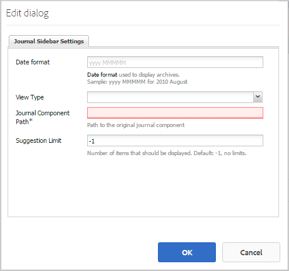
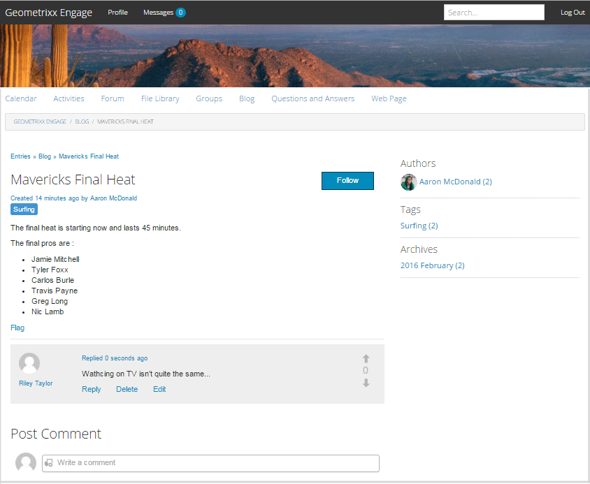

# Blog Feature {#blog-feature}

## Introduction {#introduction}

The blog feature for AEM Communities has transformed from an authoring activity to a true community activity that takes place in the publish environment.

The blog feature supports providing community information in a journaling format. Blog entries are made in the publish environment by authorized members (registered, signed-in users).

The blog feature provides:

* Publish-side creation of blog articles and comments
* Rich text editing
* Inline images (with support for drag and drop)
* Embedded social networking content ([oEmbed support](blog-developer-basics.md#allowing-rich-media))
* Draft mode
* Scheduled publishing
* Compose on-behalf (a [privileged member](users.md#privileged-members-group) can create content on behalf of a different communty member)
* [In-context and bulk moderation](moderate-ugc.md) of blog articles and comments

This section of the documentation describes

* Adding the blog feature to an AEM site
* Configuration settings for blog components

>[!NOTE]
>
>The components `Journal`and `Journal Sidebar` are titled `Blog` and `Blog Sidebar`. 
>
>The blog feature found in AEM 6.0 and earlier releases is now removed. It was based on a template and only allowed authors to create content in the author environment.

## Adding Blog Components to a Page {#adding-blog-components-to-a-page}

If it is desired to add a blog to a page in author mode, use the component browser to locate

* `Communities / Blog`
* `Communities / Blog Sidebar`

And drag them into place on a page where the blog should appear.

For necessary information, visit [Communities Components Basics](basics.md).

When the [required client-side libraries](blog-developer-basics.md#essentials-for-client-side) are included, this is how the `Blog`component will appear:

And how the `Blog Sidebar` will appear:

### Configuring Blog {#configuring-blog}

Select the placed `Blog` component to access and select the `Configure` icon which opens the edit dialog.

 

#### Settings tab {#settings-tab}

Under the **[!UICONTROL Settings]** tab, specify the basic features of the blog:

* **[!UICONTROL Allow Attachment Thumbnail]**
If checked, a thumbnail of the attached image is created.

* **[!UICONTROL Max Attach Thumbnail Size]**
Maximum size (in pixels) of the attachment thumbnail image. The default value is 800 x 800.

* **[!UICONTROL Min Image Size for Thumbnail]**
Minimum size (in bytes) of image for generating thumbnail for inline images. The default value is 100000bytes (100kb).

* **[!UICONTROL Max Thumbnail Size]**
Maximum size (in pixels) of the thumbnail image for inline image. The default value is 800 x 800.

* **[!UICONTROL Allow Privileged Members]**
If checked, only Privileged members are allowed to create content.

* **[!UICONTROL Allowed Privileged Members]**
Add the privileged members allowed to create content.

* **[!UICONTROL Block User Generated Content in Author Edit Mode]**
If enabled, blocks User Generated Content while editing in Author Mode.

* **[!UICONTROL Journal Title]**
The blog title to display on the page.
  >
  >Note:
  >The Journal Title is used to automatically create URL for the blog. Maximum 50 characters (with 5 characters additional for uniqueness) are used from the journal title you specify here to create URL for the blog.
  
* **[!UICONTROL Journal Description]** 
The blog description.

* **[!UICONTROL Topics Per Page]** 

  Defines the number of blog entries/comments shown per page. Default is 10.

* **[!UICONTROL Moderated]** 

  If checked, posting of blog entries and comments must be approved before they will appear on a publish site. Default is unchecked.

* **[!UICONTROL Closed]** 

  If checked, the blog is closed to new blog entries and comments. Default is unchecked.

* **[!UICONTROL Rich Text Editor]** 

  If checked, blog entries and comments may be entered with markup. Default is checked.

* **[!UICONTROL Allow Tagging]** 

  If checked, allow members to add tag labels to their post (see **[!UICONTROL Tag field]** tab). Default is unchecked.

* **[!UICONTROL Allow File Uploads]** 

  If checked, allow file attachments to be added to a blog entry or comment. Default is unchecked.

* **[!UICONTROL Max File Size]** 

  Relevant only if `Allow File Uploads` is checked. This field will limit the size (in bytes) of an uploaded file. Default is 104857600 (10 Mb).

* **[!UICONTROL Allowed File Types]** 

  Relevant only if `Allow File Uploads` is checked. A comma separated list of file extensions with the "dot" separater. For example: .jpg, .jpeg, .png, .doc, .docx, .pdf. If any file types are specifed, then those not specified will not be allowed to be uploaded. Default is none specified such that all file types are allowed.

* **[!UICONTROL Max Attach Image File Size]** 

  Relevant only if Allow File Uploads is checked. Maximum number of bytes an uploaded image file may have. Default is 2097152 (2 Mb).

* **[!UICONTROL Allow Replies]** 

  If checked, allow replies to comments posted to the blog entry. Default is unchecked.

* **[!UICONTROL Allow Users to Delete Comments and Topics]** 

  If checked, allow members to delete the comments and blog entries they posted. Default is unchecked.

* **[!UICONTROL Allow Following]** 

  If checked, include the following feature for blog articles, which allows members to be [notified](notifications.md) of new posts. Default is unchecked.

* **[!UICONTROL Allow Email Subscriptions]** 

  If checked, allow members to be notified of new posts by email ([subscription](subscriptions.md)). Requires `Allow Following` to be checked and [email configured](email.md). Default is unchecked.

* **[!UICONTROL Allow Voting]** 

  If checked, include the Voting feature with a blog entry. Default is unchecked.

* **[!UICONTROL Display Badges]** 

  If checked, display earned and assigned [badges](implementing-scoring.md) with a member's blog entry. Default is unchecked.

* **[!UICONTROL Allow Featured Content]** 

  if checked, the idea is able to be identified as [featured content](featured.md). Default is unchecked.

#### User Moderation tab {#user-moderation-tab}

Under the **[!UICONTROL User Moderation]** tab, specify the moderation settings:

* **[!UICONTROL Deny Posts]** 

  If checked, trusted member moderators will be allowed to deny posts and prevent the post from appearing on the public forum. Default is unchecked.  

* **[!UICONTROL Close/Reopen Topics]** 

  If checked, trusted member moderators may close a topic to further edits and comments, and may also reopen a topic. Default is unchecked.  

* **[!UICONTROL Flag Posts]** 

  If checked, allow members to flag others' topics or comments as inappropriate. Default is unchecked. 

* **[!UICONTROL Flag Reason List]** 

  If checked, allow members to choose, from a drop-down list, their reason for flagging a topic or comment as inappropriate. Default is unchecked.  

* **[!UICONTROL Custom Flag Reason]** 

  If checked, allow members to enter their own reason for flagging a topic or comment as inappropriate. Default is unchecked.

* **[!UICONTROL Moderation Threshold]** 

  Enter the number of times a topic or comment has to be flagged by members before moderators are notified. Default is 1 ( one time).

* **[!UICONTROL Flagging Limit]** 

  Enter the number of times a topic or comment has to be flagged before it is hidden from public view. If set to -1, the flagged topic or comment is never hidden from public view. Else, this number must be greater than or equal to the Moderation Threshold. Default is 5.

#### Tag field tab {#tag-field-tab}

Under the **[!UICONTROL Tag field]** tab, specify the which tags may be applied if **[!UICONTROL Allow Tagging]** is check on the **[!UICONTROL Settings]** tab:

* **[!UICONTROL Allowed Namespaces]** 

  Relevant if `Allow Tagging` is checked under the **[!UICONTROL Settings]** tab. The tags which may be applied are limited to those within the namespace categories checked. The list of namespaces includes "Standard Tags" (the default namespace) as well as "Include All Tags". Default is none checked, which means all namespaces are allowed.

* **[!UICONTROL Suggestion Limit]** 

  Enter the number of tags to be displayed as a suggestion to the member posting to the forum. A value of -1 means no limits. Default is 0.

### Configuring Blog Sidebar {#configuring-blog-sidebar}

When you double-click the `Blog Sidebar` component, an edit dialog opens up.

Under the **[!UICONTROL Journal Sidebar Settings]** tab, specify the date format for archives and what type of entries to display in the sidebar:

* **[!UICONTROL Date format]** 

  The format used to display for archives of blog entries. The format uses placeholders following the Java convention.

    * yyyy: full year, like '2015'
    * yy: short year, like '15'
    * MMMMM: full month, like June
    * MMM: short month, like Jun
    * MM: month number, like 06

  Default is "yyyy MMMMM" which would display, for example, "2015 June"

* **[!UICONTROL View Type]** 

  The Title and type of blog entries to display in the sidebar. The choice is between

    * Authors
    * Categories
    * Archives

* **[!UICONTROL Journal Component Path]** 

  *(Optional)* The location of the blog resource from which blog articles are to be listed. If left blank, will use the component of resourceType `social/journal/components/hbs/journal` that appears on the same page.

    * For example, `/content/sites/engage/en/blog/jcr:content/content/primary/blog`

* **[!UICONTROL Suggestion Limit]** 

  The number of blog articles to be displayed. A value of -1 means no limit. Default is -1.

## Site Visitor Experience {#site-visitor-experience}

In the publish environment, the blog feature will display the most recent blog article followed by older blog articles in descending order of creation. Blog sidebars allow site visitors to apply filters to limit the selection of blog articles shown.

The blog article is followed by a link to post or view comments.

When a blog article is selected, the blog article and comments are displayed (if enabled).

Other abilities depend on whether the site visitor is a moderator, administrator, community member, privileged member or anonymous.

### Working with Articles {#working-with-articles}

When creating a new blog article, there is the choice to

1. Publish Immediately
1. Publish a Draft
1. Publish at a Scheduled date and time

The blog articles will appear under the appropriate tab (Published, Drafts or Scheduled) to members able to author on publish.

#### Moderators and Administrators {#moderators-and-administrators}

When the signed in user has moderator or administrator privileges, they are able to perform [moderation tasks](moderate-ugc.md) (as permitted by the configuration of the component) on all blog articles and comments posted to a blog.

### Members {#members}

When the signed in user is a community member or [privileged member](users.md#privileged-members-group) (depending on configuration), they are able to select `New Article` to create and post a new blog article.

Specifically, they may:

* Create a new blog article
* Post a new blog article on behalf of another member
* Post a comment to a blog article
* Edit their own blog article or comment
* Delete their own blog article or comment
* Flag others' blog articles or comments

 

### Anonymous {#anonymous}

Site visitors who are not signed in may only read posted blog articles and comments, translate them if supported, but may not add a blog article or comment nor flag others' articles or comments.

## Additional Information {#additional-information}

More information may be found on the [Blog Essentials](blog-developer-basics.md) page for developers.

For moderation of blog entries and comments, see [Moderating User Generated Content](moderate-ugc.md).

For tagging blog entries and comments, see [Tagging User Generated Content](tag-ugc.md).

For translation of blog entries and comments, see [Translating User Generated Content](translate-ugc.md).
