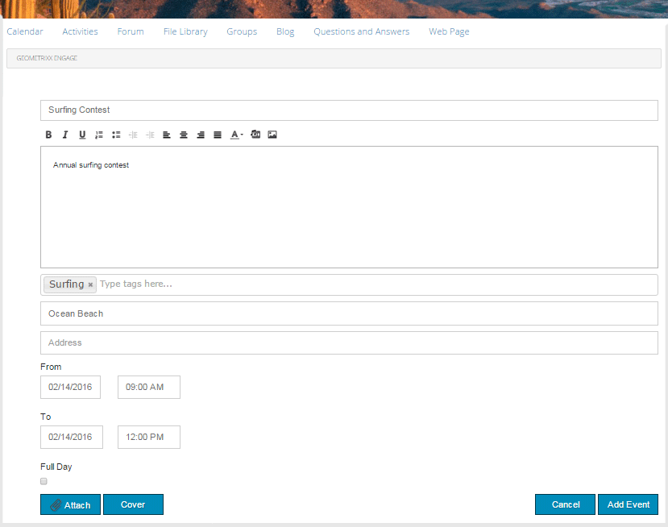

# Calendar Feature {#calendar-feature}

## Introduction {#introduction}

The calendar feature supports providing community event information in a calendar format either to all site visitors or only signed in site visitors (community members), while only authorized members may add events.

This section of the documentation describes:

* Adding the calendar feature to an AEM site
* Configuration settings for `Calendar`components

## Adding a Calendar to a Page {#adding-a-calendar-to-a-page}

To add a `Calendar` component to a page in author mode, use the component browser to locate

* `Communities / Calendar`

and drag it into place on a page, such as a position relative to the feature for users to review.

For necessary information, visit [Communities Components Basics](basics.md).

When the [required client-side libraries](calendar-basics-for-developers.md#essentials-for-client-side) are included, this is how the `Calendar` component will appear.

### Configuring Calendar {#configuring-calendar}

Select the placed `Calendar`component to access and select the `Configure` icon which opens the edit dialog.

 

#### Settings tab {#settings-tab}

Under the **[!UICONTROL Settings]** tab, specify whether or not to allow tags to be applied to calendar entries.

* **[!UICONTROL Events Per Page]** 

  Defines the number of evens shown per page. Default is 10.

* **[!UICONTROL Moderated]** 

  If checked, posting of calendar events and comments must be approved before they will appear on a publish site. Default is unchecked.

* **[!UICONTROL Closed]** 

  If checked, the calendar is closed to new event entries and comments. Default is unchecked.

* **[!UICONTROL Rich Text Editor]** 

  If checked, calendar events and comments may be entered with markup. Default is checked.

* **[!UICONTROL Allow Tagging]** 

  If checked, allow members to add tag labels to the events they post (see **Tag field** tab). Default is checked.

* **[!UICONTROL Allow File Uploads]** 

  If checked, allow file attachments to be added to a calendar event or comment. Default is checked.

* **[!UICONTROL Allow Following]** 

  If checked, allow members to follow events posted to the calendar. Default is checked.

* **[!UICONTROL Max File Size]** 

  Relevant only if `Allow File Uploads` is checked. This field will limit the size (in bytes) of an uploaded file. Default is 104857600 (10 Mb).

* **[!UICONTROL Allowed File Types]** 

  Relevant only if `Allow File Uploads` is checked. A comma separated list of file extensions with the "dot" separater. For example: .jpg, .jpeg, .png, .doc, .docx, .pdf. If any file types are specifed, then those not specified will not be allowed to be uploaded. Default is none specified such that all file types are allowed.

* **[!UICONTROL ]Max Attach Image File Size** 

  Relevant only if Allow File Uploads is checked. Maximum number of bytes an uploaded image file may have. Default is 2097152 (2 Mb).

* **[!UICONTROL Allowed Cover Image Types]** 

  A comma separated list of image file extensions with the "dot" separater. Default is `.jpg,.jpeg,.png,.gif,.bmp`.

* **[!UICONTROL Allow Threaded Replies]** 

  If checked, allow replies to comments posted to the calendar event. Default is checked.

* **[!UICONTROL Allow Users to Delete Comments and Events]** 

  If checked, allow members to delete the comments and calendar events they posted. Default is checked.

* **[!UICONTROL Allow Voting]** 

  If checked, include the Voting feature with a calendar event. Default is checked.

* **[!UICONTROL Show Breadcrumbs]** 

  Show breadcrumbs on event page. Default is checked.

* **[!UICONTROL Date Range Filter]** 

  Defines the number of days added to the current date in order to compute the "To" value of the calendar event listing page filter. Default number is 30.

* **[!UICONTROL Allow Featured Content]** 

  If checked, the idea is able to be identified as [featured content](featured.md). Default is unchecked.

Under the **[!UICONTROL User Moderation]** tab, specify how the posted topics and replies (user generated content) are managed. For more information, see [Moderating User Generated Content](moderate-ugc.md).

#### User Moderation tab {#user-moderation-tab}

* **[!UICONTROL Deny Posts]** 

  If checked, trusted member moderators will be allowed to deny posts and prevent the post from appearing on the public forum. Default is checked.  

* **[!UICONTROL Close/Reopen Events]** 

  If checked, trusted member moderators may close an event to further edits and comments, and may also reopen an event. Default is checked.  

* **[!UICONTROL Flag Posts]** 

  If checked, allow members to flag others' events or comments as inappropriate. Default is checked. 

* **[!UICONTROL Flag Reason List]** 

  If checked, allow members to choose, from a drop-down list, their reason for flagging an event or comment as inappropriate. Default is unchecked.  

* **[!UICONTROL Custom Flag Reason]** 

  If checked, allow members to enter their own reason for flagging an event or comment as inappropriate. Default is unchecked. 

* **[!UICONTROL Moderation Threshold]** 

  Enter the number of times an event or comment has to be flagged by members before moderators are notified. Default is 1 ( one time).

* **[!UICONTROL Flagging Limit]** 

  Enter the number of times an event or comment has to be flagged before it is hidden from public view. If set to -1, the flagged topic or comment is never hidden from public view. Else, this number must be greater than or equal to the Moderation Threshold. Default is 5.

#### Tag field tab {#tag-field-tab}

Under the **[!UICONTROL Tag field]** tab, the tags which may be applied, if allowed under the **[!UICONTROL Settings]** tab, are limited according to namespaces chosen.

* **[!UICONTROL Allowed Namespaces]** 

  Relevant if `Allow Tagging` is checked under the **[!UICONTROL Settings]** tab. The tags which may be applied are limited to those within the namespace categories checked. The list of namespaces includes "Standard Tags" (the default namespace) as well as "Include All Tags". Default is none checked, which means all namespaces are allowed.

* **[!UICONTROL Suggestion Limit]** 

  Enter the number of tags to be displayed as a suggestion to the member posting to the forum. Default is `-1` (no limits).

>[!NOTE]
>
>Visit [Administering Tags](../../help/sites-administering/tags.md) to learn how to add a new tag namespace (taxonomy).

#### Translation tab {#translation-tab}

Under the **[!UICONTROL Translation]** tab, if translation is enabled for the community site, translation may be set to translate the entire thread (event and comments) instead of specific posts.

* **[!UICONTROL Translate All]** 

  If checked, the event and comments are translated into the user's preferred language. Default is checked.

## Site Visitor Experience {#site-visitor-experience}

In the publish environment, the calendar feature will display a search field with a default date range, and any calendar events which fall within that range.

When a calendar event is selected, the calendar event details, description and comments are displayed.

Other abilities depend on whether the site visitor is a moderator, administrator, community member, privileged member or anonymous.

### Moderators and Administrators {#moderators-and-administrators}

When the signed in user has moderator or administrator privileges, they are able to perform [moderation tasks](moderate-ugc.md) (as permitted by the configuration of the component) on all calendar events and comments posted to an event.

### Members {#members}

When the signed in user is a community member or [privileged member](users.md#privileged-members-group) (depending on configuration), they are able to select `New Event` to create and post a new calendar event.

Specifically, they may

* Create a new calendar event
* Post a comment to a calendar event
* Edit their own calendar event or comment
* Delete their own calendar event or comment
* Flag others' calendar events or comments

 

### Anonymous {#anonymous}

Site visitors who are not signed in may only read posted calendar events, translate them if supported, but may not add an event or comment nor flag others' events or comments.

## Additional Information {#additional-information}

More information may be found on the [Calendar Essentials](calendar-basics-for-developers.md) page for developers.

For moderation of calendar events and comments, see [Moderating User Generated Content](moderate-ugc.md).

For tagging calendar events and comments, see [Tagging User Generated Content](tag-ugc.md).

For translation of calendar events and comments, see [Translating User Generated Content](translate-ugc.md).
