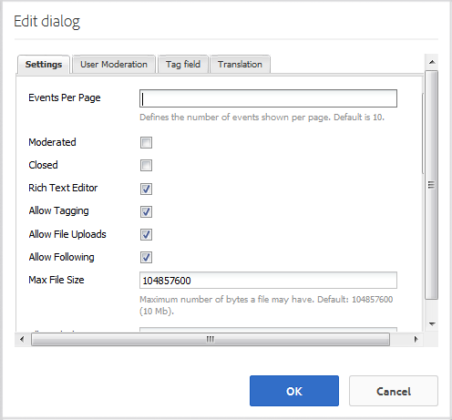

# Calendar Feature {#calendar-feature}

## Introduction {#introduction}

The calendar feature supports providing community event information in a calendar format either to all site visitors or only signed in site visitors (community members), while only authorized members may add events.

This section of the documentation describes

* Adding the calendar feature to an AEM site
* Configuration settings for `Calendar` components

## Adding a Calendar to a Page {#adding-a-calendar-to-a-page}

To add a `Calendar` component to a page in author mode, use the component browser to locate

* `Communities / Calendar`

And drag it into place on a page, such as a position relative to the feature for users to review.

For necessary information, visit [Communities Components Basics](/help/communities/basics.md).

When the [required client-side libraries](/help/communities/calendar-basics-for-developers.md#essentials-for-client-side) are included, this is how the `Calendar` component appears.

### Configuring Calendar {#configuring-calendar}

Select the placed `Calendar` component so you can access and select the `Configure` icon which opens the edit dialog.

 

#### Settings tab {#settings-tab}

Under the **Settings** tab, specify whether to allow tags to be applied to calendar entries.

* **Events Per Page**
  
  Defines the number of evens shown per page. Default is 10.

* **Moderated**
  
  If checked, posting of calendar events and comments must be approved before they appear on a publish site. Default is unchecked.

* **Closed**
  
  If checked, the calendar is closed to new event entries and comments. Default is unchecked.

* **Rich Text Editor**
  
  If checked, calendar events and comments may be entered with markup. Default is checked.

* **Allow Tagging**
  
  If checked, allow members to add tag labels to the events they post (see **Tag field** tab). Default is checked.

* **Allow File Uploads**
  
  If checked, allow file attachments to be added to a calendar event or comment. Default is checked.

* **Allow Following**
  
  If checked, allow members to follow events posted to the calendar. Default is checked.

* **Max File Size**
  
  Relevant only if `Allow File Uploads` is checked. This field limits the size (in bytes) of an uploaded file. Default is 104857600 (10 Mb).

* **Allowed File Types**
  
  Relevant only if `Allow File Uploads` is checked. A comma-separated list of file extensions with the "dot" separator. For example, .jpg, .jpeg, .png, .doc, .docx, .pdf. If any file types are specified, then those not specified cannot be uploaded. Default is none specified such that all file types are allowed.

* **Max Attach Image File Size**
  
  Relevant only if Allow File Uploads is checked. Maximum number of bytes an uploaded image file may have. Default is 2097152** **(2 Mb).

* **Allowed Cover Image Types**
  
  A comma-separated list of image file extensions with the "dot" separator. Default is `.jpg,.jpeg,.png,.gif,.bmp`.

* **Allow Threaded Replies**
  
  If checked, allow replies to comments posted to the calendar event. Default is checked.

* **Allow Users to Delete Comments and Events**
  
  If checked, allow members to delete the comments and calendar events that they posted. Default is checked.

* **Allow Voting**
  
  If checked, include the Voting feature with a calendar event. Default is checked.

* **Show Breadcrumbs**
  
  Show breadcrumbs on event page. Default is checked.

* **Date Range Filter**
  
  Defines the number of days added to the current date to compute the "To" value of the calendar event listing page filter. Default number is 30.

* **Allow Featured Content**
  
  If checked, the idea is identifiable as [featured content](/help/communities/featured.md). Default is unchecked.

Under the **User Moderation** tab, specify how the posted topics and replies (user generated content) are managed. For more information, see [Moderating User Generated Content](/help/communities/moderate-ugc.md).

#### User Moderation tab {#user-moderation-tab}

* **Deny Posts**
  
  If checked, trusted member moderators is allowed to deny posts and prevent the post from appearing on the public forum. Default is checked.

* **Close / Reopen Events**
  
  If checked, trusted member moderators may close an event to further edits and comments, and may also reopen an event. Default is checked.

* **Flag Posts**
  
  If checked, allow members to flag others' events or comments as inappropriate. Default is checked.

* **Flag Reason List**
  
  If checked, allow members to choose, from a drop-down list, their reason for flagging an event or comment as inappropriate. Default is unchecked.

* **Custom Flag Reason**
  
  If checked, allow members to enter their own reason for flagging an event or comment as inappropriate. Default is unchecked.

* **Moderation Threshold**
  
  Enter the number of times an event or comment has to be flagged by members before moderators are notified. Default is 1 ( one time).

* **Flagging Limit**
  
  Enter the number of times an event or comment has to be flagged before it is hidden from public view. If set to -1, the flagged topic or comment is never hidden from public view. Else, this number must be greater than or equal to the Moderation Threshold. Default is 5.

#### Tag field tab {#tag-field-tab}

Under the **Tag field** tab, the tags which may be applied, if allowed under the **Settings** tab, are limited according to namespaces chosen.

* **Allowed Namespaces**
  
  Relevant if `Allow Tagging` is checked under the **Settings** tab. The tags which may be applied are limited to those within the namespace categories checked. The list of namespaces includes "Standard Tags" (the default namespace) and "Include All Tags". Default is none checked, which means all namespaces are allowed.

* **Suggestion Limit**
  
  Enter the number of tags to be displayed as a suggestion to the member posting to the forum. Default is **-**1 (no limits).

>[!NOTE]
>
>Visit [Administering Tags](/help/sites-administering/tags.md) where you can learn how to add a tag namespace (taxonomy).

#### Translation tab {#translation-tab}

Under the **Translation** tab, if translation is enabled for the community site, translation may be set to translate the entire thread (event and comments) instead of specific posts.

* **Translate All**
 
  If checked, the event and comments are translated into the user's preferred language. Default is checked.

## Site Visitor Experience {#site-visitor-experience}

In the publish environment, the calendar feature displays a search field with a default date range, and any calendar events which fall within that range.

When a calendar event is selected, the calendar event details, description, and comments are displayed.

Other abilities depend on whether the site visitor is a moderator, administrator, community member, privileged member or anonymous.

### Moderators and Administrators {#moderators-and-administrators}

When the signed in user has moderator or administrator privileges, they are able to perform [moderation tasks](/help/communities/moderate-ugc.md) (as permitted by the configuration of the component) on all calendar events and comments posted to an event.

#### Members {#members}

When the signed in user is a community member or [privileged member](/help/communities/users.md#privileged-members-group) (depending on configuration), they are able to select `New Event` to create and post a new calendar event.

Specifically, they may:

* Create a calendar event
* Post a comment to a calendar event
* Edit their own calendar event or comment
* Delete their own calendar event or comment
* Flag others' calendar events or comments

 

#### Anonymous {#anonymous}

Site visitors who are not signed in may only read posted calendar events, translate them if supported, but may not add an event or comment nor flag others' events or comments.

## Additional Information {#additional-information}

More information may be found on the [Calendar Essentials](/help/communities/calendar-basics-for-developers.md) page for developers.

For moderation of calendar events and comments, see [Moderating User Generated Content](/help/communities/moderate-ugc.md).

For tagging calendar events and comments, see [Tagging User Generated Content](/help/communities/tag-ugc.md).

For translation of calendar events and comments, see [Translating User Generated Content](/help/communities/translate-ugc.md).
