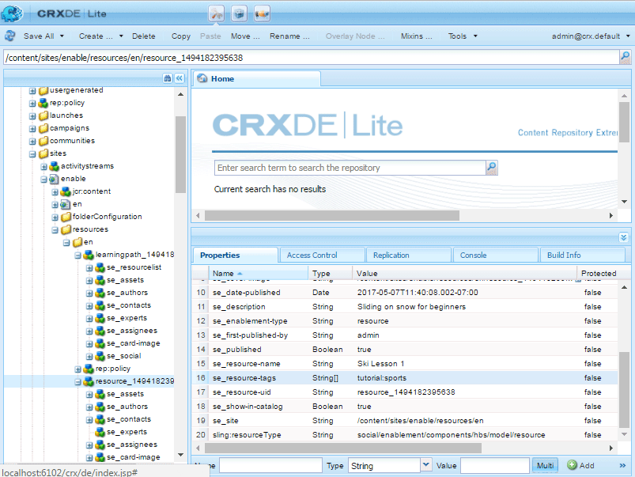

# Catalog Essentials {#catalog-essentials}

This page provides the essential information for working with the catalog feature of enablement community sites.

The catalog feature, when included in a community site, allows community members to browse and select enablement resources listed in a catalog.

The [ `enablement catalog` component](catalog.md) allows community members to access a catalog of [enablement resources](resources.md). The use of AEM tags is an important part of managing the appearance of enablement resources in a catalog.

See [Tagging Enablement Resources](tag-resources.md).

## Essentials for Client-Side {#essentials-for-client-side}

<table>
 <tbody>
  <tr>
   <td> <strong>resourceType</strong></td>
   <td>social/enablement/components/hbs/catalog</td>
  </tr>
  <tr>
   <td> <a href="scf.md#add-or-include-a-communities-component"><strong>includable</strong></a></td>
   <td>No</td>
  </tr>
  <tr>
   <td> <a href="clientlibs.md"><strong>clientllibs</strong></a></td>
   <td>cq.social.enablement.hbs.breadcrumbs  cq.social.enablement.hbs.catalog  cq.social.enablement.hbs.resource  cq.social.enablement.hbs.learningpath</td>
  </tr>
  <tr>
   <td> <strong>templates</strong></td>
   <td> /libs/social/enablement/components/hbs/catalog/catalog.hbs  </td>
  </tr>
  <tr>
   <td> <strong>css</strong></td>
   <td> /libs/social/enablement/components/hbs/catalog/clientlibs/catalog.css</td>
  </tr>
  <tr>
   <td><strong> properties</strong></td>
   <td>See <a href="catalog.md">Catalog Feature</a></td>
  </tr>
 </tbody>
</table>

## Essentials for Server-Side {#essentials-for-server-side}

### Catalog Function {#catalog-function}

A community site structure that includes the [Catalog function](functions.md#catalog-function), includes a configured `enablement catalog` component.

### Pre-Filters {#pre-filters}

When a Catalog function has been added to a community site, it is possible to restrict the enablement resources and learning paths which appear in the catalog by specifying a pre-filter. This is done by setting properties on the instance of the catalog resource for the site.

Using the example of the [Enablement Tutorial](getting-started-enablement.md):

* On author
* Using [CRXDE](../../help/sites-developing/developing-with-crxde-lite.md)

  * Such as [https://&lt;server&gt;:&lt;port&gt;/crx/de](http://localhost:4502/crx/de)

* Navigate to the catalog resource on the catalog page

  * For example, `/content/sites/enable/en/catalog/jcr:content/content/primary/catalog`

* Add a child filters node

  * Select the `catalog`node
  * Select **[!UICONTROL Create Node]**

    * Name: `filters`
    * Type: `nt:unstructured`
    * Select **[!UICONTROL Save All]**

* Add `se_resource-tags` property to the `filters` node

  * Select the `filters` node
  * Add a Multi property

    * Name: `se_resource-tags`
    * Type: String
    * Value: *&lt;enter a [TagID](#pre-filter-tagids)&gt;*
      * Select **[!UICONTROL Multi]**
      * Select **[!UICONTROL Add]**

        * In popup dialog, select `+` to add additional pre-filter TagIDs

* Re-publish the community site

#### Pre-filter TagIDs {#pre-filter-tagids}

The pre-filter [TagIDs](../../help/sites-developing/framework.md#tagid) must exactly match the tags applied to the enablement resources. These are visible in the `resources` folder for the site as the values of the property `se_resource-tags`.

### Reference APIs {#reference-apis}

* [Enablement API](https://helpx.adobe.com/experience-manager/6-5/sites/developing/using/reference-materials/javadoc/com/adobe/cq/social/enablement/reporting/model/api/package-summary.html)

* [Reporting API](https://helpx.adobe.com/experience-manager/6-5/sites/developing/using/reference-materials/javadoc/com/adobe/cq/social/reporting/dv/api/package-summary.html)

* [Reporting Analytics API](https://helpx.adobe.com/experience-manager/6-5/sites/developing/using/reference-materials/javadoc/com/adobe/cq/social/reporting/dv/model/api/package-summary.html)
