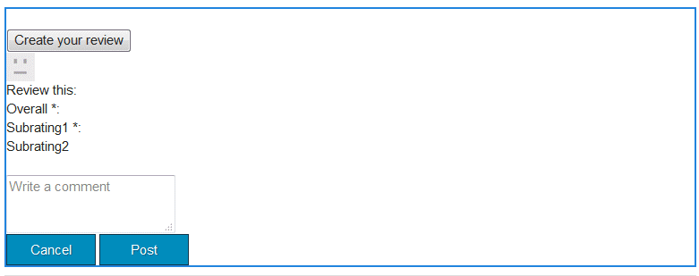
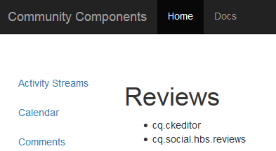
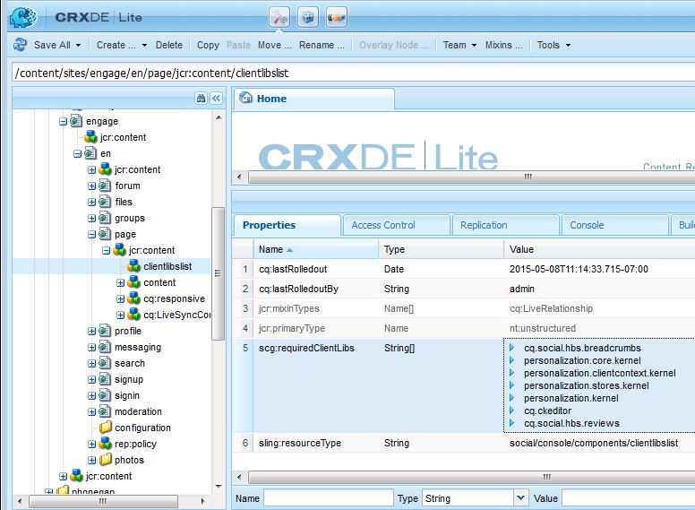

# Clientlibs for Communities Components {#clientlibs-for-communities-components}

## Introduction {#introduction}

This section of the documentation describes how to add client-side libraries (clientlibs) to a page for Communities components.

For basic information, visit :

* [Using Client-Side Libraries](/help/sites-developing/clientlibs.md) which provides usage details and debugging tools
* [Clientlibs for SCF](/help/communities/client-customize.md#clientlibs) which provides useful information when customizing SCF components

## Why Clientlibs are Required {#why-clientlibs-are-required}

Clientlibs are required for the proper functioning (JavaScript) and styling (CSS) of a component.

When there exists a [community function](/help/communities/functions.md) for a feature, all necessary components and configurations, including the required clientlibs, are present in the community site. Only if additional components are to be available to authors would additional clientlibs need to be added.

When the required clientlibs are missing, [adding a Communities component to a page](/help/communities/author-communities.md) could result in JavaScript errors and an unexpected appearance.

### Example : Placed Reviews without Clientlibs {#example-placed-reviews-without-clientlibs}

### Example : Placed Reviews with Clientlibs {#example-placed-reviews-with-clientlibs}

## Identifying Required Clientlibs {#identifying-required-clientlibs}

The essential feature information for developers identifies the required clientlibs.

In addition, from an AEM instance, browsing to the [Community Components Guide](/help/communities/components-guide.md) provides access to a listing of clientlib categories required for a component.

For example, at the top of the [Reviews page](https://localhost:4502/content/community-components/en/reviews.html) the required clientlibs listed are

* cq.ckeditor
* cq.social.hbs.reviews

## Adding Required Clientlibs {#adding-required-clientlibs}

When it is desired to add a Communities component to a page, it is necessary to add the required clientlibs for the component if not already present.

Use [CRXDE|Lite](#using-crxde-lite) to modify an existing clientlibslist for a community site page.

To add a clientlib for a community site using [CRXDE Lite](/help/sites-developing/developing-with-crxde-lite.md):

* Browse to [https://&lt;server&gt;:&lt;port&gt;/crx/de](https://localhost:4502/crx/de).
* Locate the `clientlibslist` node for the page on which you wish to add the component:

  * `/content/sites/sample/en/page/jcr:content/clientlibslist`

* With `clientlibslist` node selected:

  * Locate the String[] property `scg:requiredClientLibs`.
  * Select its `Value` to access the String array dialog.

    * Scroll down if necessary.
    * Select + to enter a new client library.

      * Repeat to add more client libraries.

      * Select **OK**.

  * Select **Save All**.

>[!NOTE]
>
>If the site is not a community site, the existence or location of the client libraries in use for the site must be discovered.

Using the [Getting Started with AEM Communities](/help/communities/getting-started.md) example, where `site-name` is *engage*, this is how the clientliblist would appear if adding the reviews component:

