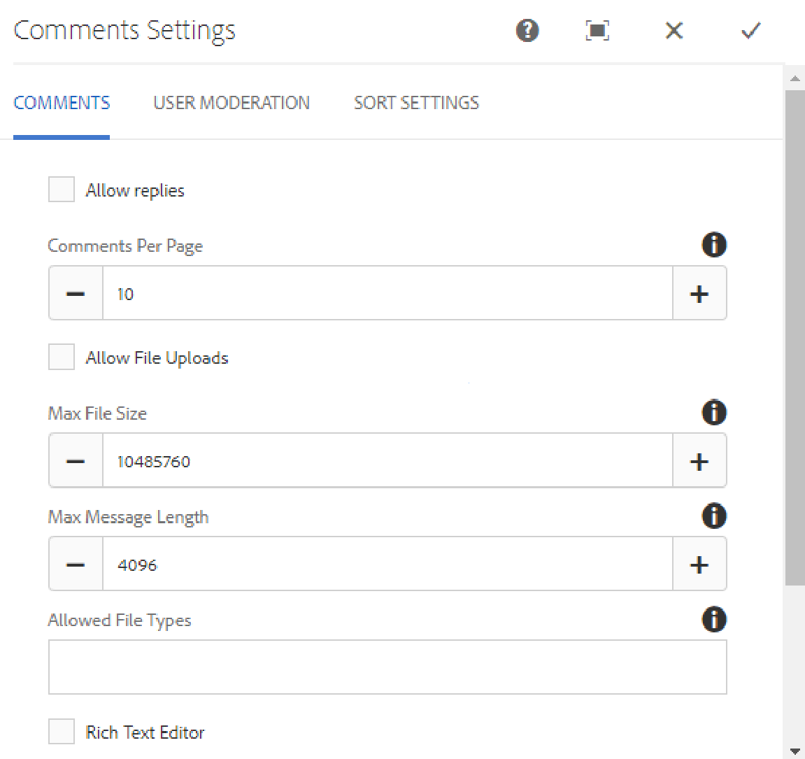

# Using Comments {#using-comments}

## Introduction {#introduction}

The comments feature is used to allow signed-in site visitors (members) to share their opinions and knowledge regarding content on the site. This feature is often already present in other features, but may be added to any website.

The document describes:

* Adding `Comments` to a page.
* Configuration settings for the `Comments` component.

>[!NOTE]
>
>Anonymous posting of a comment is not supported. Site visitors must register (become a member) and sign in to participate.

### Adding Comments to a Page {#adding-comments-to-a-page}

To add a `Comments` component to a page in author mode, use the component browser to locate

* `Communities / Comments`

and drag it into place on a page, such as a position relative to the feature for users to comment on, or simply at the bottom of the page.

For necessary information, visit [Communities Components Basics](/help/communities/basics.md).

When the [required client-side libraries](/help/communities/essentials-comments.md#essentials-for-client-side) are included, this is how the `Comments` component appears.

>[!NOTE]
>
>Only one `Comments` component may exist on a page. Be aware that several Communities features already include comments, such as a blog, calendar, forum, QnA, and reviews.

### Configuring Comments {#configuring-comments}

Select the placed `Comments` component to access and select the `Configure` icon which opens the edit dialog.

 

#### Comments tab {#comments-tab}

Under the **Comments** tab, specify how comments are entered by visitors.

* **Allow replies**

  If checked, allows members to reply to existing comments. Default is deselected.

* **Comments Per Page**

  Limits the number of comments shown per page and the number of replies shown. Default is 10.

* **Allow File Uploads**

  If checked, the option to upload a file is presented with the text entry box. Default is deselected.

* **Max File Size**

  Relevant only if Allow File Uploads is checked. This value limits the uploaded file size. Default limit is 10 MB.

* **Max Message Length**

  Maximum number of characters that may be entered into the text box. Default is 4096 characters.

* **Allowed File Types**

  Relevant only if Allow File Uploads is checked. A comma-separated list of file name extensions with the "dot" separator. For example: .jpg, .jpeg, .png, .doc, .docx, .pdf. If any file types are specified, then those not specified are not allowed. Default is none specified such that all file types are allowed.

* **Rich Text Editor**

  If checked, comments are entered with markup. Default is deselected.

* **Allow Voting**

  If checked, the option to vote up or down is presented with the text entry box. Default is deselected.

* **Allow Following**

  If checked, allow members to follow comments. Default is deselected.

* **Display Badges**

  If checked, allow earned and awarded badges to be displayed. Default is deselected.

#### User Moderation tab {#user-moderation-tab}

Under the **User Moderation** tab, specify how the posted comments are managed. For more information, see [Moderating User Generated Content](/help/communities/moderate-ugc.md).

* **Pre-Moderation**
  
  If checked, comments must be approved before they appear on a publish site. Default is deselected.

* **Delete Comments**

  If checked, the member who posted the comment is provided the ability to delete it. Default is deselected.

* **Deny Comments**

  If checked, allow moderators to deny comments. Default is deselected.

* **Close / Reopen Comments**

  If checked, allow moderators to close and reopen comments. Default is deselected.

* **Flag Comments**

  If checked, allow members to flag comments as inappropriate. Default is deselected.

* **Flag Reason List**

  If checked, allow members to choose, from a drop-down list, their reason for flagging a comment as inappropriate. Default is deselected.

* **Custom Flag Reason**

  If checked, allow members to enter their own reason for flagging a comment as inappropriate. Default is deselected.

* **Moderation Threshold**

  Enter the number of times a comment has to be flagged by the members before moderators are notified. Default is one time (1).

* **Flagging Limit**

  Enter the number of times a comment has to be flagged before it is hidden from public view. This number must be greater than or equal to the **Moderation Threshold**. Default is 5.

#### Sort Settings tab {#sort-settings-tab}

Under the **Sort Settings** tab, specify how the posted comments are sorted when displayed.

* **Sort Field**

  Pull down to select one of `Newest, Oldest, Last Updated, Most Viewed, Most Active, Most Followed`, or `Most Liked`.

* **Sort Order**

  Pull down to select one of `Ascending` or `Descending`.

### Changing to a Custom Comment Type {#changing-to-a-custom-comment-type}

By changing the Comment Resource Type, the comment system no longer generates an instance of a comment using the default, but rather one that has been customized (extended) by developers.

Once the custom resource types are known, enter [Design Mode](/help/sites-authoring/default-components-designmode.md) and double-click the placed `Comments` component to open a dialog with an extra tab.

Under the **Resource Types** tab, specify the custom resourceType for new instances of the `Comments or Voting` components:

* **Comment Resource Type**

  Navigate to the resourceType of an extended `comment` component (single comment) in /apps. For example, `/apps/social/commons/components/hbs/comments/comment`

  This resource identifies the resourceType of the UGC created when a visitor posts a comment.

* **Voting Resource Type**

  Navigate to the resourceType of an extended `voting` component in /apps. For example, `/apps/social/components/hbs/voting`

  This resource identifies the resource type of the UGC created when a visitor posts a vote.

* **Comment System Resource Type**

  Navigate to the resourceType of an extended `comments`component (Comment System) in /apps. Leave blank unless the page template [dynamically includes](/help/communities/scf.md#add-or-include-a-communities-component) the Comment System in the underlying script instead of being added to the page as a resource (comments node). Learn more by reading about the [`{{include}}` helper](/help/communities/handlebars-helpers.md#include).

### Site Visitor Experience {#site-visitor-experience}

#### Moderators and Administrators {#moderators-and-administrators}

When the signed in user has moderator or administrator privileges, they are able to perform the moderation tasks permitted by the configuration of the component, regardless of who authored the comment.

#### Members {#members}

When the site visitor is signed in, depending on the configuration, they may

* Post a new comment
* Edit their own comment
* Delete their own comment
* Flag others' comments

#### Anonymous {#anonymous}

Site visitors who are not signed in may only read posted comments, translate them if supported, but may not add a comment nor flag others' comments.

### Additional Information {#additional-information}

More information may be found on the [Comments Essentials](/help/communities/essentials-comments.md) page for developers.

For moderation of posted comments, see [Moderating User Generated Content](/help/communities/moderate-ugc.md).

For translation of posted comments, see [Translating User Generated Content](/help/communities/translate-ugc.md).
