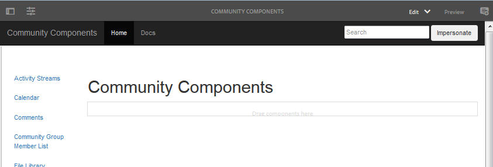
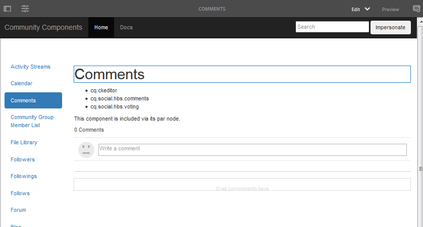
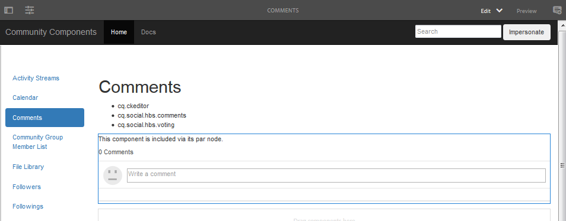
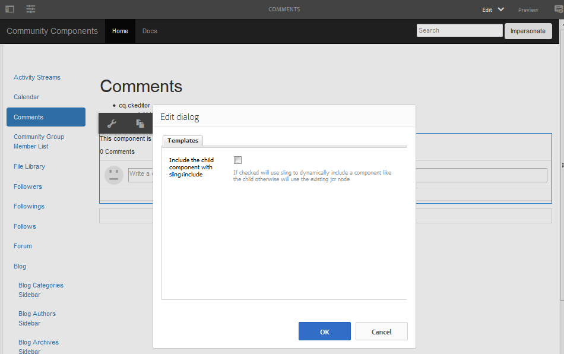
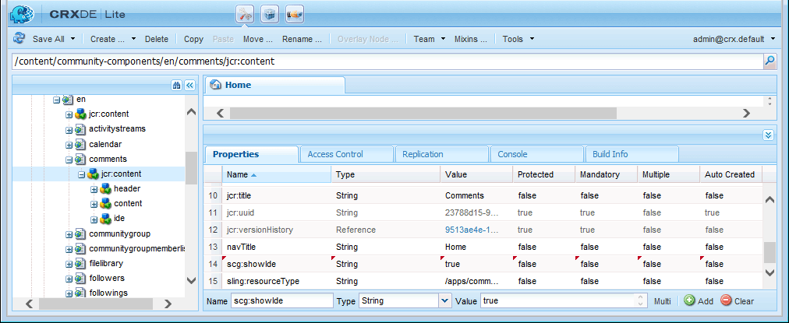
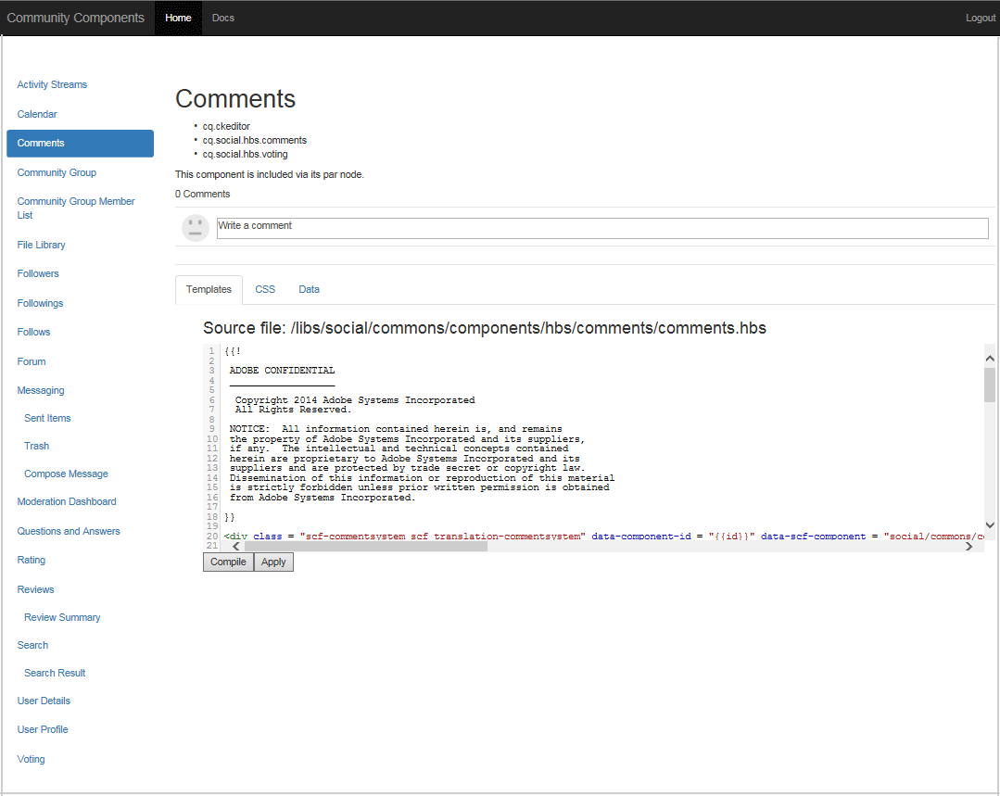

# Community Components Guide  {#community-components-guide}

The Community Components guide is an interactive development tool for the [social component framework (SCF)](scf.md). It provides a list of available Adobe Experience Manager (AEM) Communities components or the more complex features built of multiple components.

Along with basic information for each component, the guide allows for experimentation with how the SCF components/features work and how they can be configured or customized.

For information regarding development essentials related to each component, see [Feature and Component Essentials](essentials.md).

## Getting Started {#getting-started}

The guide is intended for use on development installations of author instances (localhost:4502), and publish instances (localhost:4503).

The Community Components site is accessed by browsing to

* [https://&lt;server&gt;:&lt;port&gt;/content/community-components/en.html](http://localhost:4502/content/community-components/en.html)

Interactions with the Communities components vary depending on:

* The server (author or publish).
* Whether the site visitor is signed in or not.
* If signed in, the privileges assigned to the member.
* Whether the default SRP, [JSRP](jsrp.md), is in use.

On author, to enter edit mode, insert either `editor.html` or `cf#` as the first path segment after the server name:

* Standard UI:

  [https://&lt;server&gt;:&lt;port&gt;/editor.html/content/community-components/en.html](http://localhost:4502/editor.html/content/community-components/en.html)

* Classic UI:

  [https://&lt;server&gt;:&lt;port&gt;/cf#/content/community-components/en.html](http://localhost:4502/cf#/content/community-components/en.html)

>[!NOTE]
>
>On author in Edit mode, the links on a page are not active.
>
>To navigate to a component page, first select Preview mode to activate the links.
>
>With the component page displayed in the browser, return to Edit mode to open the component's edit dialog.
>
>For general authoring information, view the [quick guide to authoring pages](../../help/sites-authoring/qg-page-authoring.md).
>
>If not familiar with AEM, view the documentation on [basic handling](../../help/sites-authoring/basic-handling.md).

### Home Page {#home-page}

The guide provides a listing of SCF components available for preview and prototyping along the left side of the page.

Components Guide as viewed on an author instance in Edit mode:

## Component Pages {#component-pages}

Select a component from the list along the left side of the page.

The main body of the guide displays:

1. Title: The name of the component selected
1. [Client-Side Llibraries](#client-side-libraries): A list of one or more required categories
1. [Includable](scf.md#add-or-include-a-communities-component): If the component may be dynamically included, then the state can be toggled in author edit mode:

    * If added, text displayed is: "This component is included via its par node."
    * If included, text displayed is: "This component is included dynamically."
    * If not includible, then no text is displayed

1. Sample Component or Feature: an active instance of the component or feature. If a component, it may be altered with changes made to the templates, CSS, and data provided in the tab section.

>[!NOTE]
>
>After making a selection from the left-hand side, the component will appear below, instead of beside, the listing of components when the browser window is too narrow.

### Author Interactions {#author-interactions}

When using the guide on an author instance, it is possible to experience configuring a component by opening its dialog. Information for developers is provided in the [Component and Feature Essentials](essentials.md) section of the documentation, while the dialog settings are described in [Communities Components](author-communities.md) section for authors.

For the Community Components guide, some component dialog settings are overlaid with the [Includable](scf.md#add-or-include-a-communities-component) toggle state. To toggle between using the existing resource or a dynamically included resource, in edit mode select both the component and includable text and double-click to open the edit dialog:

Under the **Templates** tab:

* **Include the child component with sling:include**

  If unchecked, the Component Guide uses the existing resource in the repository (a jcr node which is a child of a par node).

    * text displayed is: "This component is included via its par node."

  If checked, the Component Guide uses sling to dynamically include a component of the child node's resourceType (non-existing resource).

    * text displayed is: "This component is included dynamically."

  Default is unchecked.

### Publish Interactions {#publish-interactions}

When using the guide on a publish instance, it is possible to experience the components and features as a site visitor (not signed in) and as members with various privileges when signed in.

>[!NOTE]
>
>Be aware, if the SRP is left defaulted to [JSRP](jsrp.md), then UGC entered on the publish instance will only be visible on publish, and will *not* be visible from the [moderation](moderate-ugc.md) console on the author instance.

## Client-Side Libraries {#client-side-libraries}

The client-side libraries (clientlibs) listed for each component are those *required* to be referenced when the component is placed on a page. The clientlibs provide a means of managing and optimizing the download of the JavaScript and CSS used to render the component in the browser.

For more information, visit [Clientlibs for Communities Components](clientlibs.md).

## Impersonation {#impersonation}

On the author instance, where one is often signed in as an administrator or developer, to experience the component logged in as another user, use the text box to the left of the **[!UICONTROL Impersonate]** button to either type in the username or select from the pull-down list, and then click the button. Click Revert to sign out and end the impersonation.

The publish instance does not need to impersonate. Simply use the Login/Logout link to impersonate various users, such as the [demo users](tutorials.md#demo-users).

## Customization {#customization}

When enabled, each SCF component is available for prototyping of possible customizations by temporarily modifying the component's template, CSS, and data.

### Enabling Customization {#enabling-customization}

>[!NOTE]
>
>**This tool is read-only**. None of the edits made to templates, CSS or data are saved to the repository.

To quickly experiment with customizations, the `scg:showIde`property must be added to the component page's content JCR node and set to true.

Using the comments component as an example, on either the author or publish instance, signed in with administrator privileges:

1. Browse to [CRXDE Lite](../../help/sites-developing/developing-with-crxde-lite.md)

   For example, [http://localhost:4503/crx/de](http://localhost:4503/crx/de)

1. Select the component's `jcr:content` node

   For example, `/content/community-components/en/comments/jcr:content`

1. Add a property

    * **Name** `scg:showIde`
    * **Type** `String`
    * **Value** `true`

1. Select **[!UICONTROL Save All]**
1. Reload the Comments page in the guide

   [http://localhost:4503/content/community-components/en/comments.html](http://localhost:4503/content/community-components/en/comments.html)

1. Notice there are now three tabs for Templates, CSS, and Data.

 

### Templates Tab {#templates-tab}

Select the templates tab to see the templates associated with the component.

The Template Editor allows local edits to be compiled and applied to the sample component instance at the top of the page without affecting the component in the repository.

Running compile on local edits will highlight any errors along by placing a dot in the gutter and marking the text red.

### CSS Tab {#css-tab}

Select the CSS tab to see the CSS associated with the component.

If a component is a composite of multiple components, some CSS may be listed under one of the other components.

The CSS Editor allows the CSS to be modified and applied to the sample component instance at the top of the page.

A rule may be selected to highlight the parts of the DOM using that rule by clicking next to the rule in the gutter.

### Data Tab {#data-tab}

Select the Data tab to show the .social.json endpoint data. This data is editable and is applied to the sample component instance.

Syntax errors may be marked in the gutter and highlighted in the editor.
