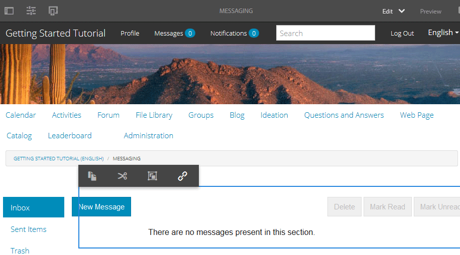
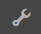
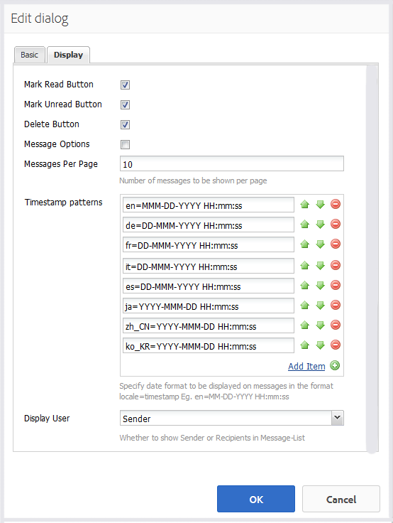
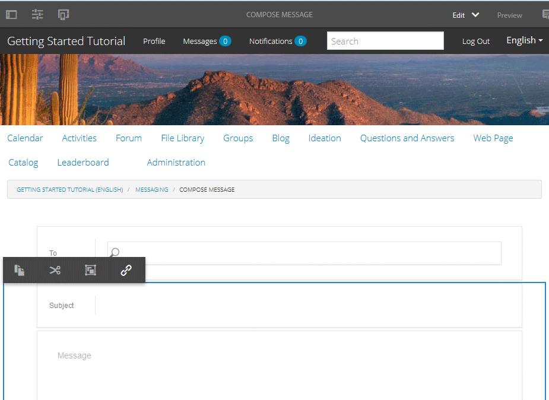
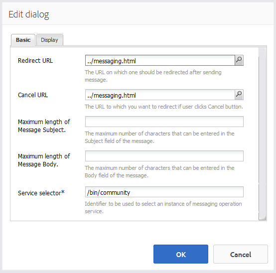
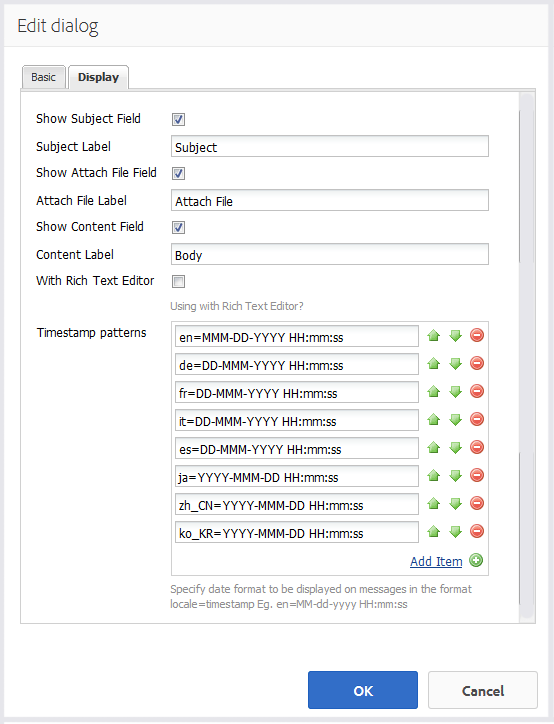

# Messaging Feature {#messaging-feature}

In addtion to the publicly visible interactions which occur in forums and comments, the messaging feature of AEM Communities enables community members to interact with one another more privately.

This feature may be included when a [community site](overview.md#communitiessites) is created.

The messaging features provides the ability to:

* Send a message to one or more community members
* Send a message to a community member group
* Send a message with attachments
* Forward a message
* Reply to a message
* Delete a message
* Restore a deleted message

In order to enable and modify the messaging feature, visit

* [Configuring Messaging](messaging.md) for administrators
* [Messaging Essentials](essentials-messaging.md) for developers

>[!NOTE]
>
>It is not supported to add `Compose Message, Message, or Message List` components (found in `Communities`component group) to a page in author edit mode.

## Configuring Messaging Components {#configuring-messaging-components}

When messaging is enabled for a community site, it is completely setup with no further configuration necessary. This information is provided if there is a need to change the default configuration.

### Configuring Message List (messagebox) {#configuring-message-list-messagebox}

In order to modify the configuration of the list of messages for **Inbox**, **Sent Items**, and **Trash** pages of the messaging feature, open the site in [author edit mode](sites-console.md#authoring-site-content).

In `Preview` mode, select the **[!UICONTROL Messages]** link to open the main messaging page. Then select either **[!UICONTROL Inbox, Sent Items, or Trash]** in order to configure the component for that message list.

In `Edit` mode, select the component on the page.

In order to access the configuraiton dialog, it is necessary to cancel inheritance by selecting the `link`icon.

Once the configuration is complete, it is necessary to restore inheritance by selecting the `broken link` icon.

Once inheritance is canceled, it will be possible to select the `configure` icon to open the configuration dialog.

#### Basic tab {#basic-tab}

* **[!UICONTROL Service selector]** 
  (*Required*) Set this to the value of the property `serviceSelector.name` from the [AEM Communities Messaging Operations Service](messaging.md#messaging-operations-service).

* **[!UICONTROL Compose Page]** 
  (*Required*) The page to open when a member clicks on the `Reply` button. The target page should contain the **[!UICONTROL Compose Message]** form.

* **[!UICONTROL Reply/View as Resource]** 
  If checked, the Reply URL and View URL will reference a resource, else data is passed as query parameters in the URL.

* **[!UICONTROL Profile Display Form]** 
  The profile form to use to display the senders profile.

* **[!UICONTROL Trash Folder]** 
  If checked, this Message List component displays only messages flagged as deleted (trash).

* **[!UICONTROL Folder Paths]** 
  (*Required*) Referencing the values set for `inbox.path.name` and `sentitems.path.name` in the [AEM Communities Messaging Operations Service](messaging.md#messaging-operations-service). When configuring for an `Inbox`, add one entry using the value of `inbox.path.name`. When configuring for an `Outbox`, add one entry using the value of `sentitems.path.name`. When configuring for `Trash`, add two entries with both values.

#### Display tab {#display-tab}

* **[!UICONTROL Mark Read Button]** 
  If checked, displays a `Read`button allowing a message to be marked as read.

* **[!UICONTROL Mark Unread Button]** 
  If checked, displays a `Mark Unread` button allowing a message to be marked as read.

* **[!UICONTROL Delete Button]** 
  If checked, displays a `Delete`button allowing a message to be marked as read. Will duplicate the delete functionality if **`Message Options`** is also checked.

* **[!UICONTROL Message Options]** 
  If checked, displays **`Reply`**, **`Reply All`**, **`Forward`** and **`Delete`** buttons allowing a message to be resent or deleted. Will duplicate the delete functionality if **`Delete Button`** is also checked.

* **[!UICONTROL Messages Per Page]** 
  The number specified is the maximum number of messages displayed per page in a pagination scheme. If no number is specified (left blank), then all messages are displayed and there is no pagination.

* **[!UICONTROL Timestamp patterns]** 
  Provide timestamp patterns for one or more languages. Default is for en, de, fr, it, es, ja, zh_CN, ko_KR.

* **[!UICONTROL Display User]** 
  Choose either **`Sender`** or **`Recipients`** to determine whether to display the Sender or Recipients.

### Configuring Compose Message {#configuring-compose-message}

In order to modify the configuration of the compose message page, open the site in [author edit mode](sites-console.md#authoring-site-content).

In `Preview`mode, select the **[!UICONTROL Messages]** link to open the main messaging page. Then select the New Message button to open the `Compose Message` page..

In `Edit` mode, select the main component on the page containing the Message body.

In order to access the configuraiton dialog, it is necessary to cancel inheritance by selecting the `link`icon.

Once the configuration is complete, it is necessary to restore inheritance by selecting the `broken link` icon.

Once inheritance is canceled, it will be possible to select the `configure` icon to open the configuration dialog.

#### Basic tab {#basic-tab-1}

* **[!UICONTROL Redirect URL]** 
  Enter the URL of the page shown after the message is sent. For example, `../messaging.html`.

* **[!UICONTROL Cancel URL]** 
  Enter the URL of the page shown if the sender cancels the message. For example, `../messaging.html`.

* **[!UICONTROL Maximum length of Message Subject]** 
  The maximum number of characters allowed in the Subject field. For example, 500. Default is no limit.

* **[!UICONTROL Maximum length of Message Body]** 
  The maximum number of characters allowed in the Content field. For example, 10000. Default is no limit.

* **[!UICONTROL Service selector]** 
  (*Required*) Set this to the value of the property **`serviceSelector.name`** from the [AEM Communities Messaging Operations Service](messaging.md#messaging-operations-service).

#### Display tab {#display-tab-1}

* **[!UICONTROL Show Subject Field]** 
  If checked, show the `Subject` field and enable adding a subject to the message. Default is not checked.

* **[!UICONTROL Subject Label]** 
  Enter the text to display next to the `Subject` field. Default is `Subject`.

* **[!UICONTROL Show Attach File Field]** 
  If checked, show the `Attachment` field and enable adding file attachments to the message. Default is not checked.

* **[!UICONTROL Attach File Label]** 
  Enter the text to display next to the `Attachment` field. Default is **`Attach File`**.

* **[!UICONTROL Show Content Field]** 
  If checked, show the `Content` field and enable adding a message body. Default is not checked.

* **[!UICONTROL Content Label]** 
  Enter the text to display next to the `Content` field. Default is **`Body`**.

* **[!UICONTROL With Rich Text Editor]** 
  If checked, indicates use of a custom Content text box with its own rich text editor. Default is not checked.

* **[!UICONTROL Timestamp patterns]** 
  Provide timestamp patterns for one or more languages. Default is for en, de, fr, it, es, ja, zh_CN, ko_KR.

