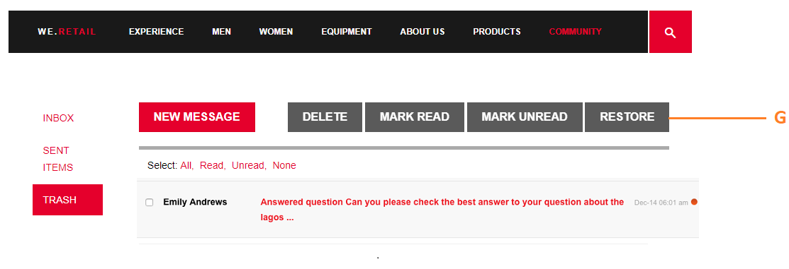
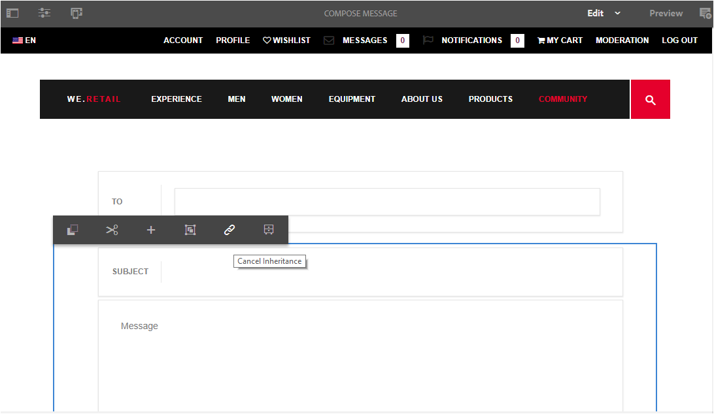
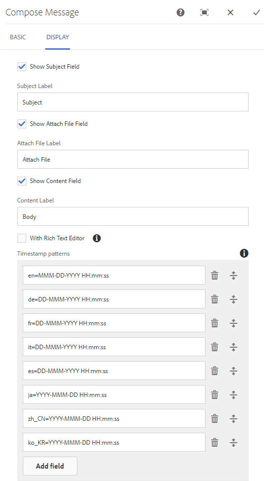

# Messaging Feature {#messaging-feature}

In addition to the publicly visible interactions which occur in forums and comments, the messaging feature of AEM Communities enables community members to interact with one another more privately.

This feature can be included when a [community site](/help/communities/overview.md#communitiessites) is created.

The messaging feature lets you do the following:

**A** - send a message to one or more community members

**B** - send direct messages in [bulk to community member groups](/help/communities/messaging.md#group-messaging)

**C** - send a message with attachments

**D** - forward a message

**E** - reply to a message

**F** - delete a message

**G** - restore a deleted message

 

To enable and modify the messaging feature, see:

* [Configure Messaging](/help/communities/messaging.md) for administrators
* [Messaging Essentials](/help/communities/essentials-messaging.md) for developers

>[!NOTE]
>
>It is not supported to add `Compose Message, Message, or Message List` components (found in `Communities`component group) to a page in author edit mode.

## Configure messaging components {#configure-messaging-components}

When messaging is enabled for a community site, it is set up with no further configuration necessary. The information is provided if there is a need to change the default configuration.

### Configure Message List (message box) {#configure-message-list-message-box}

To modify the configuration of the list of messages for **Inbox**, **Sent Items**, and **Trash** pages of the messaging feature, open the site in [author edit mode](/help/communities/sites-console.md#authoring-site-content).

1. In `Preview` mode, select the **Messages** link to open the main messaging page. Then select either **Inbox**, **Sent Items** or **Trash** to configure the component for that message list.

1. In `Edit` mode, select the component on the page.
1. To access the configuration dialog, cancel inheritance by selecting the `link` icon.
   Once inheritance is canceled, it is possible to select the configure icon to open the configuration dialog.

1. Once the configuration is complete, it is necessary to restore inheritance by selecting the `broken link` icon.

#### Basic tab {#basic-tab}

* **Service selector**
  
  (*Required*) Set this to the value of the property **`serviceSelector.name`** from the [AEM Communities Messaging Operations Service](/help/communities/messaging.md#messaging-operations-service).

* **Compose Page**
  
  (*Required*) The page to open when a member clicks the **`Reply`** button. The target page should contain the **Compose Message** form.

* **Reply/View as Resource**
  
  If checked, the Reply URL and View URL reference a resource, or else data is passed as query parameters in the URL.

* **Profile Display Form**
  
  The profile form to use to display the senders profile.

* **Trash Folder**
  
  If checked, this Message List component displays only messages flagged as deleted (trash).

* **Folder Paths**
  
  (*Required*) Referencing the values set for **inbox.path.name** and **sentitems.path.name** in the [AEM Communities Messaging Operations Service](/help/communities/messaging.md#messaging-operations-service). When configuring for an `Inbox`, add one entry using the value of **inbox.path.name**. When configuring for an `Outbox`, add one entry using the value of **sentitems.path.name**. When configuring for `Trash`, add two entries with both values.

#### Display tab {#display-tab}

* **Mark Read Button**
  
  If checked, displays a `Read`button allowing a message to be marked as read.

* **Mark Unread Button**
  
  If checked, displays a `Mark Unread` button allowing a message to be marked as read.

* **Delete Button**
  
  If checked, displays a `Delete` button allowing a message to be marked as read. Duplicates the delete functionality if **`Message Options`** is also checked.

* **Message Options**
  
  If checked, displays **`Reply`**, **`Reply All`**, **`Forward`**, and **`Delete`** buttons allowing a message to be resent or deleted. Duplicates the delete functionality if **`Delete Button`** is also checked.

* **Messages Per Page**
  
  The number specified is the maximum number of messages displayed per page in a pagination scheme. If no number is specified (left blank), then all messages are displayed and there is no pagination.

* **Timestamp patterns**
  
  Provide timestamp patterns for one or more languages. Default is for en, de, fr, it, es, ja, zh_CN, ko_KR.

* **Display User**
  
  Choose either **`Sender`** or **`Recipients`** so you can determine whether to display the Sender or Recipients.

### Configure Compose Message {#configure-compose-message}

To modify the configuration of the compose message page, open the site in [author edit mode](/help/communities/sites-console.md#authoring-site-content).

* In `Preview` mode, select the **Messages** link to open the main messaging page. Then select the New Message button so you can open the `Compose Message` page.

* In `Edit` mode, select the main component on the page containing the Message body.
* To access the configuraiton dialog, cancel inheritance by selecting the `link` icon.
  Once inheritance is canceled, it is possible to select the configure icon to open the configuration dialog.

* Once the configuration is complete, it is necessary to restore inheritance by selecting the `broken link` icon.

#### Basic tab {#basic-tab-1}

* **Redirect URL**
  
  Enter the URL of the page shown after the message is sent. For example, `../messaging.html`.

* **Cancel URL**
  
  Enter the URL of the page shown if the sender cancels the message. For example, `../messaging.html`.

* **Maximum length of Message Subject**
  
  The maximum number of characters allowed in the Subject field. For example, 500. Default is no limit.

* **Maximum length of Message Body**
  
  The maximum number of characters allowed in the Content field. For example, 10000. Default is no limit.

* **Service selector**
  
  (*Required*) Set this to the value of the property **`serviceSelector.name`** from the [AEM Communities Messaging Operations Service](/help/communities/messaging.md#messaging-operations-service).

#### Display tab {#display-tab-1}

* **Show Subject Field**
  
  If checked, show the `Subject` field and enable adding a subject to the message. Default is not checked.

* **Subject Label**
  
  Enter the text that you want displayed next to the `Subject` field. Default is `Subject`.

* **Show Attach File Field**
  
  If checked, show the `Attachment` field and enable adding file attachments to the message. Default is not checked.

* **Attach File Label**
  
  Enter the text that you want displayed next to the `Attachment` field. Default is **`Attach File`**.

* **Show Content Field**
  
  If checked, show the `Content` field and enable adding a message body. Default is not checked.

* **Content Label**
  
  Enter the text that you want displayed next to the `Content` field. Default is **`Body`**.

* **With Rich Text Editor**
  
  If checked, indicates use of a custom Content text box with its own rich text editor. Default is not checked.

* **Timestamp patterns**
  
  Provide timestamp patterns for one or more languages. Default is for en, de, fr, it, es, ja, zh_CN, ko_KR.
