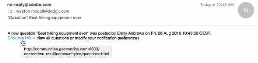

# Scoring and Badges Essentials {#scoring-and-badges-essentials}

The AEM Communities scoring and badges feature provides the ability to identify and reward community members.

The details of setting up the feature are described at

* [Communities Scoring and Badges](implementing-scoring.md)

This page contains additional technical details:

* How to [display a badge](#displaying-badges) as either image or text
* How to turn on extensive [debug logging](#debug-log-for-scoring-and-badging)
* How to [access UGC](#ugc-for-scoring-and-badging) related to scoring and badging

>[!CAUTION]
>
>The implementation structure visible in CRXDE Lite is subject to change.

## Displaying Badges {#displaying-badges}

Whether a badge is displayed as text or image is controlled on the client side in the HBS template.

For example, search for `this.isAssigned` in `/libs/social/forum/components/hbs/topic/list-item.hbs`,:

```
{{#each author.badges}}

  {{#if this.isAssigned}}

    <div class="scf-badge-text">

      {{this.title}}

    </div>

  {{/if}}

{{/each}}

{{#each author.badges}}

  {{#unless this.isAssigned}}

    

  {{/unless}}

{{/each}}
```

If true, isAssigned indicates the badge was assigned for a role and the badge should be displayed as text.

If false, is Assigned indicates the badge was awarded for an earned score and the badge should be displayed as an image.

Any changes to this behavior should be made in a customized script (either override or overlay). See [Client-side Customizaton](client-customize.md).

## Debug Log for Scoring and Badging {#debug-log-for-scoring-and-badging}

To help debug scoring and badging, a custom log file can be setup. The contents of this log file may then be provided to customer support if problems are encountered with the feature.

For detailed instructions, visit [Create a Custom Log File](../../help/sites-deploying/monitoring-and-maintaining.md#create-a-custom-log-file).

To quickly setup a slinglog file:

1. Access the **[!UICONTROL Adobe Experience Manager Web Console Log Support]**, for example

    * http://localhost:4502/system/console/slinglog

1. Select **[!UICONTROL Add new logger]**

    1. Select `DEBUG` for **[!UICONTROL Log Level]**
    1. Enter a name for **[!UICONTROL Log File]**, for example

        * logs/scoring-debug.log

    1. Enter two **[!UICONTROL Logger]** (class) entries (using `+` icon)

        * `com.adobe.cq.social.scoring`
        * `com.adobe.cq.social.badging`

    1. Select **[!UICONTROL Save]**



To see log entries:

* From the Web Console

    * Under the **[!UICONTROL Status]** menu
    * Select **[!UICONTROL Log Files]**
    * Search for your Log File name, such as `scoring-debug`

* On the server's local disk

    * The log file is at &lt;*server-install-dir*&gt;/crx-quickstart/logs/&lt;*log-file-name*&gt;.log
    * For example, `.../crx-quickstart/logs/scoring-debug.log`

 

## UGC for Scoring and Badging {#ugc-for-scoring-and-badging}

It is possible to view the UGC related to scoring and badging when the chosen SRP is either JSRP or MSRP, but not ASRP. (If not familiar with these terms, see [Community Content Storage](working-with-srp.md) and [Storage Resource Provider Overview](srp.md).)

The descriptions for accessing scoring and badging data use JSRP, as the UGC is easily accessible using [CRXDE Lite](../../help/sites-developing/developing-with-crxde-lite.md).

**JSRP on author**: experimenting in the author environment results in UGC that is only visible from the author environment.

**JSRP on publish**: similarly, if testing on the publish environment, it will be necessary to access CRXDE Lite with administrative privileges on a publish instance. If the publish instance is running in [production mode](../../help/sites-administering/production-ready.md) (nosamplecontent runmode), it will be necessary to [enable CRXDE Lite](../../help/sites-administering/enabling-crxde-lite.md).

The base location of UGC on JSRP is `/content/usergenerated/asi/jcr/`.

### Scoring and Badging APIs {#scoring-and-badging-apis}

The following APIs are available for use:

* [com.adobe.cq.social.scoring.api](https://docs.adobe.com/content/docs/en/aem/6-3/develop/ref/javadoc/com/adobe/cq/social/scoring/api/package-summary.html)
* [com.adobe.cq.social.badging.api](https://docs.adobe.com/content/docs/en/aem/6-3/develop/ref/javadoc/com/adobe/cq/social/badging/api/package-summary.html)

The latest Javadocs for the installed [releases](deploy-communities.md#LatestReleases) are available to developers from the Adobe repository. See [Using Maven for Communities: Javadocs](maven.md#javadocs).

**The location and format of the UGC in the repository is subject to change without warning**.

### Example Setup {#example-setup}

The screen shots of repository data come from setting up scoring and badging for a forum on two different AEM sites:

1. An AEM site with an unique id (community site created using wizard):

    * Using the Getting Started Tutorial (engage) site created during the [getting started tutorial](getting-started.md)
    * Locate the forum page node

        * `/content/sites/engage/en/forum/jcr:content`

    * Add scoring and badging properties

        * scoringRules = [/etc/community/scoring/rules/comments-scoring,
          /etc/community/scoring/rules/forums-scoring]
        * badgingRules =[/etc/community/badging/rules/comments-scoring,
          /etc/community/badging/rules/forums-scoring]

    * Locate the forum component node

        * `/content/sites/engage/en/forum/jcr:content/content/primary/forum`  

          ( `sling:resourceType = social/forum/components/hbs/forum`)

    * Add property to display badges

        * `allowBadges = true`

    * A user signs in, creates a forum topic, and is awarded a bronze badge

1. An AEM site *without* an unique id:

    * Using the [Community Components guide](components-guide.md)
    * Locate the forum page node

        * `/content/community-components/en/forum/jcr:content`

    * Add scoring and badging properties

        * ``` 
          scoringRules = [/etc/community/scoring/rules/comments-scoring,
          /etc/community/scoring/rules/forums-scoring]
          ```
        
        * ``` 
          badgingRules =[/etc/community/badging/rules/comments-scoring,
          /etc/community/badging/rules/forums-scoring]
          ```

    * Locate the forum component node

        * `/content/community-components/en/forum/jcr:content/content/forum`
        
          ( `sling:resourceType = social/forum/components/hbs/forum`)

    * Add property to display badges

        * `allowBadges = true`

    * A user signs in, creates a forum topic, and is awarded a bronze badge

1. A user is assigned a moderator badge using cURL:

```shell
curl -i -X POST -H "Accept:application/json" -u admin:admin -F ":operation=social:assignBadge" -F "badgeContentPath=/etc/community/badging/images/moderator/jcr:content/moderator.png" http://localhost:4503/home/users/community/w271OOup2Z4DjnOQrviv/profile.social.json

```

As a user has earned two bronze badges and has been awarded a moderator badge, this is how the user appears with their forum entry:


>[!NOTE]
>
>This example does not follow these best practices:
>
>* scoring rule names should be globally unique; they should not end with the same name.  
>  An example of what *not* to do:  
>  /etc/community/scoring/rules/site1/forums-scoring  
>  /etc/community/scoring/rules/site2/forums-scoring
>
>* creating unique badge images for different AEM sites
>

### Access Scoring UGC {#access-scoring-ugc}

Use of the [APIs](#scoring-and-badging-apis) is preferred.

For investigative purposes, using JSRP for the example, the base folder containing scores is

* `/content/usergenerated/asi/jcr/scoring`

The child node of `scoring`is the scoring rule name. Thus, a best practice is that scoring rule names on a server be globally unique.

For the Geometrixx Engage site, the user and their score is in a path contstructed with the scoring rule name, community site's site id ( `engage-ba81p`), an unique id, and the user's id:

* `.../scoring/forums-scoring/engage-ba81p/6d179715c0e93cb2b20886aa0434ca9b5a540401/riley`

For the Community Components guide site, the user and their score is in a path constructed with the scoring rule name, a default id ( `default-site`), an unique id, and the user's id:

* `.../scoring/forums-scoring/default-site/b27a17cb4910a9b69fe81fb1b492ba672d2c086e/riley`

The score is stored in the property `scoreValue_tl` which may directonly contain a value or indirectly refer to an atomicCounter.

 

### Access Badging UGC {#access-badging-ugc}

Use of the [APIs](#scoring-and-badging-apis) is preferred.

For investigative purposes, using JSRP for the example, the base folder containing information about assigned or awarded badges is

* /content/usergenerated/asi/jcr

Followed by the path to the user's profile, ending in a badges folder, such as

* /home/users/community/w271OOup2Z4DjnOQrviv/profile/badges

#### Awarded badge {#awarded-badge}

 

#### assigned badge {#assigned-badge}

 

## Additional Information {#additional-information}

To display a sorted list of members based on points:

* [Leaderboard function](functions.md#leaderboard-function) for inclusion in a community site or group template.
* [Leaderboard component](enabling-leaderboard.md), the featured component of the Leaderboard function, for page authoring.

