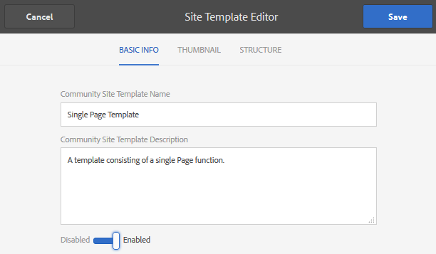
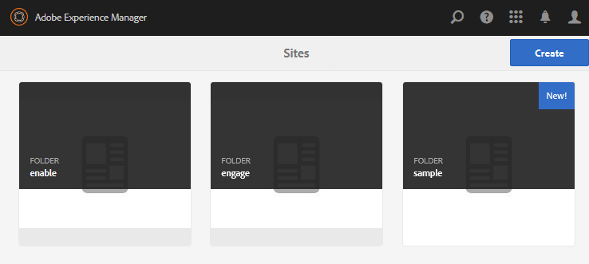

# Create a Sample Page {#create-a-sample-page}

As of AEM 6.1 Communities, the easiest way to create a sample page is to create a simple community site, consisting simply of a Page function.

This will include a parsys component so that you can [enable components for authoring](basics.md#accessing-communities-components).

Another option for exploratoin with sample components is to use the features presented in the [Community Components Guide](components-guide.md).

## Create a Community Site {#create-a-community-site}

This is very similar to creating a new site described in [Getting Started with AEM Communities](getting-started.md).

The major difference is this tutorial will create a new community site template that only contains the [Page function](functions.md#page-function) in order to create a simple community site free of other features (other than the pre-wired features basic to all community sites).

### Create New Site Template {#create-new-site-template}

To get started, create a simple [community site template](sites.md).

From global navigation on an author instance select **[!UICONTROL Tools > Communities > Site Templates]**.

* Select `Create button`
* BASIC INFO

    * `Name`: Single Page Template
    * `Description`: A template consisting of a single Page function.
    * select `Enabled`

* STRUCTURE

    * Drag a `Page` function to the Template Builder
    * For Configuration Function Details, enter

        * `Title`: Single Page
        * `URL`: page

* Select **`Save`** for the configuration
* Select **`Save`** for the site template

### Create New Community Site {#create-new-community-site}

Now create a new community site based on the simple site template.

After creating the site template, from global navigation select **[!UICONTROL Communities > Sites]**.

* Select **`Create`** icon

* Step `1 - Site Template`

    * `Title`: Simple Community Site
    * `Description`: A Community Site consisiting of a single page for experimentation.
    * `Community Site Root: (leave blank)`
    * `Community Site Base Language: English`
    * `Name`: sample

        * url = http://localhost:4502/content/sites/sample

    * `Template`: choose `Single Page Template`

* Select `Next`
* Step `2 - Design`

    * Select any design

* Select `Next`
* Select `Next`  

  (Accept all default Settings)

* Select `Create`

## Publish the Site {#publish-the-site}

From the [community sites console](sites-console.md), select the publish icon to publish the site, by default to http://localhost:4503.

## Open the Site on Author in Edit Mode {#open-the-site-on-author-in-edit-mode}

Select the open site icon to view the site in edit mode.

The URL will be [http://localhost:4502/editor.html/content/sites/sample/en.html](http://localhost:4502/editor.html/content/sites/sample/en.html)

On the simple home page it is possible to see what is pre-wired through the community functions and templates, and play with adding and configuring community components.

## View Site on Publish {#view-site-on-publish}

After publishing the page, open the page on the [publish instance](http://localhost:4503/content/sites/sample/en.html) to experiment with the features as an anonymous site visitor, signed in member, or an administrator. The Administration link visible in the author environement will not appear in the publish environment unless an administrator signs in.
