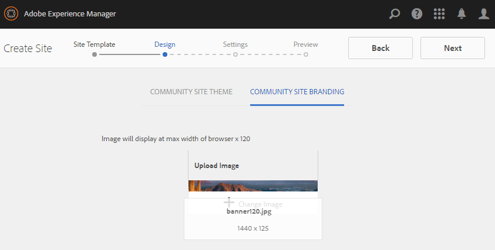
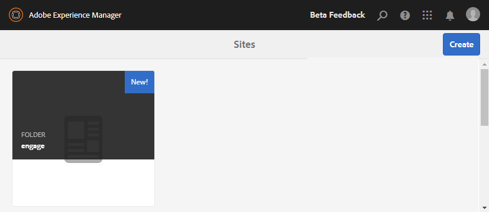
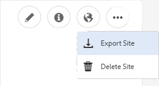
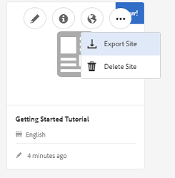
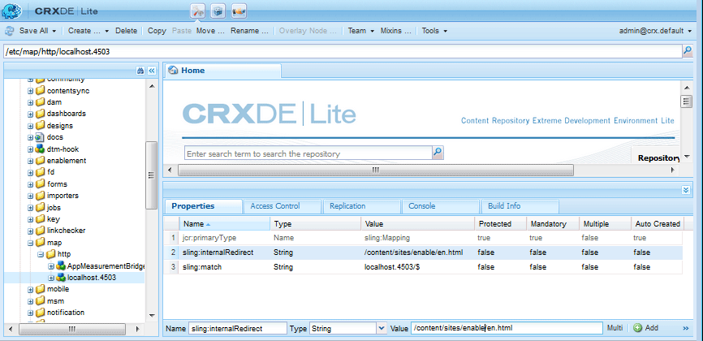

# Author a New Community Site{#author-a-new-community-site}

## Create a Community Site {#create-a-community-site}

Use the author instance to create a community site. On AEM Author instance:

1. Sign in with administrator privileges.
1. From global navigation, go to **[!UICONTROL Communities]** > **[!UICONTROL Sites]**.

The Communities Sites console provides a wizard to guide one through the steps of creating a community site. It is possible to move forward to the `Next` step or `Back` to the previous step before committing the site in the final step.

To begin creating a new community site:

* Select the `Create` button.

### Step 1: Site Template {#step-site-template}

On the [Site Template step](/help/communities/sites-console.md#step2013asitetemplate), enter a title, description, the name for the URL, and select a community site template, for example:

* **Community Site Title**: `Getting Started Tutorial`
* **Community Site Description**: `A site for engaging with the community.`
* **Community Site Root**: (leave blank for default root `/content/sites`)
* **Cloud Configurations**: (leave blank if no cloud configurations are specified) provide path to the specified cloud configurations.
* **Community Site Base Language**: (leave untouched for single language: English) use the drop-down list to choose one *or more* base languages from the available languages- German, Italian, French, Japanese, Spanish, Portuguese (Brazil), Chinese (Traditional), and Chinese (Simplified). One community site will be created for each language added, and will exist within the same site folder following the best practice described in [Translating Content for Multilingual Sites](/help/sites-administering/translation.md). The root page of each site will contain a child page named by the language code of one of the languages selected, such as 'en' for English or 'fr' for French.

* **Community Site Name**: engage

    * Double-check the name as it is not easily changed after the site is created
    * The initial URL will be displayed underneath the Community Site Name
    * For a valid URL, append a base language code + ".html"
    * *For example*, https://localhost:4502/content/sites/ `engage/en.html`

* **Template**: pull down to choose `Reference Site`

* Select **Next**.

### Step 2: Design {#step-design}

The Design step is presented in two sections for selecting the theme and branding banner:

#### COMMUNITY SITE THEME {#community-site-theme}

Select the desired style to apply to the template. When selected, the theme will be overlaid with a check mark.

#### COMMUNITY SITE BRANDING {#community-site-branding}

(Optional) Upload a banner image to display across the site pages. The banner is pinned to the left edge of the browser, between the community site header and navigation links. The banner height is cropped to 120 pixels. There is no resizing of the banner to fit the width of the browser and 120 pixel height.

 

Select **Next**.

### Step 3: Settings {#step-settings}

On the Settings step, before selecting `Next`, note that there are seven sections providing access to configurations involving user management, tagging, moderation, group management, analytics, and translation.

#### User Management {#user-management}

Check all checkboxes for [User Management](/help/communities/sites-console.md#user-management)

* To allow site visitors to self-register
* To allow site visitors to view the site without signing in
* To allow members to send and receive messages from other community members
* To allow signing-in with Facebook instead of registering and creating a profile
* To allow signing-in with Twitter instead of registering and creating a profile

>[!NOTE]
>
>For a production environment, it is necessary to create custom Facebook and Twitter applications. See [Social Login with Facebook and Twitter](/help/communities/social-login.md).

#### TAGGING {#tagging}

The tags which may be applied to community content are controlled by selecting AEM namespaces previously defined through the [Tagging Console](/help/sites-administering/tags.md#tagging-console) (such as the [Tutorial namespace](/help/communities/setup.md#create-tutorial-tags)).

Finding namespaces is easy using type-ahead search. For example,

* Type `tut`
* Select `Tutorial`

#### ROLES {#roles}

[Community member roles](/help/communities/users.md) are assigned through the settings in the Roles section.

To let a community member (or group of members) experience the site as the community manager, use the type-ahead search and select the member or group name from the options in the drop-down.

For example,

* Type `q`
* Select Quinn Harper

>[!NOTE]
>
>[Tunnel service](https://helpx.adobe.com/experience-manager/6-3/help/communities/deploy-communities.html#tunnel-service-on-author) allows selection of members and groups existing only in the  publish  environment.

#### MODERATION {#moderation}

Accept the default global settings for [moderating](/help/communities/sites-console.md#moderation) user-generated content (UGC).

#### ANALYTICS {#analytics}

If Adobe Analytics is licensed and an Analytics cloud service and framework have been configured, then it is possible to enable Analytics and select the framework.

See [Analytics Configuration for Communities Features](/help/communities/analytics.md).

#### TRANSLATION {#translation}

The [Translation settings](/help/communities/sites-console.md#translation) specify the base language for the site as well as whether or not UGC may be translated and into which language, if so.

* Check **Allow Machine Translation**
* Leave default languages selected for translation by the default Machine Translation service
* Leave default translation provider and config
* There's no need for a global store because there are no language copies
* Select **Translate entire page**
* Leave default persistence option

### Step 4: Create Communities Site {#step-create-communities-site}

Select **Create.**

When the process completes, the folder for the new site is displayed in the Communities - Sites console.

## Publish the Community Site {#publish-the-community-site}

The created site should be managed from the Communities - Sites console, the same console from where new sites may be created.

After selecting the community site's folder to open it, hover over the site icon such that four action icons appear:

On selecting the fourth ellipses icon (More Actions), Export Site and Delete Site options show up.

From left to right they are:

* **Open Site**
  
  Select the pencil icon to open the community site in author edit mode, to add and/or configure page components

* **Edit Site**
  
  Select the properties icon to open the community site for modification of properties, such as the title or to change the theme

* **Publish Site**
  
  Select the world icon to publish the community site (for example if your publish server is running on your local machine, then to localhost:4503 by default)

* **Export Site**
  
  Select the export icon to create a package of the community site that is both stored in [package manager](/help/sites-administering/package-manager.md) and downloaded.
  Note that UGC is not included in the site package.

* **Delete Site** 
  
  Select the delete icon to delete the community site from within **[!UICONTROL Communities > Sites console]**. This action removes all the items associated with the site, such as UGC, user groups, assets and database records.

>[!NOTE]
>
>If not using the default port 4503 for the publish instance, then edit the default replication agent to set the port number to the correct value.
>
>On the author instance, from the main menu:
>
>1. Navigate to **[!UICONTROL Tools]** > **[!UICONTROL Operations]** > **[!UICONTROL Replication]** menu.
>1. Select **[!UICONTROL Agents on author]**.
>1. Select **[!UICONTROL Default Agent (publish)]**.
>1. Next to **[!UICONTROL Settings]**, select **[!UICONTROL Edit]**.
>1. In pop-up dialog for Agent Settings, select **[!UICONTROL Transport]** tab.
>1. In URI, change the port number, 4503, to the desired port number. For example, to use port 6103: https://localhost:6103/bin/receive?sling:authRequestLogin=1
>1. Select **[!UICONTROL OK]**.
>1. (Optional) Select **[!UICONTROL Clear]** or **[!UICONTROL Force Retry]** to reset the replication queue.

### Select Publish {#select-publish}

After ensuring the publish server is running, select the world icon to publish the community site.

When the community site has been successfully published, a message briefly appears 'Site Published'.

### New Community User Groups {#new-community-user-groups}

Along with the new community site, new user groups are created which have the appropriate permissions set for various administrative functions. For details, visit [User Groups for Community Sites](/help/communities/users.md#usergroupsforcommunitysites).

For this new community site, given the site name "engage" in Step 1, the four new user groups may be seen from the [Groups console](/help/communities/members.md) (global navigation: Communities, Groups):

* Community Engage Community managers
* Community Engage Group administrators
* Community Engage Members
* Community Engage Moderators
* Community Engage Privileged members
* Community Engage Site content manager

Note that [Aaron McDonald](/help/communities/tutorials.md#demo-users) is a member of

* Community Engage Community managers
* Community Engage Moderators
* Community Engage Members (indirectly as a member of Moderators group)

#### https://localhost:4503/content/sites/engage/en.html {#http-localhost-content-sites-engage-en-html}

## Configure for Authentication Error {#configure-for-authentication-error}

Once a site has been configured and pushed to publish, [configure login mapping](/help/communities/sites-console.md#configure-for-authentication-error) ( `Adobe Granite Login Selector Authentication Handler`) on the publish instance. The benefit is that when login credentials are not entered correctly, the authentication error will redisplay the community site's login page with an error message.

Add a `Login Page Mapping` as

* `/content/sites/engage/en/signin:/content/sites/engage/en`

## Optional Steps {#optional-steps}

### Change the Default Home Page {#change-the-default-home-page}

When working with the publish site for demonstration purposes, it might be useful to change the default home page to the new site.

To do so requires using [CRXDE](https://localhost:4503/crx/de) Lite to edit the [resource-mapping](/help/sites-deploying/resource-mapping.md) table on publish.

To get started:

1. On publish instance, sign in with administrator privileges.
1. Browse to [https://localhost:4503/crx/de](https://localhost:4503/crx/de).
1. In the project browser, expand `/etc/map.`
1. Select the `http` node:

   * Select **Create Node:**

     * **Name** localhost.4503
          (do *not* use ':')

     * **Type** [sling:Mapping](https://sling.apache.org/documentation/the-sling-engine/mappings-for-resource-resolution.html)

1. With newly created `localhost.4503` node selected:

   * Add property:

    * **Name** sling:match
      * **Type** String
      * **Value** localhost.4503/$
          (must end with '$' char)

   * Add property:

     * **Name** sling:internalRedirect
     * **Type** String
     * **Value** /content/sites/engage/en.html

1. Select **Save All.**
1. (Optional) Delete the browsing history.
1. Browse to https://localhost:4503/.

   * Arrive at https://localhost:4503/content/sites/engage/en.html

>[!NOTE]
>
>To disable, simply prefix the `sling:match` property value with an 'x' - `xlocalhost.4503/$` - and **Save All**.

#### Troubleshooting: Error Saving Map {#troubleshooting-error-saving-map}

If unable to save changes, be sure that the node name is `localhost.4503`, with a 'dot' separator, and not `localhost:4503` with a 'colon' separator, as `localhost`is not a valid namespace prefix.

#### Troubleshooting: Fail to Redirect {#troubleshooting-fail-to-redirect}

The '**$**' at the end of the regular expression `sling:match`string is crucial, so that only exactly `https://localhost:4503/` is mapped, else the redirect value is prefixed to any path that might exist after the server:port in the URL. Thus, when AEM tries to redirect to the login page, it fails.

### Modify the Site {#modify-the-site}

After the site has been initially created, authors may use the [Open Site icon](/help/communities/sites-console.md#authoring-site-content) to perform standard AEM authoring activities.

In addition, administrators may use the [Edit Site icon](/help/communities/sites-console.md#modifying-site-properties) to modify properties of the site, such as the title.

After any modification, remember to **Save** and re-**Publish** the site.

>[!NOTE]
>
>If not familiar with AEM, view the documentation on [basic handling](/help/sites-authoring/basic-handling.md) and a [quick guide to authoring pages](/help/sites-authoring/qg-page-authoring.md).
