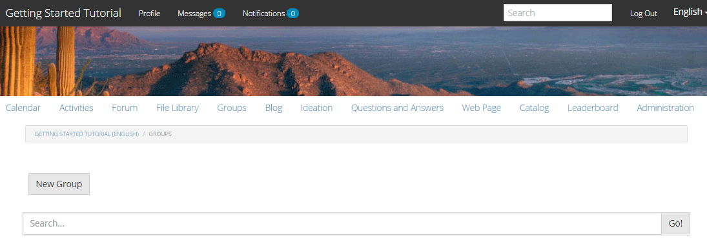

# Community Groups {#community-groups}

The community groups feature is the ability for a sub-community to be dynamically created within a community site by authorized users (community members and authors) from the publish and author environments.

This ability is present when the [groups function](/help/communities/functions.md#groups-function) is present in the [community site](/help/communities/sites-console.md) structure.

A [community group template](/help/communities/tools-groups.md) provides the design of the community group page when a community group is dynamically created.

One or more group templates are selected for the groups function when the function is added to a community site's structure or to a community site template. This list of group templates is presented to the member or author who dynamically creates a new group from within the community site.

## Creating a New Group {#creating-a-new-group}

The ability to create a new community group relies on the existence of a community site which includes the groups function, such as one created from the [Reference Site Template](/help/communities/sites.md).

The examples that follow use the community site created from the `Reference Site Template` as described in the [Getting Started with AEM Communities](/help/communities/getting-started.md) tutorial.

This is the page that loads on publish when the **Groups** menu item is selected:

When you select the **New Group** icon, an edit dialog opens up.

Under the **Settings** tab, you provide the basic features of the group:

* **Group Name**
  
  The title of the group to display on the community site. Avoid using underscore characters (_) and keywords such as resources and configuration in group name.  

* **Description**
  
  A description of the group to display on the community site.

* **Invite**
  
  A list of members to invite to join the group. Type-ahead search will provide suggestions of community members to invite.

* **Group URL Name**
  
  The name for the group page that becomes part of the URL.

* **Open Group**
  
  Selecting `Open Group` indicates any anonymous site visitor may view the content, and will deselect `Member Only Group`.

* **Member Only Group**
  
  Selecting `Member Only Group` indicates only members of the group may view the content, and will deselect `Open Group`.

Under the **Template** tab is the ability to 
select from the list of community group templates that were specified when the groups function was included in the community site's structure or in a community site template.

Under the **Image** tab is the ability to upload an image to display for the group on the community site's Groups page. The default style sheet will size the image to 170 x 90 pixels.

By selecting the **Create Group** button, the pages for the group are created based on the chosen template, and a user group is created for membership and the Groups page will be updated to show the new sub-community.

For example, the Groups page with a new sub-community titled "Focus Group", for which an image thumbnail was uploaded, will appear as follows (still signed in as a community group administrator):

Selecting the `Focus Group` link will open the Focus Group page in the browser, which has an initial appearance based on the chosen template, and includes a submenu underneath the main community site's menu:

### Community Group Member List Component {#community-group-member-list-component}

The `Community Group Member List` component is intended for use by developers of group templates.

### Additional Information {#additional-information}

More information may be found on the [Community Group Essentials](/help/communities/essentials-groups.md) page for developers.

For other information related to community groups, visit [Managing Users and User Groups](/help/communities/users.md).
