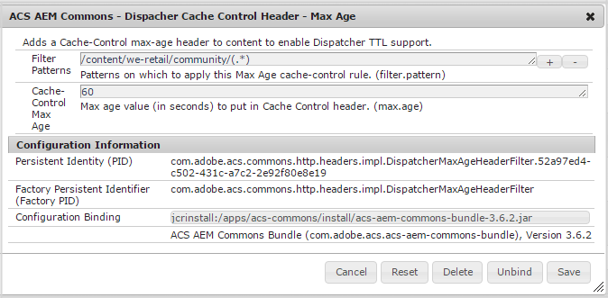

# Configuring Dispatcher for Communities {#configuring-dispatcher-for-communities}

## AEM Communities {#aem-communities}

For AEM Communities, it is necessary to configure the Dispatcher to ensure proper functioning of [community sites](overview.md#community-sites). Additional configurations are necessary when including features such as social login.

To learn what is necessary for your particular deployment and site design

* Contact [Customer Care](https://helpx.adobe.com/marketing-cloud/contact-support.html)

See also the main [Dispatcher documentation](https://helpx.adobe.com/experience-manager/dispatcher/using/dispatcher.html).

## Dispatcher Caching {#dispatcher-caching}

### Overview {#overview}

Dispatcher caching for AEM Communities is the ability for the dispatcher to serve fully cached versions of a community site's pages.

Currently, it is only supported for anonymous site visitors, such as users who browse the community site, or land on a community page as a result of a search, as well as for search engines which index pages. The benefit is that anonymous users and search engines will experience improved performance.

For signed in members, the dispatcher bypasses the cache, relaying requests directly to the publisher, such that all pages are generated and delivered dynamically.

When configured to support dispatcher caching, a TTL-based "max age" expiration is added to the header to ensure the dispatcher cached pages are current.

### Requirements {#requirements}

* Dispatcher version 4.1.2 or later (see [Installing Dispatcher](https://helpx.adobe.com/experience-manager/dispatcher/using/dispatcher-install.html) for the latest version)
* [ACS AEM Commons package](https://adobe-consulting-services.github.io/acs-aem-commons/)

  * Version 3.3.2 or later
  * `ACS AEM Commons - Dispatcher Cache Control Header - Max Age` OSGi config

### Configuration {#configuration}

The OSGi configuration **ACS AEM Commons - Dispatcher Cache Control Header - Max Age** sets the expiraton of cached pages that appear under a specified path.

* From the [Web Console](../../help/sites-deploying/configuring-osgi.md)

  * For example, [http://localhost:4503/system/console/configMgr](http://localhost:4503/system/console/configMgr)

* Locate `ACS AEM Commons - Dispatcher Cache Control Header - Max Age`
* Select the '+' icon to create a new connection configuration

  

* **Filter Patterns**
  *(required)* One or more paths to community pages. For example, `/content/sites/engage/(.*)`.

* **Cache-Control Max Age**
  *(required)* The max age (in seconds) to add to the Cache Controll header. The value must be greater than zero (0).

## Dispatcher Filters {#dispatcher-filters}

The /filter section of the `dispatcher.any` file is documented in [Configuring Access to Content - /filter](https://helpx.adobe.com/experience-manager/dispatcher/using/dispatcher-configuration.html#filter).

This section describes entries that are likely necessary for proper functioning of Communities features.

The filter property names follow the convention of using a four-digit number to indicate the order in which to apply filter patterns. When multiple filters patterns apply to a request, the last filter pattern that applies is effective. Thus, the very first filter pattern is often used to deny everything, such that the following patterns serve to restore access in a controlled manner.

The following samples use property names that will likely need to be modified to fit into any particluar dispatcher.any file.

See also:

* [Dispatcher Security Checklist](https://helpx.adobe.com/experience-manager/dispatcher/using/security-checklist.html)

>[!NOTE]
>
>**Property Name Examples**
>All property names shown, such as **/0050** and **/0170**, should be adjusted to fit within an existing dispatcher.any configuration file.
>

>[!CAUTION]
>
>See the [Dispatcher Security Checklist](https://experienceleague.adobe.com/docs/experience-manager-dispatcher/using/getting-started/security-checklist.html) for further considerations when restricting access using Dispatcher. Also, read the [AEM Security Cheklist](https://helpx.adobe.com/experience-manager/6-3/sites/administering/using/security-checklist.html) for additional security details regarding your AEM installation.
>

The following entries should be added to the end of the /filter section, especially after all deny entries.

<!-- New code wrt CQDOC-16081, changed by Vishabh on 10 Dec 2020.
-->

```shell
# design and template assets
/0050 { /type "allow" /url "/etc/designs/*" }

# collected JS/CSS from the components and design
/0051 { /type "allow" /url "/etc/clientlibs/*" }

# foundation search component - write stats
/0052 { /type "allow" /url "/bin/statistics/tracker/*" }

# allow users to edit profile page
/0054 { /type "allow" /url "* /home/users/*/*/profile.form.html*" }

# all profile data
/0057 { /type "allow" /url "/home/users/*/profile/*" }

# required for social "Sign In" link.
/0059 { /type "allow" /url "/etc/clientcontext/*" }

# required for "Sign Out" operation
/0063 { /type "allow" /url "* /system/sling/logout*" }

# enable Facebook and Twitter signin
/0064 { /type "allow" /url "/etc/cloudservices/*" }

# enable personalization
/0062 { /type "allow" /url "/libs/cq/personalization/*" }

# Enable CSRF token otherwise nothings works.
/5001 { /type "allow" /url "/libs/granite/csrf/token.json *"}
# Allow SCF User Model to bootstrap as it depends on the granite user
/5002 { /type "allow" /url "/libs/granite/security/currentuser.json*" }

# Allow Communities Site Logout button work
/5003 { /type "allow" /url "/system/sling/logout.html*" }

# Allow i18n to load correctly
/5004 { /type "allow" /url "/libs/cq/i18n/dict.en.json *" }

# Allow social json get pattern.
/6002 { /type "allow" /url "*.social.*.json*" }

# Allow loading of templates
/6003 { /type "allow" /url "/services/social/templates*" }

# Allow SCF User model to check moderator rules
/6005 { /type "allow" /url "/services/social/getLoggedInUser?moderatorCheck=*" }

# Allow CKEditor to load which uses a query pattern.
/6006 { /type "allow" /url "/etc/clientlibs/social/thirdparty/ckeditor/*.js?t=*" }
/6007 { /type "allow" /url "/etc/clientlibs/social/thirdparty/ckeditor/*.css?t=*" }

# Allow Fonts from Communities to load
/6050 { /type "allow" /url "*.woff" }
/6051 { /type "allow" /url "*.ttf" }

# Enable CQ Security checkpoint for component guide.
/7001 { /type "allow" /url "/libs/cq/security/userinfo.json?cq_ck=*"

```


<!-- existing content as of Dec 10, wrt CQDOC-16081

```shell
# design and template assets
/0050 { /type "allow" /glob "GET /etc/designs/*" }

# collected JS/CSS from the components and design
/0051 { /type "allow" /glob "GET /etc/clientlibs/*" }

# foundation search component - write stats
/0052 { /type "allow" /glob "GET /bin/statistics/tracker/*" }

# allow users to edit profile page
/0054 { /type "allow" /glob "* /home/users/*/*/profile.form.html*" }

# all profile data
/0057 { /type "allow" /glob "GET /home/users/*/profile/*" }

# required for social "Sign In" link.
/0059 { /type "allow" /glob "GET /etc/clientcontext/*" }

# required for "Sign Out" operation
/0063 { /type "allow" /glob "* /system/sling/logout*" }

# enable Facebook and Twitter signin
/0064 { /type "allow" /glob "GET /etc/cloudservices/*" }

# enable personalization
/0062 { /type "allow" /url "/libs/cq/personalization/*" }

# Enable CSRF token otherwise nothings works.
/5001 { /type "allow" /glob "GET /libs/granite/csrf/token.json *"}
# Allow SCF User Model to bootstrap as it depends on the granite user
/5002 { /type "allow" /glob "GET /libs/granite/security/currentuser.json*" }

# Allow Communities Site Logout button work
/5003 { /type "allow" /glob "GET /system/sling/logout.html*" }

# Allow i18n to load correctly
/5004 { /type "allow" /glob "GET /libs/cq/i18n/dict.en.json *" }

# Allow social json get pattern.
/6002 { /type "allow" /glob "GET *.social.*.json*" }

# Allow loading of templates
/6003 { /type "allow" /glob "GET /services/social/templates*" }

# Allow SCF User model to check moderator rules
/6005 { /type "allow" /glob "GET /services/social/getLoggedInUser?moderatorCheck=*" }

# Allow CKEditor to load which uses a query pattern not sufficed by regular glob above.
/6006 { /type "allow" /glob "GET /etc/clientlibs/social/thirdparty/ckeditor/*.js?t=*" }
/6007 { /type "allow" /glob "GET /etc/clientlibs/social/thirdparty/ckeditor/*.css?t=*" }

# Allow Fonts from Communities to load
/6050 { /type "allow" /glob "GET *.woff *" }
/6051 { /type "allow" /glob "GET *.ttf *" }

# Enable CQ Security checkpoint for component guide.
/7001 { /type "allow" /glob "GET /libs/cq/security/userinfo.json?cq_ck=*"

```
-->

## Dispatcher Rules {#dispatcher-rules}

The rules section of `dispatcher.any` defines what responses should be cached based on the requested URL. For Communities, the rules section is used to define what should never be cached.

<!-- New code wrt CQDOC-16081, changed by Vishabh on 10 Dec 2020.
-->

```shell
# Never cache the client-side .social.json calls
/0001 { /type "deny" /url "*.social.json*" }

# Never cache the user-specific .json requests
/0002 { /type "deny" /url "/libs/granite/csrf/token.json*" }
/0003 { /type "deny" /url "/libs/granite/security/currentuser.json*" }
/0004 { /type "deny" /url "/libs/granite/security/userinfo.json*" }

# Never cache the private community groups pages in case - add your own deny rules in there
/0005 { /type "deny" /url "/content/*/groups/*" }

# Never cache the assignments page in case the Enablement feature is in use - add your own deny rules in there
/0006 { /type "deny" /url "/content/*/assignments/*" }

# Never cache user generated content
/0208 { /type "deny" /url "/content/usergenerated/*" }
```

<!-- existing content as of Dec 10, wrt CQDOC-16081

```shell
# Never cache the client-side .social.json calls
/0001 { /type "deny" /glob "*.social.json*" }

# Never cache the user-specific .json requests
/0002 { /type "deny" /glob "/libs/granite/csrf/token.json*" }
/0003 { /type "deny" /glob "/libs/granite/security/currentuser.json*" }
/0004 { /type "deny" /glob "/libs/granite/security/userinfo.json*" }

# Never cache the private community groups pages in case - add your own deny rules in there
/0005 { /type "deny" /glob "/content/*/groups/*" }

# Never cache the assignments page in case the Enablement feature is in use - add your own deny rules in there
/0006 { /type "deny" /glob "/content/*/assignments/*" }

# Never cache user generated content
/0208 { /type "deny" /glob "/content/usergenerated/*" }
```
-->

## Troubleshooting {#troubleshooting}

A major source of problems is inserting filter rules without paying attention to the affect on earlier rules, especially when adding a rule to deny access.

The very first filter pattern is often used to deny everything so that following filters restore access in a controlled manner. When multiple filters apply to a request, the last filter that applies is the one in effect.

## Sample dispatcher.any {#sample-dispatcher-any}

Following is a sample `dispatcher.any` file that includes the Communities /filters and /rules.

<!-- New code wrt CQDOC-16081, changed by Vishabh on 10 Dec 2020.
-->

```shell
# Each farm configures a set of load balanced renders (i.e. remote servers)
/farms
  {
  # First farm entry
  /website
    {
    # Request headers that should be forwarded to the remote server.
    /clientheaders
      {
      # Forward all request headers that are end-to-end. If you want
      # to forward a specific set of headers, you'll have to list
      # them here.
      "*"
      }

    # Hostname matching for farm selection (virtual domain addressing)
    /virtualhosts
      {
      # Entries will be compared against the "Host" request header
      # and an optional request URL prefix.
      #
      # Examples:
      #
      #   www.company.com
      #   intranet.*
      #   myhost:8888/mysite
      "*"
      }

    # The load will be balanced among these render instances
    /renders
      {
      /rend01
        {
        # Hostname or IP of the render
        /hostname "127.0.0.1"
        # Port of the render
        /port "4503"
        # Connect timeout in milliseconds, 0 to wait indefinitely
        # /timeout "0"
        }
      }

    # The filter section defines the requests that should be handled by the dispatcher.
    #
    # Entries can be either specified using urls, or elements of the request line:
    #
    # (1) urls will be compared against the entire request line, e.g.:
    #
    #     /0001 { /type "deny" /url "* /index.html *" }
    #
    #   matches request "GET /index.html HTTP/1.1" but not "GET /index.html?a=b HTTP/1.1".
    #
    # (2) method/url/query/protocol will be compared againts the respective elements of
    #   the request line, e.g.:
    #
    #     /0001 { /type "deny" /method "GET" /url "/index.html" }
    #
    #   matches both "GET /index.html" and "GET /index.html?a=b HTTP/1.1".
    #
    # Note: specifying elements of the request line is the preferred method.
    /filter
      {
      # Deny everything first and then allow specific entries
      /0001 { /type "deny" /url "*" }

      # Open consoles
#     /0011 { /type "allow" /url "/admin/*"  }  # allow servlet engine admin
#     /0012 { /type "allow" /url "/crx/*"    }  # allow content repository
#     /0013 { /type "allow" /url "/system/*" }  # allow OSGi console

      # Allow non-public content directories
#     /0021 { /type "allow" /url "/apps/*"   }  # allow apps access
#     /0022 { /type "allow" /url "/bin/*"    }
      /0023 { /type "allow" /url "/content*" }  # disable this rule to allow mapped content only

#     /0024 { /type "allow" /url "/libs/*"   }
#     /0025 { /type "deny"  /url "/libs/shindig/proxy*" } # if you enable /libs close access to proxy

#     /0026 { /type "allow" /url "/home/*"   }
#     /0027 { /type "allow" /url "/tmp/*"    }
#     /0028 { /type "allow" /url "/var/*"    }

      # Enable specific mime types in non-public content directories
      /0041 { /type "allow" /url "*.css"   }  # enable css
      /0042 { /type "allow" /url "*.gif"   }  # enable gifs
      /0043 { /type "allow" /url "*.ico"   }  # enable icos
      /0044 { /type "allow" /url "*.js"    }  # enable javascript
      /0045 { /type "allow" /url "*.png"   }  # enable png
      /0046 { /type "allow" /url "*.swf"   }  # enable flash
      /0047 { /type "allow" /url "*.jpg"   }  # enable jpg
      /0048 { /type "allow" /url "*.jpeg"  }  # enable jpeg

      # Deny content grabbing
      /0081 { /type "deny"  /url "*.infinity.json" }
      /0082 { /type "deny"  /url "*.tidy.json"     }
      /0083 { /type "deny"  /url "*.sysview.xml"   }
      /0084 { /type "deny"  /url "*.docview.json"  }
      /0085 { /type "deny"  /url "*.docview.xml"  }

      /0086 { /type "deny"  /url "*.*[0-9].json" }
#     /0087 { /type "allow" /method "GET" /url "*.1.json" }  # allow one-level json requests

      # Deny query
   /0090 { /type "deny"  /url "*.query.json" }

      #######################################
      ## BEGIN: AEM COMMUNITITES ADDITIONS
   #######################################
   /0050 { /type "allow" /url "/etc/designs/*" }
   /0051 { /type "allow" /url "/etc/clientlibs/*" }
   /0052 { /type "allow" /url "/bin/statistics/tracker/*" }
   /0054 { /type "allow" /url "* /home/users/*/*/profile.form.html*" }
   /0057 { /type "allow" /url "/home/users/*/profile/*" }
   /0059 { /type "allow" /url "/etc/clientcontext/*" }
   /0063 { /type "allow" /url "* /system/sling/logout*" }
   /0064 { /type "allow" /url "/etc/cloudservices/*" }
   /0062 { /type "allow" /url "/libs/cq/personalization/*"  }  # enable personalization

         # Enable CSRF token otherwise nothings works.
   /5001 { /type "allow" /url "/libs/granite/csrf/token.json *"}

   # Allow SCF User Model to bootstrap as it depends on the granite user
   /5002 { /type "allow" /url "/libs/granite/security/currentuser.json*" }

      # Allow Communities Site Logout button work
      /5003 { /type "allow" /url "/system/sling/logout.html*" }

   # Allow i18n to load correctly
   /5004 { /type "allow" /url "/libs/cq/i18n/dict.en.json *" }

   # Allow social json get pattern.
   /6002 { /type "allow" /url "*.social.*.json*" }

   # Allow loading of templates
   /6003 { /type "allow" /url "/services/social/templates*" }

   # Allow SCF User model to check moderator rules
   /6005 { /type "allow" /url "/services/social/getLoggedInUser?moderatorCheck=*" }

   # Allow CKEditor to load which uses a query pattern.
   /6006 { /type "allow" /url "/etc/clientlibs/social/thirdparty/ckeditor/*.js?t=*" }
   /6007 { /type "allow" /url "/etc/clientlibs/social/thirdparty/ckeditor/*.css?t=*" }

   # Allow Fonts from Communities to load
   /6050 { /type "allow" /url "*.woff" }
   /6051 { /type "allow" /url "*.ttf" }

      # Enable CQ Security checkpoint for component guide.
   /7001 { /type "allow" /url "/libs/cq/security/userinfo.json?cq_ck=*"}

      #######################################
      ## END: AEM COMMUNITITES ADDITIONS
   #######################################

      }

    # The cache section regulates what responses will be cached and where.
    /cache
      {
      # The docroot must be equal to the document root of the webserver. The
      # dispatcher will store files relative to this directory and subsequent
      # requests may be "declined" by the dispatcher, allowing the webserver
      # to deliver them just like static files.
      /docroot "/opt/dispatcher"

      # Sets the level upto which files named ".stat" will be created in the
      # document root of the webserver. When an activation request for some
      # page is received, only files within the same subtree are affected
      # by the invalidation.
      #/statfileslevel "0"

      # Flag indicating whether to cache responses to requests that contain
      # authorization information.
      /allowAuthorized "1"

      # Flag indicating whether the dispatcher should serve stale content if
      # no remote server is available.
      #/serveStaleOnError "0"

      # The rules section defines what responses should be cached based on
      # the requested URL. Please note that only the following requests can
      # lead to cacheable responses:
      #
      # - HTTP method is GET
      # - URL has an extension
      # - Request has no query string
      # - Request has no "Authorization" header (unless allowAuthorized is 1)
      /rules
        {
        /0000
          {
          # the matching pattern to be compared against the url
          # example: * -> everything
          #        : /foo/bar.* -> only the /foo/bar documents
          #        : /foo/bar/* -> all pages below /foo/bar
          #        : /foo/bar[./]* -> all pages below and /foo/bar itself
          #        : *.html        -> all .html files
          /url "*"
          /type "allow"
          }

      #######################################
      ## BEGIN: AEM COMMUNITITES ADDITIONS
     #######################################

   # Never cache the client-side .social.json calls
   /0001 { /type "deny" /url "*.social.json*" }

   # Never cache the user-specific .json requests
   /0002 { /type "deny" /url "/libs/granite/csrf/token.json*" }
   /0003 { /type "deny" /url "/libs/granite/security/currentuser.json*" }
   /0004 { /type "deny" /url "/libs/granite/security/userinfo.json*" }

   # Never cache the private community groups pages in case - add your own deny rules in there
   /0005 { /type "deny" /url "/content/*/groups/*" }

   # Never cache the assignments page in case the enablement feature is in use - add your own deny rules in there
   /0006 { /type "deny" /url "/content/*/assignments/*" }

      #######################################
      ## END: AEM COMMUNITITES ADDITIONS
      #######################################

        }

      # The invalidate section defines the pages that are "invalidated" after
      # any activation. Please note that the activated page itself and all
      # related documents are flushed on an modification. For example: if the
      # page /foo/bar is activated, all /foo/bar.* files are removed from the
      # cache.
      /invalidate
        {
        /0000
          {
          /url "*"
          /type "deny"
          }
        /0001
          {
          # Consider all HTML files stale after an activation.
          /url "*.html"
          /type "allow"
          }
        /0002
          {
          /url "/etc/segmentation.segment.js"
          /type "allow"
          }
        /0003
          {
          /url "*/analytics.sitecatalyst.js"
          /type "allow"
          }
        }

      # The allowedClients section restricts the client IP addresses that are
      # allowed to issue activation requests.
      /allowedClients
        {
        # Uncomment the following to restrict activation requests to originate
        # from "localhost" only.
        #
        #/0000
        #  {
        #  /url "*"
        #  /type "deny"
        #  }
        #/0001
        #  {
        #  /url "127.0.0.1"
        #  /type "allow"
        #  }
        }

      # The ignoreUrlParams section contains query string parameter names that
      # should be ignored when determining whether some request's output can be
      # cached or delivered from cache.
      #
      # In this example configuration, the "q" parameter will be ignored.
      #/ignoreUrlParams
      #  {
      #  /0001 { /url "*" /type "deny" }
      #  /0002 { /url "q" /type "allow" }
      #  }

    /enableTTL "1"

      }

    # The statistics sections dictates how the load should be balanced among the
    # renders according to the media-type.
    /statistics
      {
      /categories
        {
        /html
          {
          /url "*.html"
          }
        /others
          {
          /url "*"
          }
        }
      }
    }
  }

```

<!-- existing content as of Dec 10, wrt CQDOC-16081

```shell
# Each farm configures a set of load balanced renders (i.e. remote servers)
/farms
  {
  # First farm entry
  /website
    {
    # Request headers that should be forwarded to the remote server.
    /clientheaders
      {
      # Forward all request headers that are end-to-end. If you want
      # to forward a specific set of headers, you'll have to list
      # them here.
      "*"
      }

    # Hostname globbing for farm selection (virtual domain addressing)
    /virtualhosts
      {
      # Entries will be compared against the "Host" request header
      # and an optional request URL prefix.
      #
      # Examples:
      #
      #   www.company.com
      #   intranet.*
      #   myhost:8888/mysite
      "*"
      }

    # The load will be balanced among these render instances
    /renders
      {
      /rend01
        {
        # Hostname or IP of the render
        /hostname "127.0.0.1"
        # Port of the render
        /port "4503"
        # Connect timeout in milliseconds, 0 to wait indefinitely
        # /timeout "0"
        }
      }

    # The filter section defines the requests that should be handled by the dispatcher.
    #
    # Entries can be either specified using globs, or elements of the request line:
    #
    # (1) globs will be compared against the entire request line, e.g.:
    #
    #     /0001 { /type "deny" /glob "* /index.html *" }
    #
    #   matches request "GET /index.html HTTP/1.1" but not "GET /index.html?a=b HTTP/1.1".
    #
    # (2) method/url/query/protocol will be compared againts the respective elements of
    #   the request line, e.g.:
    #
    #     /0001 { /type "deny" /method "GET" /url "/index.html" }
    #
    #   matches both "GET /index.html" and "GET /index.html?a=b HTTP/1.1".
    #
    # Note: specifying elements of the request line is the preferred method.
    /filter
      {
      # Deny everything first and then allow specific entries
      /0001 { /type "deny" /glob "*" }

      # Open consoles
#     /0011 { /type "allow" /url "/admin/*"  }  # allow servlet engine admin
#     /0012 { /type "allow" /url "/crx/*"    }  # allow content repository
#     /0013 { /type "allow" /url "/system/*" }  # allow OSGi console

      # Allow non-public content directories
#     /0021 { /type "allow" /url "/apps/*"   }  # allow apps access
#     /0022 { /type "allow" /url "/bin/*"    }
      /0023 { /type "allow" /url "/content*" }  # disable this rule to allow mapped content only

#     /0024 { /type "allow" /url "/libs/*"   }
#     /0025 { /type "deny"  /url "/libs/shindig/proxy*" } # if you enable /libs close access to proxy

#     /0026 { /type "allow" /url "/home/*"   }
#     /0027 { /type "allow" /url "/tmp/*"    }
#     /0028 { /type "allow" /url "/var/*"    }

      # Enable specific mime types in non-public content directories
      /0041 { /type "allow" /url "*.css"   }  # enable css
      /0042 { /type "allow" /url "*.gif"   }  # enable gifs
      /0043 { /type "allow" /url "*.ico"   }  # enable icos
      /0044 { /type "allow" /url "*.js"    }  # enable javascript
      /0045 { /type "allow" /url "*.png"   }  # enable png
      /0046 { /type "allow" /url "*.swf"   }  # enable flash
      /0047 { /type "allow" /url "*.jpg"   }  # enable jpg
      /0048 { /type "allow" /url "*.jpeg"  }  # enable jpeg

      # Deny content grabbing
      /0081 { /type "deny"  /url "*.infinity.json" }
      /0082 { /type "deny"  /url "*.tidy.json"     }
      /0083 { /type "deny"  /url "*.sysview.xml"   }
      /0084 { /type "deny"  /url "*.docview.json"  }
      /0085 { /type "deny"  /url "*.docview.xml"  }

      /0086 { /type "deny"  /url "*.*[0-9].json" }
#     /0087 { /type "allow" /method "GET" /url "*.1.json" }  # allow one-level json requests

      # Deny query
   /0090 { /type "deny"  /url "*.query.json" }

      #######################################
      ## BEGIN: AEM COMMUNITITES ADDITIONS
   #######################################
   /0050 { /type "allow" /glob "GET /etc/designs/*" }
   /0051 { /type "allow" /glob "GET /etc/clientlibs/*" }
   /0052 { /type "allow" /glob "GET /bin/statistics/tracker/*" }
   /0054 { /type "allow" /glob "* /home/users/*/*/profile.form.html*" }
   /0057 { /type "allow" /glob "GET /home/users/*/profile/*" }
   /0059 { /type "allow" /glob "GET /etc/clientcontext/*" }
   /0063 { /type "allow" /glob "* /system/sling/logout*" }
   /0064 { /type "allow" /glob "GET /etc/cloudservices/*" }
   /0062 { /type "allow" /url "/libs/cq/personalization/*"  }  # enable personalization
   
      # Enable CSRF token otherwise nothings works.
   /5001 { /type "allow" /glob "GET /libs/granite/csrf/token.json *"}

   # Allow SCF User Model to bootstrap as it depends on the granite user
   /5002 { /type "allow" /glob "GET /libs/granite/security/currentuser.json*" }

      # Allow Communities Site Logout button work
      /5003 { /type "allow" /glob "GET /system/sling/logout.html*" }

   # Allow i18n to load correctly
   /5004 { /type "allow" /glob "GET /libs/cq/i18n/dict.en.json *" }

   # Allow social json get pattern.
   /6002 { /type "allow" /glob "GET *.social.*.json*" }

   # Allow loading of templates
   /6003 { /type "allow" /glob "GET /services/social/templates*" }

   # Allow SCF User model to check moderator rules
   /6005 { /type "allow" /glob "GET /services/social/getLoggedInUser?moderatorCheck=*" }

   # Allow CKEditor to load which uses a query pattern not sufficed by regular glob above.
   /6006 { /type "allow" /glob "GET /etc/clientlibs/social/thirdparty/ckeditor/*.js?t=*" }
   /6007 { /type "allow" /glob "GET /etc/clientlibs/social/thirdparty/ckeditor/*.css?t=*" }

   # Allow Fonts from Communities to load
   /6050 { /type "allow" /glob "GET *.woff *" }
   /6051 { /type "allow" /glob "GET *.ttf *" }

      # Enable CQ Security checkpoint for component guide.
   /7001 { /type "allow" /glob "GET /libs/cq/security/userinfo.json?cq_ck=*"}

      #######################################
      ## END: AEM COMMUNITITES ADDITIONS
   #######################################

      }

    # The cache section regulates what responses will be cached and where.
    /cache
      {
      # The docroot must be equal to the document root of the webserver. The
      # dispatcher will store files relative to this directory and subsequent
      # requests may be "declined" by the dispatcher, allowing the webserver
      # to deliver them just like static files.
      /docroot "/opt/dispatcher"

      # Sets the level upto which files named ".stat" will be created in the
      # document root of the webserver. When an activation request for some
      # page is received, only files within the same subtree are affected
      # by the invalidation.
      #/statfileslevel "0"

      # Flag indicating whether to cache responses to requests that contain
      # authorization information.
      /allowAuthorized "1"

      # Flag indicating whether the dispatcher should serve stale content if
      # no remote server is available.
      #/serveStaleOnError "0"

      # The rules section defines what responses should be cached based on
      # the requested URL. Please note that only the following requests can
      # lead to cacheable responses:
      #
      # - HTTP method is GET
      # - URL has an extension
      # - Request has no query string
      # - Request has no "Authorization" header (unless allowAuthorized is 1)
      /rules
        {
        /0000
          {
          # the globbing pattern to be compared against the url
          # example: * -> everything
          #        : /foo/bar.* -> only the /foo/bar documents
          #        : /foo/bar/* -> all pages below /foo/bar
          #        : /foo/bar[./]* -> all pages below and /foo/bar itself
          #        : *.html        -> all .html files
          /glob "*"
          /type "allow"
          }

      #######################################
      ## BEGIN: AEM COMMUNITITES ADDITIONS
     #######################################

   # Never cache the client-side .social.json calls
   /0001 { /type "deny" /glob "*.social.json*" }

   # Never cache the user-specific .json requests
   /0002 { /type "deny" /glob "/libs/granite/csrf/token.json*" }
   /0003 { /type "deny" /glob "/libs/granite/security/currentuser.json*" }
   /0004 { /type "deny" /glob "/libs/granite/security/userinfo.json*" }

   # Never cache the private community groups pages in case - add your own deny rules in there
   /0005 { /type "deny" /glob "/content/*/groups/*" }

   # Never cache the assignments page in case the enablement feature is in use - add your own deny rules in there
   /0006 { /type "deny" /glob "/content/*/assignments/*" }

      #######################################
      ## END: AEM COMMUNITITES ADDITIONS
      #######################################

        }

      # The invalidate section defines the pages that are "invalidated" after
      # any activation. Please note that the activated page itself and all
      # related documents are flushed on an modification. For example: if the
      # page /foo/bar is activated, all /foo/bar.* files are removed from the
      # cache.
      /invalidate
        {
        /0000
          {
          /glob "*"
          /type "deny"
          }
        /0001
          {
          # Consider all HTML files stale after an activation.
          /glob "*.html"
          /type "allow"
          }
        /0002
          {
          /glob "/etc/segmentation.segment.js"
          /type "allow"
          }
        /0003
          {
          /glob "*/analytics.sitecatalyst.js"
          /type "allow"
          }
        }

      # The allowedClients section restricts the client IP addresses that are
      # allowed to issue activation requests.
      /allowedClients
        {
        # Uncomment the following to restrict activation requests to originate
        # from "localhost" only.
        #
        #/0000
        #  {
        #  /glob "*"
        #  /type "deny"
        #  }
        #/0001
        #  {
        #  /glob "127.0.0.1"
        #  /type "allow"
        #  }
        }

      # The ignoreUrlParams section contains query string parameter names that
      # should be ignored when determining whether some request's output can be
      # cached or delivered from cache.
      #
      # In this example configuration, the "q" parameter will be ignored.
      #/ignoreUrlParams
      #  {
      #  /0001 { /glob "*" /type "deny" }
      #  /0002 { /glob "q" /type "allow" }
      #  }

    /enableTTL "1"

      }

    # The statistics sections dictates how the load should be balanced among the
    # renders according to the media-type.
    /statistics
      {
      /categories
        {
        /html
          {
          /glob "*.html"
          }
        /others
          {
          /glob "*"
          }
        }
      }
    }
  }

```

-->
